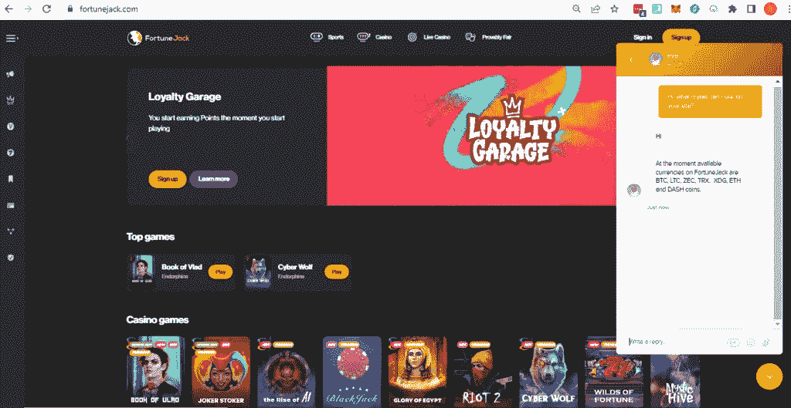
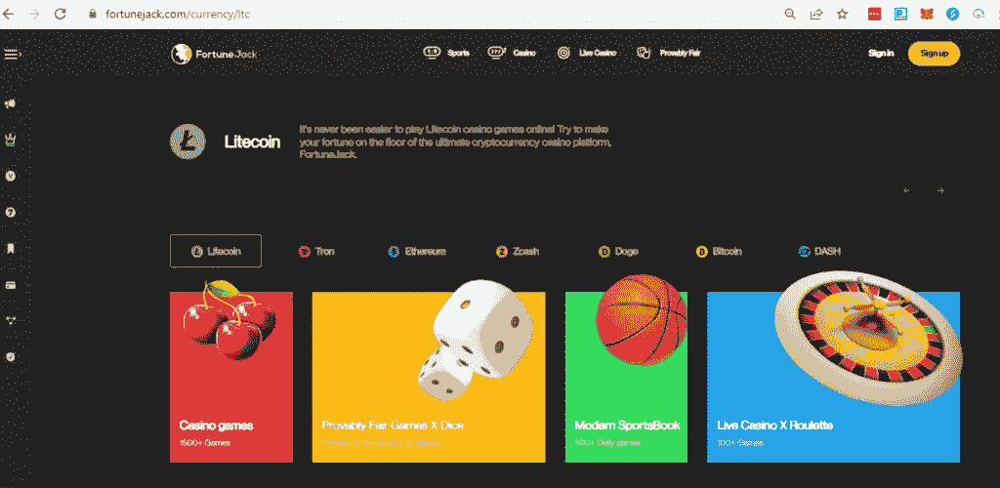
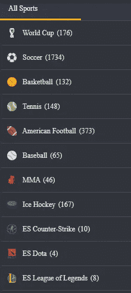
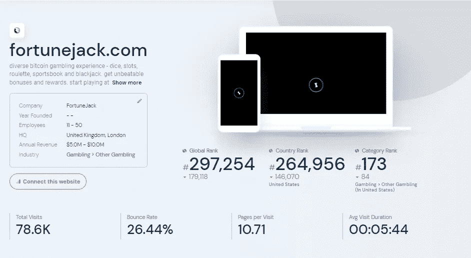

# 如何为你选择正确的加密运动手册

> 原文：<https://medium.com/coinmonks/how-to-choose-the-right-crypto-sportsbook-for-you-91ceb1d9f92b?source=collection_archive---------48----------------------->

你是否正在寻找一种不用离开舒适的家就能赌上你最喜欢的体育游戏的方法？嗯，看看没有比加密体育博彩世界更远！这些书允许你用加密货币在体育游戏上下注，加密货币是一种数字货币。

他们提供了一些传统体育博彩网站没有的好处。在这篇博客文章中，我们将解释什么是加密运动本，然后再看看当今市场上最好的运动本。我们还将根据您的具体需求，提供如何选择最适合您的产品的提示。最后，我们将包括我们的顶级加密体育书籍列表，以便您可以快速开始！

# 什么是加密体彩？

许多人对加密体育书籍很好奇，但不确定它们是什么以及它们是如何工作的。加密体彩只是一个使用加密货币的在线博彩平台。这意味着所有交易都是实时记录的，加密货币受到加密技术的保护。

这使得它们成为追求高透明度和安全性的下注者的理想选择。在下注之前，进行研究并找到最适合你的加密体彩是很重要的。需要考虑的一些因素包括您感兴趣的运动类型、存款和取款选项以及可用的客户支持。

# 选择加密体彩时需要考虑的因素

选择正确的加密体育书籍可能会令人生畏，但重要的是要花时间研究选项。有各种各样的 sportsbook 可供选择，因此找到适合您需求的那一款非常重要。首先也是最重要的，重要的是要看每本体育书提供的各种各样的游戏。然后，在报名之前，确保费用和奖金是值得的。

考虑一下你选择加密体彩的原因——也许你正在寻找一个安全可靠的体彩，提供优质的客户服务，或者提供独特的投注机会。在本文的后面，我们将把这些**因素分解成 5 个要点来考虑。**

# 使用加密体彩有什么好处？安全性和隐私

加密货币提供了传统货币所没有的隐私级别，这是最重要的优势之一。由于加密货币不受监管，赌博者在体育赌博时对他们的钱有更多的发言权。

# 更高的下注和提款限额

大多数体育博彩允许赌徒用密码下更大的赌注和提取更多的钱，但这将因不同的博彩而异。虽然您仍然需要使用常识，但如果您有资金可以花，并且不想受下注限制的约束，加密通常是一个不错的选择。

# 更快的交易速度

由于加密博彩赔率，加密货币的博彩比其他类型的货币更快。说到快速完成交易，大多数在线体育博彩都很好，但说到取款，银行和安全规则会让你慢下来。但是，您可以存入您选择的加密货币，并在它进入您的数字钱包后立即开始下注。另一方面，体彩可以立即将你的奖金转移给你。

# 更高的奖金

一直以来，在线体育博彩都有奖金和折扣。虽然有几个对任何想下注的人开放，但其他人只限于用加密货币下注的人。奖金收入可能只是一个寻找正确的地方的问题，只要你在下注时坚持使用 crypto。

# 最佳加密运动手册——我们最高评级的五点标准

如果你想赌体育，那么你需要找到一个加密的体育书。但是你怎么知道哪个适合你呢？

我们必须考虑这五个标准。为了这个例子，我们将参考 [**我们最喜欢的加密体育书籍之一——财富杰克**](https://cryptoenthusiast.net/fortunejack-casino-review/) **。**因此，无论你是在寻找一个赌电子竞技、赛马或任何其他类型运动的地方，这都将是一个很好的起点。

# 加密赌博网站的客户服务

为了安心起见，在下注之前，请务必咨询客户服务代表，以确保您获得最佳体验。顶级加密投注方在 24/7 客户服务方面为您提供服务，这既有用又可靠！

因为有了电话和实时聊天，每个站点都可以 24 小时联系。例如，我们尝试了财富杰克的实时聊天，他们在 2 分钟内就回复了——确保你不是在和机器人说话。

# 可用的加密货币

加密货币是一种快速增长且易变的资产类别。在做出决定之前，重要的是研究不同的可用加密货币，并确保它们提供您最喜欢的加密货币——不要忘记，您有尚未使用的余额上的加密资产风险。

此外，利用我们的 [**加密扫描仪在最大的交易所中寻找最便宜的加密货币。财富杰克为玩家提供了使用所有主要加密资产的选项，包括比特币(BTC)、以太坊(ETH)、Dash、Tron (TRX)、Doge (XDG)、Zcash (ZEC)和莱特币(LTC)。**](https://cryptoenthusiast.net/cryptoscanner/)

# 移动体验

我们只收录了可以通过多种智能手机和移动设备(包括 Android 和 iOS)轻松访问的网站。通过这种方式，你可以在白天或晚上的任何时间、任何地点使用你喜欢的加密体育博彩网站进行体育博彩。

Fortune Jack 没有为此提供移动应用程序，但该团队仍然将其资源投入到 FortuneJack 页面及其移动网站的开发中。FortuneJack 的手机网站可以让你下注和玩游戏。唯一的区别是，你不必在手机上下载并安装一个原生应用程序。相反，用户可以通过手机浏览器访问 FortuneJack 网站，在 FortuneJack 上浏览和玩游戏。当使用智能手机查看 FortuneJack 移动网站时，它可以完美地工作。

# 加密运动手册的图形和界面

不要忘记，在一天结束的时候，我们赌的是快乐，所以拥有一个伟大的用户友好的界面是必须的。像《财富杰克》这样的好图形在访问网站时会立即引起注意，你会发现它的美学魅力和吸引力，它拥有时尚和复杂的设计，顶级图形主导着主页。

# 提供体育市场

也许这是显而易见的，但一开始可能不那么明显。你必须确保你将使用的加密体育书籍提供你想要参与的所有体育市场。如果需要的话，找一本能满足你从曲棍球到足球到赛马的所有需求的体育书籍。

这些只是财富杰克提供的众多体育市场中的一小部分。

# 免费获得独家赢取体育博彩的机会

说到体育博彩，市场上有很多选择。但是哪一个才是最适合你的呢？体育博彩如此有趣的部分原因是体育本身是不可预测的。最成功的下注者会尽一切可能让赔率对他们有利，包括使用专家选人。如果加密体育博彩提供免费的投注选择，这将是一个额外的奖金提到的因素。

# 常见问题

## 我如何确定一个加密的体育博彩的合法性？

确保寻找一个声誉好、运营时间长、提供客户满意度评级和评论的网站。另一个要使用的重要因素是使用分析网站(如 similar web)每月检查网站的访客数量——访客数量越多，在其类别中的排名越好，加密体育博彩就越安全。

《财富杰克》在 7 月 22 日(T1)有大约 79，000 名访客，这使得它成为一个相对中等规模的加密体育博彩。

## 使用加密体彩有什么风险吗？

当然，加密赌博有其自身的风险。事实上，它仍然是一个相对较新的业务，这是主要原因之一。这意味着有大量欺诈者和非法企业在运作。因此，在选择博彩网站时，你必须非常谨慎。只与值得信赖的网站赌博，并确保做好调查。

同样重要的是要记住，加密赌博经常受到网络攻击，因为它是在线进行的。因此，你需要确保你的赌博网站有可靠的安全措施。加密货币的波动性是与加密博彩相关的另一个风险。比特币等加密货币有快速升值/贬值的趋势。如果你下注时不注意，这可能是一个很大的风险。

最后，由于加密博彩仍然是一个新事物，很少有监管机构对其进行监管。因此，存在一些额外的风险。然而，随着越来越多的国家开始监管该行业，这种情况正在迅速改变。

## 出于赌博目的，我应该使用哪种加密货币？

这将取决于你和你必须接触的加密货币。理想情况下，你可以使用最不稳定的加密货币，比如比特币或者以太币。

*原载于 2022 年 8 月 18 日*[*【https://cryptoenthusiast.net】*](https://cryptoenthusiast.net/how-to-choose-the-right-crypto-sportsbook-for-you/)*。*

> 交易新手？尝试[加密交易机器人](/coinmonks/crypto-trading-bot-c2ffce8acb2a)或[复制交易](/coinmonks/top-10-crypto-copy-trading-platforms-for-beginners-d0c37c7d698c)