# 如何要求和赌注豺狼协议空投令牌(JKL)

> 原文：<https://medium.com/coinmonks/how-to-claim-and-stake-jackal-airdrop-tokens-jkl-321bceb8e321?source=collection_archive---------0----------------------->

## 我什么时候能收到豺狼空投？

这是一个简单的指南，告诉你如何申请[豺狼协议](https://jackalprotocol.com/)空投，并为多汁的四月赌注这些代币

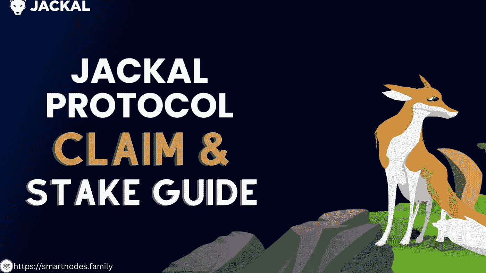

Jackal protocol airdrop Claim and Stake guide.

# 什么是豺狼协议？

[豺狼协议](https://jackalprotocol.com/)是一种快速、可扩展和安全的区块链，它使个人、开发者和企业能够在不牺牲易用性的情况下提高他们的数据隐私和网络安全状况。该协议致力于提供世界一流的应用程序来保护地球上最重要的数据——您的数据。

与其他区块链不同的是， [Jackal 协议](https://jackalprotocol.com/)同时利用了验证器和存储提供者。豺狼协议允许开发人员构建能够与所有[豺狼协议模块](https://docs.jackaldao.com/docs/protocol/modules/module-overview)接口的分散式应用程序——包括存储契约和文件结构。这使得开发人员能够修改数据所有权，与其他豺狼用户或智能合约共享数据，并发送少量或大量加密数据，而不需要中间件或集中存储服务。这些数据总是自我保管的，这意味着没有人——即使是豺狼的团队——可以访问或查看您的数据。

这个区块链目前由七个[模块](https://github.com/JackalLabs/canine-chain/blob/master/x/README.md) : [jklMint](https://github.com/JackalLabs/canine-chain/blob/master/x/jklmint/README.md) ， [lp](https://github.com/JackalLabs/canine-chain/blob/master/x/lp/README.md) ， [rns](https://github.com/JackalLabs/canine-chain/blob/master/x/rns/README.md) ， [wasm](https://github.com/JackalLabs/canine-chain/blob/master/x/wasm/README.md) ，[存储](https://github.com/JackalLabs/canine-chain/blob/master/x/storage/README.md)， [filetree](https://github.com/JackalLabs/canine-chain/blob/master/x/filetree/README.md) 和 [dsig](https://github.com/JackalLabs/canine-chain/blob/master/x/dsig/README.md) 组成。这些可互操作的模块允许创建安全的、可伸缩的和真正分散的应用程序。

Credit- [Jackal protocol Youtube Channel](https://www.youtube.com/channel/UCKX7tSwBVsUmZE-XdQMbXjQ)

# JKL 令牌是什么？

JKL 令牌是支持 Jackal 协议基础设施的本地令牌，可以以多种不同的方式应用。

## dApps

*   基于 Jackal 协议构建的应用程序，比如 Jackal Storage 和 RNS Marketplace，可能会选择利用 JKL 令牌来扩展其效用。

## 保护网络安全

*   JKL 可以被委托给验证者来保护网络和接收 JKL 奖励，因为豺狼协议是一个利害关系证明(PoS)宇宙 L1 区块链。或者被称为标记令牌。

## [交易费用](https://docs.jackaldao.com/docs/overview/jkl#transaction-fees)

*   豺狼协议要求 JKL 令牌用于所有交易。由于协议是 PoS，交易成本很低。

## [治理](https://docs.jackaldao.com/docs/overview/jkl#governance)

*   Staked tokens 允许链上治理参与到豺狼协议中，对文本、软件、支出和其他治理提案进行投票。

## 抵押品

*   验证器、存储提供者和其他智能契约可以使用 JKL 令牌作为抵押品。

## 流动性准备

*   JKL 可以被分配到一个流动性池中来获得 JKL 奖励。

# 豺狼空投细节

查看关于豺狼空投的快照和其他要求的所有细节。[豺狼空投——如何以及在哪里领取你的$JKL (airdrops.one)](https://airdrops.one/jackal/)

# 如何认领豺狼空投令牌？

没有索赔，他们已经在你的钱包里了。你需要在你的 Keplr 钱包里添加豺狼网链，你就会看到它们。 [$JKL](https://twitter.com/search?q=%24JKL&src=cashtag_click) 然后可见。

按照下面给出的步骤添加链并标记$JKL 令牌。

**第一步** —转到[https://ping.pub/jackal](https://ping.pub/jackal)，点击右上角的**钱包**按钮。

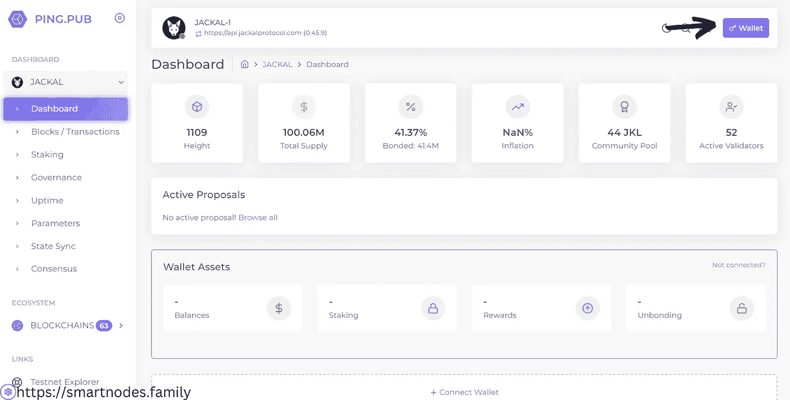

https://smartnodes.family/dashboard/

**步骤 2** —点击**导入钱包**连接到 keplr。

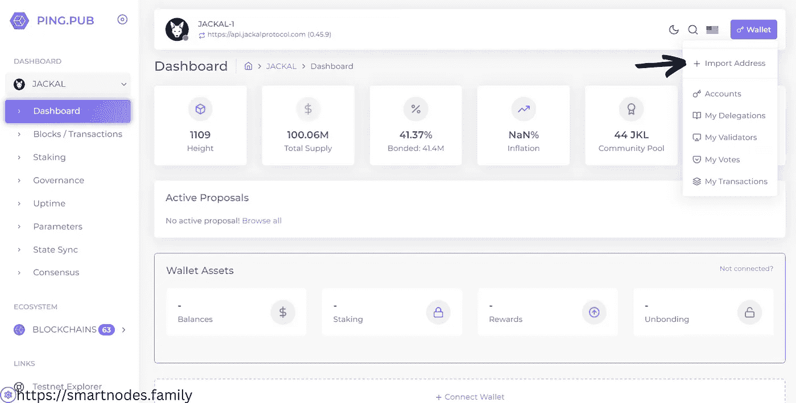

**步骤 3** —向下滚动并点击**启用 keplr** 将豺狼网络链添加到您的 keplr 钱包中。

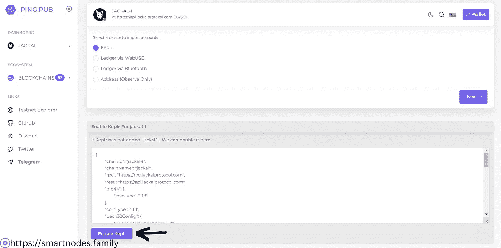

**步骤 4** —批准您的 keplr 中的**链添加请求**，祝贺您成功添加了豺狼链。现在，你可以在你的 keplr 钱包里看到$JKL 空投代币。

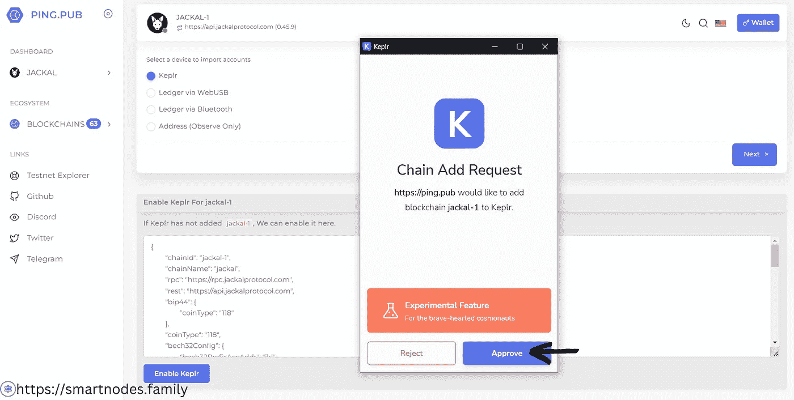

# $JKL 代币的赌注？

**第五步**——要下注 **JKL** 代币，首先你要把 ping.pub 和你的 keplr 连接起来。在菜单中选择 **Keplr** 并点击**下一步按钮**。批准 keplr 中的**请求连接**。

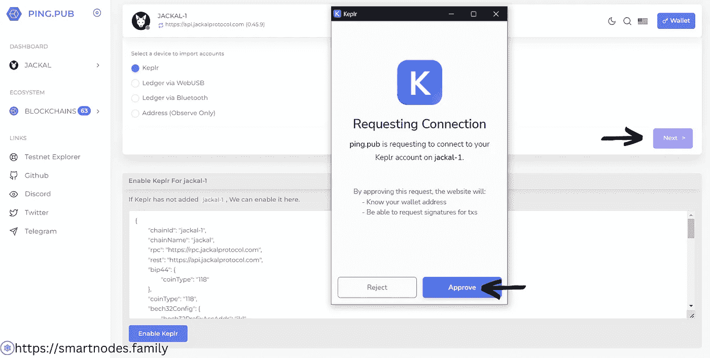

**第六步** —输入**帐户名**，在链条部分选择**豺**，点击**下一个**。

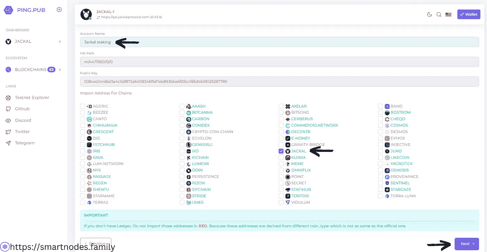

**Step-7** —确认**地址与 keplr** 匹配，点击**下一步**。

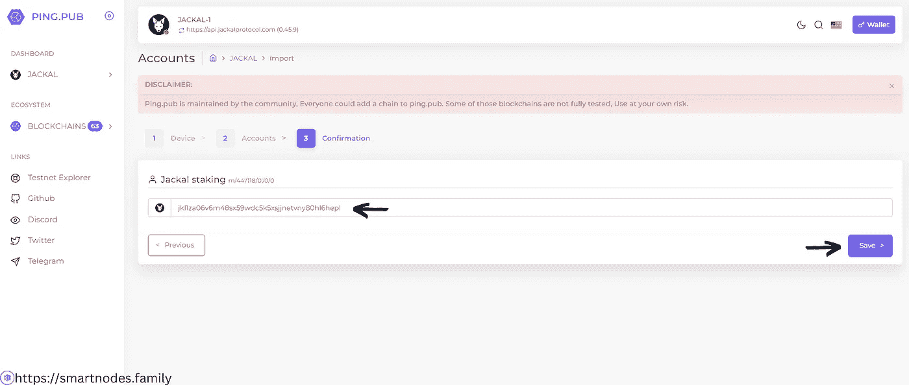

**步骤 8** —点击**细节，**进行。

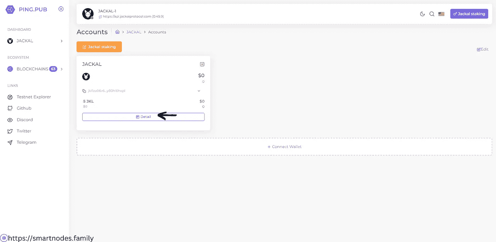

**步骤 9 —** 点击**委托按钮**进行下注。

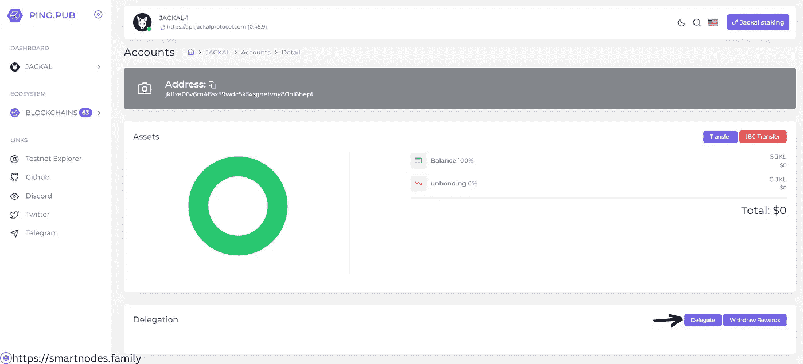

**第 10 步——选择**您的验证器，以及**您想要下注的$JKL 代币数量**。点击**发送**并批准 keplr 中的**委托交易**(保持平均燃气费)

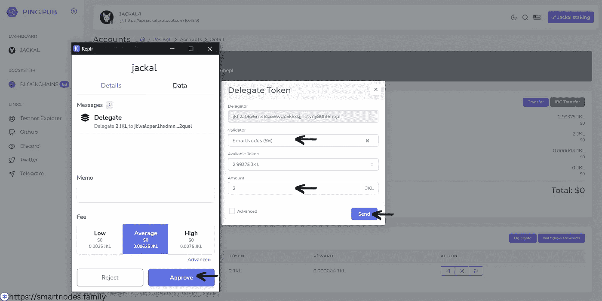

**第 11 步-恭喜，**您现在正在下注 **$JKL 代币。**此外，您可以通过点击给定的“查看交易”按钮来查看交易。

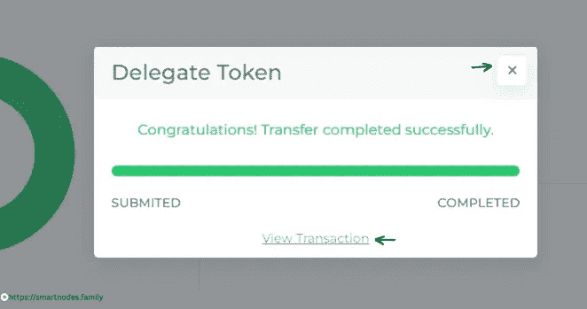

# 关于智能节点

Smartnodes Validator 提供利益相关证明服务。您的资产受到我们 100%的斜线和双标志退款保护。

1.  我们完全融入了宇宙，并乐于尽我们所能帮助他人。社区是我们前进的动力。由[智能节点验证器](https://smartnodes.family/)对想法进行主动投票，以确保有效的治理。
2.  [Smartnodes](https://smartnodes.family/) 只采用了最好的基础设施中的最好部分，并且设置了 10 层保护来保护您的投资。
3.  查看我们的网站，了解更多关于我们的验证器节点的信息。我们目前在 33 个加密货币链上提供利益证明服务(POS ),并且还在增加。
4.  请随时通过我们的社交媒体平台或电子邮件 Validators@smartnodes.tech 联系我们

https://smartnodes.family

# 在社交媒体上关注我们

[Reddit](https://www.reddit.com/user/Smart_nodes)|[Twitter](https://twitter.com/nodes_smart)|[网站](https://smartnodes.family/) | [电报](https://t.me/smartnodesvalidators) | [Instagram](https://www.instagram.com/smartnodes_validator/?igshid=YmMyMTA2M2Y%3D) | [不和](https://discord.com/invite/TA3UVPwn6D)

参加赢取宇宙周大奖。

*   点击进入[智能节点抽奖](https://lotto.smartnodes.family/)

> 交易新手？尝试[加密交易机器人](/coinmonks/crypto-trading-bot-c2ffce8acb2a)或[复制交易](/coinmonks/top-10-crypto-copy-trading-platforms-for-beginners-d0c37c7d698c)