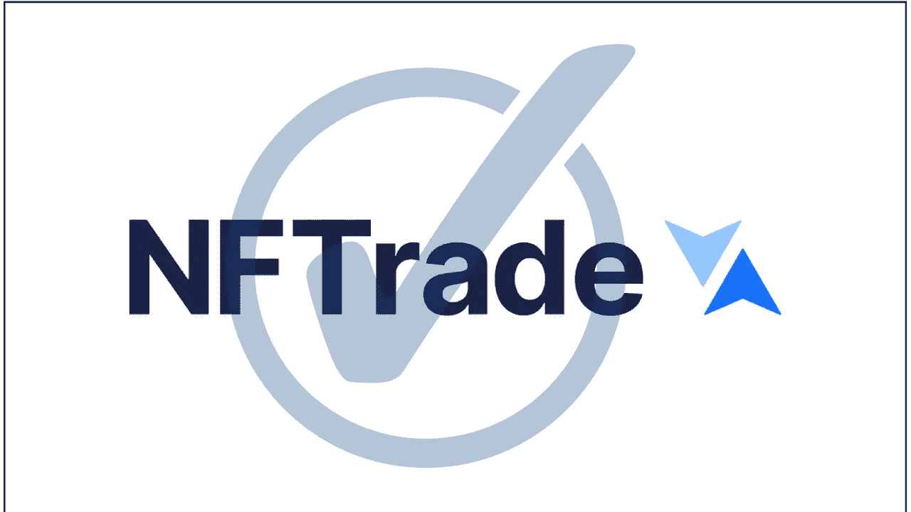
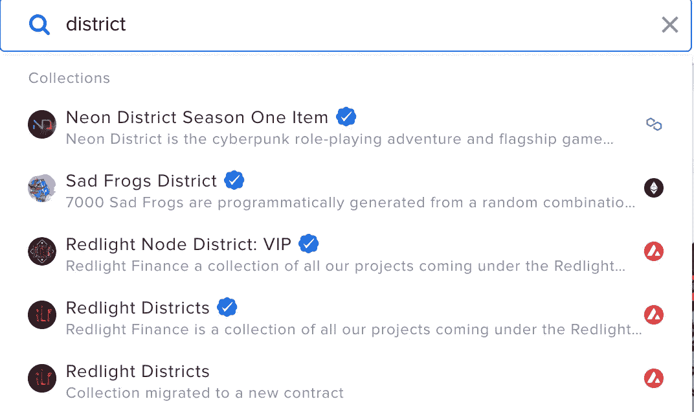
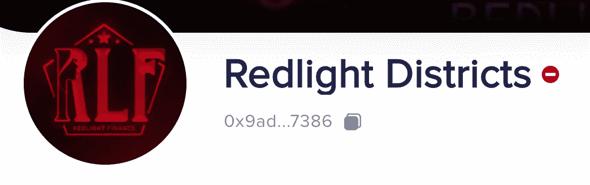

# 如何在 NFTrade 上确认 NFT 藏品

> 原文：<https://medium.com/coinmonks/how-to-confirm-a-verified-nft-collection-on-nftrade-a8c8d170af25?source=collection_archive---------26----------------------->

NFT 智能合同是一种在 NFT 所有者和买方之间执行销售协议的机制。智能合同是自动执行的，可以检查合同条款是否得到满足，也可以在不需要中介或中央机构的情况下执行条款。

可以在 NFTrade 上验证作为集合一部分的 NFT，以证明它们的合法性。NFT 可以很容易地在任何 NFT 平台上复制和传播，任何不知情的投资者都可以购买，而不会透露他们购买的是一个骗局。

下面这篇文章向你展示了如何在 NFTrade 上鉴别一个经过验证的 NFT 收藏。

**如何通过搜索识别一个经过验证的 NFT 收藏**

如上图所示，当搜索“地区”时，会出现许多结果。最后两个搜索结果显示“红灯区”。值得注意的是位于 NFT 收藏名称右侧的蓝色勾号。

**如何通过联系地址识别已验证的 NFT 藏品**

您可以从项目网站或其他社交平台复制 NFT 收集的联系地址，验证来自项目的联系地址是可靠的来源。对于上面的例子，未经核实的“re fight Districts”NFT 集合的联系地址是**0x 9 ada 04 af 0 B1 c 989 a 188 f 0063358 F2 d 0530327386。**

你可以在 NFTrade 搜索栏上复制任何联系地址来查看收藏。一旦进入 NFT 收藏页面，你就会看到它是经过验证的还是未经验证的。

**未经证实的 NFT 收藏**

在搜索栏中输入联系地址**0 x9 ada 04 af 0 B1 c 989 a 188 f 0063358 F2 d 0530327386**时，NFT 收藏页面显示以下结果。正如你所看到的，在 NFT 收藏名称的右边有一个红色的“拒绝”标志。

我们可以确认这个 NFT 系列的联系地址是**未核实**。

**安全投资**

请确保您购买的是经过验证的 NFT，NFTrade 会在未经验证的 NFT 系列上显示一个蓝色勾号验证标志和一个红色拒绝标志。

# 关于 NFTrade

NFTrade 是第一个跨链和区块链无关的 NFT 平台。我们是所有 NFT 市场的聚合者，拥有完整的 NFT 生命周期，允许任何人在不同的区块链无缝地创建、购买、销售、交换、耕种和利用 NFT。使用 NFTrade，任何人都可以访问他们的整个 NFT，释放 NFT 市场的总价值。

[**电报**](https://t.me/nftrade) **|** [**网站**](https://nftrade.com/) **|** [**推特**](https://twitter.com/NFTradeOfficial) **|** [**中**](/@NFTrade)**|**[**LinkedIn**](https://www.linkedin.com/company/nftrade/)|[**insta gram**](https://www.instagram.com/nftradeofficial)**|**

> 交易新手？试试[加密交易机器人](/coinmonks/crypto-trading-bot-c2ffce8acb2a)或[复制交易](/coinmonks/top-10-crypto-copy-trading-platforms-for-beginners-d0c37c7d698c)