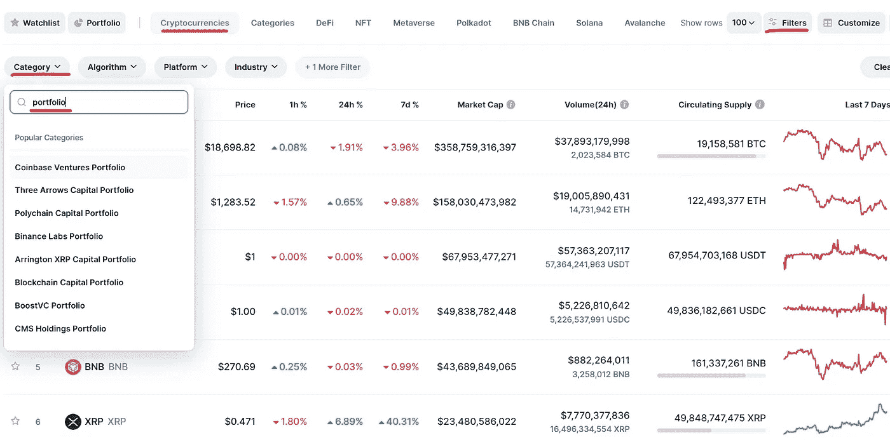

# 如何在 5 分钟内复制加密风险投资公司的投资

> 原文：<https://medium.com/coinmonks/how-to-copy-crypto-venture-capital-firm-investments-in-5-minutes-d7bda19a23ea?source=collection_archive---------0----------------------->

Photo by [Markus Winkler](https://unsplash.com/@markuswinkler?utm_source=medium&utm_medium=referral) on [Unsplash](https://unsplash.com?utm_source=medium&utm_medium=referral)

在本指南中，我将向你展示如何在 5 分钟内复制秘密风险投资公司的投资组合。

但首先，你为什么要这么做？

在进行任何投资之前，加密风险投资公司**会将加密项目提交给一个全面的分析和评估流程**，该流程会检查以下重点内容:

*   行业和使用案例
*   商业模式
*   项目团队的经验和动机
*   增长潜力

为了检查这些事情，与管理团队进行了许多会议，进行了财务审查等。

简而言之:**创投资本家能洞察到秘密项目，而这些项目通常是散户投资者所不能或无法达到的。**

Click me.

这意味着:**如果一家秘密风险投资公司投资了一个项目，那么这个项目很有可能是一个具有巨大增长机会的可靠项目。这就是为什么你想投资与这些公司投资组合中相同的项目。**

听起来很棒！但是你是怎么做到的呢？

其实很简单。

## 如何在短短 5 分钟内复制秘密风险投资公司的投资组合

Source: coinmarketcap.com

1.  转到 [**CoinMarketCap**](https://coinmarketcap.com/)
2.  确保你在“加密货币”标签中。
3.  单击“过滤器”以访问更多过滤器选项。
4.  点击“类别”。
5.  输入“投资组合”。
6.  从名单上选一家秘密风险投资公司。
7.  分析他们投资组合中的加密项目。

仅此而已。通过这些步骤，你将深入了解 30 多家风险投资公司的秘密投资组合。

然而，你一定要考虑一些事情。

## 研究加密风险投资组合时需要注意的事项

*   永远做你自己的研究。不要简单地相信他人或机构的判断。明白自己要投资什么。如果你想了解更多关于加密货币的信息，请查看我的文章。👇👇

 [## 。如何研究加密货币？循序渐进的指南

### 没有任何特殊技能和先前的知识找到加密宝石

ren-heinrich.medium.com](https://ren-heinrich.medium.com/how-to-research-crypto-projects-a-step-by-step-guide-744fdc822b99) 

*   这些公司的一些投资是几年前进行的，表现不佳。这就是为什么关注各自投资组合中较新的项目通常是最好的选择。你想要的是正在积极建设的项目。
*   并不是所有的投资公司都同样成功。首先选择一家声誉好的公司，比如 a160z、币安实验室或 Kenetic。

就是这样！

希望你觉得这个指南有用。在这里和 Twitter 上关注我，了解更多关于加密、经济和投资的内容。

*免责声明:本文仅用于信息和教育目的，不应被视为投资建议。*

> 交易新手？试试[加密交易机器人](/coinmonks/crypto-trading-bot-c2ffce8acb2a)或者[复制交易](/coinmonks/top-10-crypto-copy-trading-platforms-for-beginners-d0c37c7d698c)