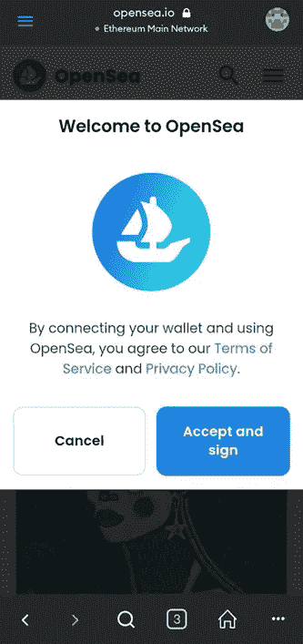

# 如何创建一个 NFT？

> 原文：<https://medium.com/coinmonks/how-to-create-an-nft-d0c7d07f54f1?source=collection_archive---------27----------------------->

创造 NFT 的最佳方式。

假设我们考虑最近和以前关于 NFT 增长、大宗购买和抛售的新闻。考虑到 NFT 在未来十年的预期市值，任何对革命性系统感兴趣的人现在都有办法参与 NFT。参与 NFT 行业或在其中发挥作用的一种方法或许是开发自己的 NFT。本文中的信息将帮助您设计您的 NFT，并为销售做广告。

但是首先，什么是 [NFT](/@princesamuelaadeyemo/what-is-nft-an-introduction-for-beginners-e4796712d631) ？

 [## 什么是 NFT:初学者入门？

### 对 NFTS 进行彻底的教育

medium.com](/@princesamuelaadeyemo/what-is-nft-an-introduction-for-beginners-e4796712d631) 

不可替代令牌是对象的数字表示，例如一块不动产、数字艺术品、视频游戏中的化身集合、唱片等。，其标识或地址指向区块链网络。

它可以是任何东西，包括房地产、古董、艺术品、音乐和视频剪辑。下面列出了创建 NFT 时需要考虑的步骤。

Photo by [Paola Aguilar](https://unsplash.com/@paola_aguilar?utm_source=medium&utm_medium=referral) on [Unsplash](https://unsplash.com?utm_source=medium&utm_medium=referral)

**第一步:什么样的 NFT？**

如前所述，NFTs 可以是任何东西，从实物到唱片到数字艺术作品。您必须决定您想要制作哪种 NFT，如数字图像、歌词、唱片、有形物体等。一旦你最终决定了你想以 NFT 的身份创作什么，

**第二步:创建加密钱包**

要创建 NFT，您必须先创建一个加密钱包，尤其是在您还没有加密钱包的情况下。它是所有相关交易的起点，例如参观市场或经销商商店等场所。你的钱包不见了。如果你有一个钱包，一个容器，甚至只是一个口袋，那会有所帮助。要开始使用 NFT，你可以从[各种钱包](/coinmonks/types-of-cryptocurrency-wallets-b4167888758) — [基于软件和基于硬件的加密货币钱包](/codex/the-differences-between-a-hardware-wallet-and-a-software-wallet-for-cryptocurrencies-be9ea26fa36f)中挑选。

**第三步:向钱包中添加一些加密货币**

如果你想生产一个 NFT 或者购买你的第一个，你的钱包里需要有加密货币；这是用来支付市场费用作为一个创作者或购买 NFT 从市场。

**第四步:选择并建立你选择的 NFT 平台或市场**。

一个可以进行非金融交易的平台被称为 NFT 市场。它类似于股票市场，但不是 NFTs 或 NFTs 的加密交易所。有各种各样的 NFT 市场。NFT 市场的一些例子有 OpenSea、Rarible、币安等。

第五步:决定你更喜欢哪个区块链。

选择一个区块链网络对开始接触 NFT 同样重要，无论你是一个创造者，一个鳍状肢，还是一个买家。一些 NFT 市场最适合特定的区块链。在你的 NFT 冒险中，你可以接触区块链，包括以太坊，币安智能链，卡尔达诺，流，索拉纳，和 EOS。更多区块链人支持 NFT 发展。

**第六步:把你的钱包和市场连接起来**

下一步是把你的钱包和你选择的市场连接起来；我们有各种各样的加密货币钱包和市场，包括 Rarible、SuperRare、币安、NBA Top Shot 等。作为案例研究，我们将使用 Metamask 和 OpenSea marketplace。

I)下载并打开 MetaMask 应用程序。这里是 [metamask 下载链接](https://metamask.io/download/)，你可以在这里下载。

Metamask

ii)创建您的钱包，记下您的密码，并将其保存在您最安全的位置。

iii)当您运行 MetaMask 时，一旦您选择了区块链，默认网络就是以太坊(在本文中，我们将使用以太坊区块链进行演示)。您可以根据您选择的市场将其更改为任何其他网络。可以添加其他网络，如智能链、邻近网络和多边形网络。我们将讨论如何在 Metamask 上切换网络。

iv)通过使用以太坊网络，点击主页左上角的菜单按钮即可导航至该页面。

Metamask wallet homepage

v)它将显示选项列表；选择“浏览器”菜单或按钮，这是首选。

Vi)由于我们刚刚开始使用该界面，请从“收藏夹”和“浏览站点”两个选项中选择“浏览站点”然后选择“艺术品和收藏品”

Accessing NFT marketplace and web3 tools through the metamask application.

vii)你会看到许多网页(市场)；向下滚动到“ *OpenSea* 并点击[Enter]键。

viii)等待几秒钟；加载页面后，您会收到一个提示。点击*接受并签字。*”

ix)会弹出另一个提示；点击“签名”

给你。您已成功将您的加密钱包连接到 NFT 市场。

**第七步:创建你的 NFT**

创造你自己的 NFT，无论是音乐、艺术、收藏品还是歌词。如果要列出的项目可用，则继续下一个操作。

**第八步:列出你的 NFT**

将您的加密钱包连接到市场后，您可以按照下面列出的方法创建您的 NFT。创建您的 NFT 非常容易导航。

I)使用 PC/笔记本电脑列出您的 NFT 会更好，因为它在我们在本文中使用的公海网站上提供了直观的布局和导航。

ii)在浏览器地址栏输入 opensea.io。

iii)“创建”菜单位于右上角。选择菜单按钮。

Opensea website

iv)单击后，连接到元掩码。

v)为您的设备安装元掩码；在这种情况下，我是为 PC/chrome 安装的。

vi)钱包:创建一个钱包；通过进入恢复阶段从现有 wallet 导入数据；或者创建一个新的钱包。

vii)确保一些加密货币(如 eth)可用。

使用 metamask 扩展打开 Opensea 应用程序。

ix)点击“创建”按钮，并提供您的文件信息。

在配置其他必要的详细信息时，列出要创建为 NFT 的文件。

NFT 是一个革命性的概念，已经显示出它的潜力。它可以用来解决世界上有关实物资产的真实性和流动性的部分问题。有了这项技术，几乎大多数东西(资产)都可以在双方之间交易，而不需要第三方或集中方的参与。此外，有了 NFTs，资产可以代代相传，而不用担心将来会出现伪造问题。

本文的主要目的是帮助我们了解如何创建 NFT。

请确保您在媒体和 Twitter 上分享和关注我。

[https://twitter.com/PrinceSamuel_A](https://twitter.com/PrinceSamuel_A)

您想深入了解什么是区块链和加密货币的更多细节吗？

 [## 什么是区块链技术？

### 区块链科技:区块链技术 101 你需要知道的一切

medium.com](/@princesamuelaadeyemo/what-is-blockchain-technology-560db5c3d8cf)  [## 什么是加密货币？

### 它是如何工作的？

medium.com](/coinmonks/what-is-cryptocurrency-5255ff3625a5) 

> 交易新手？试试[密码交易机器人](/coinmonks/crypto-trading-bot-c2ffce8acb2a)或者[复制交易](/coinmonks/top-10-crypto-copy-trading-platforms-for-beginners-d0c37c7d698c)