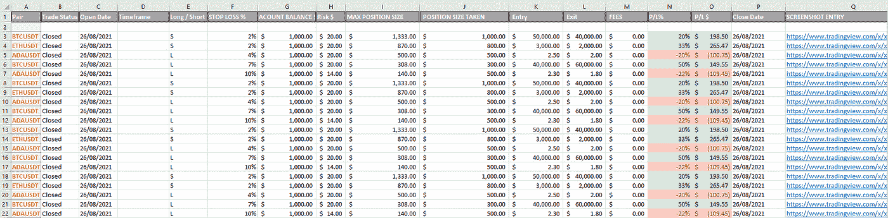

# 如何创建和维护交易日志:逐步指南

> 原文：<https://medium.com/coinmonks/how-to-create-and-maintain-a-trading-journal-a-step-by-step-guide-a041c68f148f?source=collection_archive---------14----------------------->

Boomish.org

# 关键见解

‍

*   创建和维护交易日志对理解你的交易决策至关重要
*   记录交易过程中的情绪状态会给你的交易生活提供重要的洞察力
*   找到你喜欢的日志格式将确保你继续写日志
*   一些日志格式包括长格式(Word)日志、技术(Excel)日志和记录日志。

‍

# 介绍

作为一个交易者，写日记经常会感觉很丰富和繁重，但是作为一个交易者，写日记对于最佳执行是必要的。跟踪你在市场上的行为，你的行动，让过去的自己对你的行为负责，这是一个很好的学习方法。

‍

有些人由于手头其他耗时的事情，不能花很多时间在交易日志上写条目。选择一个适合你的方法对确保你在交易过程中的日志记录和自我反省是至关重要的。

‍

有许多不同的交易日志方法可以优化和调整，以适应你的时间表和偏好。在这篇文章中，为所有不同类型的交易者提供了日志解决方案。我将浏览这些不同的日志，并给出每一个的详细例子。

‍

# 为什么是日记？

记录你的交易是交易者最重要的事情之一。它让你反思你的交易；亏损和盈利都一样。通过这个反思过程，你可以看到你在什么时候，做了什么，如何做得好，还有什么需要改进的地方。

这种交易后的反思是至关重要的，它能让你发现自己的优势和劣势，让你在未来做出相应的反应。能够批判性地评估你的执行是你交易成功的关键。

‍

日志还提供了交易前对交易想法的反思。您通常希望在下单前为您要下单的交易创建一个日记帐分录。如果你在实际交易前检查交易想法，你会发现自己经常停下来，注意到交易想法中的缺陷。

‍

> ***“没有日记的交易就像没有镜子的剃须”——亚历山大·艾尔德博士***

‍

# 在你的日记中要涵盖的重要事情

‍

**交易计划**

什么是交易计划以及如何创建交易计划是一个过程，我们在[这里](https://www.boomish.org/blogs/how-to-build-a-trading-plan)有一个循序渐进的指南。

在你的日志中，你要包括仓位的细节，如进场时间、进场价格、止损价格、止盈水平、仓位大小和利润。除了这些基本的交易记录，你还想记录评估交易时你的想法，为什么这个系统比其他系统好，你喜欢这个系统的哪些方面，以及这个系统如何遵守你的交易计划(创建交易计划的指南可以在这里找到)。把你的交易计划和规则写在日志的顶部是个好主意，这样你就可以随时更新你的计划。

‍

**心态分析**

虽然你想让你的交易日志简短，便于日后查阅，但重要的是要涵盖与交易设置无关的主题，这会很快变得有点耗时。在你开始任何一个交易日之前，这些无关的话题中的一个。在交易日开始时，坐下来反思并写下你当前的情绪状态和你的感受。

记录你感到[恐惧](https://www.boomish.org/blogs/how-to-avoid-fear-in-trading-the-five-major-fears-of-trading)，贪婪或者疯狂的次数。作为交易者，这些都是常见的经历，知道你什么时候感觉到它们以及为什么会感觉到它们将是一个重要的教训。

‍

**日终总结**

一天结束时的总结也有助于反思当天的会议。这让你有机会反思你的情绪状态和交易日，并评估它们是如何相互影响的。你也可以利用这最后的反思来反思你今天的错误和优点，尽管它们仍然新鲜。

‍

**截图**

当你写每日交易日志时，你会想参考并显示你交易的图表设置。这可以通过截图并将其直接添加到您选择的文件日志格式中来完成，或者通过在 TradingView 上创建截图并仅将截图参考链接添加到您的文档中来完成。

‍

# 不同的日志格式

‍

**Word 文档**

典型的 Word 文档或另一种传统的写作格式对大多数交易者来说就足够了。在长格式写作中，最简单的方法是记录你当天的情绪状态，同时记录交易技术。

‍

通过用心态分析开始你的每日日记，你可以把你的精神状态清晰地写在纸上。理解你在某一天的感受会让你在接下来的日子里头脑清醒。

‍

接下来，写一小段关于一般市场正在做什么，只是为了澄清你的方向偏差，以及你当天的方向无效是什么(由于不可预见的市场运动，这很容易改变)。

‍

现在是时候评估和记录可能的交易了。在进行交易之前，写下为什么一个给定的交易设置对你来说是好的，以及它是如何遵守你的交易计划的。你可能会发现这个交易系统实际上并不符合你的交易计划，看起来也没有你最初想的那么好。

‍

如果你发现自己差点做了一个糟糕的交易，这个交易想法不一定要从日记中删除，相反，写下一段关于你为什么决定不做这个交易的话。

‍

最后，如果你找到了一个好的设置，写下了你的想法，并决定进场，你将写下你的交易技术，如进场价格，止损价格，止盈水平和保证金水平(如果适用)。

‍

你也可以把交易设置的截图直接添加到日志中，而不是链接。一个直接的截图更容易评估，并创建一个清晰的概述。这样，当你思考交易时，你就能更详细地了解你所做的/想要做的交易。这种格式有足够的空间来这样做。

‍

下面提供了这种格式的一个例子。虽然没有实现优化日志的所有方面，但这是一个很好的例子，说明了短格式日志条目在 Word 中的样子。这种形式可能提供了你在交易过程中最丰富和最连贯的交易日志。

‍

*(图 1) Word 文档日志录入示例
(优化你的日志为自己所用。尝试不同的格式)*

‍

‍

**Excel 表格**

第二种，不太费时的，非常普遍的交易日记账是使用 Excel 表格。Excel 表格为你的交易条目提供了所有统计和技术方面的清晰概述(见图 2)。

‍

Excel 让你的交易日志更有条理，对某些交易者来说，这无疑是一个更好、更有效的日志解决方案。使用 Excel 表格的一个缺点是，它很难记录长格式的内容，比如你的情绪状态、市场概况和交易概况。Excel 表格也限制了将你的交易截图直接添加到日志中的可能性，这使得用图片创建即时连贯的回顾过程变得不可能。

‍

对于很多有技术背景的交易者来说，这是最简单，最快捷，最容易理解的日志格式。它需要的时间也比文字日记少得多，但仍能很好地概括你的交易时段。

‍

由于很难在 excel 中表达对自己的长篇情感解读，所以最好从只涵盖日常情感和生活状况的那一面开始写传统日记。这样你仍然可以把你每天的感受写在纸上，并且可以把它和你的交易表现联系起来，找到你的交易表现和情绪状态之间的关系。

‍

*(图 2) Excel 表日记账示例*

‍

**屏幕录制**

最省时的日志是记录你的屏幕，显示实时图表，给自己讲述你的交易过程。你大声说出你对市场和交易系统的想法，同时解释你在图表上看到的东西。这可以在 OBS、Loom 或任何其他你能找到的屏幕录制软件上完成。

‍

这种写日记的方法的缺点是，人们必须努力避免离题。人们很容易陷入对自己谈论交易和跑题，谈论与这个特定的日志/交易条目无关的事情。作为解决题外话的一个方法，你可能想要一个文本文档，里面有你写日记时要涉及的相关想法的概要。

‍

因此，尽管录制很容易成为最不耗时的版本，但如果效率低下，它也会很快变成最耗时的版本。

‍

记录你的情绪是至关重要的，但是大声记录会让人很不舒服，因此记录日志会让你难以表达当天的情绪状态。如果你决定用记录的方法来记录你的交易，用传统/普通的纸质日志或 word 文档来记录你的日常情绪和空间通常是个不错的解决方案。

‍

‍

**组合格式**

上述所有格式的组合对某些人来说也可能是最佳的。拥有一个对你最有效的方法是关键。你可能想要记录交易设置，解释它，然后将记录的链接插入到你的 Excel/Word 文档中，或者其他不同格式的组合

‍

# 交易日志和传统日志

正如我们所说，交易日志对交易非常重要。但我希望证明，记录生活事件和情绪状态的传统日志对交易同样重要。日记帮助你理清思路，了解你对某一天发生的事情的感受。

‍

交易之外困扰你的任何事情都会直接影响你的交易，因此让你的交易之外的生活井然有序是最佳交易的必要条件。

‍

# 结论

这实际上可以归结为尝试所有不同形式的日志，看看哪种最适合你的风格。想办法保证你写日记；给自己找点乐子。能够回顾过去对你未来的自己有不可估量的价值，你未来的自己肯定会感谢你在交易日志中如此勇敢地阐明了你当前的错误和情绪。

> 交易新手？尝试[加密交易机器人](/coinmonks/crypto-trading-bot-c2ffce8acb2a)或[复制交易](/coinmonks/top-10-crypto-copy-trading-platforms-for-beginners-d0c37c7d698c)

‍