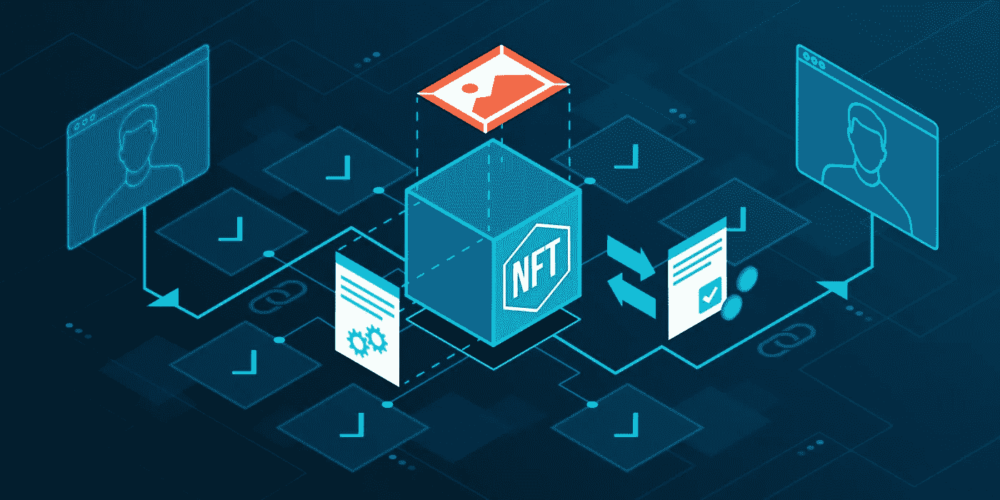

# 如何创建、购买和销售不可替换的令牌

> 原文：<https://medium.com/coinmonks/how-to-create-buy-and-sell-non-fungible-tokens-66a6d0774fed?source=collection_archive---------31----------------------->

不可替代令牌(NFT)是一种独特的可收集加密资产，早在 2012 年比特币概念首次出现时就已经存在。这些硬币只是 satoshis——比特币的一小部分，具有独特的信息，可以将硬币与现实世界的资产联系起来。当时，彩色硬币被用于在比特币区块链的交易平台上交易艺术品。

# 什么是 NFT？

NFT 是代表虚拟世界中独特物品的数字资产。他们允许玩家通过添加帽子、武器、盔甲、宠物和其他配件来定制他们的头像。这些物品不能复制，所以每个玩家只能拥有一个物品的副本。

不可替代的令牌是一种数字资产，代表虚拟世界中独一无二的东西。它是不可替换的，这意味着它不能被另一个相同的对象替换。这意味着每一个代币都有自己的价值，不能兑换成任何其他类型的货币。

# 它们为什么重要？

开发人员使用 NFT 来表示诸如收藏品、稀有物品甚至房地产之类的项目。这些资产通常使用区块链技术来表示。区块链是一个开放的账本，记录各方之间的交易，不需要中央权威机构。

NFT 允许买家支持艺术家，但它也给买家一些东西作为回报。买家可能不会把这些数字作品挂在他们的墙上，但他们可能会获得吹嘘的权利，购买像 Nyan Cat 这样的著名作品或像 Grimes 这样的流行艺术家的作品。NFT 也是一种投机性资产，许多市场已经出现，提供转售它们的能力——理论上要多得多，只要围绕 NFT 的炒作继续。

# 数字资产的历史

区块链的第一次使用是在 2008 年发明的比特币中。它使用加密技术来保护交易和验证所有权。从那以后，其他加密货币被开发出不同的功能。例如，以太坊允许用户在其平台上构建分散式应用程序(dApps)。

# 如何制作 NFT

如今，制作 NFT 系列相对简单。你不需要对密码行业有广泛的了解。此外，艺术品还可以用来制作像数字交易卡这样的收藏品。区块链有他们的 NFT 令牌标准，该标准旨在与钱包和市场兼容。尽管大多数区块链都与 EVM 兼容，但在它们上面制作的非功能性文件仍然是独一无二的。例如，如果你在 BNB 链上铸造了一个 NFT，你只能在支持 BNB 链资产的平台上出售它。然而，现在有一些桥接解决方案。这些连接不同区块链的项目。

> 交易新手？试试[加密交易机器人](/coinmonks/crypto-trading-bot-c2ffce8acb2a)或者[复制交易](/coinmonks/top-10-crypto-copy-trading-platforms-for-beginners-d0c37c7d698c)

今天，大多数 NFT 项目都在以太坊上运行，因为它是最大的 NFT 生态系统。以下是您在以太坊区块链制作自己的 NFT 艺术品、音乐或视频所需的东西:

支持 ERC-721(基于以太坊的 NFT 令牌标准)的以太坊钱包，如 MetaMask、Trust Wallet 或比特币基地钱包。

足够的乙醚来支付煤气费。如果你使用比特币基地钱包，你可以用美元、英镑和其他法定货币从平台上购买乙醚。否则，您需要从加密货币交易所购买乙醚。

一旦你有了这些，几个以 NFT 为中心的平台允许你连接到你的钱包，上传你选择的图像或文件，你想把它们变成 NFT。

# 淘金热

Grimes 是最新一位加入 NFT 淘金热的艺术家，在昨天拍卖了价值约 600 万美元的数字艺术品后，他卖出了这些作品。

2 月 28 日，一系列 10 件作品——有些是独一无二的，有些是成千上万的——在[的 Nifty Gateway](https://niftygateway.com/profile/grimes) 上出售。销量最高的是一部名为“[旧的死亡](https://niftygateway.com/itemdetail/primary/0x948b3515d81034a3c16d5393c6c155946c93c103/1)的独一无二的视频，其中涉及飞行的小天使、十字架、剑和发光的光，这些都是由 Grimes 创作的原创歌曲。中标者以近 38.9 万美元拍下。

大部分销售来自两本有数千本的书，每本售价 7500 美元。这些名为“[地球](https://niftygateway.com/itemdetail/primary/0xe04cc101c671516ac790a6a6dc58f332b86978bb/1)”和“[火星](https://niftygateway.com/itemdetail/primary/0xe04cc101c671516ac790a6a6dc58f332b86978bb/2)”的作品都是短片，展示了他们的名义上的星球，上面有一个手持武器的巨大小天使，也配有原创音乐。在销售结束前，售出了近 700 本，总价为 518 万美元。

# 现在进入 NFT 合适吗？

对 NFTs 的兴趣仍在增长。主要组织和名人已经公布或同意公布他们的不可替代资产，包括 UFC 和 Shawn Mendez。甚至埃隆·马斯克的女朋友格莱姆斯也加入了这股潮流，在几分钟内卖出了大约 600 万美元的数字艺术品。

在 2022 年的前五天，NFT 在 OpenSea 上的销售额超过了 7 亿美元，这要归功于 Bored Ape 游艇俱乐部(BAYC)和突变体 Ape 游艇俱乐部(MAYC)系列的流行。随着越来越多的区块链致力于改善 NFT 体验，越来越多的平台可供选择，现在是涉足该行业的绝佳时机。

# 做 NFTs 要多少钱？

在 OpenSea 上，制作 NFT 不需要付费。然而，在许多平台上，他们必须支付上市费。这种费用被称为“汽油”气体是在区块链上执行一个功能或逻辑所需的乙醚量。天然气的价格因网络堵塞而异。在给定时间内，通过网络进行价值交易的人数越多，天然气费用的价格就越高，反之亦然。

以太坊的汽油费在周末平均要便宜得多，因为在这个时候很少有人通过网络进行价值交易。如果你要出售多个 NFT，这有助于降低成本。一旦你有了这些，几个以 NFT 为中心的平台允许你连接到你的钱包，上传你选择的图像或文件，你想把它们变成 NFT。