# 如何创建互联网身份|探索互联网计算机生态系统

> 原文：<https://medium.com/coinmonks/how-to-create-internet-identity-explore-the-internet-computer-ecosystem-d358d2698586?source=collection_archive---------21----------------------->

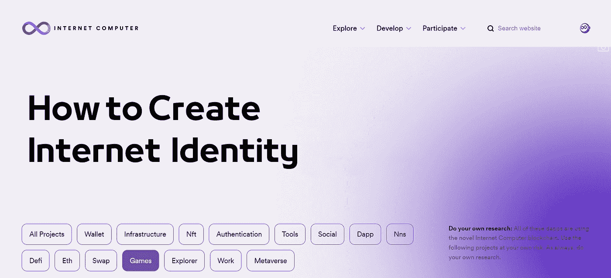

> 想探索互联网计算机生态系统吗？以下是创建互联网身份的分步指南！向您介绍如何创建您的互联网身份，并在 IC 平台上试用。

**👉在 Twitter | Medium 上关注我，让自己得到提升！**

**聚焦#NFT 研究员&#网路搜寻家**

**每日分享# web 3 # Crypto # NFT #比特币的真实素材**

互联网身份区块链认证系统使你能够在互联网计算机上不安全地匿名签署 dapps。比如，你的互联网身份可以用来登录网络神经系统 app (NNS)，在这里你可以存储和下注 ICP，参与互联网计算机的治理。

# 一、为什么选择 IC 生态系统？

1.  *训练自己的审美，积累经验。*

ICP 的币价跌了 99%，从巅峰时的 700U 跌到现在的 8.21U，生态还没有经历爆发。ICP 因其不完整的 Web3 模型受到了很多指责。

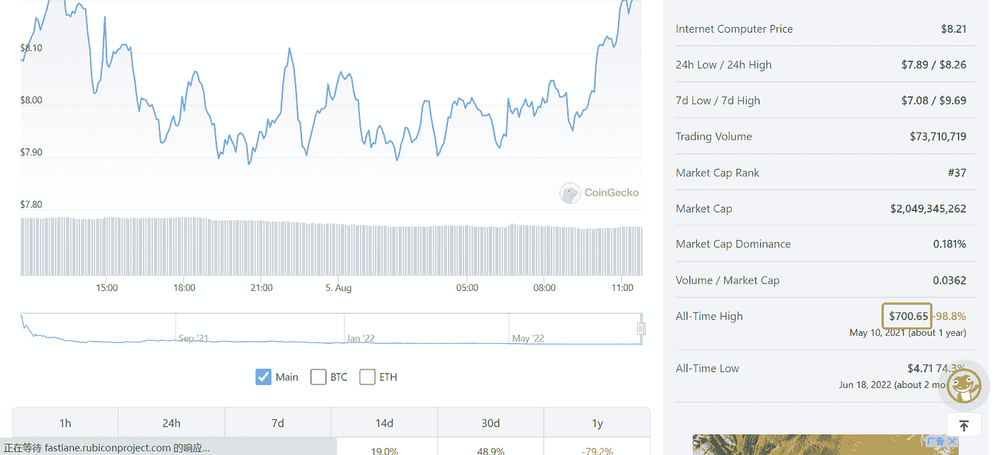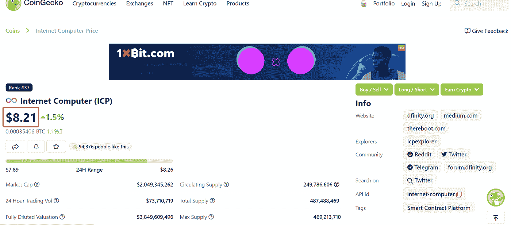

然而，该团队始终活跃在 [Medium](https://medium.com/dfinity) 和 [Github](https://github.com/dfinity) 上，这意味着产品随着生态系统的增长而不断开发和迭代。

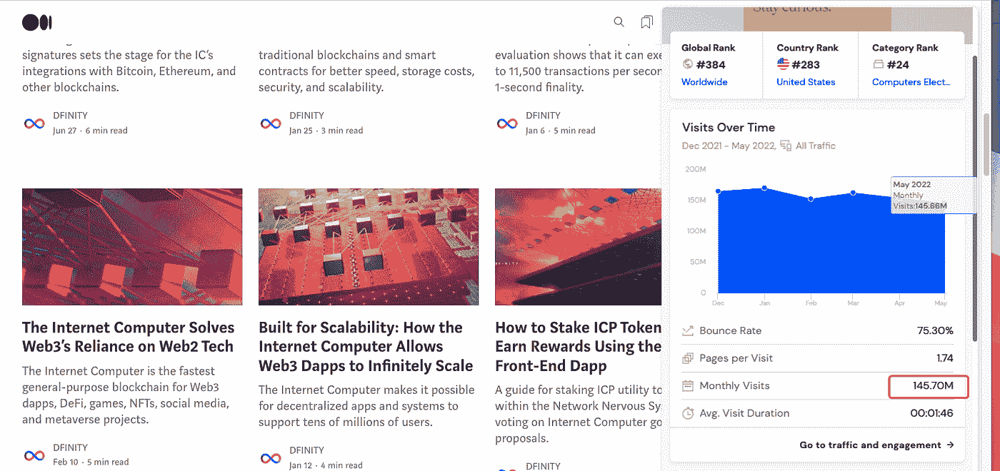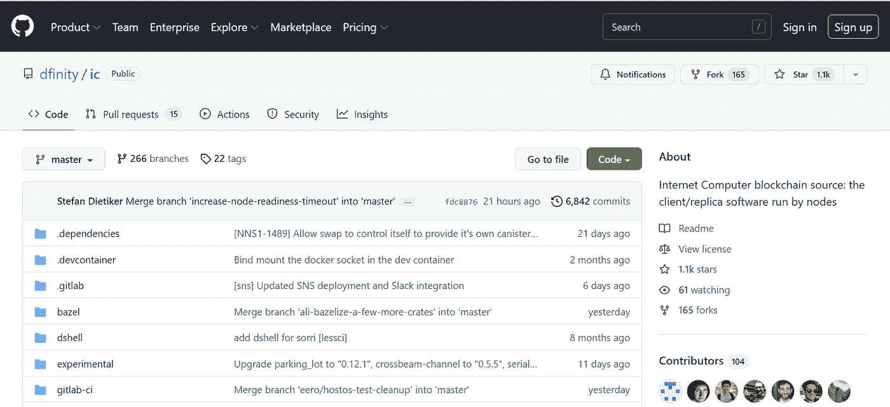

与项目交互有时不一定需要购买它的令牌。更重要的是训练我们对好项目的基本感知的审美。

*2。潜力巨大的强大底层技术*

要记住的一个最重要的原则是，互联网计算机是一个区块链，它允许以分布式、可复制的方式运行软件。

当您为运行在互联网计算机上的 dapp 编写源代码时，您将源代码编译到 WebAssembly 模块中。当您在互联网计算机区块链上部署包含您的程序的 WebAssembly 模块时，该程序在一个称为 canister(或简称 canister)的概念性计算单元中执行。

部署完成后，最终用户可以通过浏览器等前端客户端访问您为该容器定义的入口点函数，从而与容器进行交互。

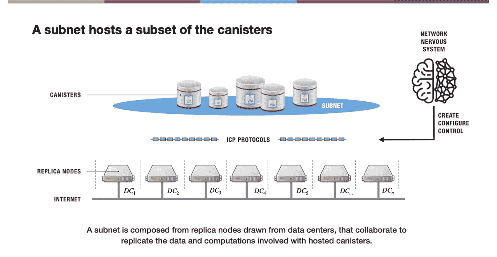

作为一种颠覆性创新技术，一旦冷却下来，爆发就来了。

*3。适合熊市。*

目前，没有太多人关注它，也没有发行硬币的项目。所以非常适合深度体验和参与熊市。

# 二。逐步指南

注意:要创建互联网身份，您需要一个具有安全认证功能或生物指纹或面部识别的设备。

**第一步:进入**[***identity . ic0 . app***](https://identity.ic0.app/)**。**

打开支持的浏览器(如 Chrome、Firefox 或 Safari)。进入[*identity . ic0 . app*](https://identity.ic0.app/)。点击*创建新的互联网身份锚*

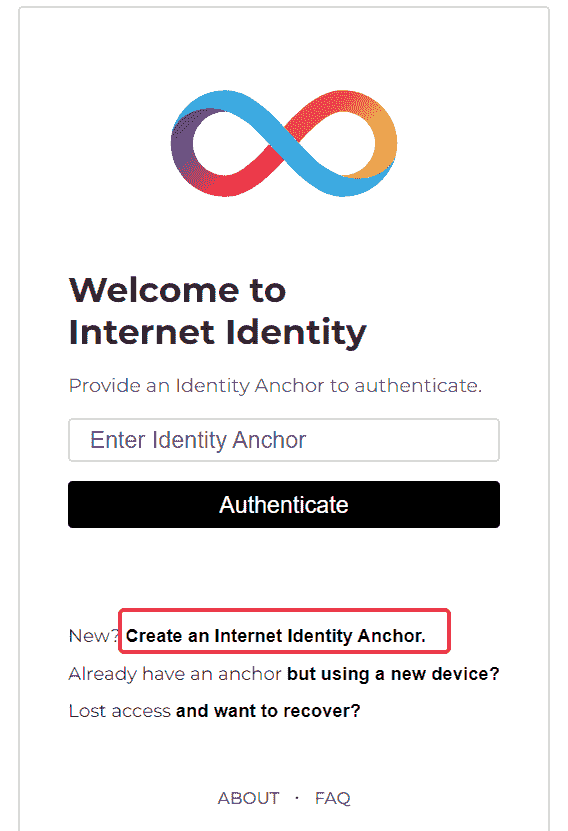

**第二步:输入您的设备名称(例如，“iPhone 12pro”)。**

然后点击*创建。*

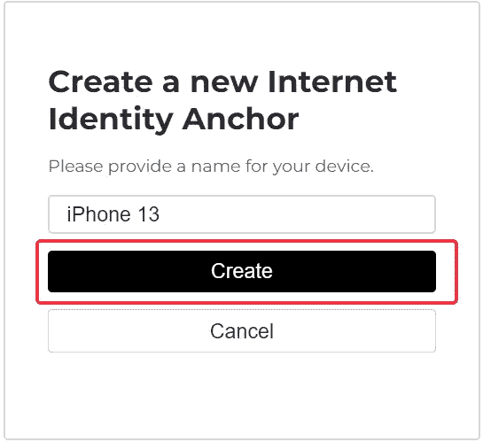

***第三步:选择你所选择的认证方式。***

*使用您的安全密钥、智能手机密码或锁定选项，或者生物指纹或面部识别进行身份验证。*

认证后，你会看到这个页面，意思是你需要等待一分钟。

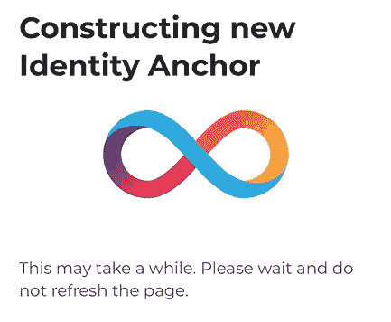

***第四步:确认报名。***

*我们会向您提供您的互联网身份号码。记下号码，并将号码保存在安全的地方。*

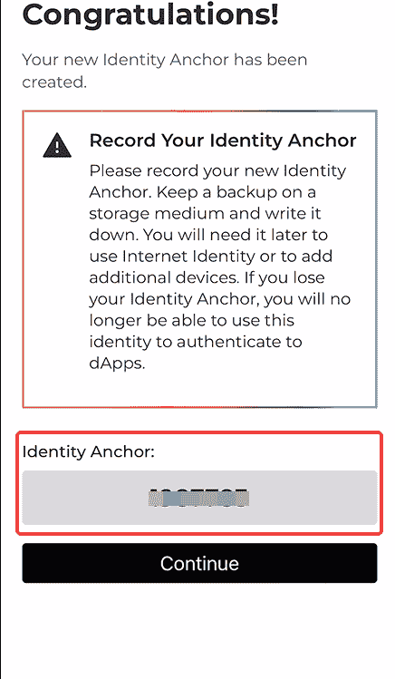

**第五步:设置帐户恢复。**

您将被引导至一个警告页面，要求您设置帐户恢复。继续并选择您的恢复选项。您可以选择种子短语和/或安全密钥。

再按一下继续，就大功告成了。

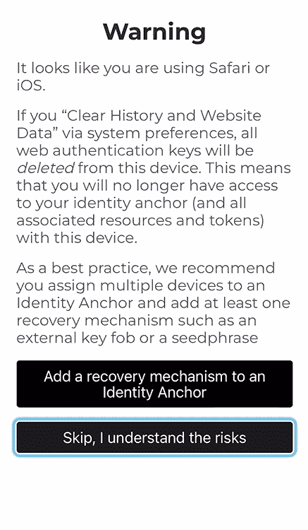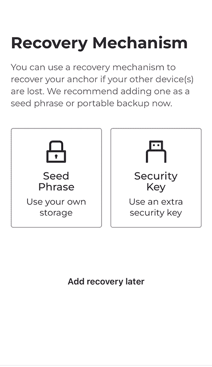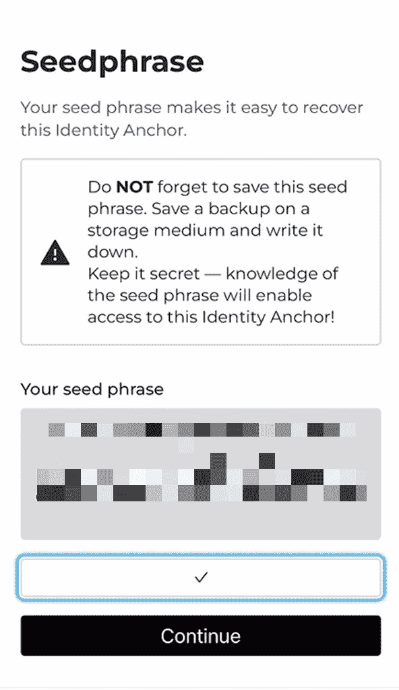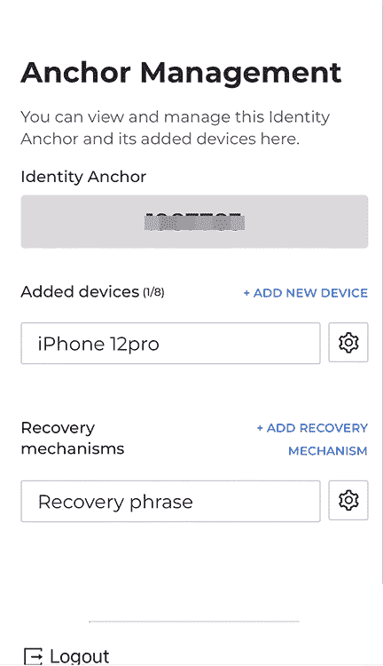

# 三。试试吧！

使用互联网身份，我们可以访问许多集成电路项目。这里我们以白纬玲为例，它是一个建立在 IC 上的高速、低成本、完全分散的 NFT 市场。

去[白纬玲](http://yumi.io)，用你的网络身份登录。

成功登录后，我们将看到这个页面显示帐户 ID(我们的地址)和委托人 ID(IC 上的唯一 ID)。

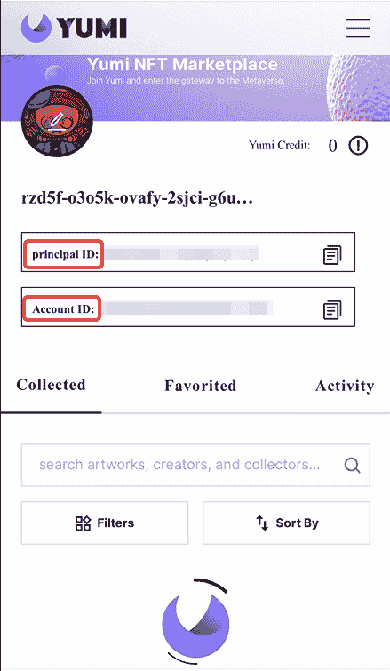

并且可以在平台上查看自己感兴趣的 NFT。如莫拉星球，显示已发行 9999 个 NFT，分为 5 个系列。

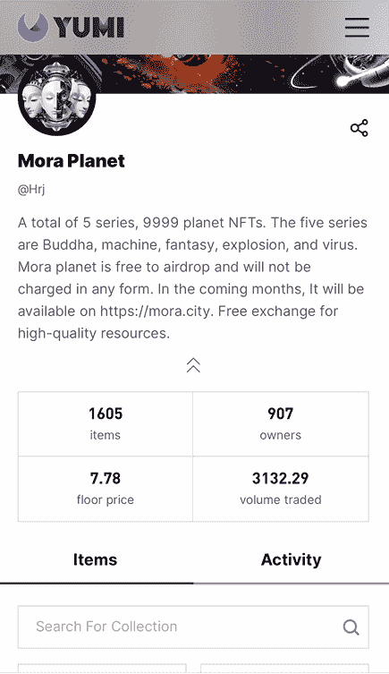

您可以搜索其他热门 NFT 或尝试 IC 上的其他平台进行交互。

一如既往，DYOR。

> ***保持知情***

1.  IC 生态系统:【https://dfinity.org/showcase?tag=games 
2.  集成电路媒介:[https://medium.com/dfinity](https://medium.com/dfinity)
3.  IC GitHub:[https://github.com/dfinity](https://github.com/dfinity)
4.  确定:[https://dfinity.org/](https://dfinity.org/)
5.  创建互联网身份:[https://identity.ic0.app/](https://identity.ic0.app/)
6.  https://tppkg-ziaaa-aaaal-qatrq-cai.raw.ic0.app/ NFT 站台白纬玲:

***跟随我获得晋升吧！***

***聚焦#NFT 研究员&#网路搜寻家***

***每日分享关于# web 3 # Crypto # NFT #比特币的真实素材***

[***碎碎念***](https://twitter.com/TheCryptoKK)***|***[***中等***](/@TheCryptoKK)

*欢迎关注我，有什么问题尽管问*

> 交易新手？尝试[加密交易机器人](/coinmonks/crypto-trading-bot-c2ffce8acb2a)或[复制交易](/coinmonks/top-10-crypto-copy-trading-platforms-for-beginners-d0c37c7d698c)