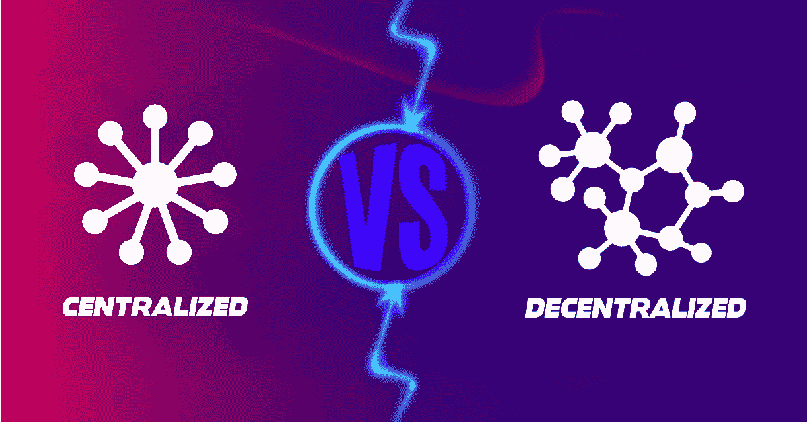
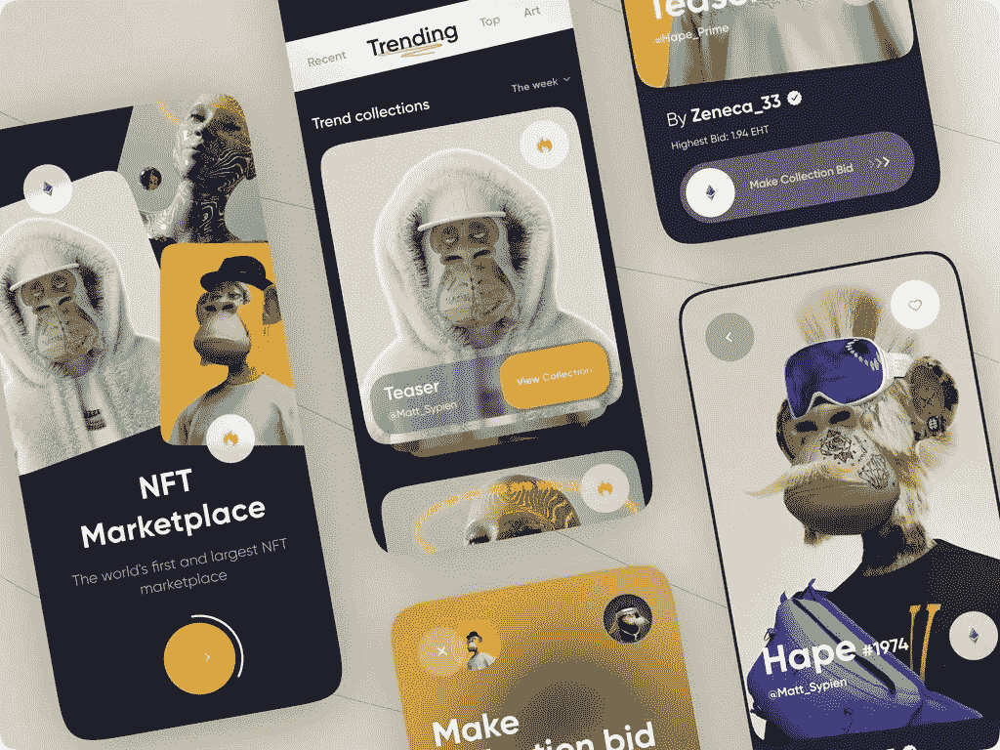

# 如何打造 2023 年的 NFT 市场？类型、收入模式和发展

> 原文：<https://medium.com/coinmonks/how-to-create-nft-marketplace-in-2023-types-revenue-model-and-development-a9a712654f94?source=collection_archive---------15----------------------->

随着生态系统的大量开发和升级，加密世界目前正在经历一场重大转变。你们必须知道的最新消息是以太坊的合并。这是一个有趣的转变，有效地邀请了许多公司甚至个人开始他们的加密事业。虽然所有这一切都是至高无上的，但真正的英雄是 NFT。

> 不可替代的代币在 2022 年出现了关键的飙升，因为它正在缓慢地朝着 2023 年的预期新步骤前进。随着 NFT 市场的发展，目前的市场价值将超过 2.32 亿美元，到 2026 年将达到 800 亿美元。

NFT 是可标记的加密资产，它将所有权无限期地分配给创建者。这些资产可以是任何可以转换成数字格式的东西，如音频剪辑、视频文件、图像、收藏品等等。这个博客是专门为这个行业的初学者准备的，目的是让他们对 NFTs 的狂热有一个大概的了解。

# **NFT 市场——你的 NFT 系列的主办者**

NFT 市场是一个使用区块链技术开发的平台，该技术提供了独特的特性来保持其平稳运行。使用 NFT 市场，用户可以购买、出售、拍卖、出借和借用 NFT，这与其他 NFT 完全不同。在 NFT 市场中，有多种资产可以进行代币化，例如门票、优惠券、体育收藏品、数字收藏品、音乐、艺术、房地产等等。下面给出了世界上最著名的 NFT 市场来开发定制的 NFT。

*   OpenSea
*   稀有的
*   超级罕见
*   漂亮的网关
*   币安
*   NBA 最佳投篮
*   基础

[**2023 年 NFT 市场的发展**](https://blog.cryptostars.is/nft-marketplace-development-a-2023-startup-guide-47f50e2bf16b) 将需要的不仅仅是当前对 NFT 技术的了解，你应该能够预测市场。此外，如果你想全面了解什么是 NFT，你必须了解它们的工作模式:集中式和分散式。

## **集中的 NFT 市场**

集中的 NFT 市场由个人或我们称之为私人公司所拥有。这些市场做铸币、交易和竞标 NFTs 但是，都是公司控制的。从启动资产的数字化到验证每一笔交易，都需要中间人的服务，这是你想要的两倍成本！

## **分散的 NFT 市场**

分散的 NFT 市场偏离了管理我们金融资产的传统做法。它们运行在一个不变的、可追踪的区块链网络上。

顾名思义，他们需要有集中的权力来验证每一笔交易和交易者的事件。

现在我们正随着技术的发展快速前进，是时候了解不同类型的 NFT 市场了。因为这些市场的领域是快节奏和不断变化的，所以你需要学习它们的基础知识。以下部分详细介绍了 NFT 市场的另外两个类别，这两个类别可能在行业中受益匪浅。

## **数字资产的市场类型**

*   **初级市场**是 NFT 首次出售的地方。在这里，创作者/艺术家运行平台，就像最知名的 NFT 市场，如 crypto kitties 等。
*   **二级市场**是在 NFTs 创建后允许交易者进行买卖的地方。二级市场的一些蓝筹市场有 OpenSea、Rarible 等。

## **收入模式:了解你在市场中的财务流**

因此，希望上面给出的所有基本清单都已完成，让我们从发展任何业务的最重要部分开始:收入模式。不管平台的规模有多大，这些为运营一个成功的 NFT 市场而建立的收入模式都是必不可少的。

*   建立一个正常运作的企业的开发成本需要专业的帮助。雇佣他们来定制您的项目所产生的成本会随着每个特性和集成它们的复杂性而变化。
*   铸造费是不可避免的，因为没有铸造，就没有非功能性食物。铸造是将资产转化为区块链技术中的数字格式的过程。因此，为了在平台中成功构建您的 NFTs，需要支付铸造费。
*   托管费用是集中的 NFT 市场。有了这样的 NFT 平台，用户将需要向市场支付托管费来维持它们的运行。这些费用是为补偿所有铸造、交易和验证 NFTs 而支付的替换费用。它们通常随着市场的规模而变化。
*   NFT 市场的营销成本对于向用户推出这些产品至关重要。由于这些平台能够进入不同的渠道进行促销活动，它们在不断变化。
*   交易成本或燃气费是用户在验证 NFTs 交易时必须为能源损失支付的费用。每个市场的交易费都不一样。
*   挂牌费是平台列出待交易的 NFT 藏品的费用。像汽油费一样，它们也因市场而异，因为该列表用于将所有登山 NFT 分类。例如，音频 NFTs 可以在音乐 NFTs 下找到。

## **2023 年 NFT 市场的预期趋势**

NFT 市场正在快速增长，这对于这样一个革命性的技术概念来说是非常出乎意料的。近年来出现了许多令人眼花缭乱的创新，从未停止让用户敬畏。使用白色标签解决方案开发的 [**创建 NFT 市场**](https://www.appdupe.com/nft-marketplace-development) 、它们具有高度可定制性，可满足所有业务需求，利润丰厚。一些这样的行业证明了密码圈内的说法

*   NFT 游戏平台
*   NFT 艺术平台
*   运动平台的 NFT
*   NFT 社区平台
*   NFT 加密货币平台
*   NFT 收藏品平台
*   NFT 时尚平台
*   NFT 标志

## **开发定制 NFT 市场的步骤**

首先，密码爱好者和有抱负的开发人员希望开发一个能够满足他们需求的项目。这可能是创造性的需求，独特的技术实力，或最重要的财务增长。NFT 是所有这些的来源，下面是创建托管平台的方法。

*   获得最有利于市场增长和品牌价值的**区块链网络**。有多种区块链可供您选择，用于您的 NFT 市场发展。如以太坊，币安智能链，创，多边形，等等。
*   满足于你感兴趣的利基市场！强烈建议进行利基市场开发，因为该平台将专注于更广泛年龄段的志同道合者。市场上可用的 NFT 市场有音乐、艺术、体育、游戏、房地产、内容创作者、元宇宙等。
*   为平台编写智能合约，轻松实现平台所有活动的自动化。它们将包括交易过程、铸造等。，以便交易者可以轻松体验平台的全部功能。
*   下一个过程是开发平台的用户界面，它将有效地与平台的用户进行交互。这些发展将确保用户有一个友好的环境，有易于使用的工具在平台内导航。为了打造一个功能完善的 NFT 平台，请获得 [**顶级 NFT 市场开发公司**](https://blog.cryptostars.is/top-10-popular-nft-marketplace-development-companies-in-2022-75123c2ad544) 的帮助。
*   集成到平台中的前端和后端开发就像 NFT 市场的两只眼睛。由于他们负责平台的后台工作，偏向用户的开发有助于密码爱好者直接或间接有效地交流。也就是说，虽然前端开发是针对用户界面的，但后端负责支付网关、交易验证等。
*   将加密钱包集成到平台中，该平台将在一个更加安全的环境中执行存储和交易 NFTs 的任务。加密钱包拥有多个私人资产的访问密钥，否则这些资产将被锁在区块链。加密钱包有多个选项，您可以从信任钱包、元掩码等中进行选择。
*   平台开发完成后，让 NFT 市场进行几次兴趣测试，以消除任何错误或缺陷。一旦市场被认为是没有错误和没有错误的，它们就被给予用户的认可。
*   NFT 市场开发过程的最后阶段是在用户的云服务器上启动它们，进行无形 NFT 交易，赚取数百万美元！
*   推广您使用白标解决方案定制的 NFT 市场，吸引感兴趣的投资者和收藏家。营销 NFT 市场是至关重要的，如果你想在密码市场取得持久的成功。

## **关闭思想！**

NFT 市场是网民的新时尚！不可替代的令牌是当今加密领域的唯一经济来源，它正进一步扩展到许多行业。令人瞠目结舌的是，与任何传统市场不同，基于 NFT 的平台可以获得那种不可能实现的利润！

如果你希望创建一个充满特色的 NFT 市场，为用户提供一些非常好的优势，一个 [**白标 NFT 市场发展公司**](https://www.appdupe.com/nft-marketplace-development) 是你的一站式目的地。考虑开发一个定制的、健壮的、蓝带平台，真正适合它的位置，你自己的生态系统，和熟练的开发者一起为利润丰厚的 NFTs 服务。

> 交易新手？尝试[加密交易机器人](/coinmonks/crypto-trading-bot-c2ffce8acb2a)或[复制交易](/coinmonks/top-10-crypto-copy-trading-platforms-for-beginners-d0c37c7d698c)