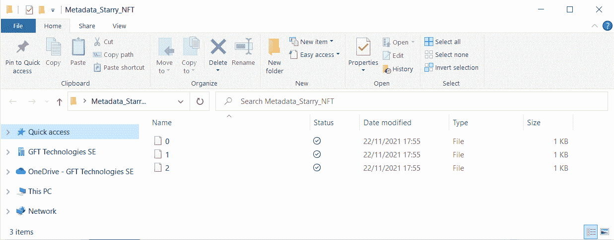
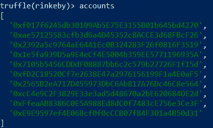
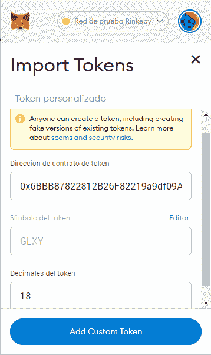

# 如何从头开始创建你的 Nft 并在 Opensea 上列出它

> 原文：<https://medium.com/coinmonks/how-to-create-your-nft-from-scratch-and-list-it-on-opensea-9f044c51e489?source=collection_archive---------21----------------------->

自从 CryptoKitties 游戏的出现，以及最近 Twitter 的创始人以大约 300 万美元的价格拍卖了其作为 NFT 的第一条推文，NFT 越来越受欢迎。

在本帖中，我们将讨论如何开始你的 NFT 收藏，并以“数码艺术品”作为标志。我们将通过利用 ERC-721 标准和以太坊区块链来做到这一点。“艺术作品”(图片)将保存在 IPFS，由于我们遵守 ERC721 JSON 模式元数据要求，NFT 也可以在 OpenSea 中访问。

# 到底什么是 Nft？

不可替换令牌，也称为 NFT，是一种独特的数字资产，其有效性由区块链保证。这种令牌是一种奇妙的工具，可用于提供各种物品的平台或企业，它们必须展示特殊的品质和特征，如:

收藏品

艺术

游戏项目

虚拟世界

文档和真实资产

# ERC721 标准:它是什么？

ERC-721 是一个不可替代的令牌标准，它为智能合约中的令牌定义了一个 API。它是由威廉·恩特里肯、迪特·雪莉、雅各布·埃文斯和纳斯塔西亚·萨克斯在 2018 年 1 月首次提出的。

它提供的功能包括在帐户之间移动不可替换的令牌、确定帐户的当前令牌余额、识别特定令牌的所有者，以及确定现在在网络上流通的令牌总数。

还允许您的令牌实现可选的元数据。

先决条件:

节点 JS & NPM—[https://nodejs.org/es/download/](https://nodejs.org/es/download/)

块菌—【https://www.trufflesuite.com/truffle 

皮纳塔账户—【https://www.pinata.cloud/ 

集成驱动电子设备

Metamask Chrome 扩展和钱包-[https://metamask.io/download.html](https://metamask.io/download.html)

> 交易新手？尝试[加密交易机器人](/coinmonks/crypto-trading-bot-c2ffce8acb2a)或[复制交易](/coinmonks/top-10-crypto-copy-trading-platforms-for-beginners-d0c37c7d698c)

# [计]元数据

元数据存储问题可以通过多种方式解决。对于本文，我选择了离线托管元数据(即远离区块链)，但是我将以一种分散的方式使用 IPFS 来访问元数据。

它可能是集中的，在这种情况下，我们会在几个方面受益，包括更快的反应或对项目更多的控制。或者直接上链，在这种情况下，由于目前对费用和汽油价格的限制，部署成本大大增加。

# ERC721 JSON 模式参考:

{

"标题":"资产元数据"，

"类型":"对象"，

"属性":{

"名称":{

"类型":"字符串"，

"描述":"标识此 NFT 代表的资产"

},

"描述":{

"类型":"字符串"，

"描述":"描述此 NFT 代表的资产"

},

"图像":{

"类型":"字符串"，

" description ":"指向 mime 类型为 image/*的资源的 URI

代表这个 NFT 所代表的资产。考虑制作宽度在 320 到 1080 像素之间、长宽比在 1.91:1 到 4:5 之间(含)的图像。"

# NFT 元数据的真实示例:

{

【描述】:“银河&星辰照片”，

" external _ URL ":" https://www . pexels . com/photo/milky-way-galaxy-during-night-1252890/"，

" image ":" https://gateway . pinata . cloud/ipfs/qmz 6 ijbupefkxuodwx 4d GAF 9 zquvrjjemxakh 8 ejtwplkm "，

【姓名】:《星夜#1》，

"属性":[

{

" trait_type ":"作者"，

“价值”:“赫里斯托·菲达诺夫”

},

{

" trait_type ":"相机"，

【价值】:尼康 D750

},

{

" trait_type ":"分辨率"，

"数值":" 6016 像素 x 3385 像素"

},

{

" display_type": "date "，

" trait_type ":"已发布"，

【价值】:1531951200

}

]

}

在下图中，我们可以看到如果我们遵循 OpenSea 约定，结果会是什么样子:

# 将元数据上传到 IPFS 和皮纳塔

第一步是将我们希望链接到我们的令牌的图像提交给 Pinata，这将让我们保持图像存储不变和分散。

接下来，我们将在“我的文件”中看到我们的照片单击相应的元数据文本文件，输入该文件的 Url。

最后，我们应该有一个类似下面的文件夹，其中有保存元数据的各种文件。

最后，我们将把文件夹提交给 Pinata。

此外，它将为您提供一个契约部署脚本的 URL，稍后您将需要它。

如果你点击它，你应该被发送到一个文件夹，看起来像这样:

# 设置环境

您将需要 WSL2 来执行 Windows 操作系统上的每个命令

开始创建新项目:

**mkdir<FOLDER _ NAME _ PROJECT>**

**光盘<文件夹 _ 名称 _ 项目>**

**npm init -y**

然后，安装 OpenZeppelin Contracts，它提供了各种 Solidity 文件，我们将利用这些文件来实现 ERC721:

**npm 安装—save-dev @ open zeppelin/contracts**

安装部署开发框架，在本例中是 Truffle:

**npm 安装块菌**

# 建立松露项目

大多数 Truffle 命令必须针对现有的 Truffle 项目执行才能使用。因此，第一步是建立一个松露项目。

**npx 块菌初始化**

该程序将生成一个名为“contracts”的目录以及一个配置文件(“truffle-config.js”)，这是一个 Javascript 文件，可以运行必要的代码来构建和维护您的 truffle 环境设置，例如:

脚本中使用的编译器和配置中选择的编译器之间的一致性。

你的项目的网络配置(开发，林克比，科万，李二等。).

我们稍后会调查这份文件。

# 智能合同和部署文件

# ERC721 和扩展

可靠性智能契约类似于 OOP 模型中的“类”概念。契约包括具有永久数据的状态变量和可以改变这些变量的函数。在单独的协定(实例)上调用函数将导致 EVM 函数调用，切换上下文并使调用协定中的状态变量不可用。

我们将使用预设的 ERC721 presetmtinterpauserautoid，这是一个已经使用 ERC721 标准及其扩展进行了预配置的 ERC 721。

本质上，我们正在将许多具有不同功能的 Solidity 智能合约导入到一个文件中，该文件将所有这些合约组合在一起，为我们提供该标准的大部分功能。

我们可以通过转到节点路径\ node _ modules \ @ openzeppelin \ contracts \ token \ ERC 721 和/或 open zeppelin 的 Github 来检查 ERC 721 presetmtinterpauserid . sol 和用于此智能合约的所有其他 Solidity 文件。

//SPDX-许可证-标识符:MIT

//open zeppelin Contracts v 4 . 3 . 2(token/ERC 721/presets/ERC 721 presets tminterpauserutoid . sol)

^0.8.0 实用主义；

导入"../ERC 721 . sol "；

导入"../extensions/ERC 721 enumerable . sol "；

导入"../extensions/ERC 721 burnable . sol "；

导入"../extensions/ERC 721 pausable . sol "；

导入"../../../access/accesscontrolenumerable . sol "；

导入"../../../utils/context . sol "；

导入"../../../utils/counters . sol "；

/**

* @dev {ERC721}令牌，包括:

*

* —持有者能够烧毁(销毁)他们的代币

* —允许令牌铸造(创建)的铸造者角色

* —允许停止所有令牌传输的暂停者角色

* —令牌 ID 和 URI 自动生成

*

*此契约使用{AccessControl}来锁定使用

*不同的角色——有关详细信息，请参阅其文档。

*

*部署合同的帐户将被授予 minter 和 pauser

*角色，以及默认的管理员角色，这将允许它授予 minter

*并将用户角色分配给其他客户。

*/

合同 ERC721PresetMinterPauserAutoId 为

语境，

AccessControlEnumerable，

ERC 721 可数，

ERC 721 可燃，

ERC 721 暂停

{

为计数器使用计数器。柜台；

bytes32 公共常量 MINTER _ ROLE = ke ccak 256(" MINTER _ ROLE ")；

bytes32 公共常量 PAUSER _ ROLE = ke ccak 256(" PAUSER _ ROLE ")；

柜台。Counter private _ tokenIdTracker

string private _ baseTokenURI

/**

* @dev 将“DEFAULT_ADMIN_ROLE”、“MINTER_ROLE”和“PAUSER_ROLE”授予

*部署合同的客户。

*

*令牌 URIs 将基于“baseURI”及其令牌 id 自动生成。

*请参见{ERC721-tokenURI}。

*/

构造器(

字符串内存名称，

字符串存储符号，

字符串内存 baseTokenURI

)ERC721(名称，符号){

_ baseTokenURI = baseTokenURI

_setupRole(DEFAULT_ADMIN_ROLE，_ msg sender())；

_setupRole(MINTER_ROLE，_ msg sender())；

_setupRole(PAUSER_ROLE，_ msg sender())；

}

function _baseURI()内部视图虚拟覆盖返回(字符串内存){

return _ baseTokenURI

}

/**

* @dev 为“to”创建一个新令牌。它的令牌 ID 将自动

*已分配(在发出的{IERC721-Transfer}事件上可用)，以及令牌

* URI 基于 URI 在建造时通过的基础自动生成。

*

*参见{ERC721-_mint}。

*

*要求:

*

* —调用方必须具有“MINTER_ROLE”。

*/

function mint(地址)public virtual {

require(hasRole(MINTER_ROLE，_msgSender())，“ERC721PresetMinterPauserAutoId:必须有 MINTER 角色才能薄荷”)；

//我们不能只使用 balanceOf 来创建新的 tokenId，因为令牌

//可以烧(毁)，所以需要单独的计数器。

_mint(to，_ tokenidtracker . current())；

_ tokenidtracker . increment()；

}

/**

* @dev 暂停所有令牌传输。

*

*参见{ERC721Pausable}和{Pausable-_pause}。

*

*要求:

*

* —调用方必须具有“PAUSER_ROLE”。

*/

函数暂停()公共虚拟{

require(hasRole(PAUSER_ROLE，_msgSender())，“ERC721PresetMinterPauserAutoId:必须有 PAUSER 角色才能暂停”)；

_ pause()；

}

/**

* @dev 取消暂停所有令牌传输。

*

*请参阅{ERC721Pausable}和{Pausable-_unpause}。

*

*要求:

*

* —调用方必须具有“PAUSER_ROLE”。

*/

函数 unpause() public virtual {

require(hasRole(PAUSER_ROLE，_msgSender())，“ERC721PresetMinterPauserAutoId:必须有 PAUSER 角色才能取消暂停”)；

_ un pause()；

}

function _beforeTokenTransfer(

地址来自，

地址:

uint256 令牌 Id

)内部虚拟覆盖(ERC721，ERC721Enumerable，ERC721Pausable) {

超级棒。_beforeTokenTransfer(from，to，token id)；

}

/**

* @ dev See { ierc 165-supports interface }。

*/

功能支持接口(字节 4 interfaceId)

公众的

视角

虚拟的

覆盖(AccessControlEnumerable，ERC721，ERC721Enumerable)

返回(布尔值)

{

返回 super . supports interface(interface id)；

}

}

这些功能使我们能够执行许多与 NFTs 和 ERC721 标准相关的交易:

**薄荷**。“铸造”一个 NFT 就是生产出某样东西的数字版本，并将其添加到区块链中。

**烧伤**。这允许你将令牌转移到一个没有公共访问权限的“黑洞”账户，在那里你只能查看余额，而不能查看内容。

**停顿。**允许您延迟 NFT 转让，如果您出于任何原因想要停止资产的适销性，这可能会很方便。

**转移。**资产必须在区块链进行转移和跟踪。

**插入元数据**。提供象征性的 URI。我们的令牌 URI 将是 baseUri + tokenId，它将随着每次铸造自动添加和递增。

我们只需要将工件复制到 build/contracts 目录，因为 build/contracts 目录已经编译好了:

**mkdir -p 构建/合同/**

**CP node _ modules/@ open zeppelin/contracts/build/contracts/* build/contracts/**

# 部署合同脚本

使用您的 IDE 在**迁移**目录中创建 **2_deploy_token.js** ，内容如下:

//迁移/2_deploy_token.js

//SPDX-许可证-标识符:MIT

const ERC 721 prestminterpauserutoid = artifacts . require(" ERC 721 prestminterpauserutoid ")；

module . exports = function(deployer){

deployer . deploy(ERC 721 prestminterpauserautoid，"我的 NFT "，" NFT "，" https://gateway . pinata . cloud/ipfs/qmcdnhctupoazqg 8 ft 3 tsrq 6 rztob 6 Edgar 5 mo 3 LV 2 weif/")；

};

我们在这里设置(按顺序):

我们正在使用的合同

集合的名称

NFT 的象征

指向 IPFS 的 baseTokenURI，它指向我们的元数据。

# 迁移

正如 Truffle 文档中所述，迁移是帮助您将合同部署到以太网的 Javascript 文件。这些文件负责准备您的部署活动，创建这些文件的前提是您的部署需求会随着时间的推移而发展。

因此，在管理大型项目的交互和部署在不同时期相互依赖的多个智能合同时，迁移是极其重要的。

您可以在迁移目录中找到该文件，名为“1_initial_migrations.js”

const Migrations = artifacts . require(" Migrations ")；

module . exports = function(deployer){

deployer.deploy(迁移)；

};

pragma 实度> =0.4.22 <0.9.0;

contract Migrations {

address public owner = msg.sender;

// A function with the signature `last_completed_migration()`, returning a uint, is required.

uint public last_completed_migration;

modifier restricted() {

require(

msg.sender == owner,

“This function is restricted to the contract’s owner”

);

_;

}

// A function with the signature `setCompleted(uint)` is required.

function setCompleted(uint completed) public restricted {

last_completed_migration = completed;

}

}

# Deploy To A Public Testnet (Rinkeby)

An Ethereum testnet is a network that is remarkably similar to the main network, except that the ether has no value and may be gained for free. This makes them particularly helpful for applications such as testing transaction costs.

We will deploy to the Rinkeby public testnet because OpenSea enables testing on Rinkeby.

What are the requirements for deploying on a public testnet?

Obtain a testnet node.

Make a new account.

In our Truffle configuration file, update our network configuration.

Contribute to our testing account

# Connect To A Testnet Node

The simplest way to connect to a testnet is using a public node service like Infura.

Create an Infura account, create a new project, and save the ‘ProjectID’ since we’ll need it later.

# Set Up A New Tester Account

An Ethereum account is required to send transactions on a testnet. This is included in the Truffle and Mnemonics package:

**npx 助记符**

这将在您的终端屏幕上输出一系列短语，您将需要用您的帐户签署交易，因此保存它们以便稍后写入 secrets.json 文件。

# 在我们的 Truffle 配置文件中，更新您的网络设置

因为我们正在利用公共节点，所以我们必须在本地签署所有交易。

我们将把@truffle/hdwallet-provider 与我们之前准备的助记短语列表结合起来。

我们将指导提供者通过 Infura 端点连接到 Rinkeby testnet。

**npm 安装—save-dev @ truffle/HD wallet-provider**

安装完成后，我们将使用到 Rinkeby 的 testnet 的新连接来更新 truffle-config.js 文件。

它应该是这样的:

/**

*使用此文件来配置您的 truffle 项目。它被播种了一些

*不同网络的通用设置和迁移等功能，

*编译和测试。取消需要的注释或修改

*根据需要调整以适合您的项目。

*

*有关配置的更多信息，请访问:

*

* trufflesuite.com/docs/advanced/configuration

*

*要通过 Infura 部署，您需要一个钱包提供者(如@truffle/hdwallet-provider)

*在将事务发送到远程公共节点之前对其进行签名。Infura 账户

*可在 infura.io/register.免费获得

*

*你还需要一个助记符——钱包用来生成的 12 个单词短语

*公钥/私钥对。如果你要发布你的代码到 GitHub，确保你加载了这个

*来自您已创建的文件的短语。gitignored，这样就不会意外公开。

*

*/

const HDWalletProvider = require(@ truffle/HD wallet-provider))；

const { projectId，助记符} = require('。/secrets . JSON’)；

模块.导出= {

/**

*网络定义了如何连接到以太坊客户端，并允许您设置

web3 用于发送交易的默认值。如果你不指定一个块菌

*当您执行以下操作时，将在端口 9545 上为您启动开发区块链

*运行“开发”或“测试”。您可以要求 truffle 命令使用特定的

*从命令行连接网络，例如

*

* $松露测试—网络<network-name></network-name>

*/

网络:{

//对测试有用。“开发”这个名字很特别——松露默认使用它

//如果在这里定义了，并且没有在命令行指定其他网络。

//您应该在单独的终端中运行客户端(如 ganache-cli、geth 或 parity)

// tab 如果您使用这个网络，您还必须设置“主机”、“端口”和“网络 id”

//下面的选项给一些值。

//

//开发:{

// host: "127.0.0.1", // Localhost(默认:无)

//端口:8545，//标准以太坊端口(默认:无)

// network_id: "* "，//任何网络(默认:无)

// },

//另一个具有更高级选项的网络…

//高级:{

//端口:8777，//自定义端口

// network_id: 1342，//自定义网络

// gas: 8500000，//每笔交易发送的 gas(默认:~6700000)

// gasPrice: 20000000000，// 20 gwei(在魏)(默认为 100 gwei)

// from:

，//发送 txs 的账户(默认:accounts[0])

// websocket: true //启用 web3 的 EventEmitter 接口(默认值:false)

// },

//对于部署到公共网络非常有用。

// NB:将提供者包装成函数很重要。

// ropsten: {

//provider:()= > new hdwallet provider(助记符，' https://ropsten . in fura . io/v3/YOUR-PROJECT-id ')，

// network_id: 3，// Ropsten 的 id

// gas: 5500000，// Ropsten 的阻塞限制比 mainnet 低

// confsirmations: 2，// #在两次部署之间等待的 conf。(默认值:0)

// timeoutBlocks: 200，部署超时前的块数(最小值/默认值:50)

// skipDryRun: true //在迁移前跳过模拟运行？(默认值:对于公共网络为 false)

// },

//对专用网络有用

//私有:{

//provider:()= > new hdwallet provider(助记键，` https://network.io `)，

// network_id: 2111，//这个网络是你的，在云端。

// production: true //将此网络视为公共网络。(默认值:false)

// }

林克比:{

provider:()= > new hdwallet provider(助记键，` https://rinke by . in fura . io/v3/$ { projectId } `)，

network_id: 4，//林克比的 id

gas: 5500000，// Rinkeby 的阻塞限制比 mainnet 低

确认:2，在两次部署之间等待的确认次数。(默认值:0)

timeoutBlocks: 500，部署超时前的块数(最小值/默认值:50)

skipDryRun: true //在迁移前跳过模拟运行？(默认值:对于公共网络为 false)

},

},

//在这里设置默认的摩卡选项，使用特殊的记者等。

摩卡:{

//超时:100000

},

//配置您的编译器

编译器:{

solc: {

版本:“0.8.9”，//从 solc-bin 中获取精确的版本(默认:truffle 的版本)

// docker: true，//使用您已经用 docker 在本地安装的“0.5.1”(默认值:false)

//设置:{ //有关优化和版本的建议，请参见 solidity 文档

//优化器:{

// enabled: false，

//运行:200

// },

// evmVersion:“拜占庭”

// }

}

},

// Truffle DB 当前默认禁用；要启用它，请启用更改:

// false 为 enabled: true。默认存储位置也可以是

//通过指定适配器设置来重写，如下面的注释代码所示。

//

//注意:不可能将您的合同迁移到 truffle DB，您应该这样做

//在启用此功能之前，请将您的项目备份到安全的位置。

//

//备份工件后，您可以通过运行 migrate 来利用 DB，如下所示:

// $ truffle 迁移—重置—全部编译

//

// db: {

// enabled: false，

//主机:“127.0.0.1”，

//适配器:{

//名称:" sqlite "，

//设置:{

//目录:"。数据库"

// }

// }

// }

};

为了避免硬编码助记符和项目 id，必须在项目目录中包含一个 secrets.json 文件(来自 Infura)。只要安全，你可以自由使用任何你选择的替代秘密管理系统。

在这种情况下，所使用的文件应该包括以下内容:

**{**

**《助记术》:“车照眼飓风鹰……”，**

**“项目 id”:“505 c 127050……”**

**}**

# 资助您的测试帐户

要获得测试帐户，Truffle 将在项目中为您提供，请执行:

**npx 松露控制台—网络 rinkeby**

然后:

**松露(rinkeby) >账目**

此命令将删除您可以使用的不同帐户的列表:

选择第一个选项。

发一条关于它的推特或脸书帖子。

复制它的 URL 并提交给 Rinkeby 的水龙头。

现在，你有了乙醚，所以你可以开始花些钱了！

# 部署:

在您的项目目录中，执行以下命令:

**npx 松露控制台—网络 rinkeby**

**松露>迁移**

现在部署您的合同:

**mynft = await ERC 721 prestminterpauserautoid . deployed()**

# 当合同完成时

如果一切顺利，你应该可以与合同互动，所以我们将铸币 1 NFT:

**松露(rinkeby) >等待 mynft . mint(" YOUR _ meta mask _ ACCOUNT _ ADDRESS ")**

# OpenSea

现在，我们将在 OpenSea 上列出我们的 NFT，以便任何人都可以看到和购买。

我们可以使用松露控制台在 Rinkeby 上找到我们的合同地址:

**松露(rinkeby) > mynft.address**

导航到 Opensea 并选择“我的收藏”，后面跟着三个竖线点表示“导入现有智能合同”

选择“在线测试”后，复制并粘贴您的智能合同地址:

你可以看到这样的信息:“我们找不到这个合同。”请检查这是在 Rinkeby 上部署的合法 ERC721 或 ERC1155 合同，并且您已经在合同上创建了内容。'

这是一个常规问题；Opensea 将显示您的令牌，但这可能需要一些时间。只要代币合约和交易在 Etherscan Rinkeby 上可见，就知道是真的 ERC-721 合约，有铸造的 X 东西。你可能要等 12/24 小时才能看到他们的非功能性消化不良。

并且，假设没有问题出现，我们应该能够在 OpenSea 上看到我们的 NFT，结构如下:

[**https://rinkeby . opensea . io/assets/【NFT**](https://rinkeby.opensea.io/assets/[nft)**合同地址]/【令牌 id】**

# 将其导入到您的元掩码钱包中

您也应该能够将您的 NFTs 导入到您的元掩码钱包中。只需启动 Metamask Chrome 扩展，输入您用于铸造的地址，然后从菜单中单击“导入令牌”。您将被要求提供合同地址，一旦复制，该地址将自动设置您之前提供的令牌符号。你还必须选择小数。

# 以下步骤

此时，有几个选项可以进一步开发您的 NFTs:

其中之一可能是研究如何在 mainnet 上部署以及如何估算成本。

另一种可能性是在契约中包含神谕来执行确认的链外操作。

检查如何直接包含所有链上元数据，以及汽油和费用是如何起作用的。

API 可以用来提供集中的元数据。

制作交互式 NFT。

*原载于 2022 年 7 月 13 日*[*https://kryptomind.com*](https://kryptomind.com/how-to-create-your-nft-from-scratch-and-list-it-on-opensea/)T22。

> *加入 Coinmonks* [*电报频道*](https://t.me/coincodecap) *和* [*Youtube 频道*](https://www.youtube.com/c/coinmonks/videos) *了解加密交易和投资*

# 另外，阅读

*   [3 商业评论](/coinmonks/3commas-review-an-excellent-crypto-trading-bot-2020-1313a58bec92) | [Pionex 评论](https://coincodecap.com/pionex-review-exchange-with-crypto-trading-bot) | [Coinrule 评论](/coinmonks/coinrule-review-2021-a-beginner-friendly-crypto-trading-bot-daf0504848ba)
*   [莱杰 vs n 格拉夫](/coinmonks/ledger-vs-ngrave-zero-7e40f0c1d694) | [莱杰纳诺 s vs x](/coinmonks/ledger-nano-s-vs-x-battery-hardware-price-storage-59a6663fe3b0) | [币安评论](/coinmonks/binance-review-ee10d3bf3b6e)
*   [加密交易机器人](/coinmonks/crypto-trading-bot-c2ffce8acb2a) | [Bingbon 评论](https://coincodecap.com/bingbon-review)
*   [Bybit Exchange 审查](/coinmonks/bybit-exchange-review-dbd570019b71) | [Bityard 审查](https://coincodecap.com/bityard-reivew) | [Jet-Bot 审查](https://coincodecap.com/jet-bot-review)
*   [3 commas vs crypto hopper](/coinmonks/3commas-vs-pionex-vs-cryptohopper-best-crypto-bot-6a98d2baa203)|[赚取加密利息](/coinmonks/earn-crypto-interest-b10b810fdda3)