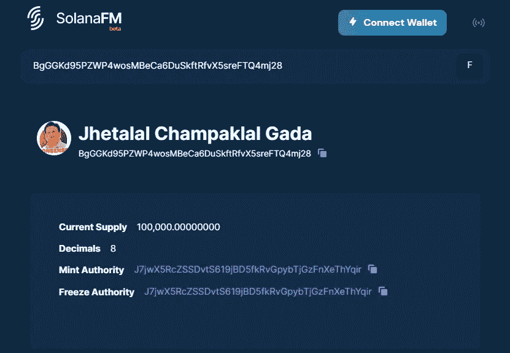
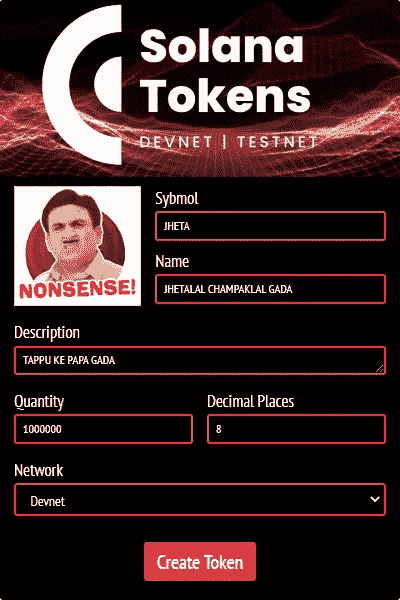
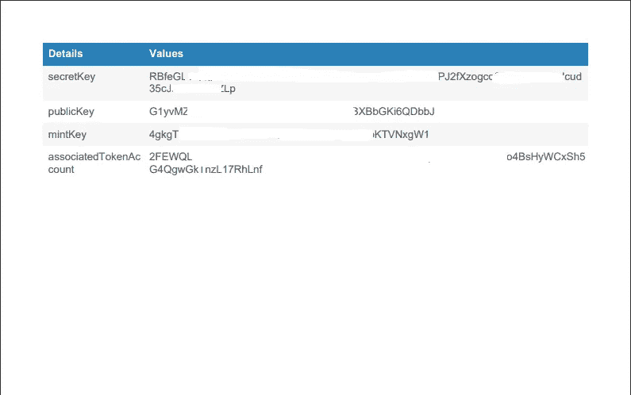

# 如何创建自己的加密货币？

> 原文：<https://medium.com/coinmonks/how-to-create-your-own-crypto-currency-47436d859eae?source=collection_archive---------8----------------------->


**什么是加密货币？**

一种**加密货币**或**加密**是一种[数字货币](https://en.wikipedia.org/wiki/Digital_currency)，它不依赖任何中央权力机构来支持或维护。并且以数字方式保存和交换！

**那么，我们如何创造自己的加密货币呢？**

比方说，我们想创造' Jheta '硬币，请按照下面提到的步骤详细。

我们将为这个博客使用索拉纳开发者网络

第一步【创建钱包】

首先，我们使用下面的命令创建一个新的 Solana 密钥对(Wallet)

配对钥匙就像银行保险箱，即……公钥(银行万能钥匙)和私钥(客户钥匙)

您将公钥共享给任何您想从其获得令牌的人

私钥将由您保管，不会与任何人共享，您可以用它来签署交易

您可以使用您的密钥导入您的虚拟扩展

```
import { clusterApiUrl, Connection, Keypair, LAMPORTS_PER_SOL } from '@solana/web3.js';

// create the wallet of the current user
const currentUserNewWallet = Keypair.generate();
```

第二步【资金钱包】

因为我们在这个博客中使用 Dev-net，所以我们在 Solana lib 中使用了 airdrop 功能

airdrop 将 2 SOL 转移到我们新创建的钱包中，用于我们将要执行的进一步交易

```
import { clusterApiUrl, Connection, Keypair, LAMPORTS_PER_SOL } from '@solana/web3.js';

const connection = new Connection(clusterApiUrl("devnet"), "confirmed");

let airDropping = await connection.requestAirdrop(currentUserNewWallet.publicKey, 2 * LAMPORTS_PER_SOL);

let confirmation = await connection.confirmTransaction(airDropping);
```

步骤 3[上传图像和元数据文件]

我们使用 NFT.storage 在区块链网络上保存文件

星际文件系统是一个协议、超媒体和文件共享对等网络，用于在分布式文件系统中存储和共享数据。IPFS 使用内容寻址来唯一标识连接 IPFS 主机的全局命名空间中的每个文件。

我们使用 NFT 将令牌图像和元数据 JSON(格式)上传到区块链。存储库

Solana 和 Metaplex 文档中指定了元数据 JSON 文件格式

```
import { NFTStorage, File } from 'nft.storage'

//upload image to NFT storage
const client = new NFTStorage({ token: environment.NFTstorage })
const imageFile = new File([fileData], symbol + '.png', { type: 'image/png' })
const imageCid = await client.storeDirectory([imageFile])

console.log("https://ipfs.io/ipfs/" + imageCid + "/" + symbol + '.png')

// upload json file
const jsonFile = new File(
  [JSON.stringify(
    {
      "name": name,
      "symbol": symbol,
      "description": description,
      "seller_fee_basis_points": 0,
      "image": "https://ipfs.io/ipfs/" + imageCid + "/" + symbol + '.png',
      "attributes": [],
      "properties": {
        "category": "image",
        "creators": [
          {
            "address": currentUserNewWallet.publicKey.toBase58(),
            "share": 100
          }
        ]
      }
    })], symbol + '.json', { type: 'application/json' })
const jsonCid = await client.storeDirectory([jsonFile])

console.log("https://ipfs.io/ipfs/" + jsonCid + "/" + symbol + '.json')
```

第四步【创建新账户】

在这一步中，我们创建骰子来铸造我们的令牌，也就是说，我们在区块链上创建一个新帐户，在其中我们指定所有的细节

重要的一点是小数，它表明我们可以将一个令牌进一步拆分成多少个分数

```
import { createAssociatedTokenAccount, createMint, mintToChecked } from '@solana/spl-token';
import { clusterApiUrl, Connection, Keypair, LAMPORTS_PER_SOL } from '@solana/web3.js';

// create mint account
let mintPubkey = await createMint(
  connection, // conneciton
  currentUserNewWallet, // fee payer
  currentUserNewWallet.publicKey, // mint authority
  currentUserNewWallet.publicKey, // freeze authority (you can use `null` to disable it. when you disable it, you can't turn it on again)
  8 // decimals
);

console.log("Mint public key", mintPubkey.toBase58())
```

步骤 5[创建关联的令牌帐户]

关联令牌帐户位于密钥对帐户下，每个钱包必须创建一次，并且每个令牌都是唯一的，即

如果我们在中有 3 个唯一的令牌，我们将为它们创建 3 个唯一的关联帐户

```
import { createAssociatedTokenAccount, createMint, mintToChecked } from '@solana/spl-token';
import { clusterApiUrl, Connection, Keypair, LAMPORTS_PER_SOL } from '@solana/web3.js';

// create associated token account
let tokenAccountPubkey = await createAssociatedTokenAccount(
  connection, // connection
  currentUserNewWallet, // fee payer
  mintPubkey, // mint
  currentUserNewWallet.publicKey // owner,
);

console.log("token public key", tokenAccountPubkey.toBase58())
```

第六步【铸造代币】

到目前为止，我们已经创建了骰子来铸造我们的加密令牌，现在是我们实际铸造和创建实际令牌的步骤

这叫做铸造代币

```
import { createAssociatedTokenAccount, createMint, mintToChecked } from '@solana/spl-token';
import { clusterApiUrl, Connection, Keypair, LAMPORTS_PER_SOL } from '@solana/web3.js';

// mint tokens
let txhash = await mintToChecked(
  connection, // connection
  currentUserNewWallet, // fee payer
  mintPubkey, // mint
  tokenAccountPubkey, // receiver (sholud be a token account)
  currentUserNewWallet, // mint authority
  1e8 * amount, // amount. if your decimals is 8, you mint 10^8 for 1 token.
  decimal // decimals
);

console.log("minterd public key", txhash)

let mintConfirmation = await connection.confirmTransaction(txhash);

console.log("minterd confirmation", mintConfirmation)
```

步骤 7[创建元数据]

现在，这是我们需要为新生成的令牌创建和初始化元数据帐户的最后一步

我们使用此元数据帐户来存储与我们的令牌相关的所有详细信息，即名称、符号、图标 URL 等

这有助于在区块链上识别和跟踪您的令牌

```
// update metadata
// const metadata = await Metadata.getPDA(mintPubkey)
const wallet = new metaPlex.NodeWallet(Keypair.fromSecretKey(currentUserNewWallet.secretKey))
let metadata = await metaPlex.actions.createMetadata({
  connection: connection, wallet: wallet, editionMint: mintPubkey, updateAuthority: wallet.publicKey, metadataData: new MetadataDataData({
    name: name, symbol: symbol, uri: "https://ipfs.io/ipfs/" + jsonCid + "/" + symbol + '.json', creators: [new Creator({
      "address": wallet.publicKey.toBase58(),
      "share": 100,
      "verified": true
    })], sellerFeeBasisPoints: 0
  })
})

let confirmation11 = await connection.confirmTransaction(metadata);

console.log("minterd confirmation", confirmation11)
```

第八步【结束】

现在你可以从 Chrome 网上商店安装幻影钱包，然后在上面导入密钥

你可以在 Solana FM 网站上查看新创建的令牌，并确保选择 dev-net 来搜索 mint 密钥



用例？

用例 1

假设我们想要开发一个地产，想要人们投资，想要它开放和自由交易，任何人都可以随时进出他们的投资

我们可以为 10，000 平方英尺的餐厅铸造 10，000 个代币，然后在我们的市场上列出这些代币，比如说 1 个代币== 1 平方英尺== 1000 卢比，所以任何人都可以以 x 平方英尺的价格购买 n 个代币，并成为该物业的部分所有者

使用这种方式的另一个好处是，买方可以拥有分数，比如说 1 个令牌== 1 平方英尺，我们可以创建 1 个令牌的分数，最多 8 位小数，这使得买方甚至可以投资更少的金额，成为该物业的部分所有者

而且，当这些代币上市时，他可以随时进出他的所有权，就像我们在股票市场上处理股票一样

用例 2

我们可以使用我们铸造的代币作为一种奖励形式，而不是真正的钱，这消除了世界各地政府监管的麻烦

例如，brave browser 具有 BAT(基本注意力令牌), Brave Browser 阻止所有广告并仅显示一些广告，我们可以设置这些广告的每小时频率，并对查看这些广告进行奖励。BAT 是所有市场上的上市令牌，并会波动，可以转换为法定货币

用例 3

国际汇款

从一个国家向另一个国家汇款有很多种方式，而且相关的费用很高

我们可以做的是将美元转换成代币，然后将代币转移给钱包里的人，他可以将代币转换成当地货币印度卢比

我们的解决方案？

[](http://bit.ly/3grgSAS) [## 索拉纳代币

### 创建您自己的加密货币

bit.ly](http://bit.ly/3grgSAS) 

我们的解决方案用途是什么？

我们已经创建了一个 Chrome 扩展，可以在 Solana dev-net 和 test net 网络上创建您自己的加密货币，用于学习和教育目的



1.  通过单击箭头来附加令牌符号
2.  输入最大长度为 10 的符号
3.  输入最大长度为 40 的令牌名称
4.  输入令牌的描述，以便人们了解令牌最大长度 60
5.  输入您要铸造的代币数量(金额)
6.  输入您可以细分令牌的程度
7.  选择网络类型
8.  单击“创建令牌”
9.  制作完成后，一个 PDF 文件被下载到您的 pc 上并保存

示例 PDF



> 交易新手？试试[加密交易机器人](/coinmonks/crypto-trading-bot-c2ffce8acb2a)或者[复制交易](/coinmonks/top-10-crypto-copy-trading-platforms-for-beginners-d0c37c7d698c)