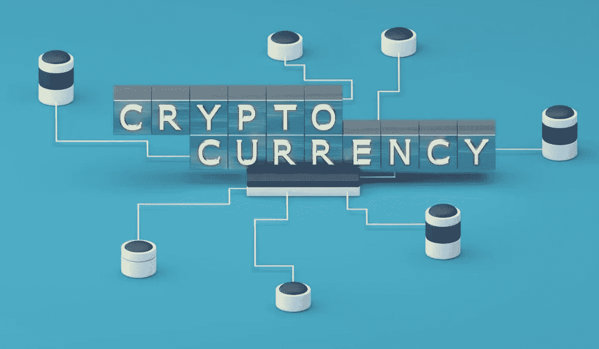
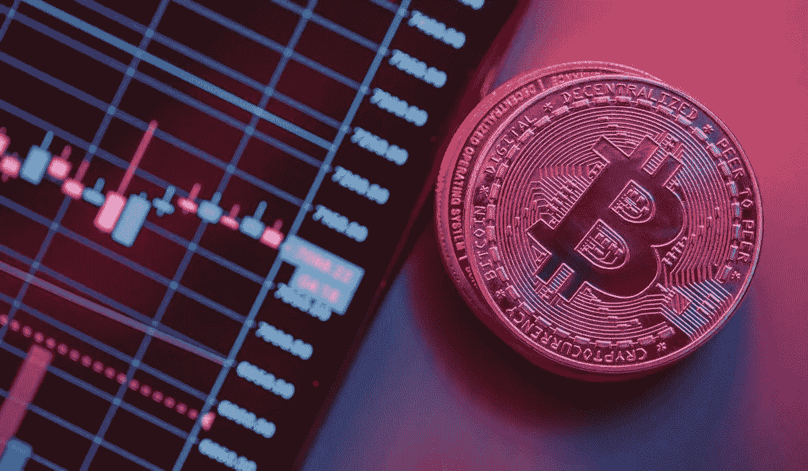

# 如何通过 7 个步骤创建自己的加密货币

> 原文：<https://medium.com/coinmonks/how-to-create-your-own-cryptocurrency-in-7-steps-b49aeb32b233?source=collection_archive---------27----------------------->

你有没有想过将商品化的概念，这已经成为今天的营销趋势之一，融入你的品牌和项目？通过创建您品牌的加密货币和 NFT 产品，您可以密切跟踪市场趋势，并创建自己的社区与您所做的好处。

在这篇文章中，我们将告诉你如何创建和销售自己的加密货币。我们将逐步解释从哪里开始，从哪里结束。如果你准备好了，就可以开始读书了。

首先，创建新的加密货币时，必须首先决定是要创建硬币还是令牌。如果你在加密货币市场待了很长时间，你就知道两者的区别了。如果你是新手，没关系。我马上解释一下。

比特币有自己的区块链，而代币则建立在现有网络的基础上。技术上这是两者唯一的区别。但如果我们深入一点比较这些技术基础架构，就会发现创建代币比创建加密货币需要更少的专业技能和工作。为了生产硬币，通常需要一个好的开发团队。不过，您也可以使用其他区块链，如 **Polygon** 、**以太坊**、**币安智能连锁**和**索拉纳**作为代币。这样，就可以在很短的时间内创建自己的令牌。

有 3 个阶段，你需要计划之前，你创建和启动你的加密。

首先，您需要考虑加密货币的使用情形、代币经济性和法律状况。

第二，继续发展阶段。在发展阶段，你需要选择区块链、共识机制和架构。

第三，你需要考虑你的项目的审计和最终的法律检查。虽然任何人都可以创建自己的加密货币，但开发一个可靠的项目需要良好的规划和大量的艰苦工作。

# 你应该遵循的 7 个步骤:

## 1.为你的项目选择最好的区块链平台

创建令牌时，需要选择要在其上颁发加密密钥的区块链。Polygon、BSC 和 Ethereum 都是受欢迎的选择，但侧链也是不错的选择。

而创造一个硬币，你需要设计你的区块链或工作与某人创造一个定制的区块链。

## 2.选择共识机制

如果你正在创建自己的区块链，或者不知道选择哪个区块链作为你的代币，尝试确定你想要的共识机制。这些机制决定了参与者如何批准和验证网络交易。

## 3.建立你的区块链结构

如果您正在创建令牌，您可以继续此步骤，而不会被卡住。但是，如果您正在创建硬币，您必须遵循此步骤来验证交易。交易验证不是公共实践。根据你的硬币和项目的目标建立你的区块链结构。这样，你就可以更容易地从保密的、公开的、基于许可的或非基于许可的验证方法中选择一种适合你的加密货币。例如，创造硬币的国家或公司可能会选择私人区块链来获得更多的控制权。

## 4.是时候发展区块链了

在这个级别，您将需要专家级的开发知识。在区块链上线之前，使用测试网络确保一切按计划进行。这将最大限度地减少问题，并大大降低误差幅度。在此阶段，与所有开发和测试部门协调工作。

## 5.检查你的密码

一些审计公司可能想测试你的加密和代码中的漏洞。测试结束后，公开分享报告，这样您就可以通过分析该报告来改进您的工作。这样，你可以更容易证明项目的可靠性。

## 6.最后一次执行合法性检查

既然你的区块链已经建立并开始运行，你最好向专家咨询是否需要申请任何许可证。完成这一步后，您的加密货币就可以开始发行了。

## 7.启动您的加密货币

创造你的加密货币取决于你的代币经济。例如，固定供应令牌通常通过智能合约一次性发行，但比特币等硬币是逐渐开采的。

最后，这里是你自己的加密货币准备推出。

**关注我们了解更多信息；** [**碎碎念**](https://app.adjust.com/nw8swri?redirect=https%3A%2F%2Ftwitter.com%2FNoSurrenderHero) **|** [**中等**](/@nosurrenderheroes)

[**NO Surrender Heroes**](https://app.adjust.com/nw8swri?redirect=https%3A%2F%2Ftwitter.com%2FNoSurrenderHero)