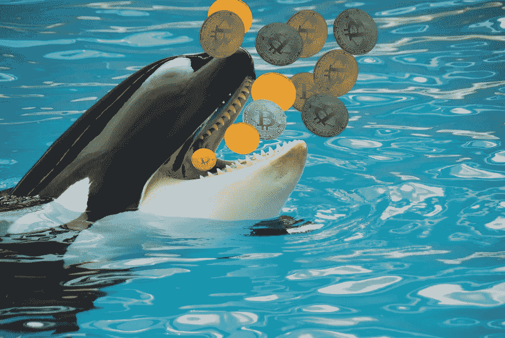
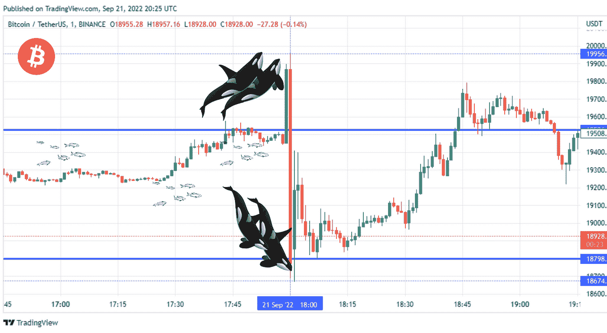

# 如何应对加密虎鲸

> 原文：<https://medium.com/coinmonks/how-to-deal-with-crypto-killer-whales-48b75662ad59?source=collection_archive---------37----------------------->

我喜欢称它们为加密黑仔鲸，它们基本上是大型交易商(或“鲸”)在外汇和加密货币等金融市场执行的止损猎人。当这些虎鲸看到成群的小鱼(一般是散户)把止损点停在几乎相同价格的位置附近时，然后虎鲸通过订单推动市场，迫使这些散户在很短的时间内立即被抛出头寸，这真的很令人震惊。

在这种情况下，你觉得你已经有了正确的交易想法，但你仍然被亏损甚至追加保证金所阻止。这种转变如此准确，就好像有人在追踪你的准确订单水平。众所周知，这让几乎所有散户交易者都感到沮丧。

最近的一个例子发生在比特币(BTC/USDT)2022 年 9 月 21 日 18:00 (UTC)，虎鲸在 19526 的阻力位或 18798 的支撑位处决了成群的小鱼。不加掩饰的虎鲸以 USDT 1283 的力量从 19956 咬到 18674，迫使所有的小交易者离开他们的位置。这个事件的图表可以在下图中看到，

***你可以在*******上找到同样的文章。只需点击*** [***这里***](https://www.publish0x.com/crypto-market-investment-ideas-cmii/how-to-deal-with-crypto-killer-whales-xyeegok?a=K9b6XL77eE) ***那里加入并阅读！****

*现在最重要的问题是，如何处理像上面这样的虎鲸停止捕猎的情况。我想在这里分享的一个简单易行的策略如下:*

*1.总是在你的订单上设置止损，这应该是必须的，尤其是在像 crypto 这样高度不稳定的市场。*

*2.永远把你的订单放在价值区，那是你的阻力或支撑。*

*3.把你的止损放在财务风险最小的地方。当然，你必须明白如何在价格波动的终点或低谷设置止损。*

*4.每当市场经历一轮波峰或波谷时，做一个**跟踪止损**，或者你可以跟踪并持有一个**零止损位**。所以在这种情况下，你的交易完全没有风险，你不会在任何时间任何地点被虎鲸打败。*

*此外，如上面 1 分钟图表所示的比特币波动性的存在意味着，无论加密价格是高还是低，通过在加密市场等现货市场交易在线赚钱是无止境的，因为在交易中，价格不是参考，重要的是它们的波动性。然而，必须注意的是，除了潜在的利润之外，交易还具有很高的财务损失甚至资本损失的风险。*

*因此，对于一个交易者来说，拥有正确的交易策略是很重要的，并且在这个策略中要遵守纪律。交易的终极策略是**避免消耗你的资本**。下一个顶级策略是**，让你的利润一点一点增长，随着时间的推移，达到金钱的顶峰**。*

*你可以在 Publish0x.com 的**上找到这篇文章。只需点击* [*这里*](https://www.publish0x.com/crypto-market-investment-ideas-cmii/how-to-deal-with-crypto-killer-whales-xyeegok?a=K9b6XL77eE) *那里加入阅读！***

**[# fyp](https://www.linkedin.com/feed/hashtag/fyp)[#fypシ](https://www.linkedin.com/feed/hashtag/fyp%E3%82%B7)[# viral](https://www.linkedin.com/feed/hashtag/viral)[# crypto](https://www.linkedin.com/feed/hashtag/crypto)[# trading](https://www.linkedin.com/feed/hashtag/trading)[# investment](https://www.linkedin.com/feed/hashtag/investment)[# profit](https://www.linkedin.com/feed/hashtag/profit)[# bit coin](https://www.linkedin.com/feed/hashtag/bitcoin)**

***免责声明:本文基于我的研究和个人观点。这不是命令，也不是邀请。投资加密货币市场既有好处也有风险。每个投资决策都是做出决策的个人的责任。请根据您的个人风险状况进行投资。***

> **交易新手？试试[加密交易机器人](/coinmonks/crypto-trading-bot-c2ffce8acb2a)或者[复制交易](/coinmonks/top-10-crypto-copy-trading-platforms-for-beginners-d0c37c7d698c)**