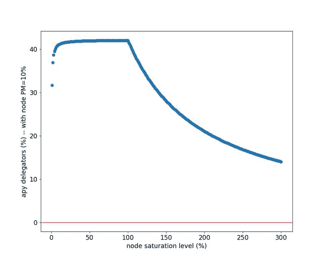

# 如何用 Nodigy 委托令牌或运行节点？

> 原文：<https://medium.com/coinmonks/how-to-delegate-or-run-nodes-with-aaavalidator-c152712fa9f5?source=collection_archive---------25----------------------->

## NYM 项目的一个例子

担心你的隐私？传统使用的 VPN 可能会隐藏您的精确 IP 地址，但不能提供任何保护来抵御强大的网络对手。这就是 NYM 的切入点。

# 什么是 NYM，它是如何工作的？

Nym 是一个旨在为互联网流量提供隐私的区块链。当你在互联网上分享东西的时候，你的数据是不加密的，任何应用程序都可以分析你的信息。分散的 NYM 混合网络使用区块链技术和经济激励措施，为电子邮件、即时消息和任何其他基于消息的流量提供强大的网络级隐私。

至于 NYM 是如何工作的，mix-net 通过多层网络对你的互联网流量进行加密，在多层网络中，每一层都将你的流量与其他用户的流量混合在一起。这使得通信保密，隐藏了你的元数据，比如你的 IP 地址。混合流量的工作是由节点完成的，这些节点由通过 NYM 令牌激励的节点运行者运行。

# 如何将 NYM 代币委托给 Nodigy？

像任何区块链一样，NYM 也有自己的象征，被称为 NYM 象征。如果你是这种新令牌的持有者，你可以通过将你的令牌委托给其他人的节点来让它为你工作，并从在该节点上完成的工作中获得奖励。

要委派令牌，请执行以下操作:

●打开装有代币的钱包。

●进入“委托”页面，点击委托按钮。

●输入您要入股的节点的身份密钥**(hbydet 93dg 8 yj 4 ux3r CP 2 ackfwbhdaunxoy 1t 8t 7k)**，以及您要委托的令牌数。

●收尾。

如果你正在寻找一个特定的[节点](https://limitlessinsights.medium.com/earn-188-day-passive-income-node-strategy-9-ce9875c87294?source=post_internal_links---------4----------------------------)来委托，考虑混合网络上的 Nodigy 节点。这些节点有一个相当低的饱和水平，一个非常低的佣金率只有 1%的奖励，并可以很容易地使用他们的身份密钥委托。

这里需要考虑的一点是饱和度。节点的饱和度越低，奖励越大。饱和点目前设定为 420，000 NYM。这意味着达到 420，000 总赌注的节点已经达到该节点可能的最大奖励金额。只有当饱和度达到 100%时，奖励才会增加。如果更多的人被委派到一个饱和节点，奖励必须被分享，每个人只能获得他们最大可能奖励的一小部分。

目前，可以看到许多 NYM 令牌被委托给过饱和混合节点。在这种情况下，最好的做法是找到另一个不饱和混合节点来委托。

# 如何用 Nodigy 运行你的节点？

让这些令牌为您工作的另一种方法是在区块链上运行您自己的节点。你不需要任何具体的技术技能来做到这一点，只是你自己的令牌，以股份的节点。其他一切都由我们来处理。

你所要做的就是通过电子邮件或社交媒体与我们联系。您将被收取 2%的奖励和固定的每月 35 美元的服务器和管理费。

对节点中的令牌数量没有最小或最大限制。建议投资额为 20，000-400，000 NYM。您拥有的代币越多，您的节点将越频繁地活跃，从而为您赢得奖励。保证正常运行时间为 97–99%。我们还保证高水平的安全性和定期更新您的节点。如果出现问题，您会立即得到通知。

在 sales@aaavalidator.com 联系我们，准备好开始委派或与 Nodigy 一起进行节点运行之旅！

> 交易新手？试试[加密交易机器人](/coinmonks/crypto-trading-bot-c2ffce8acb2a)或者[复制交易](/coinmonks/top-10-crypto-copy-trading-platforms-for-beginners-d0c37c7d698c)