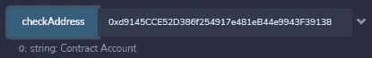

# 如何确定合同地址

> 原文：<https://medium.com/coinmonks/how-to-determine-contract-address-in-solidity-fe43f5c7388d?source=collection_archive---------2----------------------->


Image credit: dashnews.org

大家好。

欢迎阅读这篇关于用 solidity 语言编程的文章(如果你不知道 solidity 编程语言，可以在区块链以太坊上开发智能合约)

首先，让我告诉你一点以太坊的地址:

以太坊地址分为两种不同(但完全相似)的类型:

1- EOA(外部拥有的账户)

2-智能合同账户

一方面，eoa 是背后有个人的账户，并且有私钥来签署要发送到区块链的交易。

另一方面，智能合约账户是指背后没有任何真实的人，也没有私钥的账户。

现在看看这两个地址:

> 0x5b 38 da 6a 701 c 568545 DCF CB 03 fcb 875 f 56 bed DC 4
> 
> 0xd 9145 CCE 52d 386 f 254917 e 481 EB 44 e 9943 f 39138

你能猜出(仅仅通过观察它们)，

**哪个是 EOA，哪个是智能合同地址**？

肯定不是！

> 虽然它们都是 20 字节长(如你所知，我们忽略 0x，因为这只是为了清楚这个值是十六进制的)

那么，我们如何确定一个地址是 EOA 还是智能合约地址呢？？

有没有什么特殊的变量/选项/函数/等等。对于这种东西的坚固性？

恐怕不是。这个没有这样的功能。

在这种情况下，我们可以使用汇编编程。

所以让我们完成它，并编写一个函数来检查地址:

为了简单起见，我们通过[混音 IDE](http://remix.ethereum.org/) :

1-在合同文件夹中创建一个新文件，并随意命名。

2-然后按如下方式填写您的合同代码:


```
// SPDX-License-Identifier: MITpragma solidity ^0.8.0;contract AccountCheck {function checkAddress(address _addr) public view returns (string memory) {uint length;assembly {length:= extcodesize(_addr)}if (length > 0 ) {return "Contract Account";}return "User Account";}}
```

现在，在 remix 上编译和部署了这个契约之后，我们检查前面提到的那些地址。

结果如下所示:

第一个地址:0x 5b 38 da 6a 701 c 568545 DCF CB 03 fcb 875 f 56 bed DC 4


第二个地址:0xd 9145 CCE 52d 386 f 254917 e 481 EB 44 e 9943 f 39138



因此，通过在 solidity 中使用汇编，我们能够区分 EOA 地址和智能合同地址。

此外，例如，我们可以检查 msg.sender 是真实的人还是智能契约(只是让人类访问特定的功能)

希望你喜欢这篇文章，如果你喜欢就鼓掌。

任何问题或你以前的经验都欢迎在评论中提出:-)

> 交易新手？尝试[加密交易机器人](/coinmonks/crypto-trading-bot-c2ffce8acb2a)或[复制交易](/coinmonks/top-10-crypto-copy-trading-platforms-for-beginners-d0c37c7d698c)