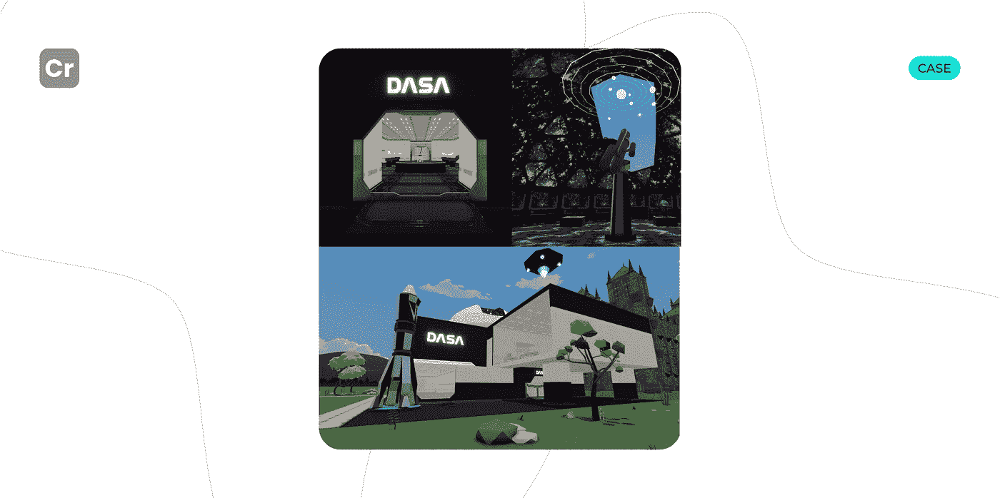

# 如何在元宇宙发展一个成功的场景？

> 原文：<https://medium.com/coinmonks/how-to-develop-a-successful-scene-in-the-metaverse-13ea29a7233e?source=collection_archive---------18----------------------->

早些时候，我们成为了分散土地的官方合作伙伴。所以现在我们将告诉你更多关于我们在元宇宙的第一个项目。

**DASA 是元宇宙的一处风景。**这个场景由一个三层建筑组成:
—建筑的一层，有一个大堂；
—第二层是一个有任务的非玩家角色，用户可以在这里玩迷你游戏；第三层有一个天文台和火箭发射井。

从客户那里，我们收到了详细的场景概念。为了实现它，Crypton Studio 不得不做:
— 3D 模型；
—模型动画；
—声音；
—脚本；
—部署。

所以，综上所述，Crypton Studio 开发了:
——非玩家角色之间的互动；
—为元宇宙大楼里的科学家和机械装置设计算法；
—将场景的所有部分连接成一个整体剧情的其他脚本，以及用户可以通过在悬浮板上飞行来观察周围场景的迷你游戏。
⠀
[联系](https://t.me/crypton_studio_bot) Crypton 工作室值得信赖的开发！

> 交易新手？试试[加密交易机器人](/coinmonks/crypto-trading-bot-c2ffce8acb2a)或者[复制交易](/coinmonks/top-10-crypto-copy-trading-platforms-for-beginners-d0c37c7d698c)