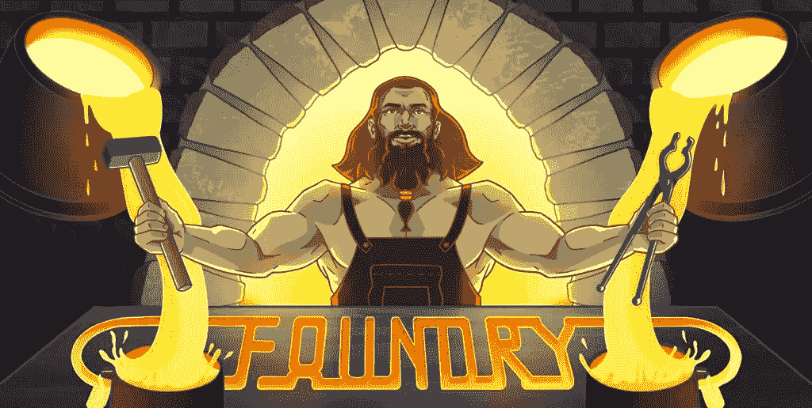
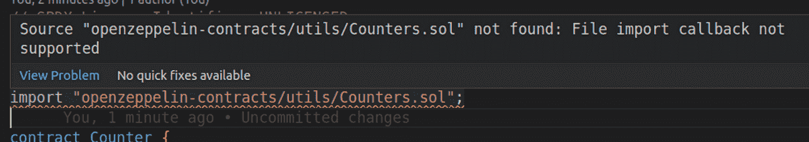
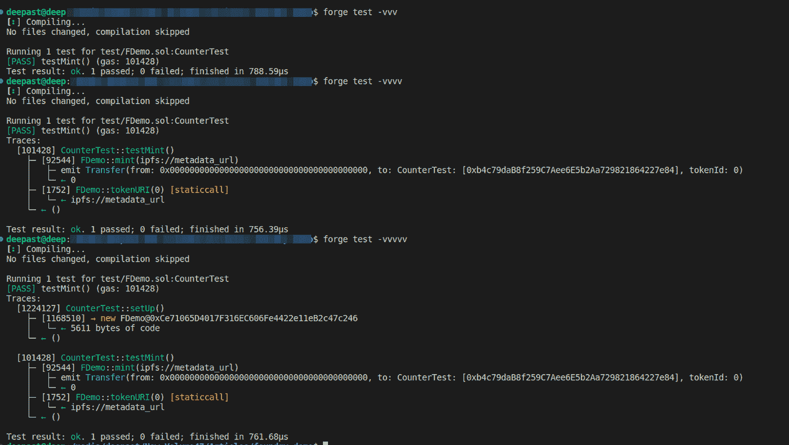
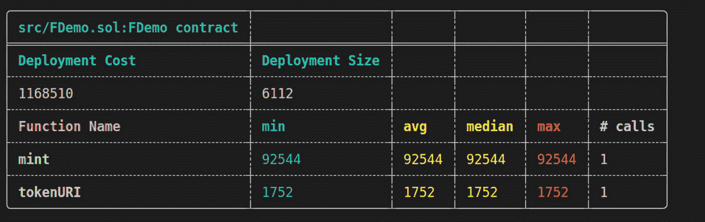
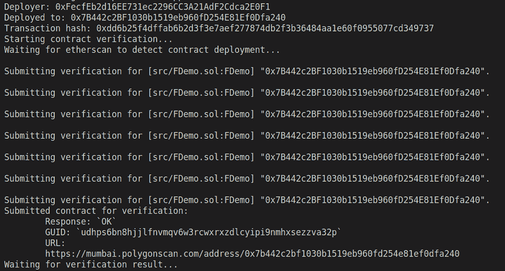

# 如何利用 Foundry & Openzeppelin 开发和部署智能合同

> 原文：<https://medium.com/coinmonks/how-to-develop-and-deploy-smart-contracts-with-foundry-openzeppelin-6bba51ddb438?source=collection_archive---------2----------------------->

Foundry 是一个用 Rust 编写的以太坊应用程序开发的非常快速、可移植和模块化的工具包。

铸造厂由三部分组成:

[Forge](https://github.com/foundry-rs/foundry/tree/master/forge) :以太坊测试框架(比如 Truffle、Hardhat、DappTools)。

[Cast](https://github.com/foundry-rs/foundry/tree/master/cast) :用于与 EVM 智能合约交互、发送交易、获取链数据的 CLI。

[Anvil](https://github.com/foundry-rs/foundry/tree/master/anvil) :本地以太坊节点，类似于 Ganache 或者 Hardhat 网络。

# **为什么要用？**



*   速度很快，运行测试时不再浪费时间。
*   它允许你在 solidity 中编写测试，这最小化了上下文切换。
*   许多测试功能，如 fuzzing、console.log 和作弊代码，为您提供了更多的功能和灵活性。

# 我们将在本文中讨论的主题

1.  项目设置
2.  如何在 Foundry 中安装依赖项(例如。OpenZeppelin)
3.  将 Foundry 与 VSCode 集成
4.  使用 Foundry 编写合同和测试用例
5.  了解铸造中的痕迹
6.  使用 Foundry 生成气体报告
7.  使用 Foundry 部署合同

# 装置

铸造的安装在铸造书里有很好的解释，看看这里的说明

[https://book.getfoundry.sh/getting-started/installation](https://book.getfoundry.sh/getting-started/installation)

# 设置项目

一旦安装了铸造车间，我们就可以使用

```
forge init foundry-demo // forge-demo is name of the project
```

创建项目后，使用命令检查一切是否正常工作

```
cd foundry-demo && forge build
```

# 安装依赖项

默认情况下，Forge 使用 [git 子模块](https://git-scm.com/book/en/v2/Git-Tools-Submodules)来管理依赖关系，这意味着它可以与任何包含智能契约的 GitHub 存储库一起工作。

要使用 **OpenZeppelin** 我们需要将它作为一个依赖项安装在我们的项目中，为此使用命令

```
forge install OpenZeppelin/openzeppelin-contracts
// forge install is command which is used for installing  dependencies 
// <https://github.com/OpenZeppelin/openzeppelin-contracts>
// use {{username}}/{{repo_name}} from the github url
```

# 将 Foundry 与 VSCode 集成

将 **OpenZeppelin** 作为依赖项安装后，尝试在契约中从它导入一些东西(你的契约在/src 目录下)，如果你使用的是 VSCode，会弹出一个错误



要修复此错误，请运行以下命令

```
forge remappings > remappings.txt
```

这个命令的作用是在项目的根目录下创建一个 remappings.txt 文件

此时，文件中的内容可能如下所示，

```
ds-test/=lib/forge-std/lib/ds-test/src/
forge-std/=lib/forge-std/src/
openzeppelin-contracts/=lib/openzeppelin-contracts/contracts/
```

更多详情请访问这里[https://book.getfoundry.sh/config/vscode](https://book.getfoundry.sh/config/vscode)

# 写合同

重命名文件`src/Counter.sol` → `src/FDemo.sol`，我们的 ERC721 智能合约的代码如下

# 使用 Foundry 测试合同

让我们从重命名测试文件开始，以匹配我们的合同名称`Counter.t.sol` → `FDemo.t.sol`

Forge 在测试中使用以下关键字:

*   `setUp`:在每个测试用例运行之前调用的可选函数

```
function setUp() public {
    testNumber = 42;
}
```

*   `test`:前缀为`test`的函数作为测试用例运行

```
function testNumberIs42() public {     
  assertEq(testNumber, 42); 
}
```

*   `testFail`:测试前缀的倒数——如果函数没有恢复，测试失败

```
function testNumberIs42() public {     
  assertEq(testNumber, 42); 
}
```

所以，现在我们只有一个方法`mint`，所以我们将为这个方法编写一个测试用例

这将是一个非常简单的问题

现在，要运行这个测试，我们可以使用命令`forge test`

如果我们想要探索更多关于测试用例的细节/事件/流程，我们可以在运行测试用例时使用跟踪来启用跟踪，使用-vvv 或-vvv

附加的截图显示了有和没有痕迹的测试用例的结果



关于踪迹的更多细节:[https://book.getfoundry.sh/forge/traces](https://book.getfoundry.sh/forge/traces)

# 使用 Foundry 生成气体报告

使用 **—气体报告**和测试命令生成气体报告

```
forge test --gas-report
```



更多关于天然气的详细报道，请点击这里:【https://book.getfoundry.sh/forge/gas-reports 

# 部署和验证与 Foundry 的合同

Forge 可以使用`[forge create](<https://book.getfoundry.sh/reference/forge/forge-create.html>)`命令将智能合约部署到给定的网络。

Forge 可以使用`[forge create](<https://book.getfoundry.sh/reference/forge/forge-create.html>)`命令将智能合约部署到给定的网络。

在部署契约时，我们可以使用 forge 创建一些选项

*   `—rpc-url`:我们想要部署合同的网络的 RPC URL(在我们的例子中，我们将使用 polygon mumbai testnet 的 Rpc URL)
*   `-constructor-args`:将参数传递给构造函数
*   `-private-key`:部署者钱包的私钥

如果我们想验证我们的合同，我们可以选择通过`--verify` & & `--etherscan-api-key`

```
$ forge create --rpc-url <your_rpc_url> \\
    --constructor-args "ForgeUSD" "FUSD" 18 1000000000000000000000 \\
    --private-key <your_private_key> src/MyToken.sol:MyToken \\
    --etherscan-api-key <your_etherscan_api_key> \\
    --verify
```

让我们现在就部署

```
forge create --rpc-url <https://rpc.ankr.com/polygon_mumbai> 
--private-key <your_private_key>  src/FDemo.sol:FDemo 
--etherscan-api-key <your_etherscan_api_key> 
--verify
```



完整代码: [GitHub](https://github.com/Deep1144/foundry-demo-contract)

> 💡在 Twitter 上关注我，了解更多类似的精彩内容[@](https://twitter.com/transitive_bs)[Patel deep _ eth](https://twitter.com/pateldeep_eth)
> Linkedin

> 交易新手？尝试[加密交易机器人](/coinmonks/crypto-trading-bot-c2ffce8acb2a)或[复制交易](/coinmonks/top-10-crypto-copy-trading-platforms-for-beginners-d0c37c7d698c)