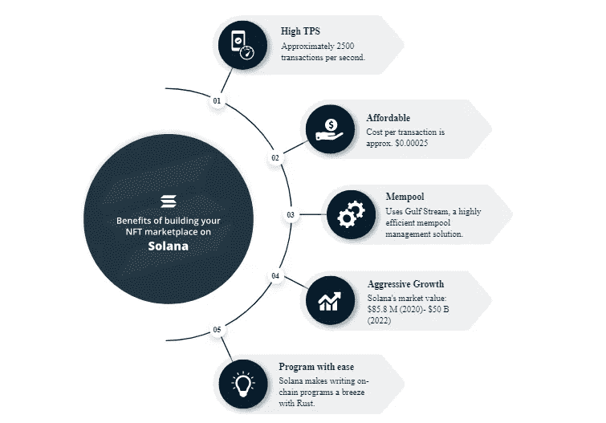

# 如何在 Solana 上开发 NFT 市场平台？

> 原文：<https://medium.com/coinmonks/how-to-develop-nft-marketplace-platform-on-solana-a0361faaf50c?source=collection_archive---------2----------------------->

不可替代的令牌已经存在多年了，但它们的用例及应用在去年成为主流。根据 Chain analysis 提供的统计数据，NFT 市场资本 ras 攀升了 400 亿美元。随着越来越受欢迎，企业似乎有兴趣通过为他们的用户提供一个成熟的 NFT 市场来充分利用 NFT 的趋势。

区块链有国家森林公园；因此，NFT 市场也必须建立在区块链分散化的生态系统之上并受到监管。虽然许多区块链支持 nft 市场的发展，但第三代区块链可以实现新时代和高度功能丰富的市场的发展，允许企业脱颖而出并获得更高的参与度。

由于 [Solana](https://www.leewayhertz.com/solana/) 声称是最快和最有效的第三代区块链协议，我们有一个很好的理由将这篇文章框架在 Solana 区块链上建立一个 NFT 市场。在开始市场开发之前，让我们先了解一下索拉纳网络和 NFT 市场。

> 交易新手？试试[密码交易机器人](/coinmonks/crypto-trading-bot-c2ffce8acb2a)或[复制交易](/coinmonks/top-10-crypto-copy-trading-platforms-for-beginners-d0c37c7d698c)

# 什么是索拉纳，为什么它适合 NFT 市场的发展？

Solana 是一种高级区块链协议，旨在支持高度可伸缩、创新和功能丰富的 dApps 的开发。以下是 Solana 在网络效率和速度方面的特点。

***交易速度***

Solana 可以在一秒钟内处理 2500+笔交易。这个区块链为开发人员提供了一个高度可扩展的生态系统，以构建具有高 TPS 的强大的分散式解决方案。

***交易成本***

该网络对每笔交易收取 0.00025 美元的交易费，与包括以太坊在内的流行的区块链网络相比，这要低得多。

***解决内存池***

Mempool 问题为交易的接受制造了障碍，即使交易被接受。感谢索拉纳网络的高效率，这有助于它逃避内存池问题。

***扩大生态系统***

Solana 是 100%开源和可编程的，使开发者能够构建他们定制的分散解决方案，并支持生态系统的不断增长。

***易编程***

Solana Network 支持 Rust 中的 dApp 开发，Rust 是一种低级编程语言，可以直接访问硬件组件和内存。尤其是这种铁锈使得索拉纳的发展完美无瑕，对每个人来说都很容易。

现在，谈到 nft 市场的发展，Solana 提供了以下特性。然而，上述增加的特征在发展未来的非功能性测试市场中也起着重要的作用。

***存储效率***

Solana 允许 nft 市场开发者配置一个高效的 web 3 存储设备，包括永久存储。为索拉纳的项目提供分散存储的是 ARweave 和其他流行的存储选项，如 IPFS。

***上链体验***

Solana 为用户、艺术家、收藏家和市场访问者提供了完全在线的体验。每一个数据和资源都是可用的，从 nft 拍卖到版税，增强了透明度和可用性。

***客户化收益***

有了 Solana，每当需要修改 nft 市场的功能时，开发人员都不需要编写新的智能合同。相反，他们可以利用索拉纳 nft 铸币计划和 nft 标准的可定制性属性，节省他们的宝贵时间来关注 NFT 市场开发的其他方面。

***互通***

Solana 知道互操作性在分散化的世界中是必不可少的，因此提供了一个创新的通信桥梁，使 Solana 和其他 DeFi 网络之间能够进行交互。它允许用户将其数字资产从任何区块链无缝迁移到 Solana 生态系统，以受益于其低成本和高速处理。

# 如何在索拉纳区块链建立一个 NFT 市场？

**第一步:创建一个 Solana 钱包**

在 [NFT 市场发展](https://www.leewayhertz.com/nft-marketplace-development-company/)的不同阶段，你将需要一个兼容 Solana 浏览器的钱包。由于 Solana 与一系列钱包兼容，您可以使用现有的钱包或创建一个 SOL 钱包。创建代币后，用 SOL 代币资助它。

**第二步:派生元复合存储库**

在 Github 帐户上派生 Metaplex 存储库，允许它轻松地托管在 Github 页面上。下一步，将 Metaplex 文件复制到您的系统中。请遵循以下步骤:

*   在桌面上创建一个文件夹，并给它起一个合适的名字，如“myNftMarketplace”
*   复制文件夹的位置。
*   在命令行中更改文件夹的目录。

通过这些操作，您可以无缝地克隆 Metaplex 存储库文件，然后在 GitHub 帐户中设置一个存储库。

**步骤:2 更改 Github 地址**。

更改 Github 地址是让您的市场在网络上运行的关键步骤:

用您自己的 Github 用户名替换部署地址。

更改商店的钱包地址。

您需要添加浏览器钱包的公共地址，它决定了对所需的访问授权。

**第三步:设置并部署您的 NFT 市场**

建立或编辑你的市场是让市场活跃起来的最后一步。在此步骤中，您需要执行一些关键步骤，例如:

将目录更改为 js 文件夹。

安装依赖项以运行各种命令行。

一旦安装了依赖项，您就可以从每个命令中获得准确的输出。此外，您可以通过运行*纱线引导*命令来检查安装是否正常工作。

**第四步:测试市场**

有了所有的依赖项，您可以通过运行 *yarn start* 命令在本地测试您的市场。运行此命令可确保安装的依赖项服务于其预期目的。

测试可能需要较长时间。编译完成后，终端将显示“编译成功”消息。之后，您可以在 localhost:3000/#/上快速测试新创建的市场的特性和功能。

**步骤 5 整合钱包**

要使 NFT 市场对最终用户可用并激活其可用性，您需要集成支持交易并允许用户创建 NFT 的钱包。

您需要运行 yarn build 命令并构建项目文件。成功执行该命令会向您提供一条输出消息——“完成”在消息旁边，您将看到在 js 文件夹中生成了 build。

现在，改变 web 文件夹的方向并运行 *yarn deploy* 命令来完成市场部署过程。

将再次出现“Done”消息，告诉您部署已经成功完成。换句话说，您的 marketplace 项目将在 Github 存储库中上线。你现在可以在 Github 页面上看到你的现场[索拉纳 NFT 市场](https://www.leewayhertz.com/solana-nft-marketplace-development/)。

# 包扎

NFT 行业的变化是一致的，释放出更多的创新和新时代的 NFT 市场。企业必须选择先进的区块链生态系统，如 Solana，以适应不断变化的发展趋势。它支持创建一个高度可扩展、高效且结构良好的 [NFT 市场](https://www.leewayhertz.com/nft-marketplace-development-company/)，这是大多数企业在当今竞争激烈的市场环境中所需要的。