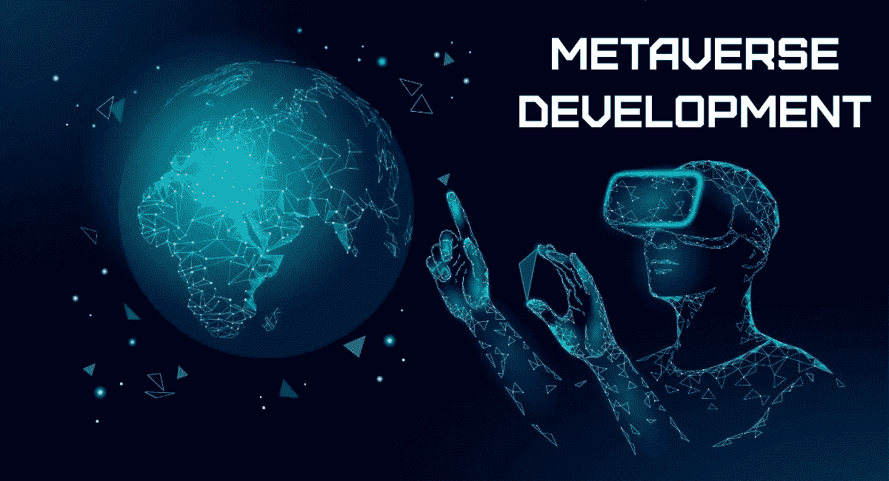
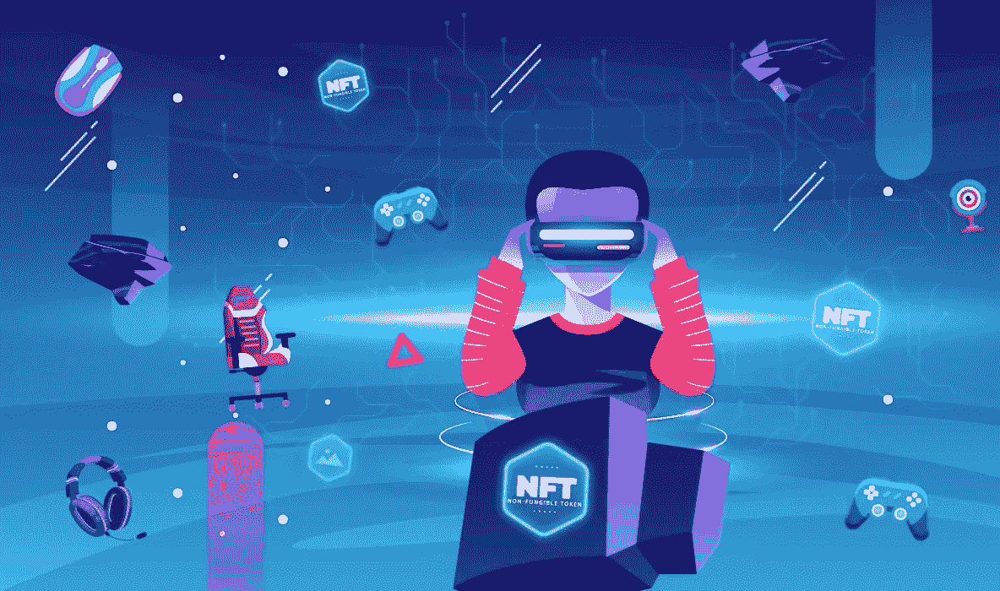

# 如何开发自己的元宇宙？将你的商业理念“元多样化”,实现指数级增长

> 原文：<https://medium.com/coinmonks/how-to-develop-your-own-metaverse-metaversify-your-business-idea-for-exponential-growth-d18535411f77?source=collection_archive---------24----------------------->

如今，客户通常如何购买产品？他们浏览电子商务网站寻找产品并订购，或者走进实体店购买。现在，让我们将**元对比**融入其中！通过元宇宙，消费者可以看到产品的 3D 全息图，用加密货币购买产品，一些买家还可以获得 NFT 和忠诚度积分。这只是元宇宙无限潜力的一个例子。元宇宙有望在 2024 年成为一个价值 8000 亿美元的**，在 2030 年达到 5 万亿美元。**

> 由区块链技术驱动的元宇宙发展有可能塑造互联网的未来。

> 那么，为什么元宇宙被预言会有更大的成就呢？如何用元宇宙发展服务来发展元宇宙？

## 𝙈𝙚𝙩𝙖𝙫𝙚𝙧𝙨𝙚

用字典的术语来说，**元宇宙**可以被定义为一个虚拟世界，在这个世界里，用户可以相互交流并沉浸在活动中。但是元宇宙和今天的互联网的区别在于区块链的用法。你可以体验元宇宙，并与来自世界任何地方的任何人互动。元宇宙的目标是完成比今天的互联网可能做的更多的事情。你可以虚拟地见到人们，和他们一起出去玩，就像他们在现实生活中一样。您可以在平台上与其他用户联系、工作和玩耍。

**Metaverse**

## 𝘾𝙧𝙮𝙥𝙩𝙤𝙨 𝙖𝙣𝙙 𝘽𝙡𝙤𝙘𝙠𝙘𝙝𝙖𝙞𝙣𝙨 𝙤𝙣 𝙩𝙝𝙚 𝙈𝙚𝙩𝙖𝙫𝙚𝙧𝙨𝙚

您可以使用加密货币在 meta 上进行交易，类似于在 Web2 上使用卡支付进行交易。加密货币的使用有助于在元宇宙创建数字经济。在元宇宙，区块链通常用于数字所有权证明、互操作性、资产转移、治理、可访问性和数字收藏等类别。区块链技术适合元宇宙，因为它**经济高效且透明**。

元宇宙的加密货币像现实世界中的法定货币一样可以互换；这就是 NFT 发挥作用的地方。您可以使用区块链创建智能合同，当满足特定标准时，智能合同将执行功能。通过基于区块链的智能合同，您可以为您的数字资产创建所有权；它可以是任何东西，比如艺术、视频、音频等等。

**Metaverse NFTs**

## 𝙉𝙁𝙏𝙨 𝙖𝙣𝙙 𝙩𝙝𝙚 𝙈𝙚𝙩𝙖𝙫𝙚𝙧𝙨𝙚

NFT 是区块链上的记录，代表数字或实物资产。非功能性测试是唯一的一种，这意味着它们是不可替代的。

Metaverses 不是由一个公司或实体建立的。许多公司开发了他们的 Metaverses，它们是可互操作的。当用户从一个元宇宙移动到另一个时，他们可以移动他们的资产。区块链有助于在元数据中确认数字资产的所有权，如果它们彼此兼容的话。与该平台集成的加密货币钱包可用于存储元宇宙独有的资产，如**头像、虚拟饰品、头像动作等**。在 metaverses 中，人们可以将数字形式的资产呈现为 NFT，并将能够通过所有权证明对该资产进行定价。NFT 有可能改变人们在 Metaverses 上相互交流和联系的方式。

## 𝘿𝙞𝙛𝙛𝙚𝙧𝙚𝙣𝙩 𝙢𝙚𝙩𝙖𝙫𝙚𝙧𝙨𝙚 𝙨𝙤𝙡𝙪𝙩𝙞𝙤𝙣𝙨

👉 [**元宇宙游戏**](https://bit.ly/3Rq5v9F) **:** 沉浸式虚拟现实游戏，玩家可以在虚拟世界中进行游戏和互动。

👉**元宇宙咨询:**顶级虚拟咨询服务，提升其质量和可用性。

👉 [**元宇宙医疗保健**](https://bit.ly/3cVhGfM) **:** 元宇宙医疗保健支持虚拟医院的使用、术前培训以及医疗专业人员的准备工作。元宇宙还可以用于与医生进行虚拟咨询，为用户提供实时体验。

👉**元宇宙市场:**身临其境的元宇宙市场体验。元宇宙市场增强了用户的购买体验。

👉**元宇宙社交媒体:**元宇宙社交媒体旨在提供一个虚拟世界，用户可以在其中相互互动，并执行所有可以在 web2 社交媒体但不是虚拟世界中进行的活动。

👉电子商务网站:通过元宇宙的电子商务网站为用户提供舒适的实时购物体验

👉**房地产元宇宙:**用户可以通过房地产元宇宙买卖和交易虚拟财产。

## 𝘾𝙤𝙣𝙘𝙡𝙪𝙨𝙞𝙤𝙣

元宇宙仍处于婴儿阶段，但有很大的潜力成为下一个大事件。区块链功能的可用性、虚拟现实的扩展和广泛流行的互联网连接肯定会有助于 Metaverses 的发展。毫无疑问，元宇宙将会塑造互联网的未来。因此，元宇宙有很大的机会成为有利可图的商机。还可以 [**开发自己的元宇宙**](https://bit.ly/3x3oZbZ) ，根据自己的品牌和要求定制自己的虚拟世界。通过雇佣市场上的元宇宙开发服务开始建立你自己的元宇宙。

> 交易新手？尝试[加密交易机器人](/coinmonks/crypto-trading-bot-c2ffce8acb2a)或[复制交易](/coinmonks/top-10-crypto-copy-trading-platforms-for-beginners-d0c37c7d698c)