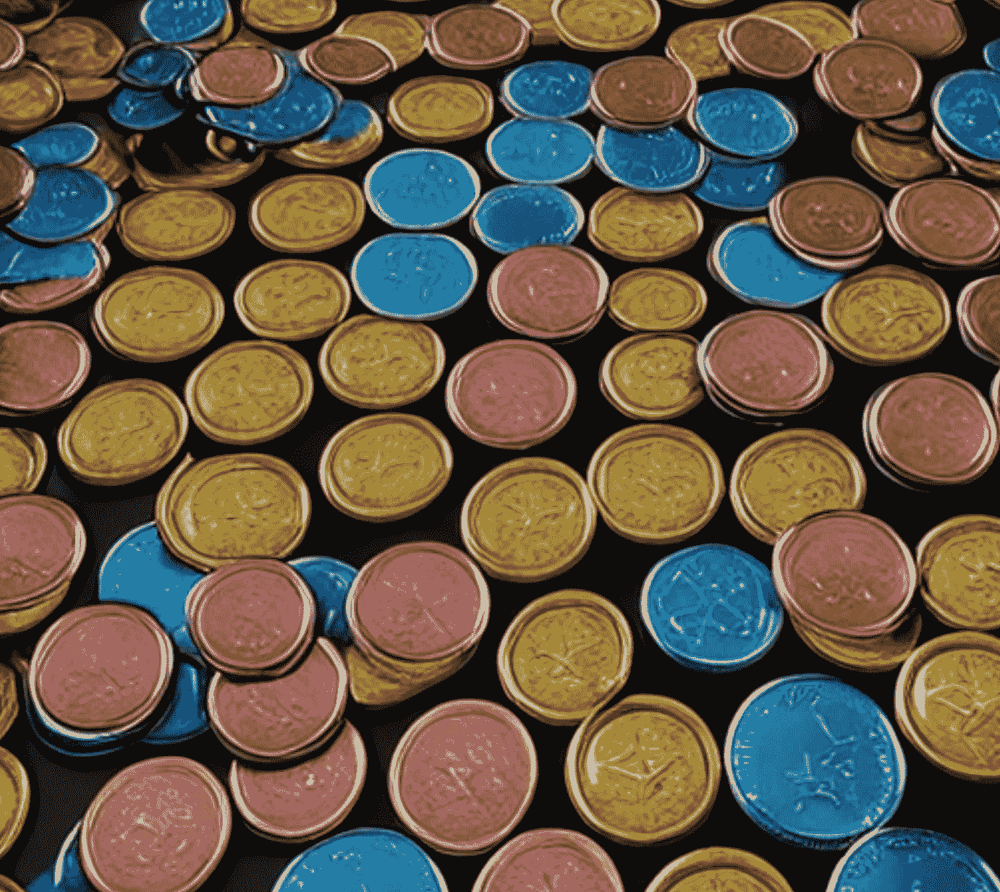

# 如何在 2023 年多元化您的加密产品组合

> 原文：<https://medium.com/coinmonks/how-to-diversify-your-crypto-portfolio-in-2023-16ed3fa60a63?source=collection_archive---------26----------------------->

近年来，加密货币投资越来越受欢迎，人们希望分散投资组合，并有可能获得高回报。然而，重要的是要记住，加密货币仍然是一种相对较新且不稳定的资产类别，因此，分散加密货币投资以降低风险非常重要。

