# 如何用蛋糕 DeFi 在比特币上赢得 10.79%的 APY！

> 原文：<https://medium.com/coinmonks/how-to-earn-10-79-apy-on-bitcoin-with-cake-defi-101cd095207?source=collection_archive---------7----------------------->

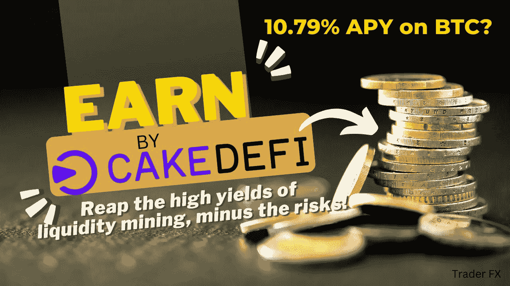

T 最近由 Terra 生态系统崩溃引发的密码崩溃确实让密码货币行业大开眼界。很少有 fintech 平台在密码冬天幸存下来并保持稳固；值得一提的是，经受住了时间考验的不是别人，正是**。T5 是一款可靠的一体化投资平台，让您的密码货币**产生高额回报，产生被动现金流，让您可以安心放松！事实上， [**蛋糕 DeFi**](https://cakedefi.com/?ref=677920) **已经很快为自己建立了稳固的声誉**并赢得了许多像我这样快乐用户的信任。****

**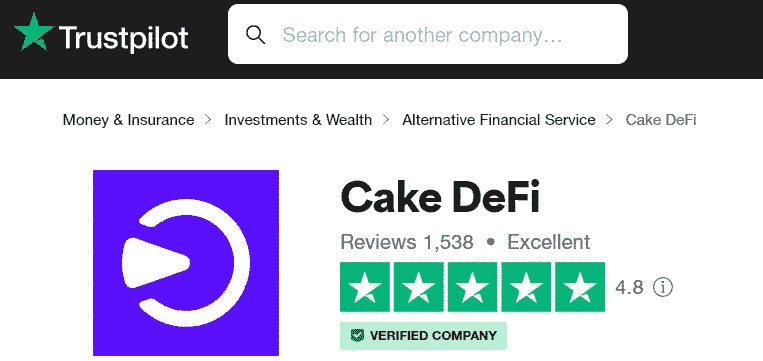**

**Cake DeFi scores excellent on Trustpilot**

**有几种方法可以在蛋糕上产生被动现金流，例如**

*   ****流动性挖掘****
*   ****铆接****
*   ****冷冻箱****
*   ****借贷****
*   ****借款****

**该列表最近增加了一个新功能，即**获取**功能，这也是本文的重点。**

# **赚取背后的原理**

****

**我认为，作为早期投资者，你只有比特币。无意中发现了 Cake DeFi，您被它的许多(激动人心的)服务淹没了，比如投资、流动性挖掘和贷款——您不知道应该使用哪种服务。你被流动性挖掘的高收益所吸引，它承诺 APY 高达 50%的回报率，但与此同时，你对流动性挖掘是如何运作的以及为什么它涉及一对硬币，另一个主要是 DFI 感到困惑。在谷歌深度挖掘时，一听到“短暂损失”这个词，你就对参与流动性挖掘犹豫不决，这意味着你的比特币数量可能会实际减少！您变得没有投资的动力。毕竟，您需要的只是一个简单的解决方案来发展您的比特币——但与此同时，投资过程似乎相当复杂！**

# **流动性挖掘的问题:暂时性损失**

**L **流动性挖掘(LM)是用户向分散的金融应用程序提供流动性，并由此获得丰厚回报的过程**。这些资产集合被称为流动性池，由两种比例相等的独特资产组成。当投资者将一项资产换成另一项资产时，这项交易收取的费用将支付给向这些流动性池贡献资产的投资者，从而激励他们参与流动性挖掘。**

**当一项资产的价格与流动性挖掘池中其他资产的价格变动不同时，就会出现非永久性损失。发生这种情况是因为分散的交易所(自动货币制造机)总是试图在两种资产之间保持相等的比例；如果一种资产的价格相对于另一种资产迅速增加，前者的数量必须减少，以维持两种资产之间的恒定比率(50:50)。**

**为了大致说明这个概念，请看下面的场景。**

> ***让我们做如下假设:***
> 
> ***1 DFI = 1 美元***
> 
> ***1 比特币= 1000 美元= 1000 DFI***
> 
> ***您参与了 BTC-DFI 流动性挖掘(LM)池，其中包含 10 个 BTC 和 10，000 个 DFI，总价值为 20，000 美元。***
> 
> ***通过向资金池中贡献 1 个比特币和 1000 个 DFI，你拥有 BTC-DFI LM 资金池的 10%份额(价值 2000 美元)。***
> 
> ***比方说，比特币的价值翻倍至 2000 美元，而 DFI 的价值保持不变。因此，LM 池的总价值现在变为 30，000 美元。回想一下，LM 池重新平衡资产的方式是使两种资产的比例相等；因此，BTC 和 DFI 各值 15，000 美元。因此，现在资金池中有 7.5 个比特币和 1500 个 DFI。由于你拥有这个 LM 池的 10%份额，你的 1 BTC 已经减少到 0.75 BTC，而你的 DFI 持有量已经从 1，000 DFI 增加到 1，500(LM 池的份额数量保持不变，而你的资产数量动态变化)。因此，如果你决定在这个时间点撤回你的资产，就会发生非永久性的损失，因为如果你持有比特币而不是参与流动性挖掘，你现在拥有的比特币会比最初少。***

**Impermanent losses explained**

**顾名思义，非永久性损失不是永久性的，也不会在资产撤出时实现，因为价格会根据市场条件动态变化，因此可能会逆转任何非永久性损失。如果资产在 LM 池中持有的时间更长，或者如果两种资产都具有良好的长期潜力，这些损失的风险就会降低。**

**因此，尽管回报颇丰，但流动性开采仍然是一种令人望而生畏的投资方式，可以规避非永久性损失(如上所述)以及智能合同和项目本身的风险。话虽如此，但 Cake DeFi 最近开创了一种创新的金融解决方案，旨在降低此类风险。**

# **介绍 Earn**

**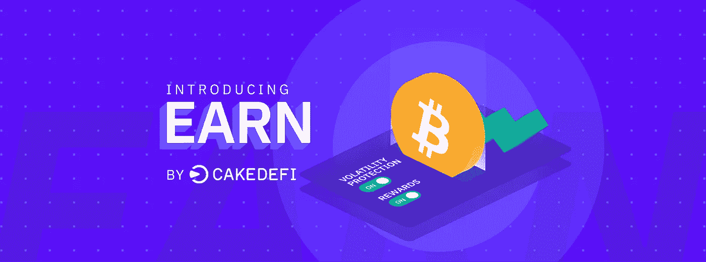**

**E **arn 是一种革命性的加密货币回报方式，没有流动性挖掘带来的风险和复杂性。**简而言之，**将流动性挖掘的高收益与贷款/抵押服务的稳定性和安全性完美结合。**这可以被比作**单边流动性挖掘**，只允许从单一类型的资产中产生现金流。**

# **它是如何工作的？**

**答在分配一种加密货币后，它将与另一种加密货币配对(取决于分配的加密货币的类型和数量)，然后投资到流动性挖掘池中。奖励将每 24 小时支付一次(以用户分配的相同类型的加密货币支付)，减去 Cake DeFi 的费用，其中的固定百分比将贡献给波动性保护池。**

****Earn 有一个波动性保护池，旨在覆盖用户的波动性损失。**在参与 Earn 产品的每 24 小时后，投资者将获得 1%的波动性保护，100 天后最高可达 100%的保护。在编写本报告时，波动性保护池的资金为 100 323.85 美元。**

**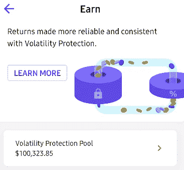**

# **赞成的意见**

*   **允许使用**单一类型的加密货币参与流动性挖掘。****
*   ****加密货币高达 10.79% APY 的竞争性回报**。**
*   **能够**自动复利。****
*   **一个**波动性保护池**防范与加密市场波动性相关的风险。**
*   **没有交易对手风险，因为不涉及机构合作伙伴。**

**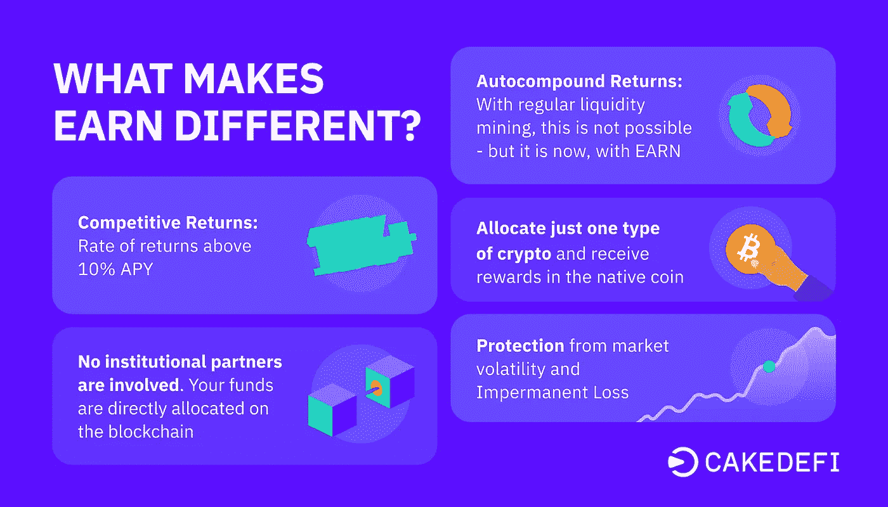**

# **骗局**

*   **目前**仅限于比特币和 DFI** (未来将增加更多币！)**
*   **易失性保护池完全取决于池中的余额——即使用户基于上述条件设法实现 100%的覆盖，也不能保证上述**覆盖。****
*   ****与直接投资于流动性开采本身相比，APYs** 更低。**
*   **桌面界面上的**不可用。****

# **如何开始使用 Earn？**

****

*   **[**报名**](https://cakedefi.com/?ref=677920) 参加蛋糕 DeFi，如果你还没有账户的话！**
*   **通过 **KYC 验证和** **将从您的首笔合格存款中获得 50 美元的注册奖金**！点击了解有关如何获得注册奖金[的更多信息。](https://cybery.medium.com/start-earning-passive-income-today-with-a-50-signup-bonus-3cf0b9a0e316)**
*   **在蛋糕定义应用程序上，转到“烘焙”，然后“**赚取****

**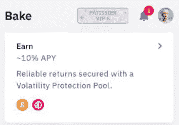**

*   ****点击“开始赢取”，分配 BTC 或 DFI** 。**

**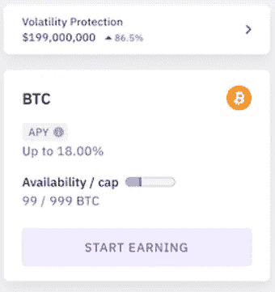**

*   **在接下来的几页中，您将获得有关波动性保护的更多信息，以及有关 Earn 的常见问题解答。**
*   **指明您希望**分配的资产数量和加密类型**。**

**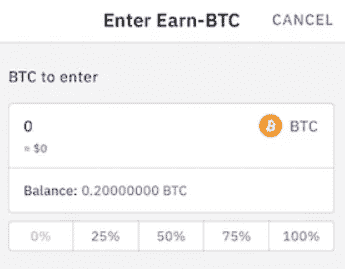**

*   **我们将提供您参赛作品的摘要。查看详细信息，点击**确认**。**

**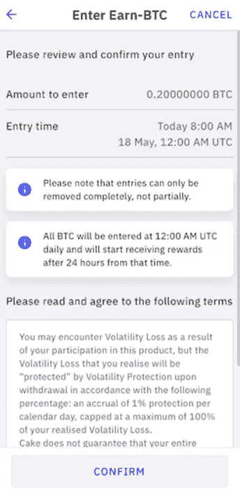**

*   **祝贺你成功入围！奖励将以您选择的本国货币支付，每 24 小时一次。在接下来的 100 天里，波动性保护的百分比将每天增加 1%。**

**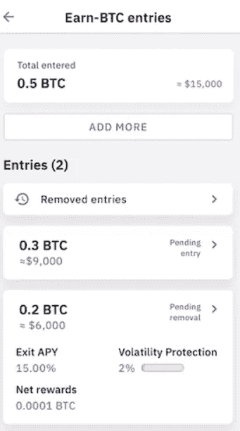**

# **挣钱对我来说是正确的选择吗？**

**这个完全看你的风险承受能力和投资偏好！**

*   ****如果你正在进行长期投资**，并且看好流动性挖掘池中提供的两种资产，**你或许可以坚持投资收益率更高的流动性挖掘**，但如果资产价格变动不一，你可能会面临非永久性损失的风险。**
*   ****如果您正在寻找一个相对更安全、更短期的投资选择，那么 Earn 可能是您的正确解决方案**，因为它获得了流动性挖掘的高收益，减去了流动性池的非永久性损失和波动性的潜在负面影响。**

**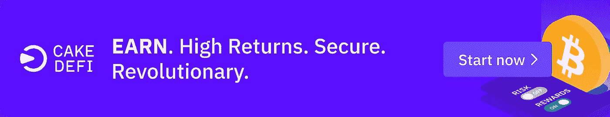**

**无论您选择哪个选项，请放心，[**Cake DeFi**](https://cakedefi.com/?ref=677920)**是一个合理的投资选择，可以从您闲置的加密货币中产生被动现金流！在这里注册******获得 50 美元的免费注册奖金，今天就开始你的被动收入之旅吧！******

****想了解更多关于蛋糕定义的信息，请随意查看我以前的文章，以及这个[系列](https://cybery.medium.com/list/cake-defi-0acb0c90a3ab)！****

**** [## 如何在自动驾驶仪上用蛋糕 DeFi 赚取被动收入:教程

### Cake DeFi 是一个值得信赖的平台，通过赌注、流动性挖掘等方式在加密货币上创造被动收入

medium.com](/coinmonks/how-to-earn-passive-income-on-autopilot-with-cake-defi-a-tutorial-2ec2ac5f46ba)  [## 蛋糕 DeFi，3 年后——我迄今为止最大的错误！

### 在经历了时间的考验后，这一最初令人遗憾的投资在经历了一段时间后变成了一颗宝石

medium.com](/coinmonks/cake-defi-3-years-down-the-road-my-best-mistake-so-far-f751caea1637)  [## 如何从蛋糕定义获得免费的 50 美元注册奖金:教程

### Cake DeFi 是一个金融科技平台，可以从你的加密货币中获得被动现金流。了解如何获得 50 美元奖金…

medium.com](/predict/how-to-get-a-50-signup-bonus-from-cake-defi-bad80cc5aa87) 

*本帖使用的部分材料摘自* [*官饼 DeFi 博客*](https://blog.cakedefi.com/new-product-earn/) *。*

★ ***不用任何资本就能赚钱的免费应用！*** ★

*🎁*[***honey gain***](https://r.honeygain.me/CYBER577DD)**一款被动收入 app，从你未使用的互联网带宽中赚钱。* [*免费获得 5 美元*](https://r.honeygain.me/CYBER577DD) *，无需投资。**

**🎁*[**peer 2 profit**](https://p2pr.me/164388119761fba2ed0531f)*一款被动收入 app，从你未使用的互联网带宽中赚钱。**

**🎁* [**IPRoyal 卒**](https://iproyal.com/pawns?r=532906) *一款被动收入应用，从你未使用的互联网带宽中赚钱。**

**🎁*[**earn App**](https://earnapp.com/i/mlztuxu)*一款被动收入 app，从你未使用的互联网带宽中赚钱。**

*★ ***加密货币投资平台*** ★*

**🎁* [***蛋糕 Defi***](https://cakedefi.com/?ref=677920)**一站式投资平台，烘焙高达 100%的被动现金流！* [*在 DFI 用 50 美元存款获得 50 美元奖金*](https://cakedefi.com/?ref=677920) *。***

***🎁*[***Nexo***](https://nexo.io/ref/hce5cfdt5o?src=web-link)**一家先进的受监管数字资产机构，提供即时加密贷款，资产年利率高达 36%，是一家交易所，在 200 多个司法管辖区提供 40 多种法定货币的服务。* [*用 100 美元存款获得 25 美元*](https://nexo.io/ref/hce5cfdt5o?src=web-link) 奖金*。****

***🎁* [***币安***](https://www.binance.info/en/activity/referral-entry/CPA?fromActivityPage=true&ref=CPA_00BFAOLI96) *全球最大的加密货币交易所，无需介绍！***

***🎁*[***Kucoin***](https://www.kucoin.com/r/af/rJH29LZ)*一个庞大的加密货币交易所，提供有趣的产品，如赌注、免费交易机器人和比特币云挖掘服务。***

***🎁* [***火币***](https://www.huobi.com/en-us/topic/double-invite/register/?invite_code=5t5jb) *一个提供多样化产品、免费空投和交易机器人的加密货币交易所。***

***🎁*[***MEXC***](https://www.mexc.com/en-US/register?inviteCode=mexc-1NAJC)*从持有 MX token 开始就有有趣的房源和频繁空投的加密货币交易所。***

***🎁*[***Crypto.com***](https://read.cash/@TraderFX/10-tips-to-maximize-earnings-on-honeygain-an-effortless-free-passive-income-app-68535728#bad-link)*一家总部设在新加坡的加密货币交易所。* [*得到 25 美元*](https://crypto.com/app/fcbsjmf5pb) *在 CRO 赌一张红宝石牌。***

**★ ***加密货币交易机器人*** ★**

***🎁*[***Jet-bot***](https://jet-bot.com/?fpr=l1be4)*具有复制交易功能的高级现货、期货交易机器人。3 天试用期可用* [*试玩账号*](https://jet-bot.com/?fpr=l1be4) *。***

***🎁*[***Pionex***](https://www.pionex.com/en-US/sign/ref/mWhH4v29)*一个免费的多功能套利交易机器人，全天候自动化低买高卖的过程。***

***🎁* [***一键资本***](https://app.onebutton.capital/sign-up?ref=X%2Bak1CB1aLL2Cg1g&s=MjAtMA%3D%3D) *一个由神经网络驱动的人工智能机器人，它可以自动管理你的加密货币投资组合。***

**★ ***针对马来西亚投资者*** ★**

***🎁*[***Luno***](https://www.luno.com/invite/EDXG2X)*在 BTC 用 100 令吉购买 BTC 获得 25 令吉奖金！***

***🎁*[***Stashaway***](https://www.stashaway.my/referrals/kenleel9jx)**免费投资 6 个月！****

***🎁****Wahed****代号‘ken lie 1’RM10 报名奖金***

***🎁****cap bay****P2P 代码‘8879 C6’RM 100 签约奖金***

***🎁* [***亦然***](https://download.versa.com.my/1bAf/referral?deep_link_value=QF218MMB) *用 100 令吉存款获得 10 令吉奖金！***

***🎁*[***KDI***](https://app.digitalinvesting.com.my/registration/signup?referral_code=103433)*用 250 令吉存款获得 10 令吉奖金！***

*****接我*** [***中***](https://cybery.medium.com/)***|***[***read . cash***](https://read.cash/r/TraderFX)***|***[***YouTube***](https://www.youtube.com/c/SmartInvestingChannel)**

> **交易新手？试试[加密交易机器人](/coinmonks/crypto-trading-bot-c2ffce8acb2a)或者[复制交易](/coinmonks/top-10-crypto-copy-trading-platforms-for-beginners-d0c37c7d698c)******