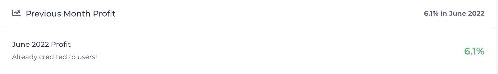

# 如何通过精通理财赚取 5-15%的月回报率

> 原文：<https://medium.com/coinmonks/how-to-earn-5-15-monthly-returns-by-masternoding-b8340ee80cbc?source=collection_archive---------10----------------------->

## YieldNodes 以惊人的月回报率战胜了加密崩溃。

***免责声明！！！*** *我写的文章只是我投资的日志，绝不是理财建议。在我的* [*第一篇文章中，*](/@Crypto_Auto/earn-30-day-1000-investment-the-truth-lets-go-a97ff2401510) *我开诚布公地谈一谈这类项目的真相。只投资你能承受的损失，不要把所有的鸡蛋放在一个篮子里。*

Photo by [Jeremy Bezanger](https://unsplash.com/@unarchive?utm_source=medium&utm_medium=referral) on [Unsplash](https://unsplash.com?utm_source=medium&utm_medium=referral)

欢迎和我一起收看另一集如何让**被动收入**！这是一篇令人兴奋的文章，因为我一直想投资这项服务。有了加密带来的利润，我终于可以！就此而言，与其说是投资，不如说是购买服务。

这个平台叫做[**yield nodes**](https://yieldnodes.com?a=lGZ0jm751Bo4KbP&trk=mytracking911)**，每月给出**5-15%不等的回报**。如果收益率连续 3 个月低于 5%，我们的首期付款将连同任何累计利润一起返还。**

*****【投资 10000 美元=每月赚 500 到 1500 美元。*****

***如果我们从一开始投资(2019 年 10 月)，***1 万美元的投入会产生* ***利润*******【42120】美元*** *。也就是****4.2x****但是风险更低。*****

********

****YieldNodes Calculator****

# ****什么是 YieldNodes？****

******YieldNodes** 是**主节点**的服务提供商。资金用于建立主节点服务器。这涉及到“主节点可加密货币”的赌注，它允许这些节点参与加密网络活动，产生更多的硬币。通过存放到 YieldNodes，我们可以成为他们主节点程序的一部分。合同可以在 6 个月后取消，并返还初始投资。每月利润的 85%将分配给参与者，15%分配给收益节点。****

> ****交易新手？尝试[加密交易机器人](/coinmonks/crypto-trading-bot-c2ffce8acb2a)或[复制交易](/coinmonks/top-10-crypto-copy-trading-platforms-for-beginners-d0c37c7d698c)****

# ****什么是主节点？****

****主节点是区块链基础设施的一部分。常规节点添加新的事务块，而主节点是那些**验证**它们的节点。这些节点也作为*管理层*和*政府*的机制。****

****Noding 大师还需要大量的资金来启动(远远超过常规节点)——在加密货币中占有相当大的股份。作为交换，主节点将获得有保证的收益，相当于赌注总额的 10% .这些收入来自为验证 PoS 网络中的交易而提供的数字劳动力。我想它有一个*类似的概念*(但技术上不同)作为工作证明(PoW)网络中的天然气费的开采。****

# ****我为什么投资****

******YieldNodes** 运营快 **3 年了**(2019 年 10 月上线)。他们在马耳他也有**两年一次的现场审计**(最近一次审计是在 2021 年 10 月 31 日)。这就是我们如何确定他们实际上是在操作主节点，而不是一些其他方案。他们还在自己的网站上清楚地陈述了他们的节点组合。****

****此外，现场审计还意味着成员们被**进行了身体检查和检查**。这不像我们在最近的 NFT 闹剧中经常看到的付费演员。****

****此外，即使在市场危机期间，YieldNodes 也被证明是盈利的，例如最近的死亡螺旋(Terra crypto crash)——6 月份的回报率为 6.1%。该公司还与 CoinMarketCap 和 CoinGecko 这两大品牌建立了合作关系。****

****************

# ****入门指南****

1.  ****访问此 [**链接**](https://yieldnodes.com?a=lGZ0jm751Bo4KbP&trk=mytracking911) 即可上手。注册过程很简单。****

******2。**让**安全！**
头转向*【2FA 设置】*。获取谷歌认证，以增加安全性，并记住绑定您的电话号码。你不想冒你的投资被黑的风险。****

********

******3。**让自己得到**的验证！**
头转到*【KYC 文件】*。
(1)下载协议模板，**签字**。
(2)拍一张*非常清晰的*你的身份证/驾驶证/护照的照片。
(3)附上银行对账单复印件证明你的住址(最简单的方法)。****

******请记住，所有文件都必须小于 5MB(如果需要，您可以使用大小调整工具来减小文件大小。)
*记住只附加支持的文件格式。*****

********

******4。** **存款！**
这是最后一步。头转向*【存款】*。决定您是否希望在 Tron 网络上存放**比特币**或 **USDT (TRC-20)** 。输入金额并生成您的*临时地址*。在到期时限内存入金额**。******

******请勿通过“优惠券”或“第三方服务”选项存款。这些会产生更多的费用。*****

********

******5。**一个月后？是时候**撤退了！** 连接你的钱包地址。提款要求在每月的 **1 日至**15 日提出。这是为了在下个月的**8 号处理订单。******

********

# ****我的策略****

****我会不断退出，没有任何复合。希望至少能获得平均 8%的月收益。这将使我在 1 年后达到收支平衡。我知道，如此高的回报可能无法像他们网站上所说的那样长期持续。因此，8%处于提议的 5-15%范围的中间。****

*******查看我的加密作品集*** [***这里***](/@Crypto_Auto/read-my-crypto-mining-portfolio-for-free-ef6b3d31ac5c) ***！*******

*****如果你觉得这篇文章有帮助，*👉 ***跟着*******拍手👏*******共享*** 👐*和你的朋友一起吧！*******

*****如果你决定在这里使用* ***我的推荐链接*** *我也会很感激(没有压力)！*****

******链接**:[https://yieldnodes.com？a = lgz 0 JM 751 bo 4k BP&trk = my tracking 911](https://yieldnodes.com?a=lGZ0jm751Bo4KbP&trk=mytracking911)****

****请随时打电报给我(@The_Crypto_Auto)。****