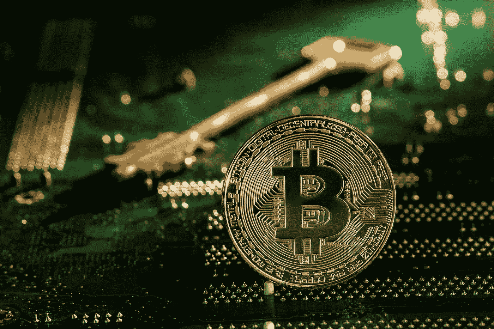
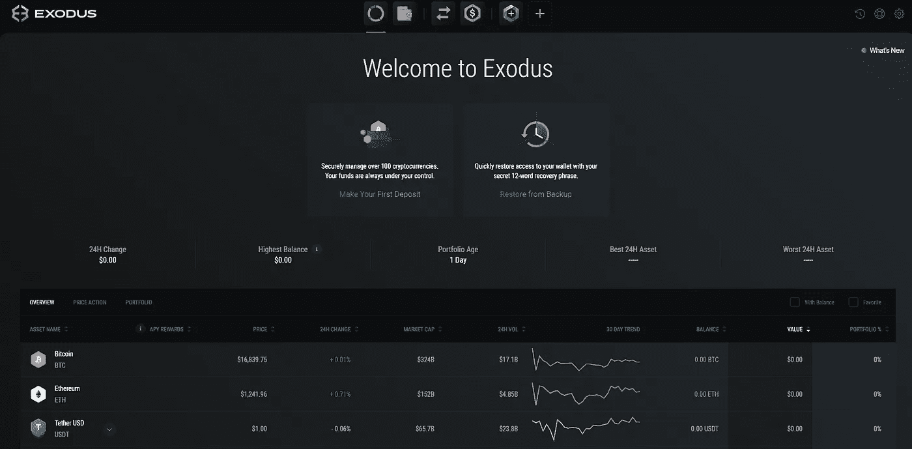
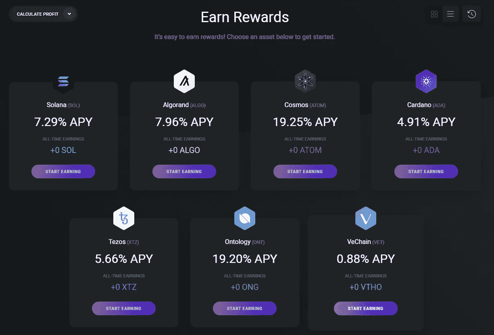
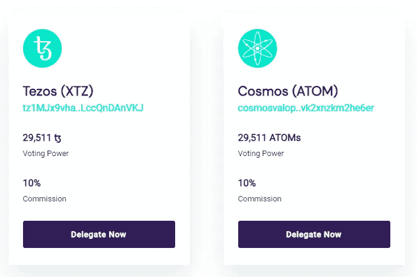
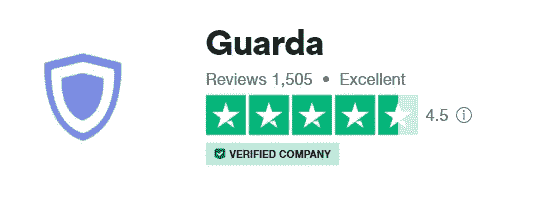
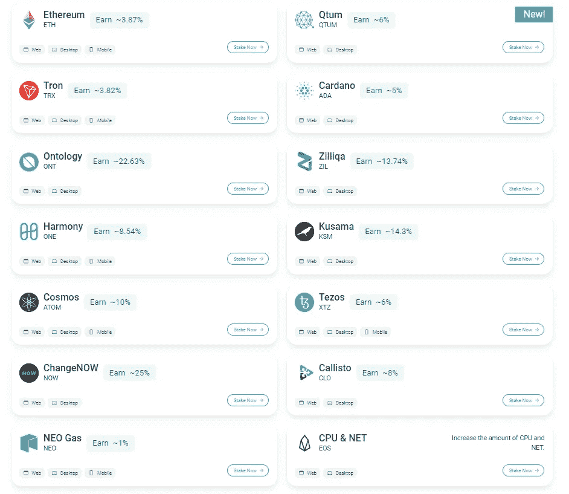
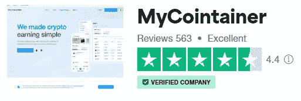
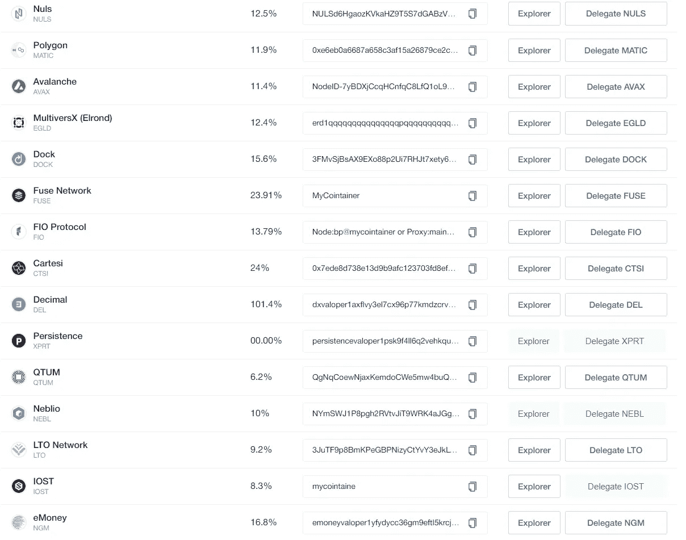

# 如何用冷钱包赚取加密货币:冷赌注介绍

> 原文：<https://medium.com/coinmonks/how-to-earn-cryptocurrencies-with-cold-wallets-an-introduction-to-cold-staking-2280fa472408?source=collection_archive---------7----------------------->

Photo taken from cryptonews.com

> 不是你的钥匙，不是你的硬币。

我认为，在加密货币行业的众多大玩家中，Terra Luna 和 FTX 的惊人崩溃强化了加密货币自我监管的重要性。FUD(恐惧、不确定性和怀疑)不会放过任何实体——即使是世界上最大的加密货币交易所币安，最近也出现了资金外流，这充分说明了投资者对 CEXs(集中式交易所)信心的丧失，这是由对交易所上周发布的[储备证明报告](https://www.wsj.com/articles/binance-is-trying-to-calm-investors-but-its-finances-remain-a-mystery-11670679351)的担忧引发的。

# 自我监护介绍

S elf 托管是私有密钥的所有权，它允许访问区块链上存在的加密货币资产。从广义上讲，有两种主要类型的钱包可以存储加密货币——热钱包和冷钱包。热钱包通过你的电脑或手机不断连接到互联网，而冷钱包是可以让你的私钥离线的硬件设备，承载着自我保管的终极形式。不严格地说，下载到与互联网隔离的设备上的热钱包(签署交易时除外)也可以被视为冷钱包。

**自我保管的限制**

虽然自保管消除了暂停取款的风险和(不诚实的)CEX 的难题，但如果您丢失了设备/钱包恢复短语，您仍可能会永久失去资金。因此，在保存您的恢复短语时要采取最大限度的预防措施，这可以访问您的私钥，也就是您的加密货币的所有权！

再者，难度略大(但也不是不可能！)来增加和复合您的资产，相比之下，通过诸如赌注、贷款和流动性挖掘等服务在 CEX 上一键获得收益的体验。

# 那么，如何在存储在冷钱包上的 Crypto 上获得被动收入呢？

D 您是否知道您可以离线储存现有代币，并使用它们来赚取更多代币？**介绍冷铆接**，字面意思是在冷钱包上进行铆接！在深入研究冷铆接的细节之前，让我们先了解一下铆接的概念及其工作原理。

# **什么是赌注？**

采取行动是区块链独有的，它遵循利益证明共识机制，如以太坊 2.0。通过持有硬币，用户可以将他们的资产抵押给区块链，以获得验证者的资格，并依次获得代币奖励。简单来说，赌注也许可以比作传统金融的定期存款，为投资者锁定在银行的资产支付利息。

# 冷铆接

C 古老的赌注结合了两个世界的优点，一是保护你自己保管的资产(因为只有你有权使用授予这些资产所有权的私钥),二是同时从赌注中赚取利息！冷铆接的工作方式类似于普通铆接；只有你的财产会离线储存在一个硬件钱包里。当你开始离线下注时，你每帮区块链添加一个区块，都会获得奖励。锁定的资产永远不会离开您的钱包，而只是委托给运行锁定服务的节点。因此，您可以在下注时保持对代币的完全控制，甚至可以随时取消下注。

虽然加密货币领域有太多的钱包，但很少有人提供原生应用内赌注的选项。以下是几个值得注意的冷标提及，在对每个提及进行审查之前，会从 Trustpilot 获得一个评级。

**出埃及记**

Exodus 是一个用户友好、安全和方便的跨平台钱包，提供有吸引力的 APYs 冷赌注。

Assets available for staking on Exodus

**Airgap.it**

它在这个领域是一个相对较新的参与者，但却是一个很有前途的参与者。借助 AirGap 的双设备方法，您可以在没有任何网络连接的设备上使用 AirGap Vault 应用程序完全离线签署交易，并使用 AirGap Wallet 应用程序在您的日常智能手机上广播交易，从而将安全性提升到一个新的水平。您还可以参与各种货币的赌注，如 Tezos、Cosmos 或 Polkadot，并赚取奖励，同时安全地存储您的资金。

Assets available for staking on Airgap

**瓜尔达**

Guarda 是一个安全的多货币加密钱包，提供冷赌注。

Assets available for staking on Guarda

**我的容器**

[my container](https://mycointainer.com/?partner=aYpdDed2GeU0xB6wPgB7)是一个赌注和主节点加密平台，帮助其用户以赌注的形式产生利润。除了传统的资金保管方式之外，[my container](https://mycointainer.com/?partner=aYpdDed2GeU0xB6wPgB7)还提供了冷保管，即充当资产保管的验证者，这些资产仍然安全地存储在您选择的冷钱包中。

Assets available for cold staking on MyCointainer

# 最后的想法

我承认，这次熊市让我大开眼界，没有一个单一的加密平台是值得完全信任的——无论这个平台看起来财务状况多么稳健和谨慎。展望未来，自我保管可能是加密货币资本保值的唯一关键，至少在混乱的水域平静下来之前是如此。

你对此有什么想法？有没有其他冷打桩的钱包推荐？欢迎在下面留下你的评论！

★ ***不用任何资本就能赚到钱的免费应用！*** ★

*🎁*[***【honey gain】***](https://r.honeygain.me/CYBER577DD)**一款被动收入 app，从你未使用的互联网带宽中赚钱。* [*免费获得 5 美元*](https://r.honeygain.me/CYBER577DD) *，无需投资。**

**🎁*[**peer 2 profit**](https://p2pr.me/164388119761fba2ed0531f)*一款被动收入 app，从你未使用的互联网带宽中赚钱。**

**🎁* [**IPRoyal 卒**](https://iproyal.com/pawns?r=532906) *一款被动收入 app，从你未使用的互联网带宽中赚钱。**

**🎁*[**earn App**](https://earnapp.com/i/mlztuxu)*一款被动收入 app，从你未使用的互联网带宽中赚钱。**

*★ ***加密货币投资平台*** ★*

**🎁* [***蛋糕 Defi***](https://cakedefi.com/?ref=677920)**一站式投资平台，以高达 100%的年利率烘焙被动现金流！* [*在 DFI 用 50 美元存款获得 50 美元奖金*](https://cakedefi.com/?ref=677920) *。***

***🎁*[***Nexo***](https://nexo.io/ref/hce5cfdt5o?src=web-link)**一家先进、受监管的数字资产机构，提供即时加密贷款，资产年利率高达 36%，是一家交易所，在 200 多个司法管辖区提供 40 多种法定货币的服务。* [*用 100 美元存款获得 25 美元*](https://nexo.io/ref/hce5cfdt5o?src=web-link) 奖金*。****

***🎁* [***币安***](https://www.binance.info/en/activity/referral-entry/CPA?fromActivityPage=true&ref=CPA_00BFAOLI96) *全球最大的加密货币交易所，无需介绍！***

***🎁*[***Kucoin***](https://www.kucoin.com/r/af/rJH29LZ)*一个庞大的加密货币交易所，提供有趣的产品，如赌注、免费交易机器人和比特币云挖掘服务。***

***🎁* [***火币***](https://www.huobi.com/en-us/topic/double-invite/register/?invite_code=5t5jb) *一个提供多样化产品、免费空投和交易机器人的加密货币交易所。***

***🎁*[***MEXC***](https://www.mexc.com/en-US/register?inviteCode=mexc-1NAJC)*一家持有 MX token 的加密货币交易所，有着有趣的列表和频繁的空投。***

***🎁*[***Crypto.com***](https://crypto.com/app/fcbsjmf5pb)*一家位于新加坡的加密货币交易所。* [*获得 25 美元*](https://crypto.com/app/fcbsjmf5pb) *在 CRO 赌赢一张红宝石牌。***

**★ ***加密货币交易机器人*** ★**

***🎁*[***3 commas***](https://3commas.io/?c=cybery)*一个加密货币交易管理平台，提供 DCA 机器人、电网机器人、期权机器人、期货机器人、HODL 机器人、黄牛终端和完整的投资组合管理，所有这些都来自一个方便的界面。***

***🎁*[***Jet-bot***](https://jet-bot.com/?fpr=l1be4)*具有复制交易功能的高级现货、期货交易机器人。* [*模拟账户*](https://jet-bot.com/?fpr=l1be4) *提供 3 天试用期。***

***🎁*[***Pionex***](https://www.pionex.com/en-US/sign/ref/mWhH4v29)*一个免费的多功能套利交易机器人，自动化低买高卖的过程，全天候。***

***🎁* [***一键加密***](https://app.onebutton.capital/sign-up?ref=X%2Bak1CB1aLL2Cg1g&s=MjAtMA%3D%3D) *一个由神经网络驱动的人工智能机器人，它可以自动管理你的加密货币投资组合。***

**★ ***针对马来西亚投资者*** ★**

***🎁*[***Luno***](https://www.luno.com/invite/EDXG2X)*在 BTC 用 100 令吉购买 BTC 获得 25 令吉奖金！***

***🎁* [***斯塔沙威***](https://www.stashaway.my/referrals/kenleel9jx) *免费投资 6 个月！***

***🎁****Wahed****code‘ken lie 1’RM10 报名奖金***

***🎁****cap bay****P2P 代码' 8879c6' RM100 签约奖金***

***🎁* [***亦然***](https://download.versa.com.my/1bAf/referral?deep_link_value=QF218MMB) *用 100 令吉存款获得 10 令吉奖金！***

***🎁*[***KDI***](https://app.digitalinvesting.com.my/registration/signup?referral_code=103433)*用 250 令吉存款获得 10 令吉奖金！***

*****接我*** [***中***](https://cybery.medium.com/)***|***[***read . cash***](https://read.cash/r/TraderFX)***|***[***YouTube***](https://www.youtube.com/c/SmartInvestingChannel)***|***[***推特***](https://twitter.com/cybertraderfx)**

> **交易新手？在[最佳加密交易](/coinmonks/crypto-exchange-dd2f9d6f3769)上尝试[加密交易机器人](/coinmonks/crypto-trading-bot-c2ffce8acb2a)或[复制交易](/coinmonks/top-10-crypto-copy-trading-platforms-for-beginners-d0c37c7d698c)**