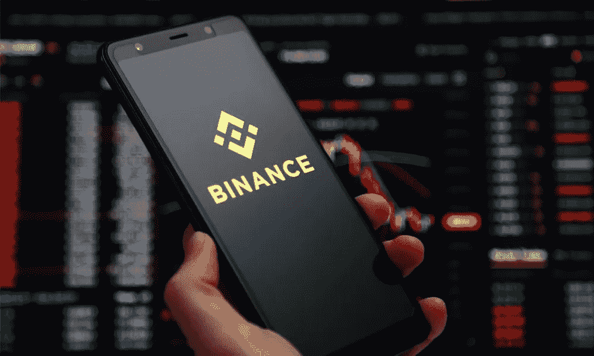

# 如何在没有交易的情况下在币安赚钱？

> 原文：<https://medium.com/coinmonks/how-to-earn-money-on-binance-without-trading-52e22bd15efc?source=collection_archive---------4----------------------->

**How To Earn Money on Binance Without Trading?**

币安据说是最好的密码交易平台之一。它为用户提供了参与安全交易的机会。币安提供了广泛的贸易以及被动收入的可能性。这里有一些潜在的不用交易就能赚钱的方法。

## 推荐并赢取:

***请注意:*** *这个方法是下面所有其他步骤的主要因素。*

当你推荐新用户时，币安推荐计划允许其用户赚取 40%的利息。最重要的是给人一个有价值的内容。记住，人们接受注册你的推荐链接是因为他们想支持你。

# 🌟你想赚钱吗？🌟

币安挣是一个选项，收集适合新用户的产品。如果你还没有注册[**Binance.com**](https://www.binance.com/en/activity/referral/offers/claim?ref=CPA_00M6XWFUN3)，或者你可以 [**使用这个推荐代码获得 100 USDT 奖励**](https://www.binance.com/en/activity/referral/offers/claim?ref=CPA_00M6XWFUN3) 。

**🌟** [**Create a Binance account and get 100$ Bonus in USDT**](https://www.binance.com/en/activity/referral/offers/claim?ref=CPA_00M6XWFUN3)**🌟**

## 币安挣:

当您在[**【www.binance.com】**](https://accounts.binance.com/en/register?ref=26723737)开户，您就能获得适合新老用户需求的币安 Earn 产品。此外，当你遵循一些简单的规则时，你的钱包里会有 100 USDT 的奖励。这可以用于交易，赌注或 NFT。

**有了这笔奖金，您可以在币安赢取活动中使用以下产品之一:**

1.  **灵活储蓄**
2.  **BNB 金库**
3.  **发射池**
4.  **固定条款**
5.  **固定储蓄**
6.  **锁定锁紧**
7.  **ETH 2.0 锁紧**
8.  **活动**

完整版的币安赚主题涵盖在我的文章中。所以如果你有兴趣的话 [***在这里。***](/coinmonks/binance-earn-earn-interest-using-less-risk-products-408f6736cea)

## 币安 P2P:

你可以在名为币安 P2P 的点对点市场上与其他币安用户直接交易密码。使用您选择的支付方式和当地货币，币安 P2P 支持加密交易。

## 币安赌注:

赌注是将您的数字资产放在钱包中的过程。这将使你在加密中受益。赌注已经被新用户使用，帮助他们被动赚钱。

## 买卖 NFT 艺术品:

我已经写过一篇关于 [**如何创建自己的 NFT**](/coinmonks/6-top-nft-artists-to-hire-on-fiverr-62ae1643eedc)以及如何推广的文章(免费&付费方法)。你会在最后找到所有的标题。

> 交易新手？试试[密码交易机器人](/coinmonks/crypto-trading-bot-c2ffce8acb2a)或[复制交易](/coinmonks/top-10-crypto-copy-trading-platforms-for-beginners-d0c37c7d698c)

## 币安发射池:

币安·发射池:这是什么？币安 Launchpool 于 2020 年 9 月推出，是一个让用户能够免费使用现有加密令牌并生成新令牌的平台。对赚取被动收入感兴趣的投资者应该使用这个策略。

## 促销礼品:

将 Cryptos 保存在您的币安帐户中，以便从空投中获得收益。现在，当你把 BNB 放在你的币安钱包里，你就可以获得价值 1600 万美元的 SXP 硬币的空投，这只对币安的 BNB 持有者开放。

## 币安卡:

用你的币安卡消费。币安赋予了“你必须花钱才能挣钱”新的含义。使用在欧洲推出并将很快在更多地区推出的币安卡，您可以在全球数千家参与零售商处消费，并获得 BNB 奖励。返现利率从 1%开始，你持有的 BNB 越多，币安利率就越高。

# 🌟[在 USDT 创建一个币安帐户并获得 100 美元奖金](https://www.binance.com/en/activity/referral/offers/claim?ref=CPA_00M6XWFUN3)🌟

**🌟** [**Create a Binance account and get 100$ Bonus in USDT**](https://www.binance.com/en/activity/referral/offers/claim?ref=CPA_00M6XWFUN3)**🌟**

# 🌟我有一个伟大的奖金给你:在币安注册后 100 美元🌟

一旦您创建了一个帐户**[**www.Binance.com**](https://www.binance.com/en/activity/referral/offers/claim?ref=CPA_00M6XWFUN3)**存入 50 美元以上，然后在 100 USDT 优惠券到期前赎回。****

## ****结论:****

****这些是不通过交易在币安赚钱的屡试不爽的策略。这些技术不需要任何数学或交易专业知识。请确保您自己对这个主题进行了研究，并随时与我们分享您的经验。****

****这就是这篇文章的全部内容:如何在不交易的情况下在币安赚钱？如果你喜欢，如果你能在推特或脸书上分享，我会很感激。非常感谢！****

********

****[**Click Here To Get Your 100 USDT Bonus Once you Deposit 50 USDT or its Equivalent**](https://www.binance.com/en/activity/referral/offers/claim?ref=CPA_00M6XWFUN3)****

****请 [**关注并订阅**](/@s.hanz) ，务必分享我的作品作为激励。点击这里查看我所有的文章:[**https://medium.com/@s.hanz**](/@s.hanz)****

# ****更多文章:****

****[**买 Shitcoin 有什么好处吗？**](/coinmonks/is-there-any-benefit-from-buying-shitcoin-412bf88006aa)****

****[**币安赚:利用低风险产品赚取利息**](/coinmonks/binance-earn-earn-interest-using-less-risk-products-408f6736cea)****

****[**熊市买比特币以外的 5 大加密货币**](/coinmonks/5-great-cryptocurrencies-other-than-bitcoin-to-buy-in-a-bear-market-be3e9945d621)****

****[**2022 年元宇宙最佳 5 个好项目加密币—清单 1**](/@s.hanz/best-5-metaverse-crypto-coins-with-good-projects-in-2022-list-1-687fedbe668e)****

****[***2022 年元宇宙最佳 5 个加密币好项目—榜单二***](/@s.hanz/best-5-metaverse-crypto-coins-with-good-projects-in-2022-list-2-15af2f8f01d9)****

****[**2022 年最值得投资的 7 种元宇宙加密币—榜单 3**](/coinmonks/7-best-metaverse-crypto-coins-to-invest-in-2022-list-3-9e077f5c87ab)****

****[**最后的机会—2022 年投资的 6 个最佳元宇宙加密硬币—榜单 4**](/coinmonks/last-chance-6-best-metaverse-crypto-coins-to-invest-in-2022-list-4-2ce3d6c1c922)****

****[**需要钱的时候要做的事情快——新招**](/@s.hanz/things-to-do-when-i-need-money-fast-new-tricks-2b68ad24406b)****

****[**2022 年推广 NFT 项目的 7 种免费方式**](/coinmonks/7-free-ways-to-promote-nft-projects-in-2022-ccefc7f249e7)****

****[**2022 年 7 款最佳赌注硬币**](/@s.hanz/7-best-staking-coins-in-2022-70dbc31adcae)****

****[**五月六日聘请 NFT 顶级艺人**](/coinmonks/6-top-nft-artists-to-hire-on-fiverr-62ae1643eedc)****

> ****加入 Coinmonks [电报频道](https://t.me/coincodecap)和 [Youtube 频道](https://www.youtube.com/c/coinmonks/videos)了解加密交易和投资****

# ****另外，阅读****

*   ****[币安 vs FTX](https://coincodecap.com/binance-vs-ftx) | [最佳(SOL)索拉纳钱包](https://coincodecap.com/solana-wallets)****
*   ****如何在 Uniswap 上交换加密？ | [A-Ads 审查](https://coincodecap.com/a-ads-review)****
*   ****[加密货币储蓄账户](/coinmonks/cryptocurrency-savings-accounts-be3bc0feffbf) | [YoBit 审核](/coinmonks/yobit-review-175464162c62)****
*   ****[Botsfolio vs nap bots vs Mudrex](/coinmonks/botsfolio-vs-napbots-vs-mudrex-c81344970c02)|[gate . io 交流回顾](/coinmonks/gate-io-exchange-review-61bf87b7078f)****
*   ****[CoinFLEX 评论](https://coincodecap.com/coinflex-review) | [AEX 交易所评论](https://coincodecap.com/aex-exchange-review) | [UPbit 评论](https://coincodecap.com/upbit-review)****