# 如何在自动驾驶仪上用蛋糕 DeFi 赚取被动收入:教程

> 原文：<https://medium.com/coinmonks/how-to-earn-passive-income-on-autopilot-with-cake-defi-a-tutorial-2ec2ac5f46ba?source=collection_archive---------0----------------------->

> *“睡觉的时候不找到赚钱的方法，就工作到死。”—沃伦·巴菲特*

我知道，获得被动收入是财务自由的缩影。因此，在这个旅程中选择一个明智的投资平台是最重要的。

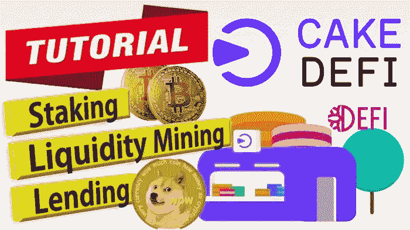

I**n 推出** [**Cake DeFi**](https://cakedefi.com/?ref=677920) ，一个可靠的一体化投资平台，让您的**加密货币**产生高回报，产生被动现金流，让您高枕无忧！经历了时间的考验，[**Cake DeFi**](https://cakedefi.com/?ref=677920)**很快为自己建立了稳固的声誉**，并赢得了许多像我一样的快乐用户的信任。

事实上，看到 Cake DeFi 在 Trustpilot 上的评论分数在过去几个月的表现令人惊讶，尽管有加密冬天！

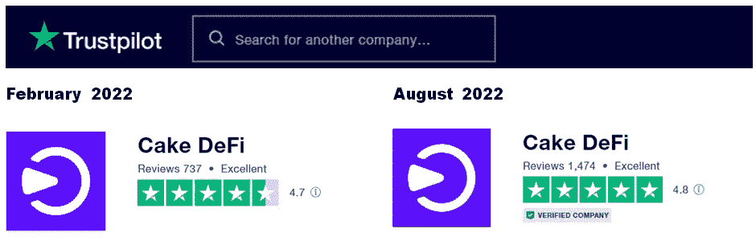

Not only did the number of reviews double over 6 months, but the overall ratings actually improved even further! Read on to find out why!

有几种方法可以在蛋糕 DeFi 上产生被动现金流，例如

*   **流动性挖掘**
*   **打桩**
*   **冰柜**
*   **借贷**
*   **借款**
*   **赚**

# 仪表板概述

L 进入 [**Cake DeFi**](https://cakedefi.com/?ref=677920) 带你进入**你目前持有资产的概况**。向下滚动页面会显示您的加密货币资产在分配和总价值方面的详细信息。

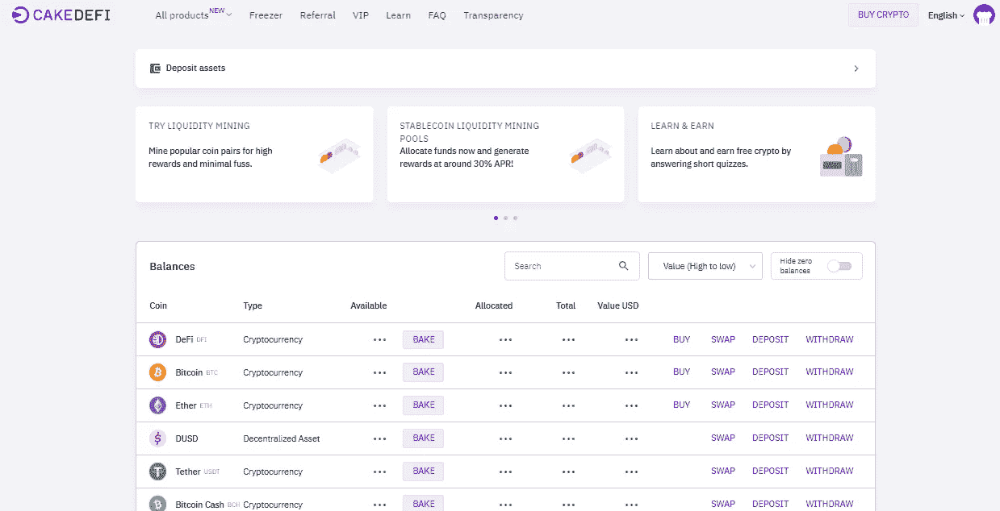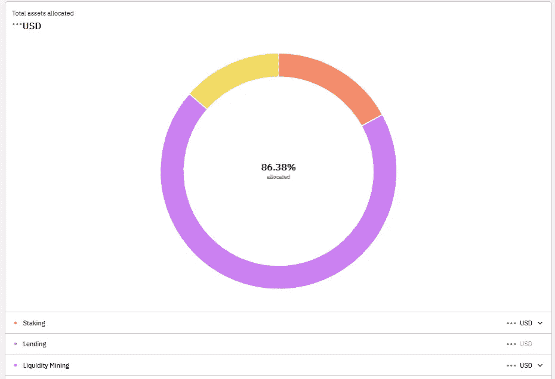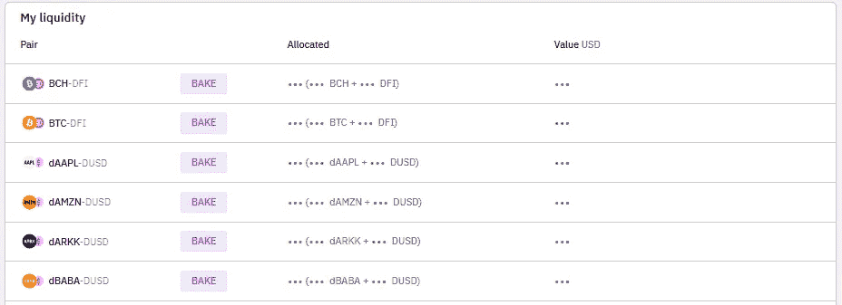

# 如何进行首次存款？

开始投资之旅的第一步是**将硬币**存入蛋糕 DeFi。在这个例子中，我将使用比特币来说明存款过程。在您的仪表板上，**只需点击存款并选择您想要的转账网络**。

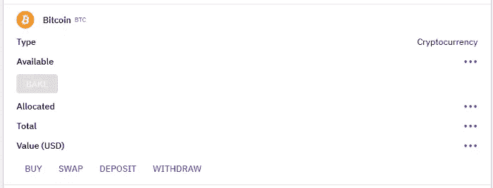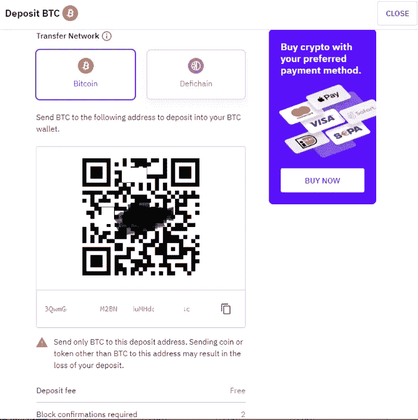

Ensure transfer network is correct

务必**确保选择的转移网络是正确的**，否则你的资产可能会在运输途中丢失。存款地址以二维码或文本的形式显示，可以复制到您想要转移资产的钱包中。存款开始后，只需等待存款出现在您的 Cake DeFi 帐户中，这可能需要几分钟到几个小时，具体取决于区块链的流量和使用的转账网络。

您也可以考虑从类似[库币](https://www.kucoin.com/land/register/r/rJH29LZ)或[火币](https://www.huobi.com/en-us/topic/double-invite/register/?invite_code=5t5jb)的交易所存入**DFI(DeFiChain)**，因为 DeFi 作为 DeFi chain 网络的本地货币，被广泛用于 Cake DeFi 提供的许多服务中；虽然 DFI 也可以很容易地从你选择存入 Cake DeFi 的其他加密货币中兑换出来。

或者，您可以通过 Transak 或 Banxa 以优惠的价格用 Visa 或 Master 卡购买 crypto。

现在您已经有了一些加密货币，是时候让它们发挥作用了，这样您就可以高枕无忧了！

# **DFI 一瞥**

D **FI 是 DeFiChain network** 的原生令牌，这是一个去中心化的区块链平台，致力于为比特币生态系统带来快速、智能和透明的去中心化金融服务。

蛋糕 DeFi 不是 DeFiChain 的同义词，也与 PanCAKESwap 生态系统的蛋糕无关。相反， **Cake DeFi 是一个 CeDeFi**——一个金融科技平台，利用 DeFiChain 网络的创新，为投资者提供直观的用户界面，轻松产生被动现金流。除了 DeFiChain 上可用的流动性挖掘池和分散式交易所之外，Cake DeFi 还提供额外的服务，包括赌注、贷款、冰柜借款&。

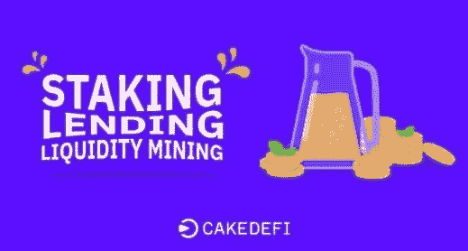

The 3 primary services of Cake DeFi

# 流动性挖掘

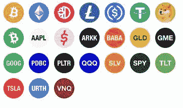

Assets available for liquidity mining

L **流动性挖掘**是分散式金融项目的关键要素，其中**参与者将其加密货币资产贡献给流动性池**，以促进交易并为希望在分散式交易所进行加密货币互换的用户提供流动性。流动性开采提供高达 50%的年回报率，这取决于 DFI 的价格。

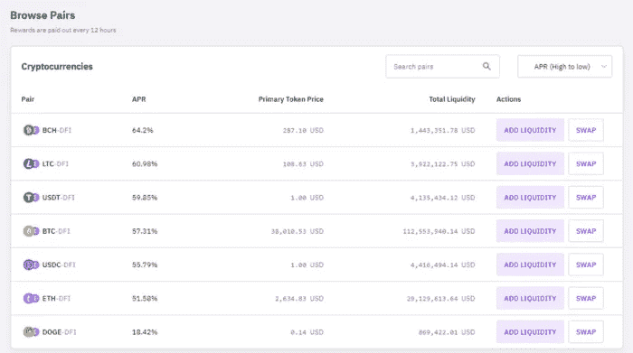

Liquidity Mining pools available on Cake DeFi

**要参与流动性挖掘，请在 Cake DeFi 网站中导航至流动性挖掘。向下滚动网站会显示 Cake DeFi 目前拥有的流动性资产列表，以及其当前的固定价值。流动性对的完整列表可以在下面找到，这揭示了其相应的年百分比、主要令牌价格和总流动性。有许多可用的池，如比特币-DFI 池、USDT-DFI 池、以太坊-DFI 池等等。**

这个流动性池列表中令人兴奋的一项是分散资产，它结合了 T2 高收益流动性挖掘和间接投资 T4 传统股票市场的能力，如苹果、谷歌、特斯拉、方舟创新 ETF、标准普尔 500 ETF 信托基金等。

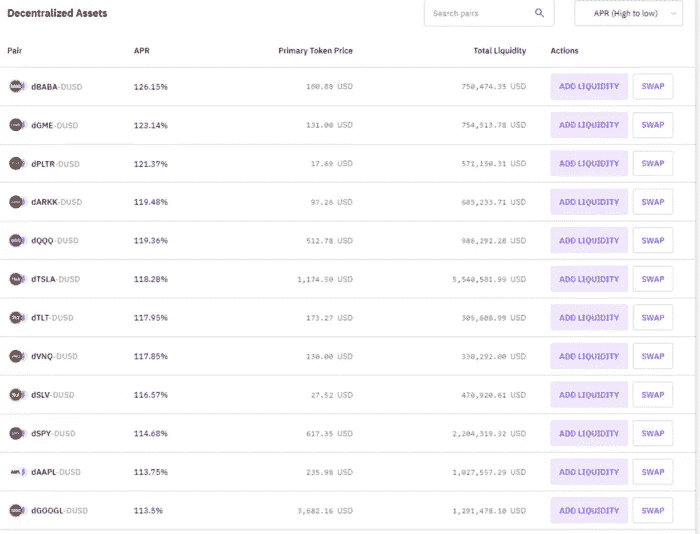

Decentralized assets

奖励主要在 DFI 发放，每天两次。您可以选择自动持有 DFI 奖励，这样就可以获得复利。

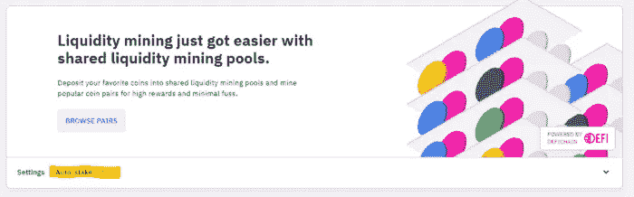

Auto-staking liquidity mining rewards are a great way to quickly grow your staking returns!

流动性挖掘要求资产池中包含等量的两种资产；如果您没有任何感兴趣的资产，只需使用**分散交易所或 DEX 将硬币兑换成您想要的加密货币**。点击“交换”会弹出“DeFiChain 交换”页面，您可以轻松地在任何硬币之间进行交换。

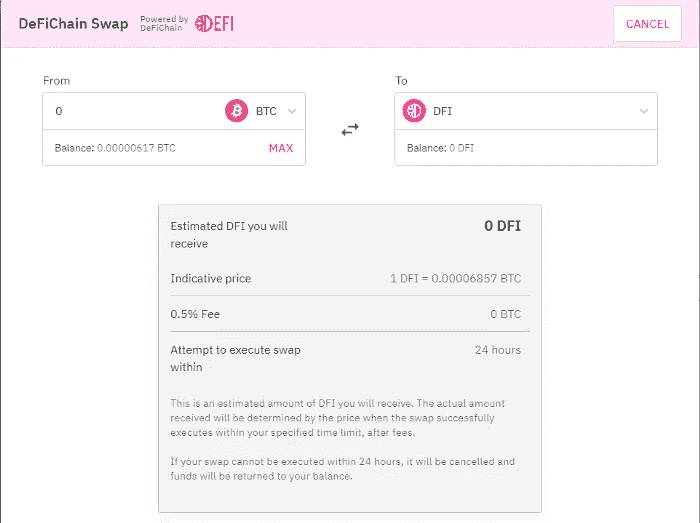

DeFiChain Swap

去联锁网络通常在 1 小时内处理**交换，但是如果网络拥塞，这可能会延长更长时间。Cake DeFi 收取合理的 0.5%的费用，以方便在网站上兑换硬币，避免将 DFI 提取到 DeFiChain 钱包进行兑换，然后将其发送回 Cake DeFi 的麻烦。**

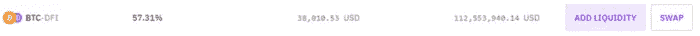

BTC-DFI pool

以比特币-DFI 流动性池为例，你需要等量的比特币和 DFI 才能加入该池。假设你有 1 个比特币，你要把 0.5 个比特币兑换成 7292 个 DFI。

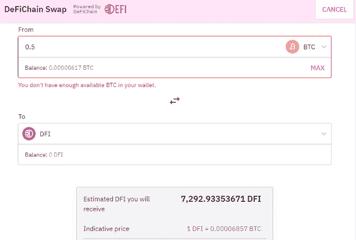

Swapping 0.5 bitcoin to DFI for entry into liquidity mining

点击查看掉期，通过输入您的双因素身份验证代码确认交易，然后等待交易处理。

**现在你已经拥有等量的两种加密货币，你已经准备好加入流动性池了。**只需点击**添加流动性，并指定您愿意贡献的比特币或 DFI 数量**，系统将自动计算出需要进入池中的另一枚比特币的相应等值。

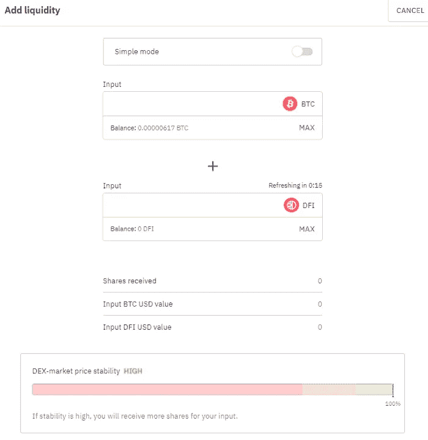

Adding liquidity

注意 DEX-市场价格稳定指数，它给出了流动性池当前稳定性的标志——指数越高，相同数量的硬币可以获得越多的股票。在增加流动性之前，我通常会等待 DEX 稳定性达到或接近 100%。

或者，进入**简单模式，只需添加 1 种加密货币**；在这种情况下，将先前示例中的原始 1 比特币添加到流动性挖掘将自动执行所需 DFI 量的掉期交易，以进入流动性池。其余步骤在其他方面是相同的。

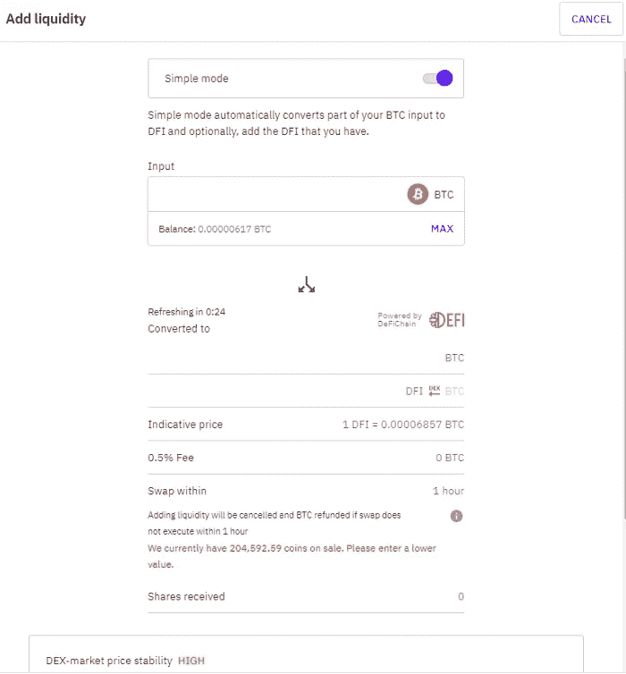

Simple mode

**利用分散资产，投资者可以间接投资于传统股票市场上的资产股价，并从中获利，如谷歌、苹果、特斯拉等。**

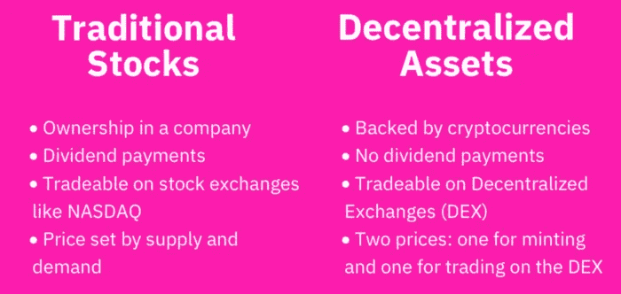

A comparison between traditional and decentralized stocks. Image taken from the DeFiChain blog.

**要使用分散资产参与流动性挖掘，你将需要 dUSD，这是与美元价值挂钩的 defichain 网络中的稳定货币。**如前所示，您可以从任何硬币交换到 dUSD 和您选择的分散资产，然后继续添加到相应的流动性池。

Swapping assets into dUSD

# 获得

Earn 是 Cake DeFi 提供的最新服务，旨在**彻底改变从流动性挖掘中产生的现金流，减去与之相关的风险和复杂性**。在您的比特币或 DFI 上安全赚取高达 10.79%的 APY！简而言之， **Earn 结合了流动性挖掘的高收益和贷款/抵押服务的稳定性和安全性这两个方面的优势。**它可以被比作**单边流动性挖掘**，允许仅从单一类型的资产产生现金流，通过**波动性保护池来减轻非永久性损失的风险。**

为了真诚地参与，

*   在蛋糕定义应用程序上，转到“烘焙”，然后“**赚取**

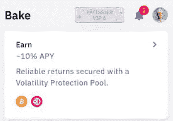

*   **点击“开始赚取”分配 BTC 或 DFI** 。

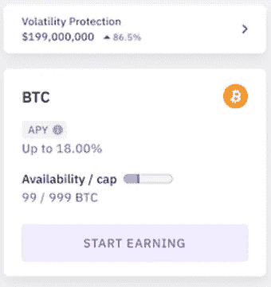

*   在接下来的几页中，您将获得有关波动性保护的更多信息，以及有关 Earn 的常见问题解答。
*   指明您希望**分配**的资产数量和加密类型。

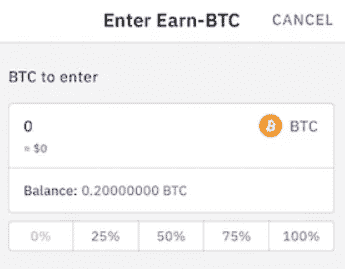

*   我们将提供您参赛作品的摘要。查看详细信息，点击**确认**。

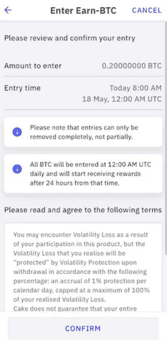

*   祝贺你成功入围！奖励将以您选择的本国货币支付，每 24 小时一次。在接下来的 100 天里，波动性保护的百分比将每天增加 1%。

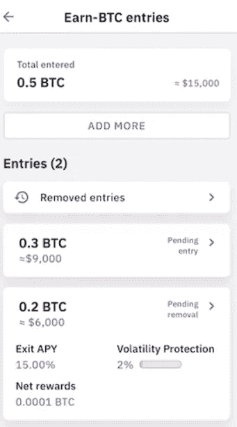

要了解更多关于 earn 的信息，请查看我的以下文章！

 [## 如何用蛋糕 DeFi 在比特币上赚到 10.79%的 APY！

### Earn 是 Cake DeFi 的一项创新功能，可为您的加密货币提供高回报，同时将风险降至最低…

cybery.medium.com](https://cybery.medium.com/how-to-earn-10-79-apy-on-bitcoin-with-cake-defi-101cd095207) 

# 立桩标界

Assets available for staking

S **taking 是一种通过在赌注池**中持有你的加密资产来赚取可观利息的方式，与你的储蓄账户非常相似，但利率要高得多！蛋糕 DeFi 的赌注可以用 **DFI** 来完成，DeFiChain 的原币目前提供 38.2%的年百分比收益率；和**破折号**，尽管年收益率较低，为 5.4%。常规标桩没有固定的条款。

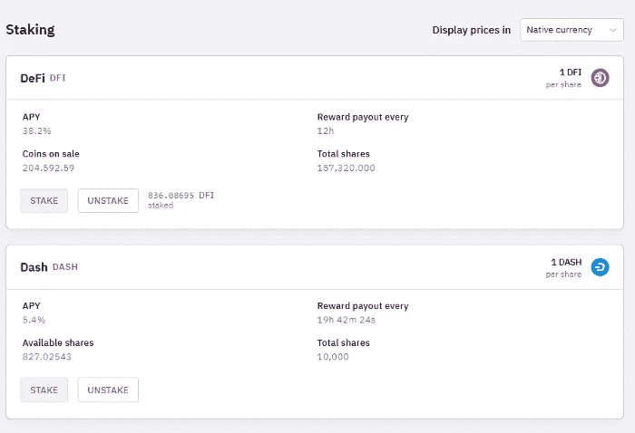

Staking on Cake DeFi

**要下注您的资产，只需点击“下注”,选择您选择的加密货币，并指出您想要下注的硬币数量。**使用取消堆叠功能，可以随时移除已堆叠的资产，而不会受到惩罚。

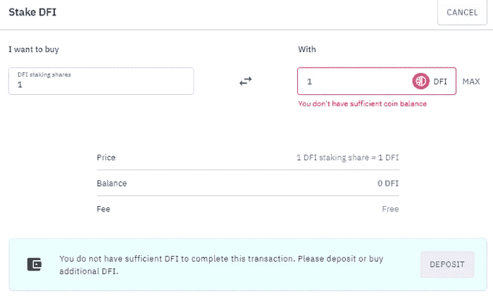

Buying Staking shares

# 放款

C ake DeFi 还提供借贷服务，允许你通过你的比特币、以太坊、美元系绳以及美元币赚取**被动收入。**

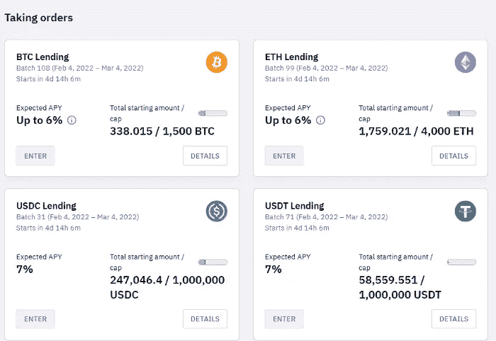

Lending on Cake DeFi

**你的资本和回报得到充分保障，无风险**，如果资产的现货价格超过一定数额，还可能有奖金。**每批贷款运行 28 天**，在周五开始和结束。一旦你选择参与，你的 BTC /瑞士联邦理工学院/ USDT / USDC 将在接下来的 4 周内锁定期权合约。在这一批 4 周后，您可以选择自动进入下一批(生成自动复利)，只提取您的回报，或者将您的全部本金和回报提取回您的账户。

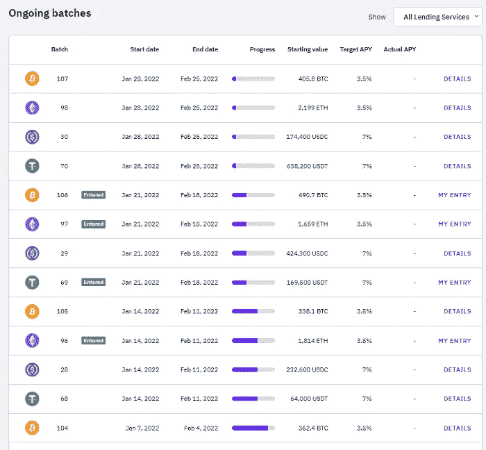

Lending batches on Cake DeFi

向下滚动页面会显示正在进行的批及其进度，以及批的详细信息摘要，如起始值、目标 apy 和实际 apy。要输入贷款批次，只需**点击所需的贷款批次，并指出您希望为该特定批次分配的资产数量。**指定批次的开始和结束时间。当前批到期时，您可以选择自动将回报和资本或仅资本复合到下一批贷款中，也可以选择完全不自动进入下一批贷款。

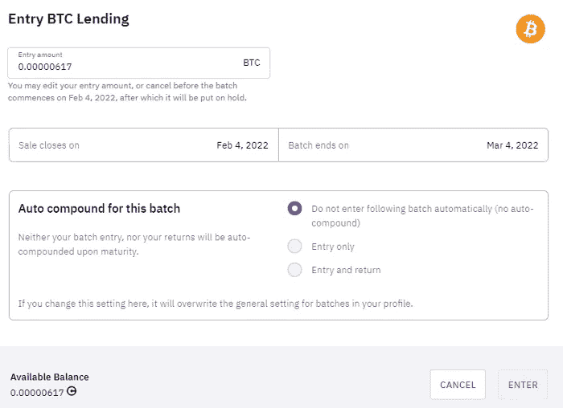

Entering a lending batch

# 冰柜

冰柜可以比作一个忠诚度计划，奖励用户在一定时间内向 Cake DeFi 投入资金，时间从 1 个月到 10 年不等。可用于分配给**押仓&流动性挖掘**产品的资金。

普通冰箱会给你高达蛋糕费 85%的回扣。另一方面，5 年期和 10 年期 DFI 赌注将资金锁定在 DeFiChain 区块链本身，根据租期的不同，给予用户**高达 2 倍的常规赌注回报**，相当于 10 年赌注期高达 100%的惊人年百分比收益率！但是请注意，一旦被冻结，在任期结束之前，资产不能解冻或收回。

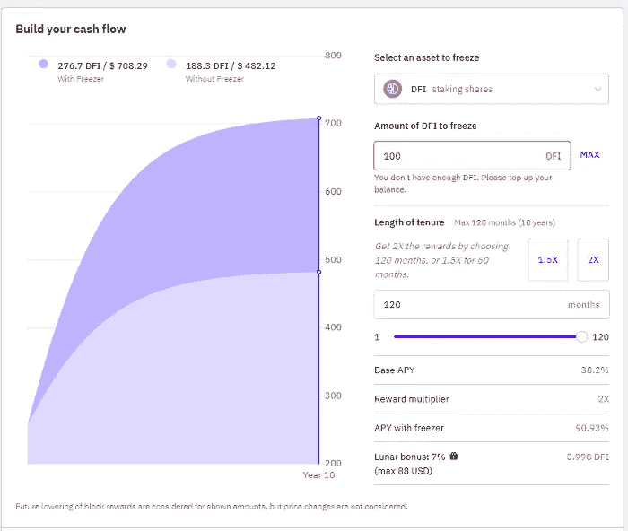

The Freezer on Cake DeFi

# **借**

**用加密货币做抵押，以低至 5%的年利率借 DUSD** ！

首先， [**下载蛋糕 DeFi app**](https://app.cakedefi.com/borrow) 。一旦你下载了应用程序，只需**进入“烘焙”,从选项中选择“借用”**

在那里，你可以通过将 DFI 作为抵押品或将其与比特币、以太币、系绳币和美元币结合起来开始借款。

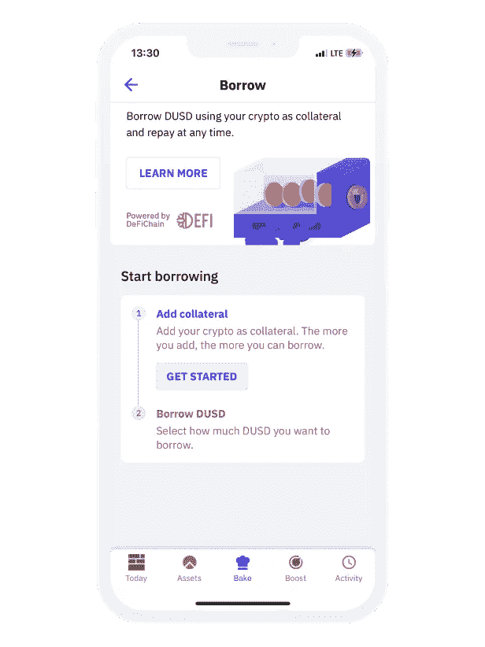

# **最后的想法**

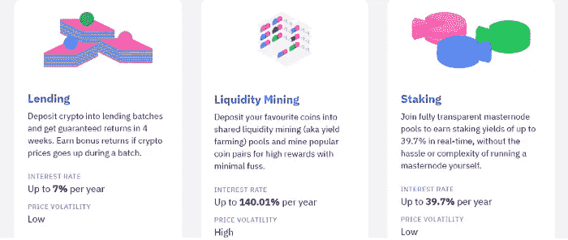

# 一眼

Cake DeFi 的三大核心服务迎合了不同的投资胃口和偏好。

*   **贷款提供低风险的担保资本，但有固定的期限。**
*   **流动性开采提供了灵活性和高收益，尽管存在非永久性损失的风险。**
*   **Earn 收获流动性开采的高收益，同时寻求将非永久性损失的风险降至最低。**
*   **赌注是一种低风险、高收益、灵活的解决方案，可在无锁定期的 DeFiChain 网络的原生货币 DFI 上赚取高额利息。**

无论你喜欢哪种服务，请放心 **Cake DeFi 是一个值得信赖和可靠的一站式平台，可以产生被动现金流**，这样你就可以把时间更多地放在生活中重要的事情上。 [**今天报名**](https://cakedefi.com/?ref=677920) 开始享受被动收益！锦上添花的是， **r** [**对于注册、通过 KYC 验证并在蛋糕定义中分配资产的新用户，将获得 50 美元的额外奖励**](https://cakedefi.com/?ref=677920) ！

**有关如何获得注册奖金的详细信息，请单击** [**此处**](/predict/how-to-get-a-50-signup-bonus-from-cake-defi-bad80cc5aa87) **。**简而言之，这项奖励包括 40 美元的新用户注册奖励，以及来自 Earn & Learn 的 10 美元额外奖励(不过，这项奖励因地区而异，并非所有国家都提供！).

来看看我之前在蛋糕 DeFi 系列的[文章吧！](https://cybery.medium.com/list/cake-defi-0acb0c90a3ab)

*View a step-by-step tutorial below on how to generate passive cashflow with CakeDeFi!*

Introduction to DeFi, taken from the youtube channel of DeFiChain.

*本文是对 2022 年 2 月发表的原* [*的更新。*](/coinmonks/how-to-earn-passive-income-with-cake-defi-a-tutorial-64abe4a01bec)

*🎁*[*honey gain*](https://r.honeygain.me/CYBER577DD)*一款被动收入 app，从你未使用的互联网带宽中赚钱。* [*免费获得 5 美元*](https://r.honeygain.me/CYBER577DD) *，无需投资。*

*🎁* [*蛋糕 Defi*](https://cakedefi.com/?ref=677920) *一站式投资平台，以高达 100%的 APYs 烘焙被动现金流！* [*在 DFI 用 50 美元存款获得 50 美元奖金*](https://cakedefi.com/?ref=677920) *。*

*🎁*[*Nexo*](https://nexo.io/ref/hce5cfdt5o?src=web-link)*一家先进的、受监管的数字资产机构，提供即时加密贷款，资产日收益率高达 36%，是一家交易所，在 200 多个司法管辖区提供 40 多种法定货币的服务。* [*用 100 美元存款获得 25 美元*](https://nexo.io/ref/hce5cfdt5o?src=web-link) 奖金*。*

*🎁* [*币安*](https://www.binance.info/en/activity/referral-entry/CPA?fromActivityPage=true&ref=CPA_00BFAOLI96) *全球最大的加密货币交易所，无需介绍！*

*🎁*[*Kucoin*](https://www.kucoin.com/r/af/rJH29LZ)*一个庞大的加密货币交易所，提供有趣的产品，如赌注、自由交易机器人和比特币云挖掘服务。*

*🎁* [*火币*](https://www.huobi.com/en-us/topic/double-invite/register/?invite_code=5t5jb) *一个提供多样化产品、免费空投和交易机器人的加密货币交易所。*

*🎁*[*MEXC*](https://www.mexc.com/en-US/register?inviteCode=mexc-1NAJC)*一个持有 MX 令牌的加密货币交易所，有着有趣的列表和频繁的空投。*

*🎁*[*Crypto.com*](https://read.cash/@TraderFX/10-tips-to-maximize-earnings-on-honeygain-an-effortless-free-passive-income-app-68535728#bad-link)*一家位于新加坡的加密货币交易所。* [*获得 25 美元*](https://crypto.com/app/fcbsjmf5pb) *在 CRO 赌赢一张红宝石牌。*

*🎁* [*Pionex*](https://www.pionex.com/en-US/sign/ref/mWhH4v29) *一个免费的多功能套利交易机器人，自动化低买高卖的过程，24/7。*

*🎁* [*一键资本*](https://app.onebutton.capital/sign-up?ref=X%2Bak1CB1aLL2Cg1g&s=MjAtMA%3D%3D) *一个由神经网络驱动的 AI 机器人，它在自动驾驶仪上管理你的加密货币投资组合。*

***针对马来西亚投资者***

*🎁*[*Luno*](https://www.luno.com/invite/EDXG2X)*在 BTC 用 100 令吉购买 BTC 获得 25 令吉奖金！*

*🎁*[*Stashaway*](https://www.stashaway.my/referrals/kenleel9jx)*免费投资 6 个月！*

*🎁Wahed code 'KENLIE1' RM10 注册奖金*

*🎁Capbay P2P 代码' 8879c6' RM100 注册奖金*

*🎁* [*亦然*](https://download.versa.com.my/1bAf/referral?deep_link_value=QF218MMB) *用 100 令吉存款获得 10 令吉奖金！*

*🎁*[*KDI*](https://app.digitalinvesting.com.my/registration/signup?referral_code=103433)*用 250 令吉存款获得 10 令吉奖金！*

***接我*** [***中***](https://cybery.medium.com/)***|***[***read . cash***](https://read.cash/r/TraderFX)***|***[***Youtube***](https://www.youtube.com/c/SmartInvestingChannel)

> 交易新手？试试[加密交易机器人](/coinmonks/crypto-trading-bot-c2ffce8acb2a)或者[复制交易](/coinmonks/top-10-crypto-copy-trading-platforms-for-beginners-d0c37c7d698c)