# 如何利用 Jet-bot 实现加密货币交易自动化:综述

> 原文：<https://medium.com/coinmonks/how-to-earn-passive-income-with-automated-cryptocurrency-trading-on-jet-bot-a-review-60c8ae36dc7c?source=collection_archive---------3----------------------->

# **概述**

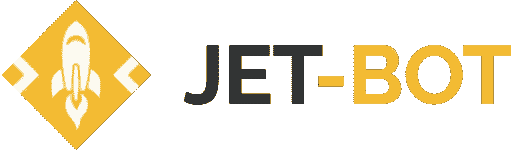

作为一个狂热的技术爱好者，我经常发现自己被能够自动化日常生活各个方面的东西所吸引，更不用说交易了；这就是**交易机器人的作用，它们能够自动完成低买高卖**的过程，规避任何人类情感和单调乏味的日常工作。在尝试了各种各样的机器人之后，我对 [**Jet-bot**](https://jet-bot.com/?fpr=l1be4) 的产品印象特别深刻，这是一个**高级在线交易机器人，能够自动进行币安**的现货和期货交易，全天候产生现金流。

# 特征

*   **现货和期货**市场 24/7 自动交易，具有**止盈/止损**功能。
*   先进的**安全订单**配置，可自动平均进场价格，以防市场走向不利。
*   **电报机器人支持**:在网络平台和通过电报创建机器人、更改设置和接收交易报告。
*   **模拟交易账户**拥有**10 万美元的虚拟投资组合。**
*   **3 天试用期**可完全访问平台

# 仪表板

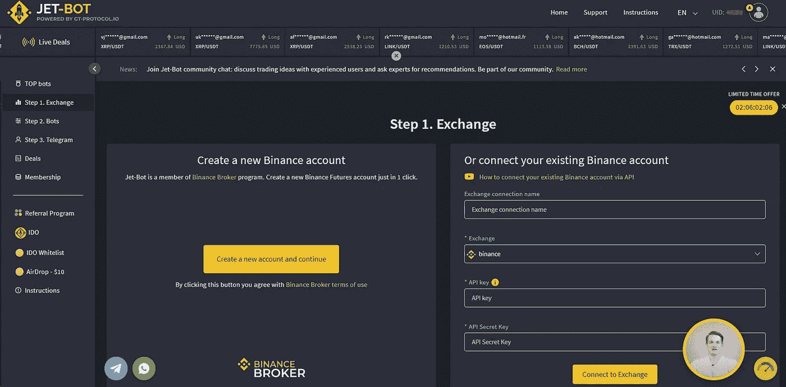

[**在此**](https://jet-bot.com/?fpr=l1be4) **注册一个帐户，获得 10 美元奖金(最低赎回要求为 50 美元)、100，000 美元的虚拟投资组合，以及 3 天的完整 bot 功能试用期！**

*   只需在[注册页面](https://jet-bot.com/?fpr=l1be4)上输入您的电子邮件和密码，然后按下“注册”按钮，或者通过社交网络使用一键注册。
*   通过发送到您电子邮件地址的链接确认您的帐户。

# 不是你的钥匙，不是你的硬币

YYou**永远不需要向 Jet-bot** 存入任何资金，因为所有的交易都直接在你的币安账户上完成，由 Jet-bot 处理。因此，第一步是**将你在币安的 API 密匙链接到你的 Jet-Bot 账户**。(API 密匙允许 Jet-Bot 在您现有的币安账户上交易资金，没有提款功能——您的资金是币安的 SAFU。)

# 设置你的机器人

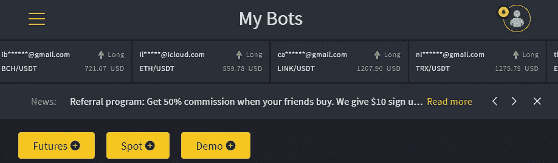

你可以选择建立一个**模拟账户，或者用你的币安现货/期货账户进行交易。**如果您是初学者，建议您使用演示模式来熟悉 bot 设置，并在无风险的环境中练习交易。

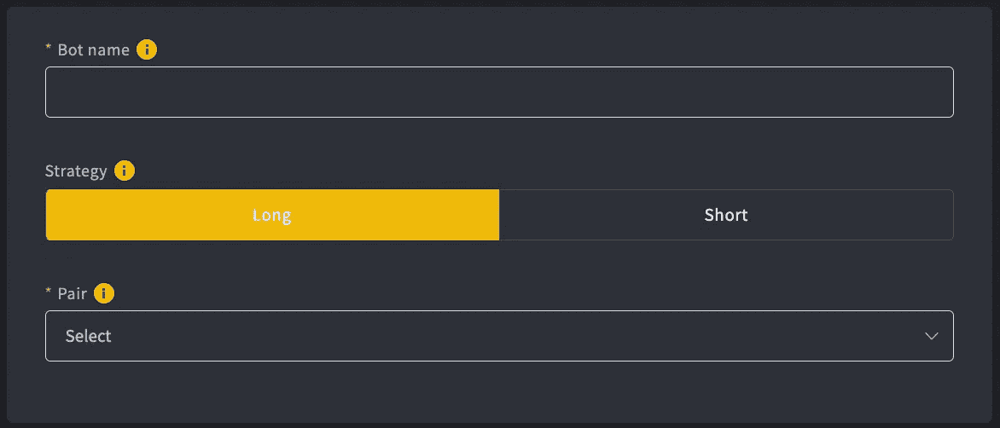

**1。策略&对**

-如果您看好该资产，请选择“做多”。

-如果您看跌该资产，请选择“做空”。

如果你不确定资产的预期方向，或者如果市场是横向的，你可以建立一个做空和做多机器人，从两个方向的价格波动中获利。(免责声明:轻微的价格波动会被很好的容忍；然而，一个主要的不利趋势可能导致清算和资本损失，这取决于 bot 的设置。)

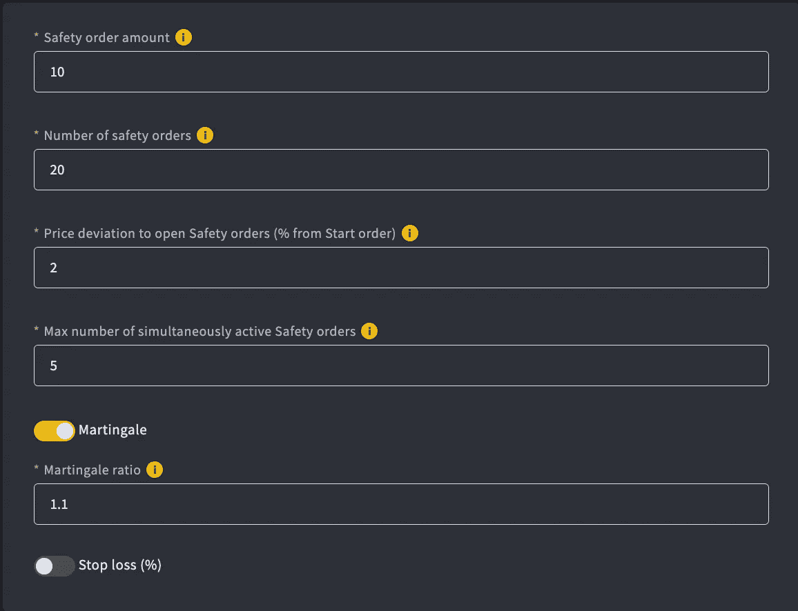

**2。开始订单金额**:订单的初始保证金(最低 10 美元)

**3。利用**:2-20 倍(根据要求最高可达 125 倍)

低杠杆=低风险。更高的杠杆率——更高的风险。

**4。获利:你的机器人应该从每笔交易中获利多少。
利润金额将根据您的订单金额计算。**

虽然较高的获利在牛市中可能是有益的，但较低的获利在日常的横向市场中可能更有用，这样机器人将更频繁地建立交易，而不是等待可能需要几天/几周才能实现的高获利订单。合理的范围是 0.5–3%。

**5。跟踪获利:**
如果启用，在达到获利目标后，您的机器人将继续保持您的交易，并等待价格进一步上涨，以更高的利润完成交易。

**6。跟踪偏差:**价格下跌的百分比，在此百分比之后，您的机器人应该执行止盈单；比如 0.1%。

**7。安全订单金额**:如果价格与您的头寸相反，安全订单会平均您的头寸，使您的止盈目标更接近当前价格。可以设置为等于或高于开始订单金额。

**8。安全订单数量**:你的机器人在一次交易中可能使用的最大安全订单数量。安全订单有助于平均您的头寸进场价格，并使您的止盈目标更接近。

9。价格偏差:安全订单之间的百分比步长。
如果您设置 1%的偏差，这意味着每次当价格从您的初始订单输入价格下降-1%时，将执行每个新的安全订单。

10。同时激活的安全订单的最大数量:同时发出的安全订单的数量。建议使用 3-5(考虑到在大的市场波动期间，币安可能会过载，不能及时响应 bot 的请求。)

**11。鞅:**后续安全订单规模倍增的程度。例如，如果您将鞅设置为 1.1，初始安全订单为 10USDT，则第二个安全订单将为 10x1.1=11USDT，第三个安全订单将为 10x(1.1x1.1)=12.1USDT，依此类推。

**12。止损:**止损是根据进场价格计算的。如果您设置止损=40%，并且您以 10，000 美元的价格建立了一笔新交易，在价格下跌 40%至 6，000 美元(10，000–40%)后，该交易将通过止损单成交。

# 复制交易

除了设置你自己的机器人，你还可以选择**复制表现最好的机器人的策略**！顶级交易者是一个有经验的交易者，他创造了一个盈利能力和安全性都很好的机器人。换句话说，将交易和设置配置的整个过程留给一个在 Jet-bot 上运行盈利机器人的经验丰富的交易员。

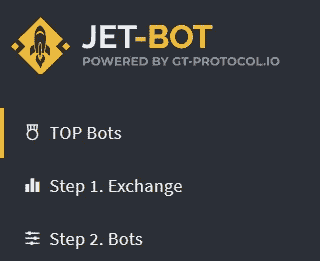

要开始复制交易，只需前往左上角的顶级机器人菜单，浏览顶级机器人列表，并考虑以下几个因素

1.  期望 APY(年收益率——潜在利润的衡量标准，考虑复利)
2.  现货或期货交易
3.  交易对
4.  设定的激进程度(激进程度越高，潜在的利润和风险就越大)
5.  最低要求余额

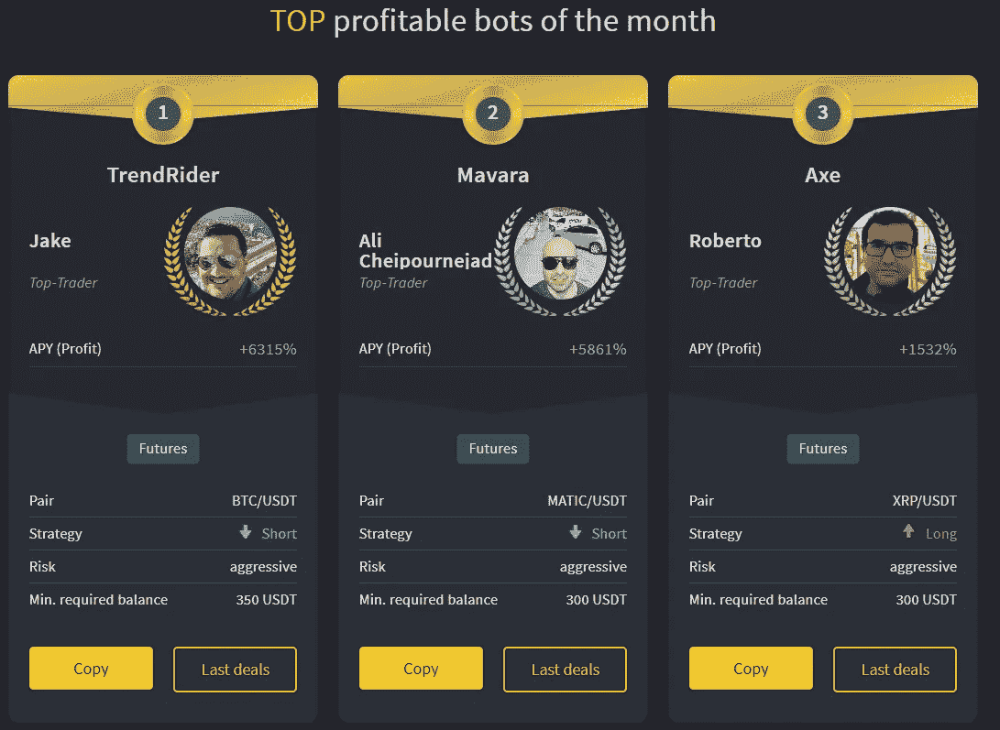

1.  决定要复制的热门机器人后，单击“复制”按钮，将该机器人添加到您的帐户中
2.  转到菜单选项卡
3.  转到下拉菜单，选择 Exchange，然后选择所需的连接
4.  单击创建 Bot 按钮，然后单击启动 Bot。

一切就绪！你的机器人已经在等待顶级交易员的下一个命令开始交易。

# 一个运行机器人的例子

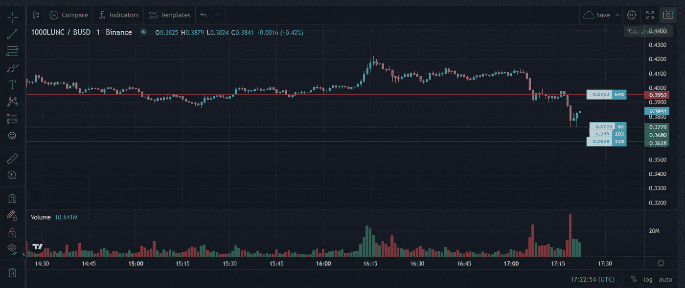

在上面这个 LUNC 多头策略的例子中，红线代表止盈单，而绿线代表安全单，在下跌时抓住它，以平均买入价。

# 预期收益

根据 Jet-bot 官方网站，基于[之前的统计](https://gtprotocol.crunch.help/jet-bot/copy-trading)

*   现货机器人每月能带来 5%到 20%的利润。考虑到复利，人们可以预期在一年的时间里有 179%到 891%的回报。
*   期货机器人可以带来 10-45%的月利润。你可以预期年复合利润在 313 到 8，639%之间。

当然，这些数字是高度可变的，取决于市场的状态和机器人的设置。

# 定价

Jet-bot 完全免费试用 3 天，功能齐全，能够连接到您的币安帐户。试用期结束后，您可能需要考虑购买预付费套餐或无限套餐，如下所示。

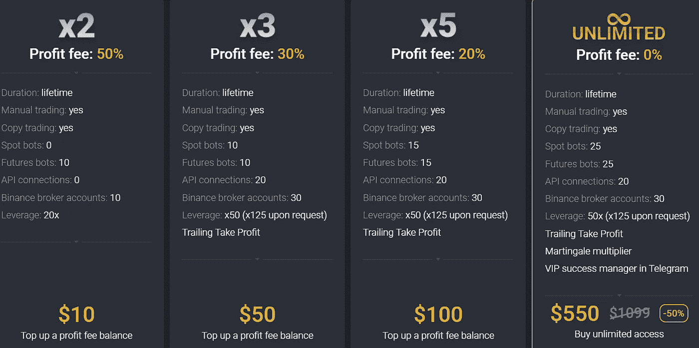

在这种利润分享模式中，平台可以免费使用，要么支付固定的利润费，要么支付一次性的终身费用。例如，一个 10 美元、利润为 50%的 x2 套餐允许您访问该平台，直到您获得 20 美元的利润，之后订阅将被耗尽。因此，在向 Jet-bot 预付 10 美元并获得 20 美元的收入后，您将获得 10 美元的净利润，而剩余的 10 美元将与平台分享，因此有 50%的利润费。同样的原则也适用于利润更低的 x3 和 x5 产品包。如果你是一个经验丰富的交易者/希望用 Jet-bot 进行更大的投资，你可以考虑无限的套餐，让你终身使用 bot。

# 赞成的意见

*   先进的**安全指令**配置有助于在合理的范围内平均交易的进场价格，而不管市场方向如何。
*   优秀的**客户支持**。
*   **副本交易**可用——不用担心 bot 设置！
*   如果你有交易经验，并希望成为顶级交易者，喷气机器人可能是一个有利可图的被动收入来源！(顶级交易员从抄袭他们的人那里赚取 25%的利润。)

# 骗局

*   与所有投资一样，在一次糟糕的交易中，总会有损失资本的风险——确保正确配置机器人(例如，在市场走向不利的情况下，允许足够的安全指令；并设置止损。)
*   某些顶级机器人/ bot 设置可能需要相对**高的初始投资**。
*   **一个账户一次只能进行一笔期货交易**；换句话说，如果你想同时进行几笔期货交易，你需要连接一个以上的币安账户。
*   对于小投资者来说，无限 bot 的定价可能有点高。

# 最后的想法

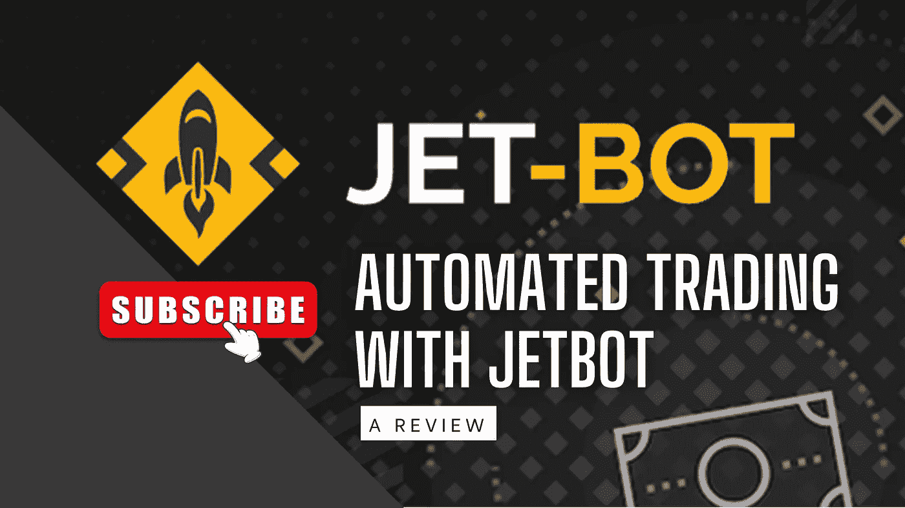

我认为， [Jet-bot](https://jet-bot.com/?fpr=l1be4) 似乎是一个非常有前途的平台，一旦配置得当，它将为交易者产生被动现金流。然而，伴随高回报而来的是高风险，即糟糕交易后的资本损失。因此，做尽职调查，做自己的研究，以确定 Jet-bot 是否是一个适合你的投资偏好和风险承受能力的交易机器人。

[**在这里注册 3 天免费试用期**](https://jet-bot.com/?fpr=l1be4) ，拥有完整的 bot 功能和演示资金！

请继续关注关于配置 Jet-bot 的深入概述的未来文章，以及对我与 Jet-bot 的交易组合的回顾。

# **喷气机器人资源**

[电报聊天](https://t.me/global_traders_protocol_chat) [电报频道](https://t.me/global_traders_protocol_channel) [推特](https://twitter.com/gt_protocol) [媒体](https://global-traders-protocol.medium.com/) [Youtube](https://www.youtube.com/channel/UCK8Vur_osEOmjODHYldO7Ug)

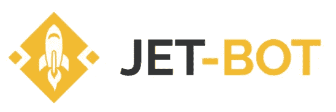

*🎁*[*honey gain*](https://r.honeygain.me/CYBER577DD)*一款被动收入 app，从你未使用的互联网带宽中赚钱。* [*免费获得 5 美元*](https://r.honeygain.me/CYBER577DD) *，无需投资。*

*🎁* [*蛋糕 Defi*](https://cakedefi.com/?ref=677920) *一站式投资平台，以高达 100%的年利率烘焙被动现金流！* [*在 DFI 用 50 美元存款获得 50 美元奖金*](https://cakedefi.com/?ref=677920) *。*

*🎁*[*Nexo*](https://nexo.io/ref/hce5cfdt5o?src=web-link)*一家先进的受监管数字资产机构，提供即时加密贷款，资产年利率高达 36%，是一家交易所，在 200 多个司法管辖区提供 40 多种法定货币的服务。* [*用 100 美元存款获得 25 美元*](https://nexo.io/ref/hce5cfdt5o?src=web-link) 奖金*。*

*🎁* [*币安*](https://www.binance.info/en/activity/referral-entry/CPA?fromActivityPage=true&ref=CPA_00BFAOLI96) *全球最大的加密货币交易所，无需介绍！*

*🎁*[*Kucoin*](https://www.kucoin.com/r/af/rJH29LZ)*一个庞大的加密货币交易所，提供有趣的产品，如赌注、自由交易机器人和比特币云挖掘服务。*

*🎁* [*火币*](https://www.huobi.com/en-us/topic/double-invite/register/?invite_code=5t5jb) *一家提供多样化产品、免费空投和交易机器人的加密货币交易所。*

*🎁* [*MEXC*](https://www.mexc.com/en-US/register?inviteCode=mexc-1NAJC) *一种加密货币交易所，拥有有趣的列表和频繁空投的 MX 令牌。*

*🎁*[*Crypto.com*](https://read.cash/@TraderFX/10-tips-to-maximize-earnings-on-honeygain-an-effortless-free-passive-income-app-68535728#bad-link)*一家位于新加坡的加密货币交易所。* [*获得 25 美元*](https://crypto.com/app/fcbsjmf5pb) *在 CRO 赌赢一张红宝石牌。*

*🎁*[*Jet-bot*](https://jet-bot.com/?fpr=l1be4)*一个高级的现货和期货交易机器人，具有复制交易功能。* [*模拟账户*](https://jet-bot.com/?fpr=l1be4) *提供 3 天试用期。*

*🎁*[*Pionex*](https://www.pionex.com/en-US/sign/ref/mWhH4v29)*一个免费的多功能套利交易机器人，自动化低买高卖的过程，全天候。*

*🎁* [*一键资本*](https://app.onebutton.capital/sign-up?ref=X%2Bak1CB1aLL2Cg1g&s=MjAtMA%3D%3D) *一个由神经网络驱动的 AI 机器人，它在自动驾驶仪上管理你的加密货币投资组合。*

***针对马来西亚投资者***

*🎁*[*Luno*](https://www.luno.com/invite/EDXG2X)*在 BTC 用 100 令吉购买 BTC 获得 25 令吉奖金！*

*🎁* [*斯塔沙威*](https://www.stashaway.my/referrals/kenleel9jx) *获得 6 个月免费投资！*

*🎁Wahed code 'KENLIE1' RM10 注册奖金*

*🎁Capbay P2P 代码' 8879c6' RM100 注册奖金*

*🎁* [*亦然*](https://download.versa.com.my/1bAf/referral?deep_link_value=QF218MMB) *用 100 令吉存款获得 10 令吉奖金！*

*🎁***存款 250 令吉获得 10 令吉奖金！**

****接我*** [***中***](https://cybery.medium.com/)***|***[***read . cash***](https://read.cash/r/TraderFX)***|***[***YouTube***](https://www.youtube.com/c/SmartInvestingChannel)***|****

> ***交易新手？尝试[加密交易机器人](/coinmonks/crypto-trading-bot-c2ffce8acb2a)或[复制交易](/coinmonks/top-10-crypto-copy-trading-platforms-for-beginners-d0c37c7d698c)***