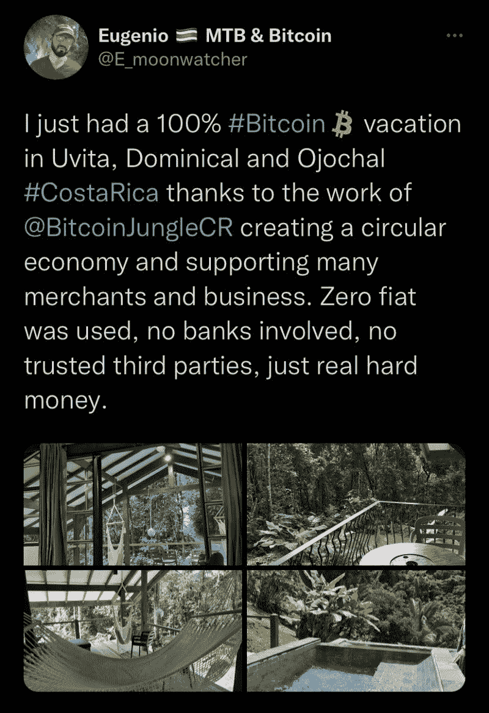

# 如何使用比特币在哥斯达黎加享受一个令人惊叹的假期？

> 原文：<https://medium.com/coinmonks/how-to-enjoy-an-amazing-holiday-in-costa-rica-using-bitcoin-b35a6e298a32?source=collection_archive---------37----------------------->

How to enjoy an amazing holiday in Costa Rica using Bitcoin.

一个装满比特币的加密钱包和一个旅行计划能得到什么？一个美妙的假期。

自 2009 年中本聪向公众推出比特币以来，许多人质疑比特币在现实世界中的使用情况。加密货币是如何工作的？许多人不知道，而且在很长一段时间里，普通大众都不知道它的真正潜力。用加密货币交换商店或精品店中的产品的想法可能不会出现在许多人的脑海中。

但如今比特币的接受度和使用量都在增长。有更多的商店，你可以交换商品或支付服务的密码。

哥斯达黎加太平洋海岸作为比特币热点越来越受欢迎。有一个初露头角的社区，人们愿意用密码交换大量的产品。你可以支付食品费用，享受五星级晚餐等等。据 CoinTelegraph 报道，哥斯达黎加的多米尼克、乌维塔和奥乔哈尔镇以比特币丛林而闻名，这是一个受比特币海滩启发的项目，也是一个不断增长的[加密社区。](https://t.me/valorexchangecommunity)

许多加密爱好者参观了这个小镇，因为它在全球加密社区中越来越受欢迎。

哥斯达黎加不是唯一可以享受加密货币的地方。太平洋沿岸以外的更多人和商店愿意交易密码。

越来越多的人采用加密货币正在影响全球。越来越多的国家和商店允许人们在线交换他们产品的密码。今天你可以使用比特币在全球许多国家进行交易，甚至在非洲。非洲大陆的加密用户数量相当于一些国家公民数量的总和。

一些金融机构也考虑涉足密码行业。这是因为区块链技术无可否认的有用性。

你如何开始？嗯，你需要知道如何开一个比特币账户。

## 如何开设比特币账户？

首先，你需要一个有效的电子邮件账户和电话号码，然后你就可以继续操作[创建账户了。](https://account.valorexchange.com/)完成设置过程后，你会自动拥有一个比特币钱包。这正是在 ValorExchange 上开设比特币账户的方法。

在那里，你今天可以获得比特币，或者将你的法定货币兑换成平台上的其他加密货币。您可以发送和接收任意数量的加密货币，因为这是您的账户和您的选择。

你还可以进行全球资金转账，购买衣服或其他物品，并用比特币、以太网或 USDT 支付。

> 交易新手？试试[密码交易机器人](/coinmonks/crypto-trading-bot-c2ffce8acb2a)或[复制交易](/coinmonks/top-10-crypto-copy-trading-platforms-for-beginners-d0c37c7d698c)