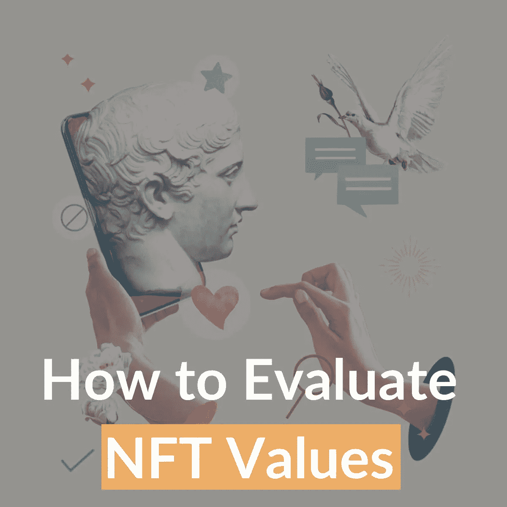
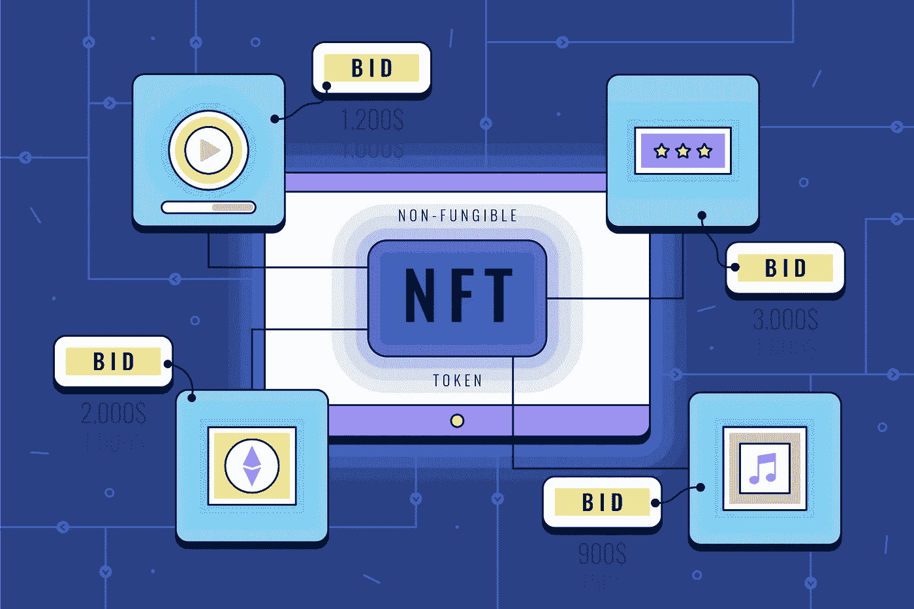

# 如何评价一个 NFT 的价值？

> 原文：<https://medium.com/coinmonks/how-to-evaluate-the-value-of-an-nft-d4078f1a98ba?source=collection_archive---------24----------------------->

NFT 是一个新的领域，最近引起了公众的极大关注。所以，测量 NFTs 的值，并不是像正常计算那样，大家都会很熟悉的常识。因为我们无法将评估私营公司或传统投资工具(如股票)的流行指标应用于非上市公司。

最后一个买家的付款可以产生一些关于价值的提示。然而，几乎不可能预测下一个买家可能支付的价格。因此，卖家和买家都主要依靠猜测。它会逐渐导致对 NFT 价值观缺乏控制。

 [## NFT 为假人解释道

### 作为一个交易者，利用更传统的交易工具——如股票、商品、期权或期货——进行…

medium.com](/@libraryoftrader/nft-explained-for-dummies-f8a53cdc1e28) 

例如，一件 NFT 艺术品可能会在一段时间内受到买家的追捧，他们认为这是一件独特的艺术品，在不久的将来可能会产生价值。然而，它不可能是一种随着时间而增值的美酒，但 NFT 艺术品的价值与波动性密切相关。

所以，拐弯抹角地得出 NFT 值不可测量的结论？不，当然不是！同意很难评估非功能性测试的价值，但这并不意味着我们不能。

本文将带您了解专业人士推荐的评估 NFTs 的一些基本方面。衡量和预测 NFTs 的潜在增长是至关重要的，因此您可以及时做出决策。

# 哪些因素决定了 NFTs 的价值？

*Learning to evaluate NFTs is crucial to earning high profits from NFTs.*

# 很少见吗？

人们想要 NFT 是因为它的独特性和稀有性。但是我们怎么知道 NFT 的稀有程度呢？

如果你在别处找不到 NFT 的艺术品，或者经销商非常有限，你可以给 NFT 的艺术品贴上稀有的标签。著名的插图画家或艺术家制作独特的艺术作品，可以被认为是罕见的非艺术作品。因为相关的代币是由顶级名人铸造的。

毫无疑问，稀有因素可以为这些非功能性交易带来很多内在价值。NFT 越稀有，它的价值就越高。

# 适应性强吗？

*Adaptable NFTs have higher values than the opposite ones.*

在稀有之后，我们现在需要考虑效用。想象一下，你可以拥有一件稀有物品，但它很难使用，那么 NFT 的价值就会下降。例如，NFTs 的效用表现在被用于标记房地产、贵金属、虚拟土地和游戏资产。tặng·蒂姆·triệu·尤·thương！！！！

 [## NFTs 的未来:幻想还是乐观？

### 非专利技术已经上升到投资者和投资者最值得考虑的投资项目

medium.com](/coinmonks/the-future-of-nfts-illusions-or-optimism-a95f7520786e) 

NFT 的价值可以从其固有特征中提取，然后基于重要项目的效用和社区力量而增长。诸如虚拟地块之类的分散式非功能性交易是这种代币的突出例子。

# 是有形的吗？

一旦 NFT 与现实世界的物体联系在一起，它就必然与某种有形的元素联系在一起。有形中的价值建立在区块链所有权的不变性上。NFTs 可以有效地表明所有权，并消除欺诈活动的可能性。

长期和短期交易都将有利于持有有形价值的非上市公司。一些像门票这样的非功能性交通工具可能有截止日期；与此同时，其他人可能会随着时间的推移变得更有价值。

# 有可能交换信息吗？

NFT 的价值主张之一是其在各种应用中使用令牌的适应性。例如，如果你可以在不同的游戏中使用相同的武器，这意味着该武器有更多的机会成为增值令牌。

 [## 2022 年更新的被动收入最佳的 15 家非正规金融机构

### 什么是 NFT 硬币？

medium.com](/@libraryoftrader/top-15-best-nfts-with-passive-income-updated-in-2022-8368cd5971eb) 

开发人员必须构建一个巨大的应用程序网络，在这个网络中令牌是可用的。如果 NFT 缺乏互操作性，它的用户就不能享受功能的集成和在交易方面切换游戏或网络时的便利。

# 是在社交媒体上验证的吗？

社会证明是决定非物质文化遗产价值的决定性因素之一。推特或 Instagram 上的 NFT 简介可以支持对其可接受性的衡量。关注者的数量可以看出它是否能为自己创造坚实的基础。如果数字很低，还不行！否则，这个社区就足够大了。

从你所考虑的 NFT 周围的人那里得到暗示也是至关重要的。社会证明能告诉我们，一般来说，人们是如何评价这个项目的。因此，你会发现决策过程更容易。

# 所有权历史中是否明确？

*Tracking the ownership history of an NFT can help you determine its value better.*

NFT 的发行者和以前的所有者也会影响它的价值。例如，如果[NFT 是由知名人士或公司实体铸造的](/@libraryoftrader/what-does-minting-nft-mean-everything-you-need-to-know-c14e94e707dd)，他们可以利用高所有权历史价值。因此，NFT 的价值主张可以通过与在非关税壁垒问题上具有强大品牌价值的人或企业合作而得到提升。

 [## NFTS 是什么时候开始的？它会在加密崩溃中结束吗？

### NFT 开始的时候并不是它的黄金时代。然而，它没有花很长时间就达到了高潮。本文展开…

medium.com](/@libraryoftrader/when-did-nfts-start-will-it-end-amid-the-crypto-crash-468d6082bb24) 

获得牵引力的方法之一是转售以前由名人或 kol 拥有的 NFT。通过市场和卖家的追踪界面，对 NFT 的所有权历史进行有价值的洞察变得更加容易。

# 是液体吗？

当然，高流动性可以为 NFT 带来更高的价值。二级市场可以是以无摩擦的方式交易符合 ERC 或 BSC 标准的 NFT 的场所。交易员和投资者倾向于将资金投入流动性更高的非金融资产，这有助于他们轻松获利。

# 是投机吗？

在交易或投资时，一个不能错过的因素是风险水平。推测 NFT 项目的价格表现图，以了解项目下资产的变化是至关重要的。因此，你可以管理你承担的风险，并制定可行的策略，以赢得最大的利润，遭受最小的损失。

# 新生的 NFT 生态系统不断自我更新

前述元素——稀有性、实用性、有形性、互操作性、社会证明、所有权历史、流动性和投机——有望简化评估 NFT 价值的过程。然而，这个概念仍然是主观的，并引起关注和讨论。

市场的波动是增加投资和价值不稳定性的另一个因素。NFT 不是钻石，所以要有耐心，冷静下来，全面考虑各种因素，做出最佳决定。

 [## 什么是多克斯 NFT？在 NFT 空间里，你会选择被解绑还是被解绑？

### 什么是多克斯 NFT？

medium.com](/@libraryoftrader/what-is-a-doxxed-nft-will-you-choose-to-be-doxxed-or-undoxxed-in-the-nft-space-6d3558527b1a) 

> 交易新手？试试[加密交易机器人](/coinmonks/crypto-trading-bot-c2ffce8acb2a)或者[复制交易](/coinmonks/top-10-crypto-copy-trading-platforms-for-beginners-d0c37c7d698c)