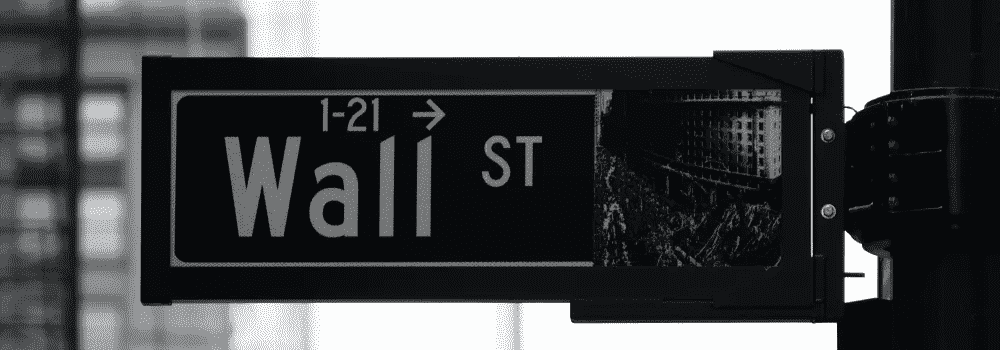

# 如何评价你的投资组合

> 原文：<https://medium.com/coinmonks/how-to-evaluate-your-portfolio-8eff47294c45?source=collection_archive---------53----------------------->

你是那种把投资组合的成功建立在回报基础上的投资者吗？虽然高回报是好事，但这并不是表现良好的投资组合的唯一指标。事实上，大多数投资者甚至从未考虑过为获得这些回报而承担的所有风险。有时候，光凭直觉或听从任何分析师的意见是不够的——相反，有必要不时评估一下你的投资组合。这意味着从各个角度。

# 评估你的投资组合意味着什么？

当你开始你的投资之旅时，你脑子里可能有几个目标。随着时间的推移，这些目标可能会改变——你可能会结婚、成家或转行。此外，你需要针对通胀评估你的投资组合。

评估你的投资组合最重要的方面是:如果整个市场的事件倾向于以同样的方式影响你的投资(当一个上涨时，它们都上涨)，你的投资组合可能不够多样化。如果你所有的投资都倾向于同时上涨，这意味着任何负面的市场事件都可能导致你的投资一起触底，抹去你可能已经取得的任何进展。

# 那么，最好的投资组合评估方法是什么呢？

快速搜索会返回几十个工具，你可以用它们来评估你的投资组合。这里有几种方法可以做到:

# 1.使用在线投资组合评估工具

这些工具很方便，因为它们为你做了所有的计算，只有一个问题——你可能需要手动输入所有的投资。有些工具可以让你上传投资的电子表格，但如果你没有，这可能需要一些时间，取决于你有多少投资。如果你不想使用在线工具，你也可以找一家提供全方位服务的公司进行投资组合评估。

在线工具将你的投资分为不同的资产类别，如股票或债券，也可以按行业分类，如科技或工业。虽然确切的行话不一定重要，但重要的是你的投资组合不要过于集中在一个类别或部门。分散投资组合是抵御市场动荡的关键。

# 2.看看你投资组合的整体表现

如果这是你第一次评估你的投资组合，看看它的整体表现。整体表现如何？与指数或交易所交易基金相关？如果你的投资组合中科技股比重较大，那就将其与纳斯达克指数进行对比。此外，审查你的投资的市盈率，或 P/E 比率，股息收益率和预期增长。

# 3.单独看待每一项投资

假设你的投资组合是股票、债券和交易所交易基金的混合。看看每个类别在投资组合中的权重，并评估每个类别的分配情况。

股票配置要从个人角度来看。例如，你持有的股票的市盈率是多少？他们都来自位于美国的公司吗？分散投资，持有一些全球股票不会有什么坏处。最后，你的个人信仰也应该发挥作用。例如，如果你对人类利益部门有强烈的感觉，你可以投资那些符合你个人观点的公司。

你的债券投资可以产生稳定的收入，这也是投资组合经理通常建议这些投资作为全面投资组合的一部分的原因之一。今天的许多投资者不知道的是，你从债券中获得的最大回报来自于你债券利息支付的再投资。你应该有一个再投资的计划。

添加替代投资，如部分房地产(wink wink)，可以作为投资组合回报的整体稳定器。

最后，你的投资组合应该包括共同基金或交易所交易基金(ETF)。确保你评估他们在一段时间内的表现，就像你评估其他投资一样。审查基金经理的任期也没有坏处。他们的历史是怎样的？另外，基金本身是否足够多元化？你的共同基金在某些领域有重叠的倾向吗？

# 4.管理费是多少？

如果你的投资组合经理收取过高的费用，它会扼杀你可能看到的任何回报。尽管如此，如果你投资组合中的一只基金持续跑赢指数，即使扣除费用，当你看到更高的回报时，支付更高的费用也不是一笔坏交易。但不要付给你的投资组合经理高于指数基金本身要求的百分比，尤其是在基金表现不佳的情况下。

# 5.考虑你的长期目标

毕竟，你的投资可以为成功的未来铺平道路。一旦你回顾了上面概述的所有方面，是时候从“它符合我的长期目标吗？”的角度来看这个问题了

首先，你的长期目标是什么？接近退休年龄的投资者通常与刚开始工作的人有不同的资产配置。接近退休的人有几十年的时间来调整他们的投资组合，而 20 多岁的人有足够的时间来观察什么可行，什么不可行。

然后，决定你愿意在游戏中投入多少皮肤。哪些市场事件或经济发展让你感到恐惧？如果你担心即将到来的衰退，那么更多地投资于大宗商品，如黄金、白银或房地产，比将一生的积蓄投入股市要好。金额没有百分比和分配策略重要。

# 投资组合评估是负责任投资的必要组成部分

如果你听说过“积极投资组合管理”这个术语，它意味着半定期地做上面概述的事情，并在必要时重新平衡你的投资。想想你最喜欢的家庭成员在假期做的蛋糕或馅饼——因为它的成分，味道很好(或不太好)。在你的投资组合中加入最好的“成分”也会产生最好的结果。但重要的是，你还要监控单个投资如何与你的整体投资组合相互作用。因为如果比例失调，即使是最好的苹果和肉桂也会变酸。

评估你的投资组合是帮助你提高回报和最小化风险的有效方法。让投资组合进入最佳状态，也就是“金发女郎区”,需要时间。它会随着时间而改变。如果你不确定成分的正确组合，让专家站在你这边会有所帮助，帮助你获得适合你的资产组合。

> 交易新手？试试[加密交易机器人](/coinmonks/crypto-trading-bot-c2ffce8acb2a)或者[复制交易](/coinmonks/top-10-crypto-copy-trading-platforms-for-beginners-d0c37c7d698c)