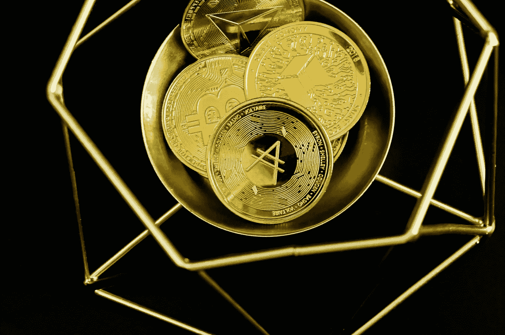
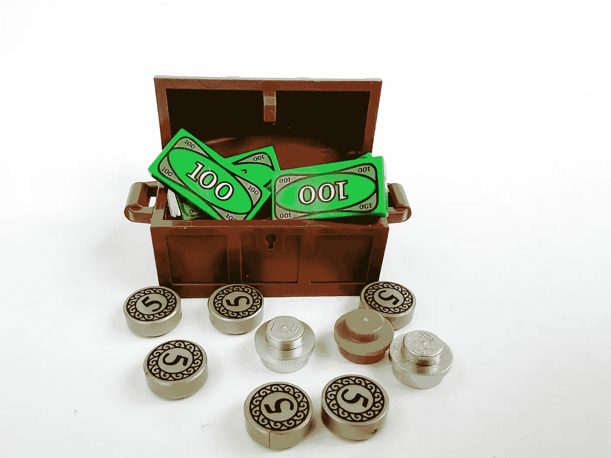

# 如何向你的祖父母解释比特币

> 原文：<https://medium.com/coinmonks/how-to-explain-bitcoin-to-your-grandparents-4545db2f09c7?source=collection_archive---------19----------------------->

比特币可能会让很多人感到困惑，尤其是你的祖父母甚至你的父母。不过别担心，我是来帮忙的！在这篇博文中，我们将用通俗易懂的语言解释比特币，并告诉你如何向你的祖父母解释它。所以请坐好，放松，继续读下去！

## 比特币是如何开始的

比特币是什么？在 20 世纪 80 年代，有一场名为“密码朋克”(Cypherpunk)的运动，他们希望使用密码学来维护他们的隐私，密码学是一门研究安全通信的学科，只允许消息的发送者和接收者查看内容。

这场运动激发了创造比特币的灵感。比特币是一种数字形式的货币，允许点对点交易。比特币是由一个人或一群人在 2009 年用假名 Satoshi Natkamoto 创造的。比特币和用法定货币(纸币)使用银行的区别，就从使用你的身份开始。

## 比特币的假名

银行在记录你账户上的存款和取款时会使用你的名字。然而，使用比特币，你的名字不会被使用，也没有像银行这样的中介将交易分配到你的名下。

需要一些东西来证明你的身份。代替你的名字，有两个密钥，由随机产生的数字和字母组成，这叫做公钥和私钥。这是你用来接收资金，管理你的账户和提取资金。

## 私钥和公钥是如何工作的:邮箱类比

这两把钥匙的工作方式就像你在街角看到的公共邮箱。任何人都可以把(输入)信件放入邮箱(使用你的公钥)，但只有拥有唯一(私钥)的人才能打开邮箱取出(输出)信件。

换句话说，你的公钥允许存款，但是你需要你的私钥来取款。首先，将生成一个私钥，然后从私钥生成一个公钥，这样两者就链接在一起了，因为它们需要一种相互通信的方式。

## 比特币的目标是四样东西

比特币旨在实现四个目标——匿名、不可信、去中心化和不可改变。通过使用您的私人和公共密钥，您可以使用假名。

比特币使用一个名为区块链的系统来验证交易的有效性，它需要大量的计算机能力来确保交易的正确性和准确性。这就像一个非常复杂的数学问题。我们称验证交易的计算机为比特币矿工。

解决这些复杂数学问题的系统叫做工作证明。因为验证交易需要大量工作，所以负责验证交易的矿工赢得了一票。有点像投票芭蕾。**与银行不同，你的数据集中在一家银行，比特币数据分散到比特币网络中的所有矿工(计算机)手中。**

需要比特币网络中的大多数计算机(通过投票)同意一批交易是准确和正确的。在网络中的大多数计算机投票决定一个事务块有效之后，该数据块被添加到所有其他块中，从而创建一个链。投票是比特币不可信的原因。

每个区块有数千笔交易。这种投票系统也被称为共识方法。区块链中的数据块不可更改。因此，如果有人篡改了一个区块中的数据，它将不会与其他矿工拥有的相同区块相匹配。

如前所述，交易需要多数票才能生效。其他比特币矿工不会有相同的数据，被篡改的区块将被丢弃。**这使得区块链的街区不可改变。**

## 你不能创造假比特币或作弊

因为共识用于验证交易，所以它防止了双重花费攻击。这是指有人试图通过多次花费相同金额的资金来欺骗系统。但是你可能会想，怎么会有人双倍消费呢？

假设你用法定货币 1 美元买了一个苹果。一旦你买了那个苹果，你就不能拿回那 1 美元并保留那个苹果。它不见了，因为你花了它。但对于数字货币来说，这并不是那么直接，人们有办法作弊，但使用网络中所有计算机的共识可以防止这种情况发生。这就是投票制度存在的原因。

另一种可能发生在数字货币上的攻击被称为 Sybil 攻击。这是当一个人试图创建多个身份，以便能够投票不止一次，但这不可能发生，因为工作证明系统使投票昂贵。

## 让比特币变得易于理解

比特币可能会让一些人感到困惑，但它实际上是一个非常简单的概念。现在你已经了解了比特币的基础知识，你可以向你的祖父母(或者其他任何有兴趣学习的人)解释一下了。如果你需要帮助解释它或者写它，联系我——我很乐意帮助你。[在这里了解我的写作服务](https://www.fiverr.com/share/GXeVEd)！

> 交易新手？尝试[加密交易机器人](/coinmonks/crypto-trading-bot-c2ffce8acb2a)或[复制交易](/coinmonks/top-10-crypto-copy-trading-platforms-for-beginners-d0c37c7d698c)