# 如何向 TurboTax 申报加密货币税(分步)

> 原文：<https://medium.com/coinmonks/how-to-file-cryptocurrency-taxes-with-turbotax-step-by-step-2ba650efea86?source=collection_archive---------21----------------------->

在本指南中，我们将一步一步地在 TurboTax 上报告您的比特币和加密货币，包括在线和桌面版本。

我可以在 TurboTax 上申报加密货币税吗？

是的，TurboTax 允许用户申报 [**加密货币税**](https://coinledger.io/crypto-taxes) 。

虽然 TurboTax 是市场上最好的税务平台之一，但重要的是要记住，它不是以加密货币为设计理念的。因此，它并不总是具备让您轻松申报加密税所需的集成和功能。

这就是为什么 TurboTax 与 [**CoinLedger**](https://coinledger.io/) 合作，帮助用户汇总和计算他们所有钱包和交易所的加密交易。然后，您可以将相关的税务表格直接导入您的 TurboTax 帐户。

如何将加密损益输入 TurboTax

以下是如何在 TurboTax 的在线版本中报告您的加密货币。

1.导航至在线 TurboTax，并选择卓越理财或自主创业套餐

前往 TurboTax Online 并选择您的套餐。Premier 和自营职业者都支持加密货币纳税申报。

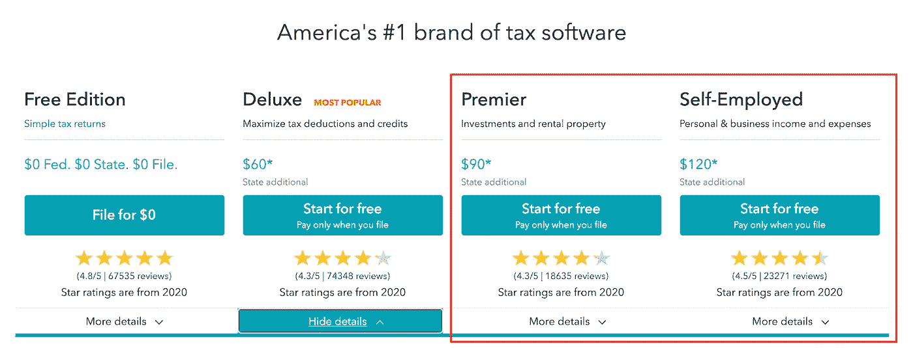

2.回答初始提示和问题

首次登录时，TurboTax Online 会要求您完成一些初始提示，并填写您的基本信息。在此步骤完成之前，您无法在应用程序中前进。

3.选择“我出售了股票、加密或其他投资”。

4.导航到加密货币部分

要进入应用程序的加密货币部分，请进入“联邦”选项卡，然后选择“工资和收入”。

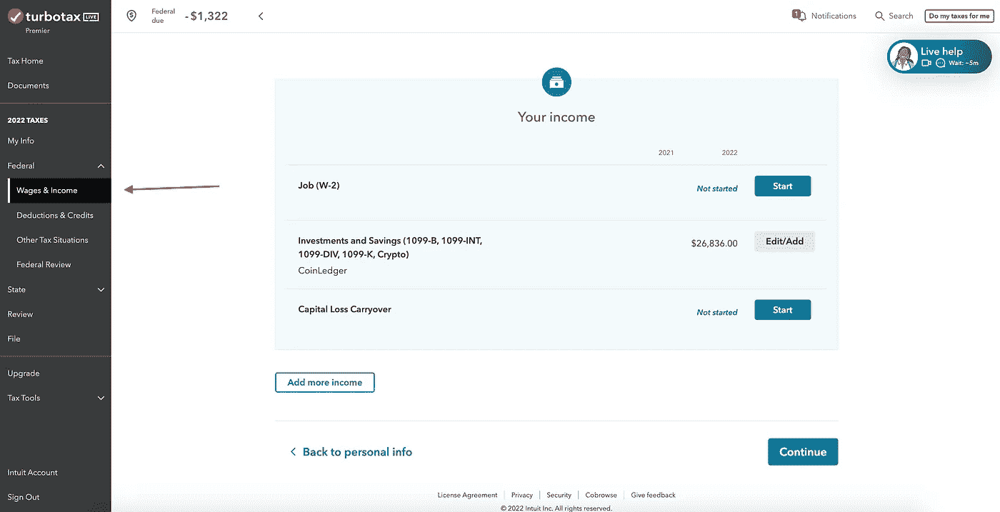

5.添加您的加密货币数据

在工资和收入中，单击开始/编辑投资和储蓄部分(这是加密货币模块所在的位置)。

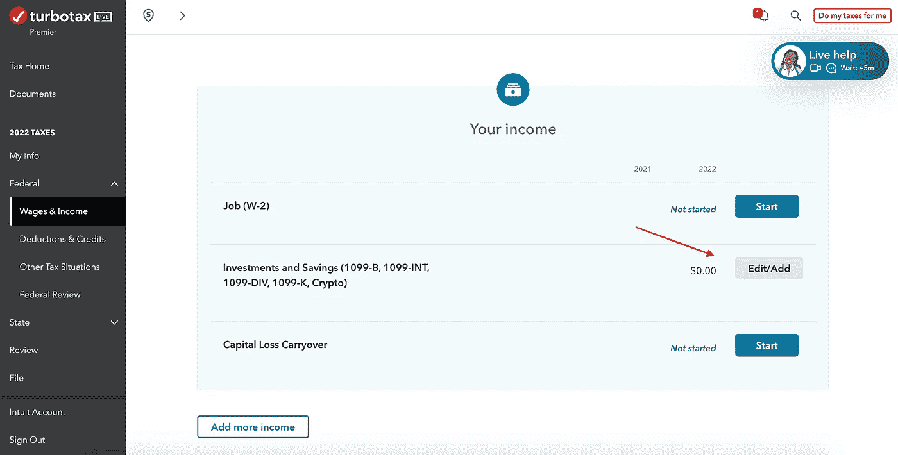

6.选择“是”即可在 2022 年获得投资收益

投资收入包括来自加密活动的收入。即使你在加密中有净损失，你也要在这里输入这些损失。

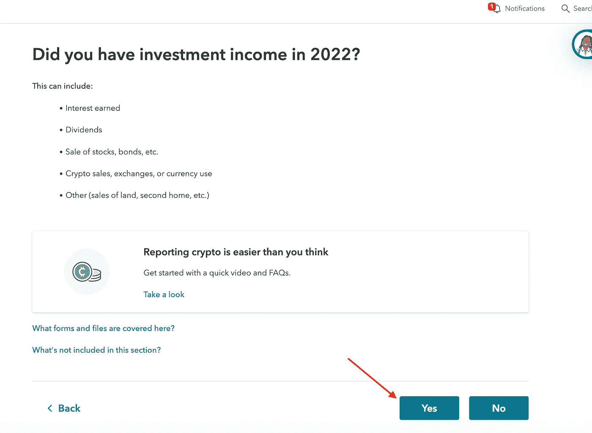

7.在税务导入屏幕上选择“输入不同的方式”

当报告你的加密收益和损失时，汇总你所有钱包和交易所的数据是很重要的，否则你可能会丢失成本基础数据，这大大夸大了你当年的资本收益。

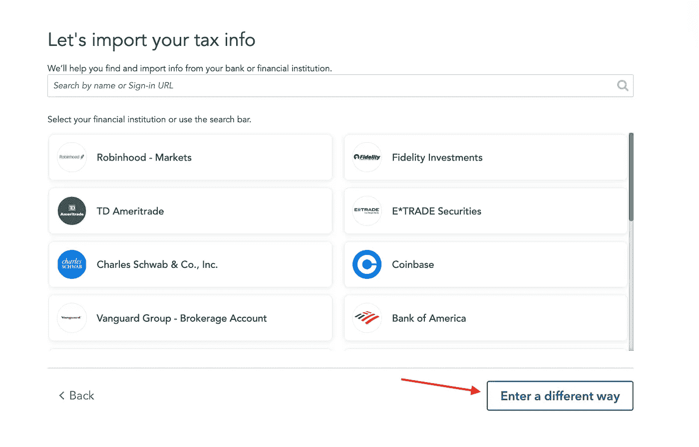

8.选择加密货币作为投资类型

选择加密货币卡并点击继续。

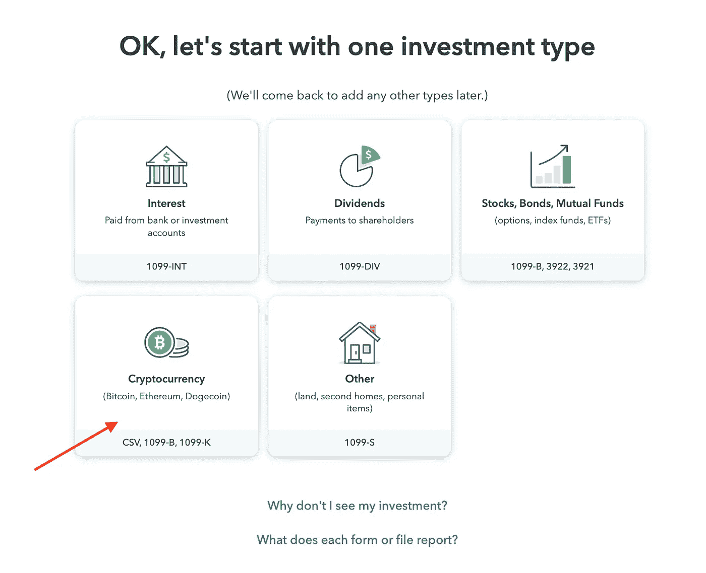

9.选择“从我的电脑上传”

选择从您的计算机上传的选项。

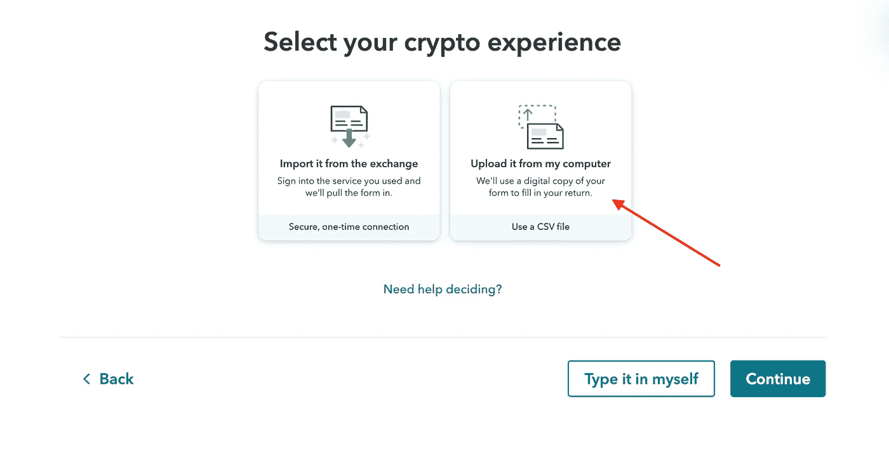

10.选择“CoinLedger”作为您的平台

从下拉列表中，选择 CoinLedger 作为导入平台，然后点击 continue。

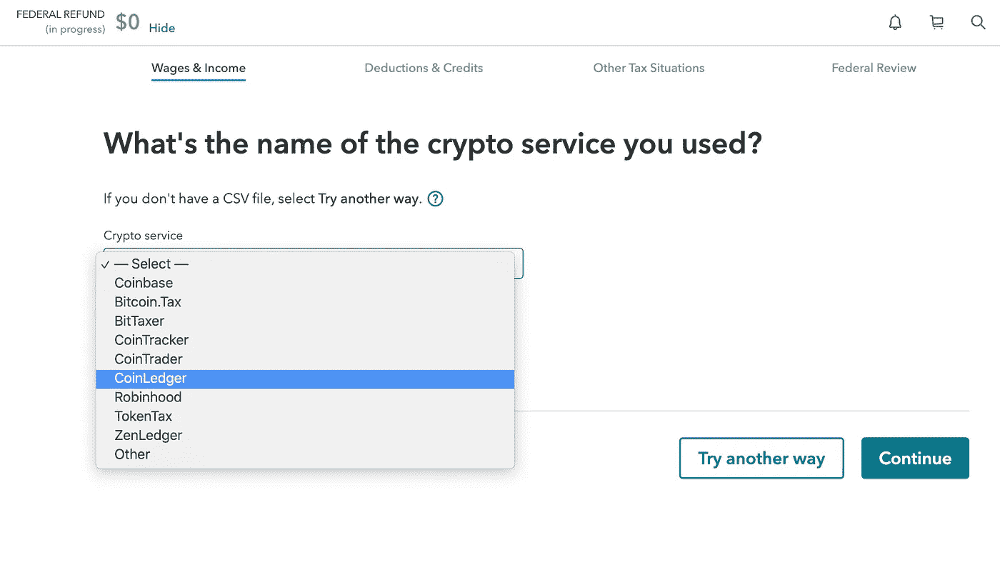

11.导入您从 CoinLedger 收到的“在线 TurboTax 文件

从 CoinLedger 中的税务报告仪表板，下载您的“在线 TurboTax”文件，然后将其导入 TurboTax。该文件包含您在所有钱包和交易所的交易活动中的加密货币总损益。

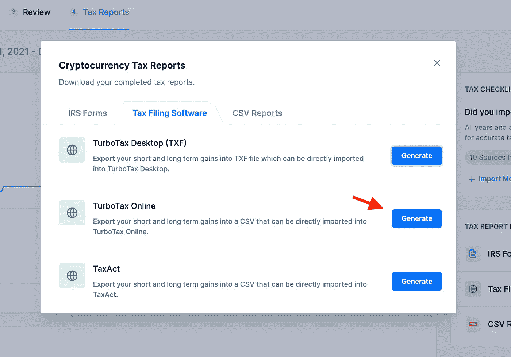

如果你还没有在 CoinLedger 中建立你的税务报告，现在是时候了。只需创建一个账户，连接您的交易所和钱包，点击一个按钮，即可生成您所需的 [**加密税务报告**](https://coinledger.io/cryptocurrency-tax-reports) 。

12.查看您的销售情况，然后点击“继续”

导入后，TurboTax 将要求您检查从 CoinLedger 导入的销售额，并选择哪些交易应纳税。CoinLedger 仅在您的报告中包含应税交易，因此您只需向下滚动并点击“继续”。

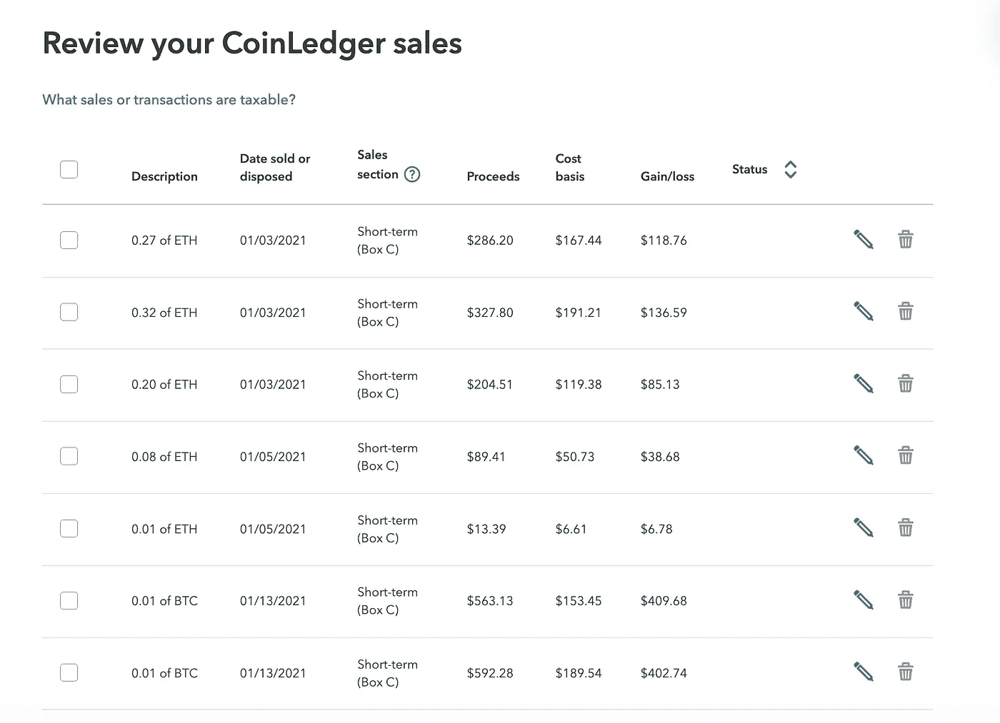

恭喜你。你已经完成了。

过程到此结束！如果你已经完成了上述所有步骤，你将能够看到你的加密收益和损失的完整记录。

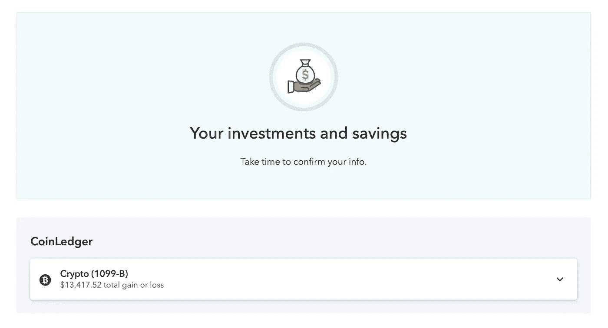

我如何用 TurboTax 报告普通加密收入(不是资本收益/损失)？

记住，上面的过程是为了帮助你报告你的资本收益和损失。如果您获得了其他加密货币收入，您必须单独报告。

此时 TurboTax 不支持直接上报 [**跑马**](https://coinledger.io/blog/staking-taxes) 和 [**矿业收入**](https://coinledger.io/blog/how-to-handle-cryptocurrency-mining-on-your-taxes) 的能力。您可以通过以下流程申报此类收入。

*   转到联邦选项卡，然后单击工资和收入。
*   找到标有“不常见收入”的行，然后单击“显示更多”。

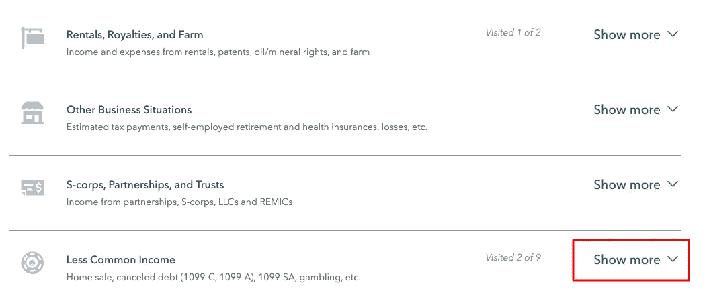

导航到标有“杂项收入”的部分，然后单击“开始”按钮。

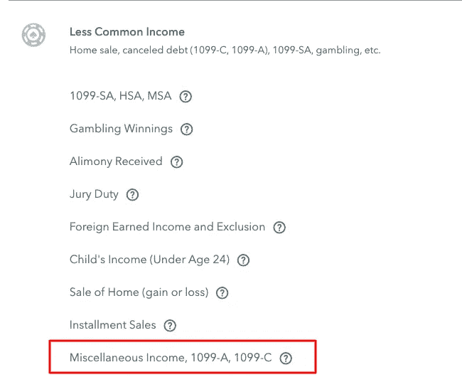

导航到最后一个标有“其他可申报收入”的部分，然后单击“开始”按钮。

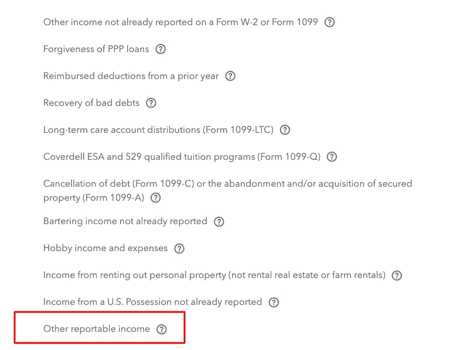

您可以在这里输入您的加密货币赌注收入、利息等的详细信息。在纳税年度期间。你可以很容易地在你的 CoinLedger 收入报告中找到你所有的“加密收入”。

# TurboTax 从比特币基地进口吗？

此时，TurboTax 允许用户从 [**、比特币基地**](https://coinledger.io/integrations/coinbase) 等交易所导入交易。

然而，重要的是要记住，如果你曾经将加密货币转移到比特币基地境外，或者在不同的钱包和交易所之间转移，那么你从比特币基地报告的资本收益可能会被大大夸大。

考虑下面的例子。

在这种情况下，TurboTax 将很难计算你的资本损益，因为它缺乏跟踪钱包和交易所之间转移的能力。

如果您曾经在钱包之间传输密码，您应该在 CoinLedger 中汇总您的所有交易，而不是将您的交易所直接连接到 TurboTax。

与 TurboTax 配合使用的最佳加密税务软件是什么？

寻找最好的 [**加密税务软件**](https://coinledger.io/) 与 TurboTax 配合使用？以下是您应该选择 CoinLedger 的原因。

**能力强:** CoinLedger [**整合了**](https://coinledger.io/integrations) **[**比特币基地**](https://coinledger.io/integrations/coinbase)[**北海巨妖**](https://coinledger.io/integrations/kraken)[**双子座**](https://coinledger.io/integrations/gemini) 和区块链 [**以太坊**](https://coinledger.io/integrations/ethereum)[**索拉纳**](https://coinledger.io/integrations/solana) 等数百家交易所和钱包。**

**获得您需要的支持:**我们知道尝试自己报税可能会有困难。如果您在使用 CoinLedger 时需要任何帮助，我们的支持团队随时准备通过电子邮件和实时聊天为我们的所有客户提供帮助。

**点击导入您的损益:**一旦您在 CoinLedger 中导入了您的加密交易历史并生成了您的 [**加密税务报告**](https://coinledger.io/cryptocurrency-tax-reports) ，您就可以点击一个按钮将它们直接导入 TurboTax 和其他税务平台！

‍ *了解更多关于*[***coin ledger 如何工作***](https://coinledger.io/product) *。*

TurboTax 桌面版加密货币税

上述步骤概述了在在线版 TurboTax 中申报加密货币税的流程。TurboTax 的桌面版*官方*不支持 crypto。因此，建议您使用在线版本进行加密纳税申报。

然而，仍然有一种方法可以将你的加密货币税收信息导入桌面版的 TurboTax。要了解更多信息，请查看这篇概述了**分步流程的文章。
‍**

**我有 4000 多笔交易怎么办？**

**目前，TurboTax Online 最多只能从特定交易所导入 4000 笔加密交易。**

**如果您有超过 4，000 笔交易，CoinLedger 将自动按资产类型合并您的 TurboTax 在线文件，以便您仍然可以导入您的交易并向 TurboTax 提交您的税款。**

**当以电子方式提交合并的 [**表格 8949**](https://coinledger.io/blog/form-8949-for-cryptocurrency) 时，您需要采取一个额外的步骤，将您完整的 8949 表格邮寄给 IRS。有关更详细的说明，请查看我们的 [**邮寄 IRS 8949**](https://coinledger.io/blog/mailing-in-form-8949-for-e-filing-cryptocurrency-traders) 指南。**

**今天就开始吧！**

**想在截止日期前申报加密货币税吗？试试 CoinLedger，这是一款加密税务软件，有 30 多万投资者用它来缓解税务季的压力。**

**[**今天就开始免费预览报告**](https://app.coinledger.io/?referrer=coinledger) 。**

**常见问题**

****turbo tax 是否计算加密收益？****

**虽然 TurboTax 可以帮助你手动计算你的加密收益，但该平台不具备与 CoinLedger 等原生 [**加密税收计算器**](https://coinledger.io/crypto-tax-calculator) 相同的功能水平。**

****我如何申报加密货币税？****

**加密货币损益应在表格 8949 上报告，而加密货币收入应根据您的收入性质在附表 1、附表 B 或附表 C 上报告。**

**如何在 TurboTax 上申报赌注和采矿收入？**

**加密货币收入可以在 TurboTax 平台中作为‘杂项收入’输入。**

****如何将我的加密货币交易格式化为 csv 格式以用于 TurboTax？****

**使用 CoinLedger，您可以下载一个 csv 文件，其中包含您在一年中的所有加密货币收益、损失和交易，该文件可以自动上传到 TurboTax。**

**TurboTax 上的加密税问题在哪里？**

**如果您在纳税年度内赚取了加密货币或处理了加密货币，您需要对表格 1040 上的 [**加密税务问题**](https://coinledger.io/blog/irs-clarifies-1040-cryptocurrency-tax-question) 回答“是”。**

***最初发布于*[*https://coin ledger . io*](https://coinledger.io/blog/how-to-file-your-cryptocurrency-taxes-with-turbotax)*。***

> **交易新手？尝试[加密交易机器人](/coinmonks/crypto-trading-bot-c2ffce8acb2a)或[复制交易](/coinmonks/top-10-crypto-copy-trading-platforms-for-beginners-d0c37c7d698c)**