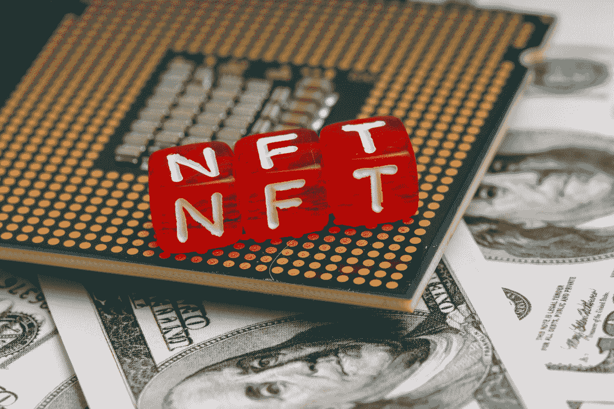

# 如何找到一个好的 NFT 项目进行投资

> 原文：<https://medium.com/coinmonks/how-to-find-a-good-nft-project-to-invest-in-b80a7e97b416?source=collection_archive---------6----------------------->

> 如何找到最好的 NFT 项目，充分利用你的投资，并进行有利可图的交易的详细指南。

投资不可替代代币(NFT)在加密货币领域迅速变得流行，因为 NFT 正在吸引投资者、艺术收藏家和加密货币爱好者越来越多的关注。

*如果你还不明白什么是 NFT 以及它们是如何工作的，请花一点时间来看看这篇文章，了解一下什么是 NFT**。*

NFT 已经成为分散金融工具的一个改变游戏规则的应用。根据报告，2021 年第三季度，该市场的交易额超过 106.7 亿美元，比上一季度增长 704%，同比增长 38，060%。

尽管这一领域有了巨大的增长，但仍有一些人不明白如何在这一领域进行有利可图的投资。

# 投资 NFTs 之前需要知道什么

起初，发现最有前途和最有利可图的 NFT 项目可能是一项挑战。然而，在选择一个值得你投资的 NFT 项目之前，有几个因素你应该考虑。

在我们进一步讨论之前，值得一提的是，在你寻找一个长期有利可图的 NFT 项目时，你可能会寻找那些有公用设施的非技术设施。

例如，随着最近 GameFi 领域的繁荣，人们可能会投资于与优质区块链游戏相关联并具有良好游戏内效用的 NFT。

投资 NFTs 不是一个应该仓促做出的决定。投资者/买家在做出 NFT 投资决策时，应该注意很多事情。

# 寻找优质的 NFT 项目

有几条路线可以让你找到你想投资的 NFT，有几条是:

**关注受欢迎的 NFT 收藏家**——识别你可能投资的可靠 NFT 项目的一个方法是关注 Twitter 或 Instagram 上的秘密名人，并在他们赞助的 NFT 项目中寻找他们的用户名。大型 NFT 买家和收藏家通常是最先了解新项目的人。

例如，在一年前成功推出[德戈斯 NFT](https://magiceden.io/marketplace/degods) 系列后，[弗兰克德戈斯](https://twitter.com/frankdegods?ref_src=twsrc%5Egoogle%7Ctwcamp%5Eserp%7Ctwgr%5Eauthor)最近发布了一个名为 [y00ts NFT](https://www.y00ts.com/) 的 NFT 系列。

投资者很快就抓住了最新的系列，因为 Frank 已经因为是 Solana 区块链最大的 NFT 系列之一 [degods](https://magiceden.io/marketplace/degods) 成功背后的大脑而闻名。

**寻找目前有趋势的项目** —考察目前票房收入高、需求大的 NFT 项目是寻找可靠的 NFT 投资项目的另一种方法。这可以通过在 [OpenSea](https://opensea.io) 、 [CryptoSlam](https://cryptoslam.io) 和 NonFungible 上执行 NFT 项目的卷搜索来完成。

你也可以通过使用高端平台，如 [icy.tools](https://icy.tools/) 、Nansen 和 [Moby.gg](https://moby.gg/) ，在最后一刻发现喜欢的项目。

**加入一个社区**——另一个获得 NFT 优质项目最新信息的方法是留意并加入一个 NFT 社区。你可以在 Discord、Twitter 或 Telegram 上找到这些社区。

目前，在 NFT 地区，有几个被称为 DAOs(分散自治组织)的社区试图为他们的社区成员发出良好的 NFT 呼声。这些众所周知的 NFT 论坛大多数都是不和谐的，不自由的。有些社区可能会收取订阅费，或者要求您拥有一个 NFT 才能享受会员权益。

然而，你可能会在 Twitter、Telegram 或 Discord 上寻找仍然提供高质量信息的免费社区。

寻找 NFT 项目的其他方法 —有更多的方法来确定可靠和可行的 NFT 项目。利用 Launchpads，NFT 聚合器(聚合网站，如 Solana 的 [HowRare.is](https://howrare.is/) ，以太坊的 [Rarity Tools](https://rarity.tools/) 和 [NFT 日历](https://nftcalendar.io/))，Minting Monitors(如 [icy.tools](https://icy.tools/) 和 [whatsminting.live](https://whatsminting.live/) )，以及利用稀有工具(如 [freshdrops.io](https://freshdrops.io/) )寻找项目就是几个例子。

你也可以跟踪并密切关注某个你认为非常有利可图的 NFT 收藏家的钱包地址，并购买他们购买的任何东西。你不需要他们的许可就可以这么做，因为区块链上的交易是完全公开透明的，允许你追踪任何你想追踪的钱包地址，查看他们持有的 NFT 资产。

# 最后的想法

最好的做法是确保你留意那些经得起时间考验的高质量 NFT 项目，不管你投资 NFTs 的唯一动机是为了盈利，还是你只是喜欢数字艺术，想开始收藏。这是因为，即使作为一个只是为了美学价值而购买艺术品的数字艺术收藏家，你可能会在某个时候选择出售这样一件作品，如果它没有市场价值，那可能是一个挑战。

> 如果你还有任何问题，请留下评论，或者更好的是，在 Twitter 上直接给我发消息( [@lanre_aderemi](https://twitter.com/Lanre_aderemi) )，我会尽快回复。感谢您的阅读，如果您能为我鼓掌，那就太好了！

不要忘记点击“关注”按钮查看更多类似的故事；——)

> 交易新手？试试[加密交易机器人](/coinmonks/crypto-trading-bot-c2ffce8acb2a)或者[复制交易](/coinmonks/top-10-crypto-copy-trading-platforms-for-beginners-d0c37c7d698c)