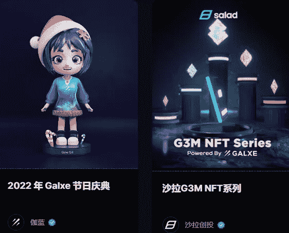
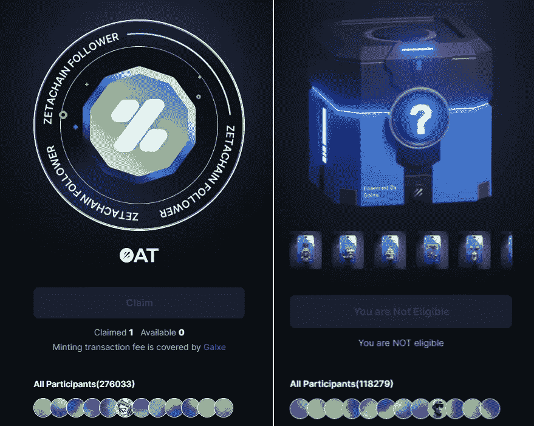
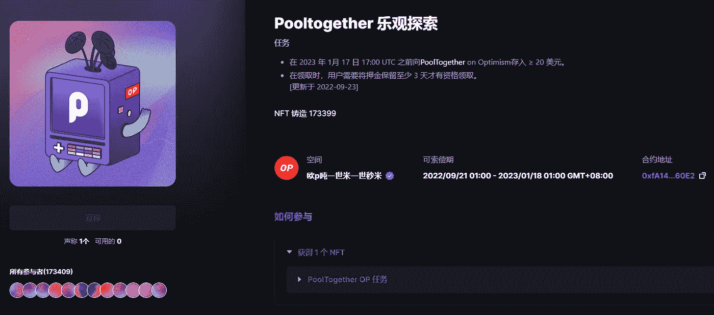
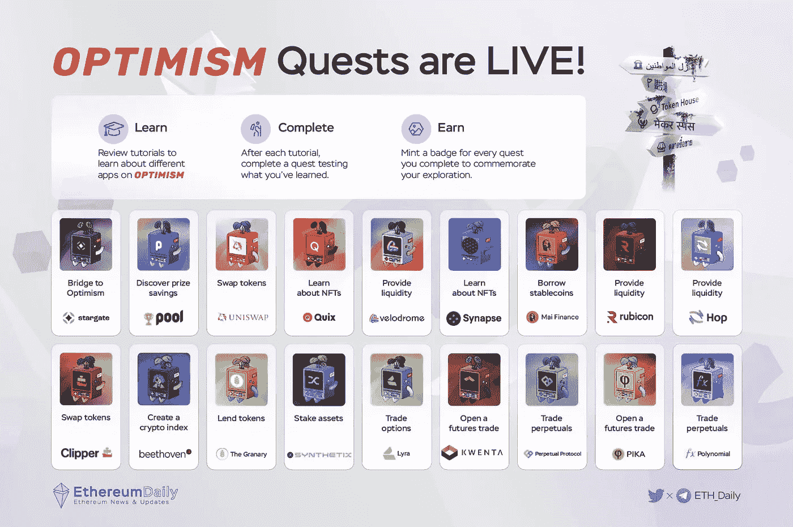
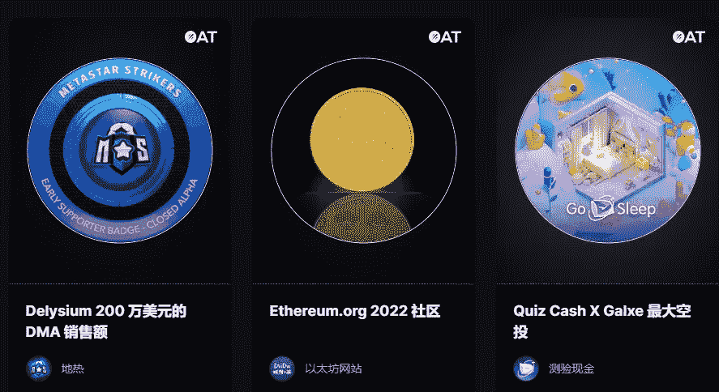
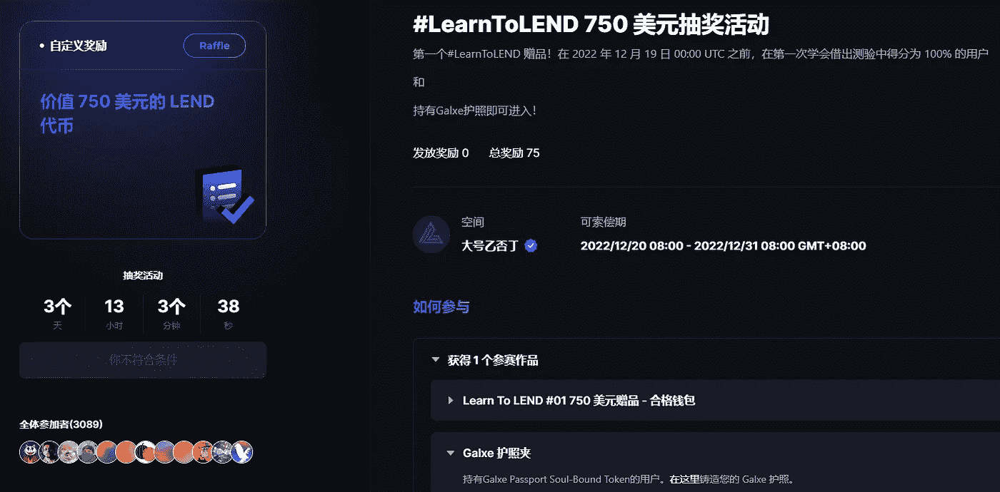
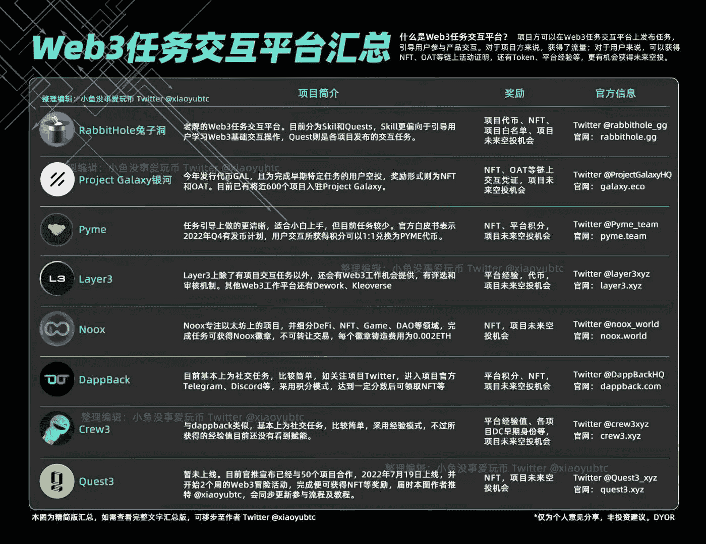

# 如何从 Web3 任务平台 Galxe 寻找空投机会？

> 原文：<https://medium.com/coinmonks/how-to-find-airdrop-opportunities-from-web3-task-platform-galxe-89476cbe3198?source=collection_archive---------3----------------------->

最近在做乐观 Quests，对 web3 任务平台 Galxe 有了更深的理解。

在 web2 网络中，完成一定的任务会获得一定的奖励或积分；在 web3 网络中，完成相应的任务将获得 NFT 或项目空投机会。

Galxe’s ongoing quests

【Galxe 是做什么的？

Galxe 是一个 Web3 凭证数据网络和任务平台。记录用户在链上的交互行为，完成交互后获得代金券 NFT。

比如某个协议第一次开始贡献流动池，或者链上投票，或者关注某条推文并点赞转发，都会被记录保存，获得相应的证书。

用户完成体验项目的任务后，将获得项目空投或奖励；并且在不断的交互行为中，他会不断积累自己的数字身份，获得相应的数字证书。

> 不知道什么时候买卖，试试[复制交易](http://coincodecap.com/go/bityard)。

项目方通过 Galxe 平台获取精准用户，起到促进项目早期发展的作用，快速向目标用户推荐产品和功能。

Participation in some tasks is very popular

**如何做 Galxe 任务？**

Galxe 中有各种正在进行的任务，完成后将收到 NFT 作为凭证。

常规任务包括关注 Twitter、转发、点赞、加入社区，以及具体的项目互动，如交流、认捐、租借、选角等。对于项目经验。

比如乐观互动任务，完成任务后可以领取 NFT，这些互动动作可能会作为明年 2 月 OP 空投的凭证之一。

其中一项任务是共同探索。用户需要在 PoolTogether 中存入 20 美元以上，并在质押 3 天后认领。

完成操作后，您可以在 Galxe 中获得一个 NFT。超过 170，000 辆 NFT 为这项任务铸造。

OP Quest Pooltogether Exploration

乐观互动任务 18 个，已铸就超过 190 万 NFT，人气极高。

OP 空投第二期已经公布，明年 2 月空投。目前还是可以互动的，截止时间是明年 1 月 18 日。

Complete the OP interactive task to receive NFT

除了 NFT 任务，还有燕麦、抽奖等活动；还有各种链条、不同赛道的各种项目活动。

使用 Galxe 作为 web3 任务平台，通过平台了解和熟悉各种推进的 web3 项目，也是一个很好的方法。

Various tasks on Galxe

**做 Galxe 任务有什么用？**

在 web3 生态中，项目需要更多的用户体验早期的产品功能和用户数据，每一次体验和交互都可能带来未知的反馈。例如，当 Uniswap 推出 UNI 时，它向早期平台上的交易用户空投了不同数量的 UNI。

在 Galxe 上，一个钱包账号绑定了一个 Twitter、DC、TG、邮箱等身份信息，这是用户的数字身份信息。

通过平台完成任务，关注项目，体验产品，完成了一套交互，对于项目方、用户、平台来说，是一个多赢的局面。

Cash Draw Mission

**如何参与和了解 web3 项目？**

熊市没有大行情，BTC 价格继续在低位徘徊。不如多了解一下行业的玩法，看看各种项目是如何推广的，如何用科技改变生活。

除了 Galxe，还有其他的 web3 任务平台，比如最早的 rabbit hole RabbitHole，以及 Layer3、Crew3、Quest3 等新平台。

可以关注某个平台，继续跟进某个项目，有可能在里面发现下一个牛市的黑马项目。

Each Web3 task platform

熊市漫漫，只有继续做功课，才能提高意识，发现机会，才能埋伏好下一轮牛市腾飞的项目。

以上只是我个人观点，没有投资建议。我是楚小莲，我正在关注元宇宙和 web3。

> *加入 Coinmonks* [*电报频道*](https://t.me/coincodecap) *和* [*Youtube 频道*](https://www.youtube.com/c/coinmonks/videos) *了解加密交易和投资*

# 另外，阅读

*   [3 商业评论](/coinmonks/3commas-review-an-excellent-crypto-trading-bot-2020-1313a58bec92) | [Pionex 评论](https://coincodecap.com/pionex-review-exchange-with-crypto-trading-bot) | [Coinrule 评论](/coinmonks/coinrule-review-2021-a-beginner-friendly-crypto-trading-bot-daf0504848ba)
*   [莱杰 vs n rave](/coinmonks/ledger-vs-ngrave-zero-7e40f0c1d694)|[莱杰 nano s vs x](/coinmonks/ledger-nano-s-vs-x-battery-hardware-price-storage-59a6663fe3b0) | [币安评论](/coinmonks/binance-review-ee10d3bf3b6e)
*   [加密交易机器人](/coinmonks/crypto-trading-bot-c2ffce8acb2a) | [Bingbon 审查](https://coincodecap.com/bingbon-review)
*   [Bybit Exchange 评论](/coinmonks/bybit-exchange-review-dbd570019b71) | [Bityard 评论](https://coincodecap.com/bityard-reivew) | [Jet-Bot 评论](https://coincodecap.com/jet-bot-review)
*   [3 commas vs crypto hopper](/coinmonks/3commas-vs-pionex-vs-cryptohopper-best-crypto-bot-6a98d2baa203)|[赚取加密利息](/coinmonks/earn-crypto-interest-b10b810fdda3)