# 如何找到您的 NFT 元数据

> 原文：<https://medium.com/coinmonks/how-to-find-your-nfts-metadata-c2d058626fb8?source=collection_archive---------3----------------------->

It can be harder to find than this cat at times

到目前为止，我们都听说过 NFTs。虽然交易量下降很糟糕，就像平均投资组合一样(至少我们没有 Saylor 或 Nayib 水平下降很糟糕)，但 NFTs 仍然是一项有前途的技术。

证明对数字资产的所有权不仅仅是在 Twitter 上摇摆 PFP。证书、访问密钥甚至身份，很多都可能与 NFTs 相关联。🔑

但是有几件事需要考虑，很少有人谈论的一件大事是元数据。这可能没有用你的精神健康和财富去换取 JPEGs 图片那么性感。现在想象一下，如果 Jpeg 不再显示并导致一个断开的链接呢？

很难用错误 404 给随机的路人留下深刻印象。

**那么让我们来谈谈元数据**

元数据只是关于数据的数据。一个常见的误解是，你的 NFT 是艺术。但在大多数情况下，事情有点复杂。很少有 NFT 艺术作品被储存在链条上(艺术块是一个例外)。如果你支付过以太坊的煤气费，你就会知道为什么了。💸

在大多数情况下，图稿文件存储为一个链接，指向可以找到图像的另一个位置。

想象一下，有人刚刚在他们的 Dropbox 或 GoogleDrive 上添加了一个链接；一旦那个人删除了，你的图像就没了。祝你好运，尝试出售一个链接到破损页面的令牌。

如今，当创作者使用他们的铸造工具时，大多数 NFT 市场会自动将文件上传到分散存储解决方案，如或 [Arweave](https://www.arweave.org/) 。这已经比依赖一个集中的位置好得多了。

但正如他们所说，在 crypto 中， ***“信任，但要验证。”***

当然，我们相信 NFT 的创作者总是把我们想得最好，但我们也喜欢弄清楚我们的元数据说了什么，我们的作品存储在哪里(因为说实话，我们并不太关心 tokenID 或其他值)。

> 注意:对于这个任务，使用一个本地支持 IPFS 的浏览器(如 Brave 或 Opera)或获得一个扩展会有所帮助。如果你想一路进入书呆子的领地，请随意下载并在你自己的设备上运行 IPFS。

## 在 OpenSea 上查找元数据

最大的 NFT 市场是 OpenSea 那是我开始的地方。我访问了我拥有的一个 NFT 的页面，很快注意到元数据不是一个容易找到的东西。

但是有一种方法(是的，这需要使用 API，如果我能做到，你也能做到)。

1.  记下联系地址和令牌 ID。这些可以在 NFT 页面的详细信息下找到。

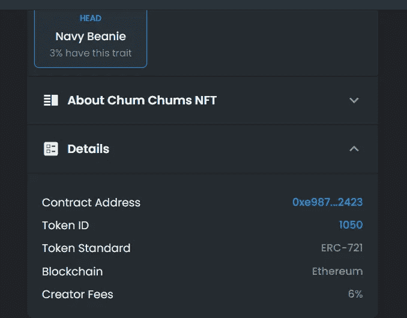

2.现在，在以下链接的字段中添加合同地址和令牌 id:[https://api.opensea.io/asset/contract/tokenid](https://api.opensea.io/asset/contract/tokenid)

对我来说，那就是:[https://api.opensea.io/asset/](https://api.opensea.io/asset/contract/tokenid)0xe 987 e 9 b 07 ca 431 Fe 0 c 7 E8 f 431 fa 4 f 94 ab 9 ca 2423[/](https://api.opensea.io/asset/contract/tokenid)1050

3.运行它，您会得到如下所示的内容:

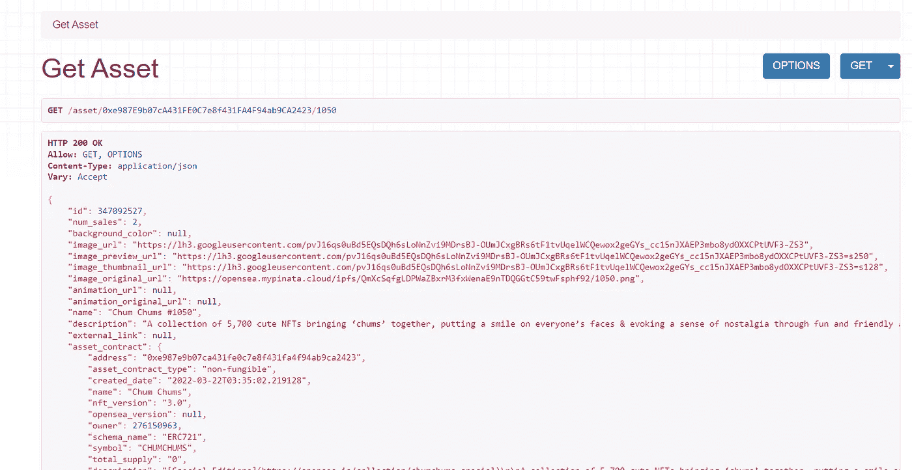

这是您的 NFT 的元数据。正如您所看到的，它包括了对集合和图像 URL 的描述。作为视觉人，我们关心的是。如果愿意，您可以获取该图像 URL 并在浏览器中打开它。它会向你展示你的艺术。

恭喜你。您已经获得了 NFTs 元数据。90%的 NFT 买家都懒得去想这个问题。😼

当然，OpenSea 不是唯一的市场。所以让我们看看另一个选择。

## 在基础上查找元数据

*剧透预警:*比在 Opensea 上容易多了；不需要 API。

你需要做的就是:

1.  转到 NFTs 页面
2.  向下滚动到详细信息

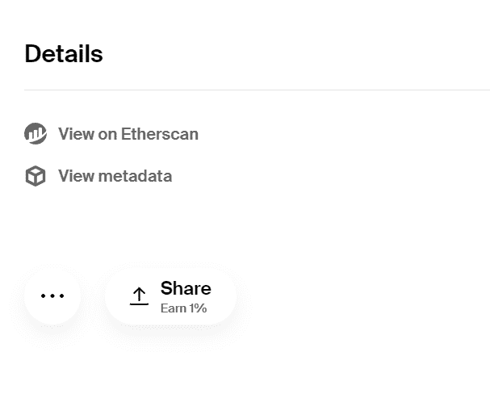

3.点击元数据，瞧。这将打开 arweave 存储位置以及您的 NFT 上的所有元数据。开海，记下来！

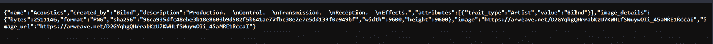

如果您想查看图像位置，请选择图像或 imageURL。

接下来，另一个成为头条新闻的市场是 Looksrare。

## **在 Looksrare 上查找元数据**

在看 Looksrare 的时候，我想也许我可以直接从契约中找到元数据。因为为什么不尝试新的东西。

1.  转到 NFTs 页面，单击 ETHScan 符号。

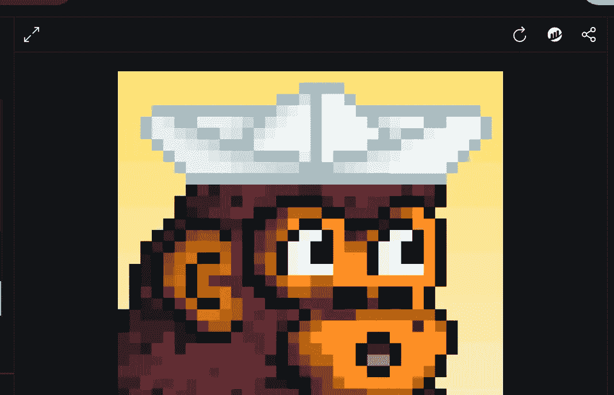

2.点击合同标签，然后点击阅读合同

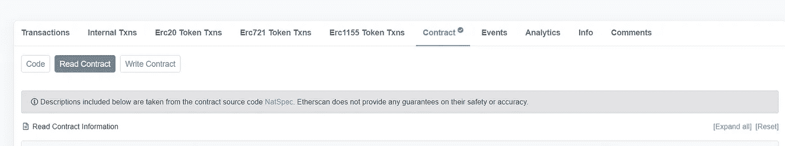

3.查找 URI(唯一资源标识符)

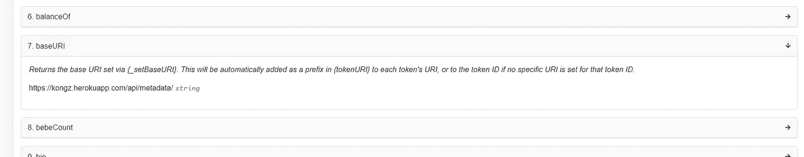

4.太好了，我们可以试试这个链接。我添加了链接，而不是字符串 NFT 的令牌 ID。

自己看:[https://kongz.herokuapp.com/api/metadata/2368](https://kongz.herokuapp.com/api/metadata/2368)

在里面，像时钟一样，有一个 IPFS 链接，上面有 NFT 的图片。

然而，在智能合同如何引用 Looksrare 上的图像位置方面似乎没有统一性(或者更广泛地说)，所以我发现，在这种情况下， [API](https://looksrare.github.io/api-docs/#/Tokens/TokenController.getCollectionToken) 也是您的最佳选择。

同样，您需要合同地址和 ID 来输入它们。

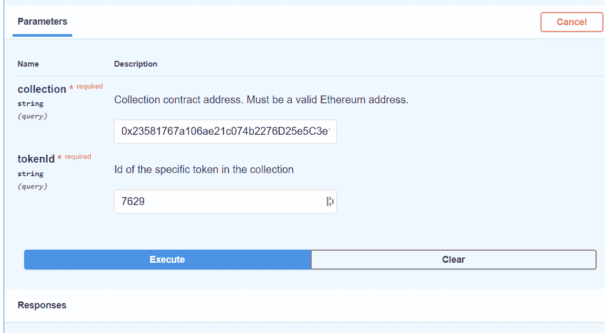

[Looksrare API](https://looksrare.github.io/api-docs/#/Tokens/TokenController.getCollectionToken)

您的回复将如下所示，并包括您的 NFT 的所有元数据。

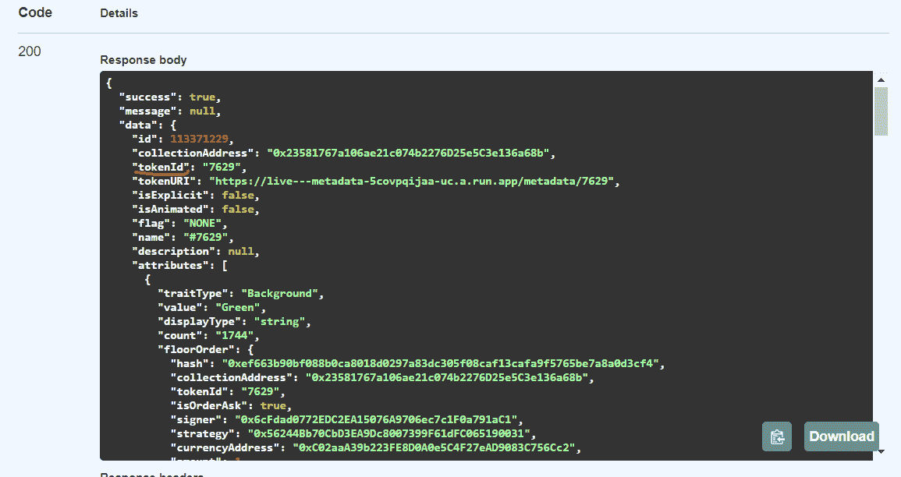

[LooksRare API](https://looksrare.github.io/api-docs/#/Tokens/TokenController.getCollectionToken)

## 但是索拉纳 NFTs 呢？

好吧，这是真的， [MagicEden](https://www.magiceden.io/) 最近筹集了很多资金，所以值得探索。

1.  要通过 MagicEden 找到你的索拉纳 NFT 元数据，请访问 NFTs 页面并查看详细信息。
2.  找到造币厂的地址，点击它旁边的索拉纳符号。这将打开索拉纳浏览器
3.  向下滚动，然后选择元数据选项卡

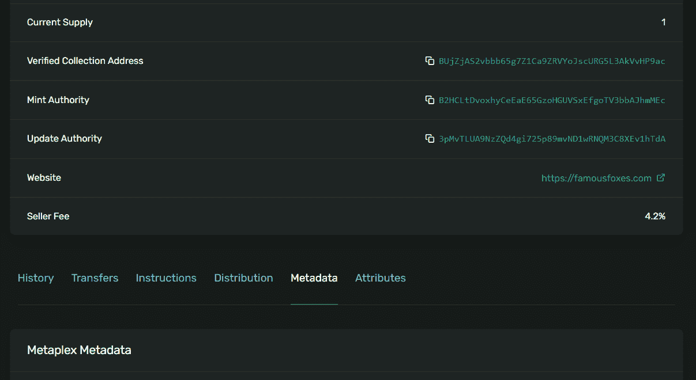

4.在元数据顶部的某个地方，你会发现一个 URI，其中有一个 IPFS 链接

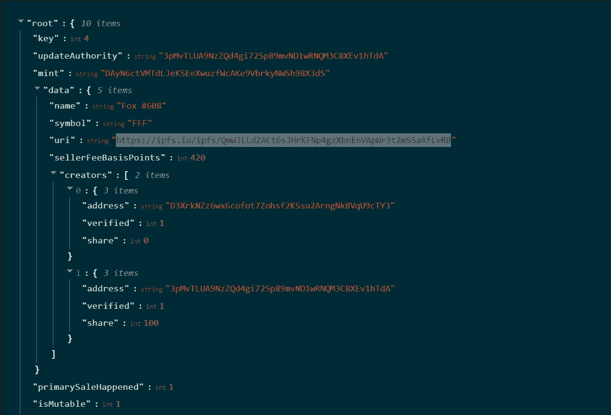

如果你打开它，你会发现所有关于你的 NFT 的描述，以及它的图像文件等等。

## 那么，现在怎么办？

说得好。虽然 IPFS 很棒，但它并非无懈可击。NFT 的图像不会出现也不是没有听说过。这通常与中央实体提供的网关有关。

Twitter Sauce to back up what I say

幸运的是，我们可以尽自己的努力变得更加独立自主。比如托管我们自己的图像。

你的 NFT 艺术在 IPFS 吗？太棒了。执行以下操作来添加到您自己的 IPFS 实例中。

1.  这不言而喻，但话说回来，下载 https://docs.ipfs.io/install/ipfs-desktop/[IPFS 桌面](https://docs.ipfs.io/install/ipfs-desktop/)
2.  找到你图片的 ipfs 链接，这里有个例子:[https://ipfs . io/ipfs/qmutfdgynjfqdwlgn 3 ro 2 jhegpmibbbeucgovmz 4 C5 atep 2](https://ipfs.io/ipfs/QmUTFdGynJfQDwLGN3ro2jhEgpMibbEUCGovmZ4c5ATEp2)
3.  打开你的 IPFS 桌面应用，进入文件。然后点击导入。

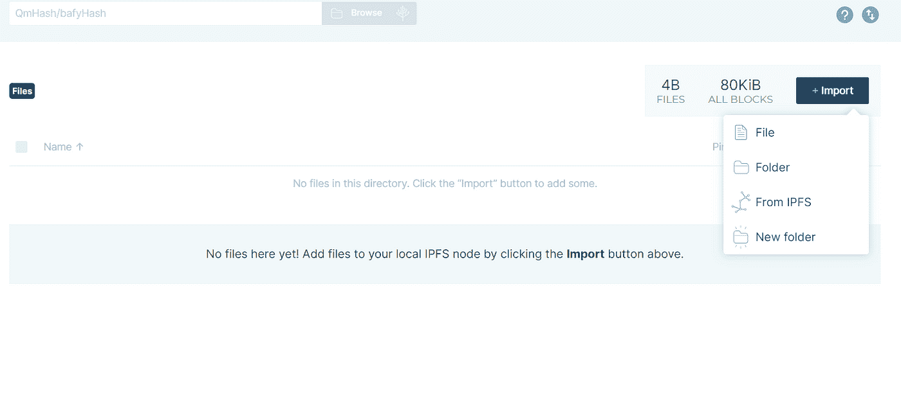

4.从 IPFS 选择，并添加您的图像的链接。不要忘记从 URL 中删除整个“https://ipfs.io”部分。应该是这样的:/ipfs . io/ipfs/qmutfdgynjfqdwlgn 3 ro 2 jhegpmibbbeucgovmz 4 C5 atep 2

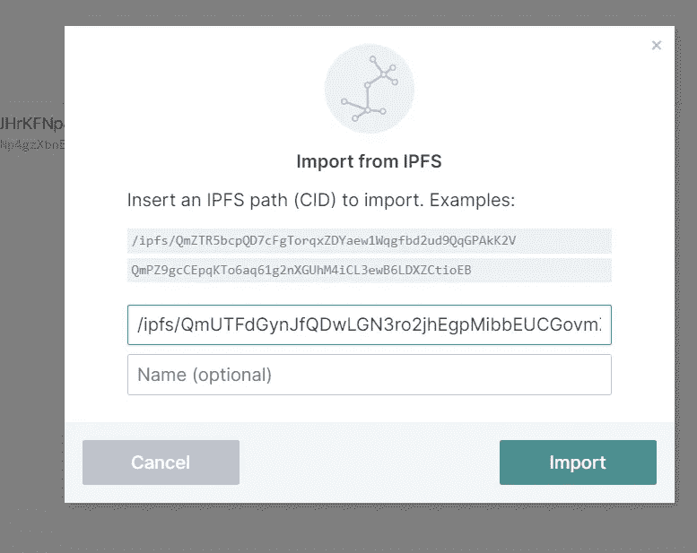

添加后，它会显示在您的文件下，您可以随时查看。

还有，你现在管理着 IPFS，完全不同了🐰下去的洞。

感谢阅读！以上所有这些，我都是用试错法想出来的。我绝不是 dev，只是有点书呆子。🤓

我知道有更多的平台提供了 NFTs，我可能最终会得到其余的平台。可以肯定的是，结合以上几点，你可以在绝大多数网站上找到你的图片位置。如果没有，打我！