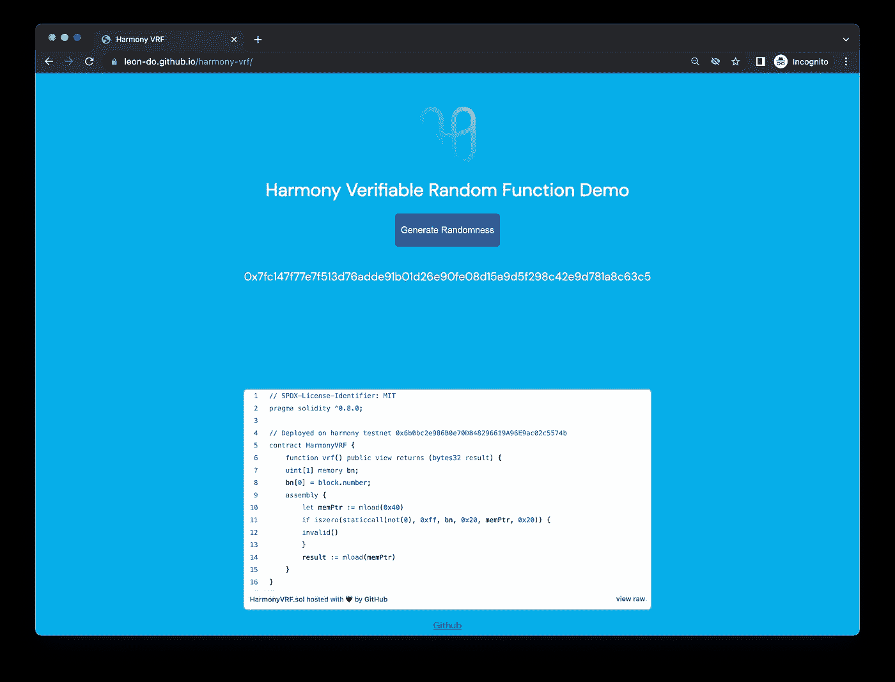
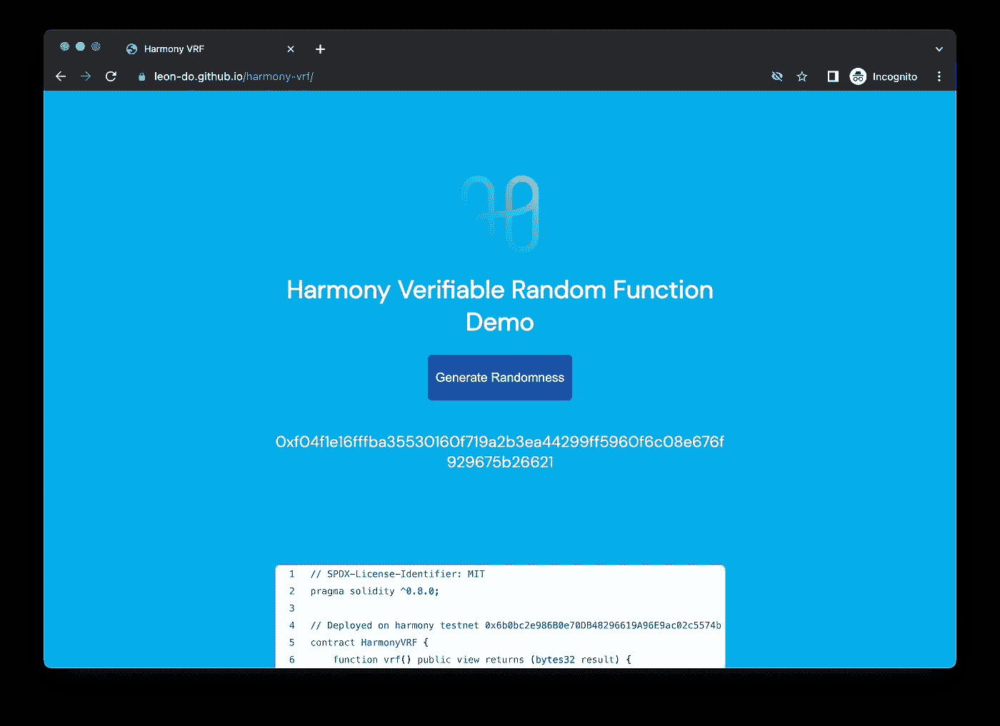
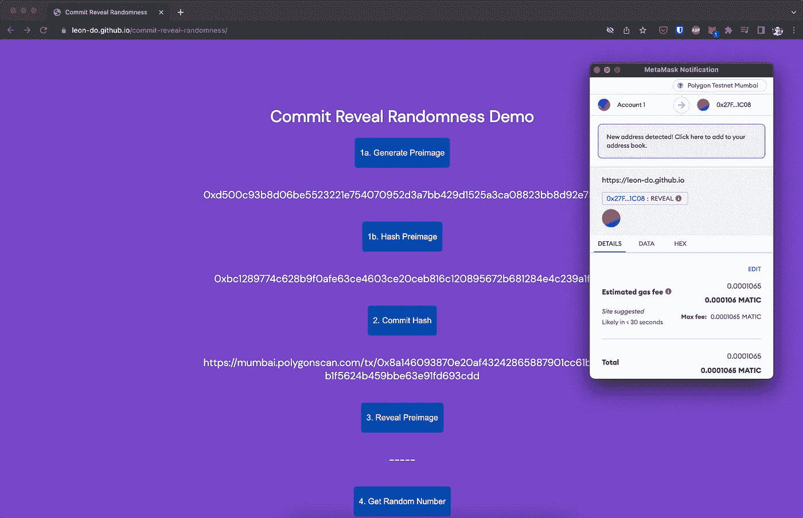

# 如何在 Solidity 中生成随机数

> 原文：<https://medium.com/coinmonks/how-to-generate-random-numbers-in-solidity-16950cb2261d?source=collection_archive---------1----------------------->

链上产生随机数的多种方法。



# 概观

智能合约是确定性的，这意味着任何拥有代码和输入的人都可以预测输出。智能合约也是公开的。给定公共代码，我们如何使其不具有确定性？

下面是一些技巧

*   散列伪随机数
*   链上可验证随机函数(VRF)
*   离线可验证随机函数(VRF)
*   提交-显示随机性

# 散列伪随机数

**赞成者**

*   易于在所有 EVM 上实施

**缺点**

*   最不安全

这个想法是通过散列`blockhash`、`timestamp`和`transaction origin`来产生随机数。这是伪随机的，因为矿工理论上可以在提交块之前生成这些值。

如果大量资金依赖于这个数字，就不要使用这个技巧。

```
function random() internal view returns (uint256) {
    return uint256(keccak256(abi.encodePacked(
      tx.origin,
      blockhash(block.number - 1),
      block.timestamp,
    )));
  }
```

**来源**

 [## 狼游戏(WGAME)令牌跟踪器|以太扫描

### 概述数千只羊和狼在元宇宙的一个农场竞争。一个诱人的羊毛奖品等待着，与致命的…

etherscan.io](https://etherscan.io/token/0xeb834ae72b30866af20a6ce5440fa598bfad3a42#code#F23#L277) 

# 链上可验证随机函数

**优点**

*   论连锁安全

**缺点**

*   仅限于某些区块链

**概述**

一些链已经将 VRF 直接构建到它们的协议中。例如，哈莫尼用他们的赌注和 BLS 签名来签署能产生签名的区块。每个签名可以被散列以生成一个随机数。简而言之，某些区块链可以为每个块产生一个随机数。

**演示**

 [## 和谐 VRF

### 演示

莱昂-多. github.io](https://leon-do.github.io/harmony-vrf/) 

**来源**

[](https://docs.harmony.one/home/developers/tools/harmony-vrf) [## 和谐 VRF

### 和谐一号](https://docs.harmony.one/home/developers/tools/harmony-vrf) 

# 链外可验证随机函数

**优点**

*   比伪随机数更安全
*   可以在多个区块链上工作

**缺点**

*   可能需要持有和使用他们的本地令牌。

**概述**

Chainlink 是一个解决方案，它使用 oracles 的外链来产生随机性。这种技术用于 dApps，如 PoolTogether。获胜者是随机挑选的，以赢得奖品。因为随机性等同于大量的金钱，所以拥有真正的(而不是伪)随机性是很重要的。

[](https://docs.chain.link/docs/vrf/v2/introduction/) [## 链环 VRF

doc . chain . link](https://docs.chain.link/docs/vrf/v2/introduction/) 

# 提交显示随机性

**优点**

*   适用于所有 EVM，并且是安全的

**缺点**

*   请求两个交易

另一种技术是使用 commit reveal 生成一个随机数。

**步骤**

1.  用户离线生成一个前映像(编号),然后*提交*哈希
2.  智能合同将哈希保存在链上
3.  用户至少等待一个程序块
4.  用户显示前图像。如果前映像的哈希与保存的哈希匹配(在步骤 2 中)，则在链上生成一个随机数
5.  生成随机数:散列`pre-image` + `blockhash`

**步骤(简化)**

这个想法是用未来的数据来提交现在的数据。因为没有人能知道未来，所以不可能确定随机数。

1.  用户将数字`111`保存在链上。这是无法改变的。
2.  用户等待一个街区
3.  该块现在生成一个`blockhash` `222`
4.  新的随机数是`111 + 222 = 333`

如果没有等待未来的块，那么技术将类似于:*通过散列的伪随机数。*

如果没有提交，用户可以等待 blockhash，然后输入他们的数字来获得想要的“随机”数字:`myInput + 222 = myDesiredNumber`

**演示**

 [## 提交显示随机性

### 编辑描述

莱昂-多. github.io](https://leon-do.github.io/commit-reveal-randomness/) 

**来源**

[](/gitcoin/commit-reveal-scheme-on-ethereum-25d1d1a25428) [## 以太坊上的提交揭露方案

### 隐藏动作和生成随机数

medium.com](/gitcoin/commit-reveal-scheme-on-ethereum-25d1d1a25428) 

> 交易新手？尝试[加密交易机器人](/coinmonks/crypto-trading-bot-c2ffce8acb2a)或[复制交易](/coinmonks/top-10-crypto-copy-trading-platforms-for-beginners-d0c37c7d698c)