# 如何获得加密水龙头？值得尝试的免费平台

> 原文：<https://medium.com/coinmonks/how-to-get-crypto-faucets-free-platforms-worth-trying-cc68a44b12fe?source=collection_archive---------0----------------------->

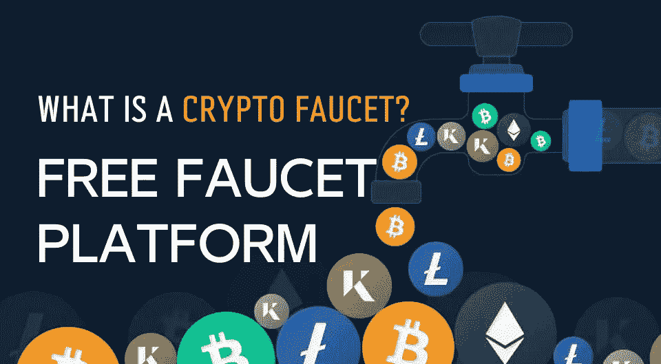

> 快来增加你的矿力，获取加密货币！加密龙头是获得免费加密货币的一种方式。对于初学者来说，使用水龙头是开始加密之旅的好方法。

**👉跟我上** [***推特***](https://twitter.com/TheCryptoKK)***|***[***中***](/@TheCryptoKK) **让自己升职！**

**聚焦#NFT 研究员&#网路搜寻家**

**每日分享# web 3 # Crypto # NFT #比特币的真实素材**

一个加密龙头是一个网站或应用程序，它以完成简单任务为交换，发放少量的加密货币。“水龙头”这个名字来源于这样一个事实:回报非常小，就像水龙头上滴下的水滴。

我给你介绍一下获得免费币的主要步骤，并推荐几个水龙头网站供你选择。

# I .测试网络上的硬币

首先，您必须将测试网络添加到您的钱包中。这里我使用元掩码。

点击 ID >设置>高级>打开“显示测试网络”，你会看到 4 个测试网络显示在你的网络仪表板上。

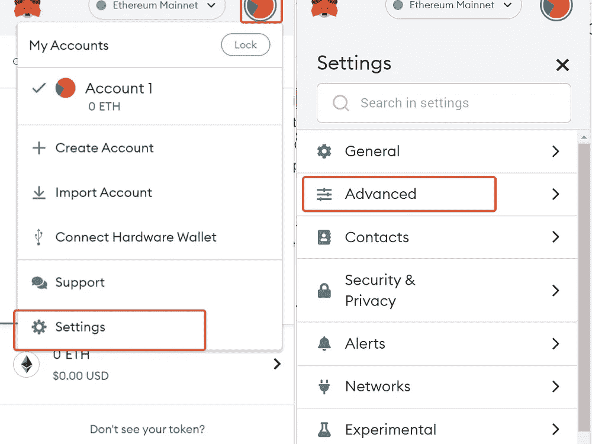

*   **Ropsten 测试网络**

去[http://faucet.egorfine.com/](http://faucet.egorfine.com/)，只要输入你的钱包地址，你就会得到测试币。

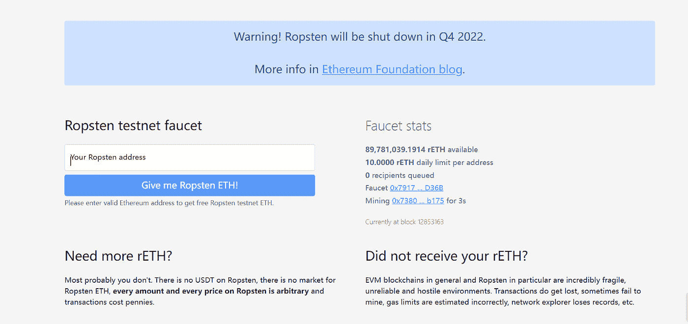

*   **科万测试网**

1.  [https://gitter.im/kovan-testnet/faucet](https://gitter.im/kovan-testnet/faucet)

登录并加入房间后，只需在聊天窗口中输入您的钱包地址。等一会儿拿你的硬币。

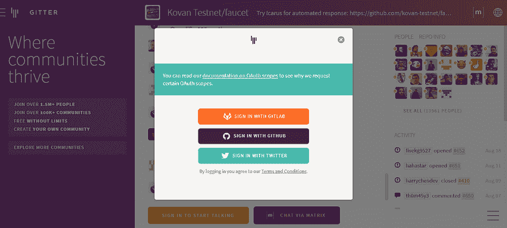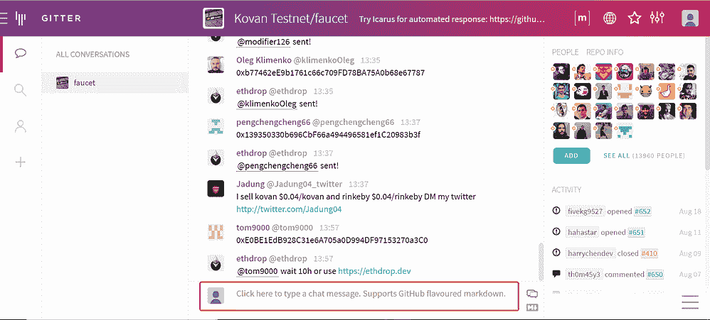

2. [https://ethdrop.dev](https://ethdrop.dev)

只需输入您的钱包地址即可获得硬币。

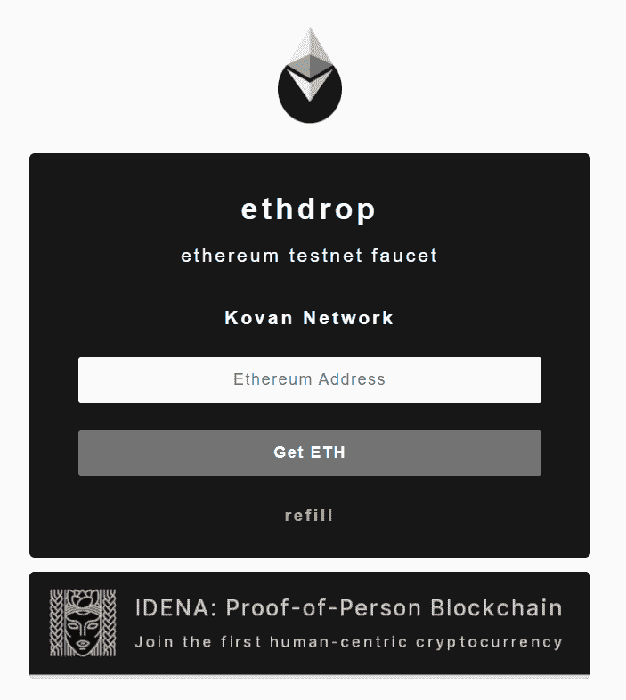

*   **林克比测试网**

1.  [https://faucet.rinkeby.io/](https://faucet.rinkeby.io/)

首先验证您的 Twitter 或脸书帐户。点击链接获取推文模板，用你的钱包地址替换数字，然后将你的推文 URL 复制并粘贴回仪表盘。

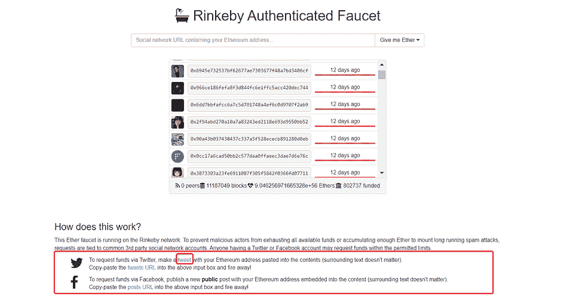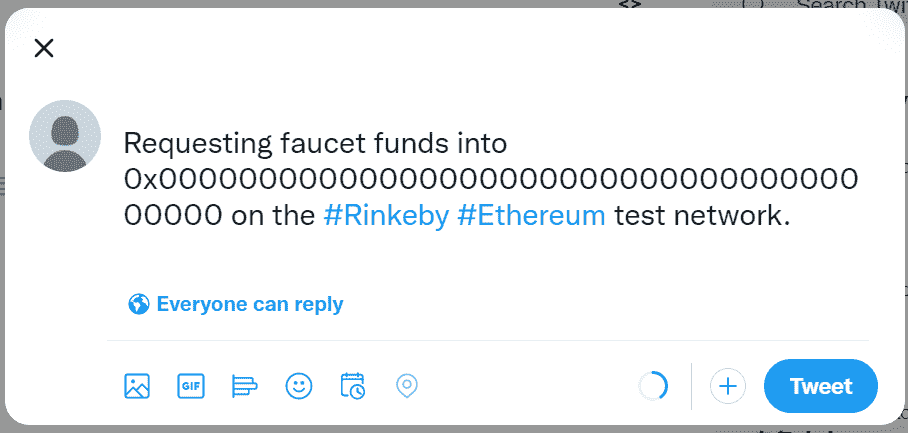

2.[https://www.rinkebyfaucet.com/](https://www.rinkebyfaucet.com/)

直接输入你的地址。

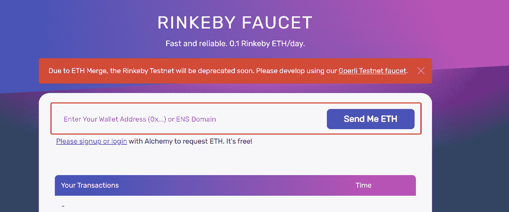

*   **戈利测试网**

[https://goerli-faucet.mudit.blog/](https://goerli-faucet.mudit.blog/)

类似于 Rinkeby 验证你的社交美达账户。但这次你必须确保你的账户已经建立了至少一周，并且有一些推文和追随者。由于测试硬币的数量有限，戈利的硬币相对来说很难获得，而且你必须等待更新。

# 二。免费水龙头平台

*   [**同出一辙**](https://cointiply.com/)

你可以通过在线玩有趣的游戏、观看视频、在线购物或只是分享你对流行产品的看法来赚取比特币、DOGE、LTC 或 DASH。

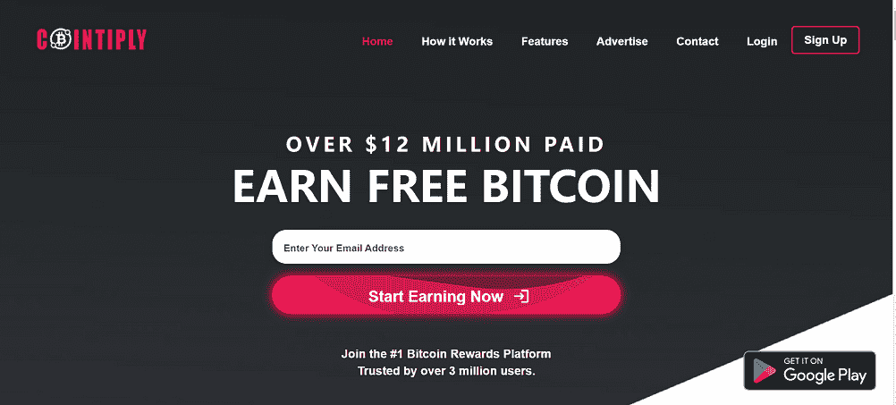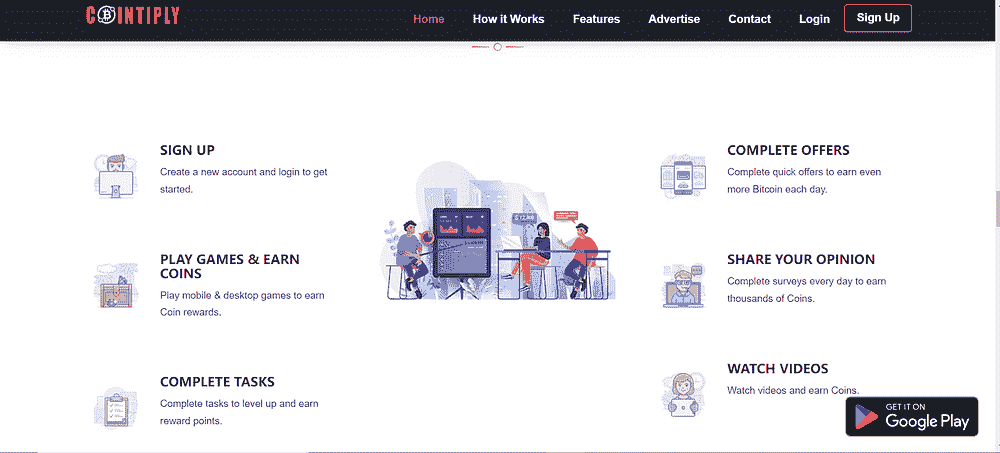

只需使用您的电子邮件注册一个免费帐户，您就可以开始您的旅程。

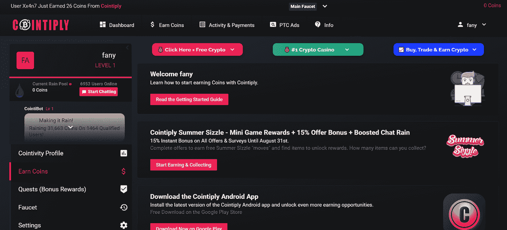

*   [免费赠送 ](https://freebitco.in/signup/?op=s)

它是互联网上最古老的比特币龙头之一。注册就像输入您的电子邮件一样简单，甚至无需创建密码，只需点击“立即玩”。

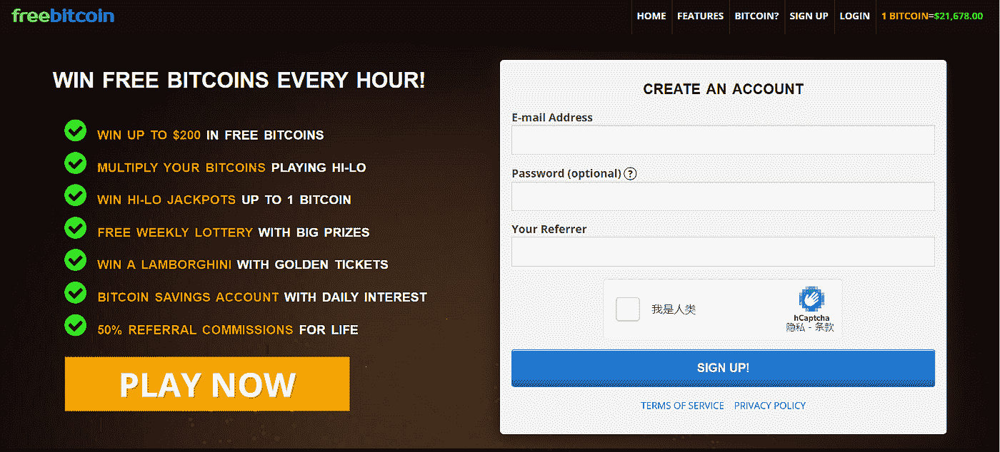

每 60 秒可获得免费比特币，通过 HI-LO 游戏增加收益。此外，您还可以通过每次免费滚动获得彩票，并参加每周抽奖。

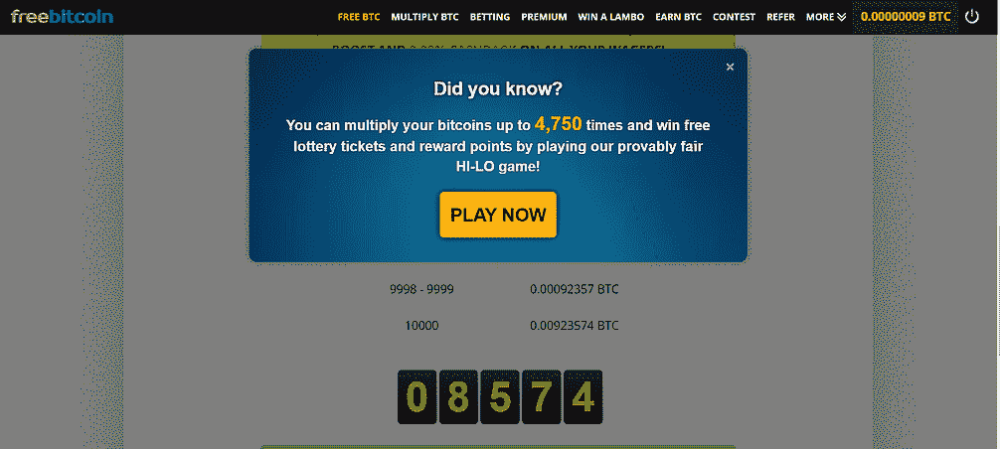

*   [**比特币狂潮**](https://bitcoinmaniagame.com/)

玩游戏可以赚比特币。你需要做的就是进去，即使没有任何投资也能盈利。

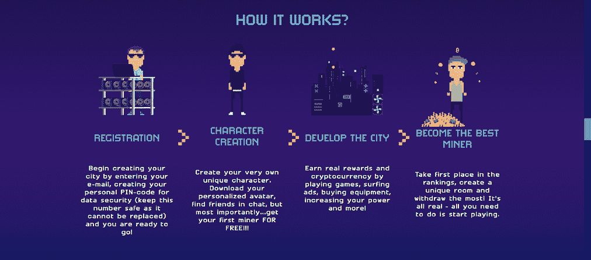

使用您的电子邮件注册，并创建您自己的 PIN 码用于确认访问。创建你自己的城市和矿工，矿工会在游戏中铸造密码，你会得到真正的比特币。

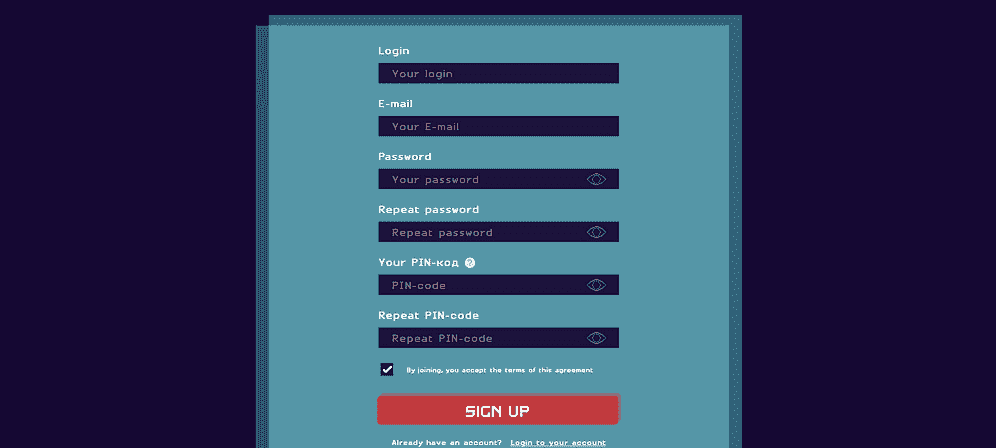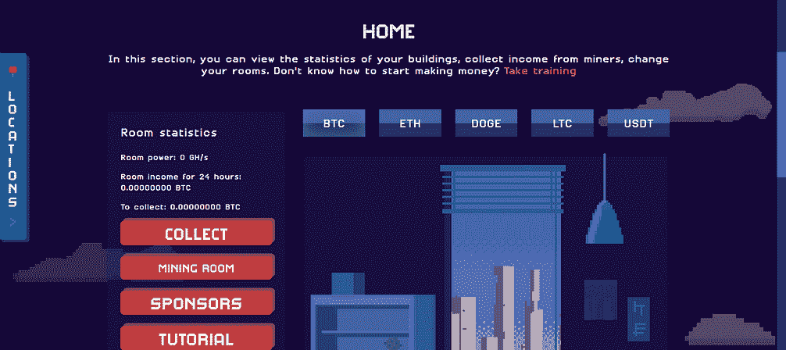

*   [**龙头加密**](https://faucetcrypto.com/)

水龙头加密目前支持 17 种加密货币，比特币，DASH，DOGE，Komodo 等。只需使用您的电子邮件注册，并选择观看 PTC 广告、回答问题或每 30 分钟点击按钮获取奖励。此外，它还提供不同的级别。通过达到更高的水平，你将获得越来越多的奖励。

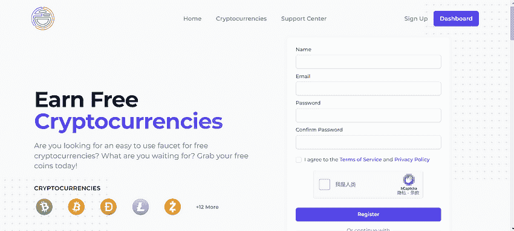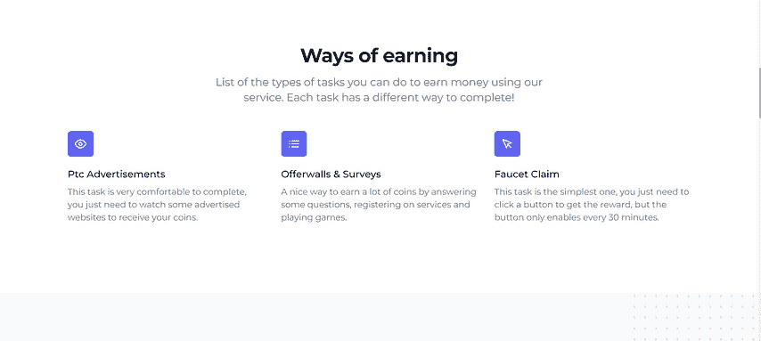

*   [**管焰**](https://pipeflare.io/)

这个玩到赚的游戏平台允许你每 24 小时赚取免费的 ZEC、MATIC 和 1FLR。用你的邮箱注册。你也可以在业内最好的 NFT 市场上买卖有限的 NFT。

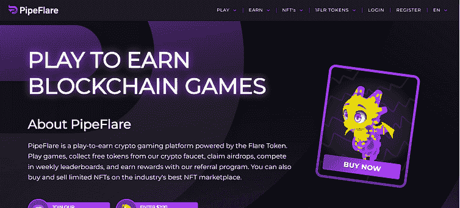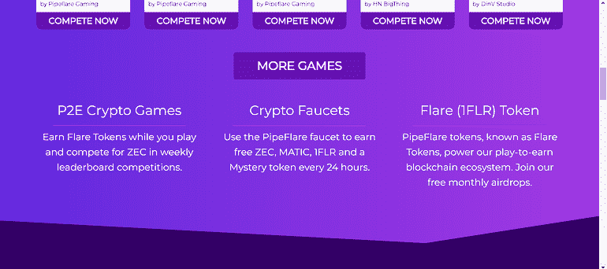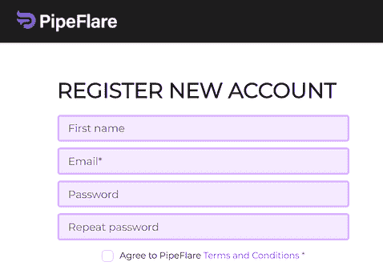

# 三。结束语

对于初学者来说，使用水龙头是开始加密之旅的好方法。当然，没有什么是真正免费的，存在加密水龙头的风险。

一些伪装成加密水龙头的网站或应用程序可能会用恶意软件感染您的计算机，并窃取我们的数据。在第一步做广泛而仔细的研究总是一个好主意。记住 DYOR，依靠你信任的知名品牌。另一件事是，在你完成一项耗时的任务后，回报可能会太少。你应该找到声誉良好的加密水龙头，最有可能产生足够的加密奖励，以证明你的时间和努力。

***关注我让自己升职！***

***聚焦#NFT 研究员&#蛛网***

***每日分享关于# web 3 # Crypto # NFT #比特币的真实素材***

[***碎碎念***](https://twitter.com/TheCryptoKK)***|***[***中等***](/@TheCryptoKK)

*欢迎关注我，并随时询问任何事情*

> 交易新手？尝试[加密交易机器人](/coinmonks/crypto-trading-bot-c2ffce8acb2a)或[复制交易](/coinmonks/top-10-crypto-copy-trading-platforms-for-beginners-d0c37c7d698c)