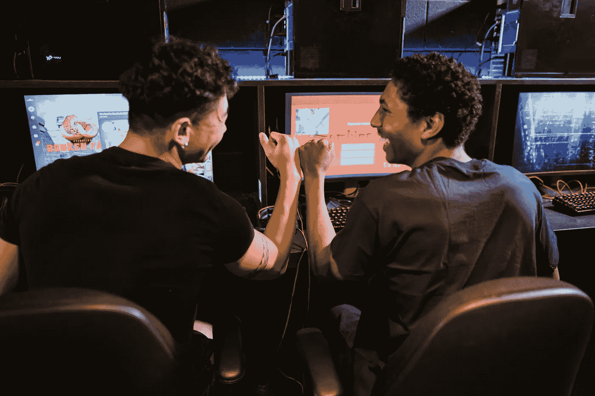
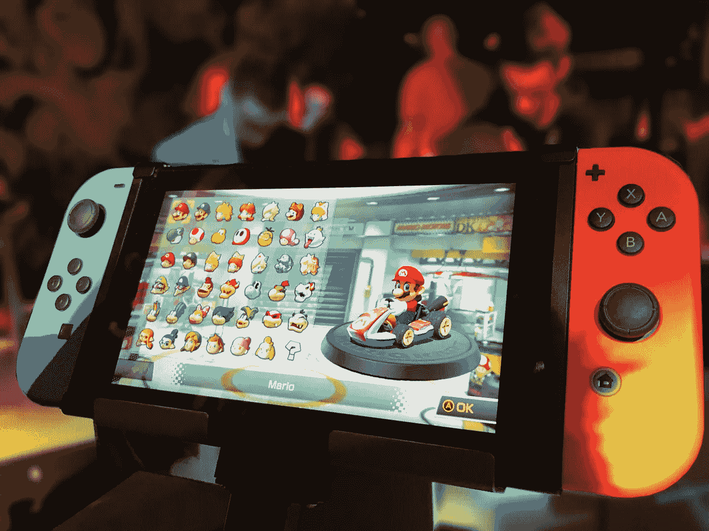

# 如何让开发者对 web3 游戏感兴趣

> 原文：<https://medium.com/coinmonks/how-to-get-developers-excited-about-web3-gaming-c12e1869c41a?source=collection_archive---------27----------------------->

Web3 游戏是让人们对网络潜力感到兴奋的好方法。全球博彩业价值约 3000 亿美元，而且还在不断增长。该行业的颠覆时机已经成熟，区块链技术有潜力为游戏玩家提供新的创新方式来与游戏互动和相互交流。

Web3 gaming 提供了一个不依赖第三方发行商或集中平台开发游戏的机会。对于许多游戏开发者来说，开发一个不受某个实体控制的游戏，并且玩家拥有游戏资产的前景听起来像是梦想成真。

这意味着玩家可以获得他们数字资产的所有权，并通过智能合同将其货币化——在分发内容时，将不再需要更多像苹果或谷歌这样的中介！

那么，我们如何让开发者对 web3 游戏感兴趣呢？这里有三种方法可以做到:

# 展示区块链技术的潜力

让开发者对 web3 游戏感到兴奋的一个方法是强调区块链技术可以给行业带来的好处。例如，基于区块链的游戏可以让玩家真正拥有游戏中的物品，如角色、标志、物体、声音等，并能够在二级市场上进行交易，如 [OpenSea](https://opensea.io/) 或 [Rarible](https://rarible.com/) 。这可能会导致一个更加活跃的游戏生态系统，玩家会更加投入和投入到他们玩的游戏中。

区块链技术可以用来创建真正去中心化的游戏世界，并为玩家提供更高程度的控制和自主权。这可能会导致新一波的实验性和创新性游戏，推动游戏行业的发展。

据 DappRadar 报道，2022 年 Q2 的加密游戏投资超过 25 亿美元，预计到今年年底将达到 100 亿美元。75%的公司现在都在从事某种形式的区块链项目。例如，[微软宣布投资了一家韩国区块链游戏公司](https://www.gamespot.com/articles/microsoft-buys-into-korean-blockchain-game-company/1100-6508859/)。此外，《侠盗猎车手 V》和《《我的世界》》宣布他们已经在游戏服务器上引入了[可玩的不可替换令牌(NFT)。](https://venturebeat.com/games/mymetaverse-and-enjin-bring-playable-nfts-to-grand-theft-auto-v-and-minecraft-servers/)

尽管市场状况不佳，但区块链和 NFT 相关游戏的表现超过了其他加密项目。区块链游戏目前占区块链行业活动的 52%，去年比 Q2 增长了 2000%。

# 互用性

我们必须让区块链游戏具有互操作性，让开发者对 web3 游戏感兴趣。最好的方法是为游戏引擎创建一个通用库，允许不同区块链上的不同游戏进行通信。这将让来自一个游戏的玩家与来自不同游戏的玩家对战，反之亦然。

没有不同网络之间的互操作性，web3 游戏的规模将面临风险，而游戏玩家将因局限于一个世界而感到厌倦。在一个像游戏开发和不断发展的 web3 空间这样复杂的领域，实现互操作性是一项艰巨的任务，但有一点是肯定的，那就是它是可行的！

区块链互操作性将增加每个人的灵活性，而不是被束缚在单一的链上。

想象一个游戏，玩家可以在许多平台上实时地互相玩。这意味着你可以在家里或办公室的任何地方和你的朋友一起玩，就好像他们都在家里一样，即使他们不在那里！你也可以在你的设备之间发送信息，当有人完成他们的回合时，这样每个人都知道在给定的时刻发生了什么(或者如果有人退出)。这将允许我们一起参与这种共享的体验，而不是一个人玩。

# 开发人员易于集成

我认为最有希望的方法是开发一个开源协议，促进不同区块链游戏之间的互操作性。这需要创建一套通用的规则、标准和参与规则，供行业中的所有参与者使用。

有一个很好的机会，这可以通过以太坊作为其底层技术来实现——值得探索的是，您是否可以使用以太坊智能合约来进行这样的项目。

此外，在设备上使用多种加密货币的游戏用户可以轻松地在它们之间切换，而不必下载新软件或更新计算机的操作系统。他们将能够同时使用不同类型的硬币——例如，他们可能会在 [Axie Infinity](https://axieinfinity.com/) 上使用比特币进行内部购买，而在玩 [Gods Unchained](https://godsunchained.com/) 时使用另一种代币。这将减少货币之间的摩擦，同时也让用户在网上购物时更加灵活。

最后，有必要为创新游戏或功能提供奖励或认可。我们必须强调与其他 web3 游戏开发商的合作，以在生态系统的未知水域中航行。教程、模板和文档也是帮助他们入门的好方法。

值得注意的是，web3 游戏仍处于早期阶段，有很大的增长和发展潜力。这为开发商提供了一个机会，让他们能够从一开始就参与进来，并帮助塑造行业的未来。

> 区块链游戏已经炙手可热，但让我们让它更令人向往！

如果你是一个独立开发者，你是否有一个小团队并不重要。有很多机会可以让你的游戏在 web3 游戏平台和其他平台(如移动平台)上运行。如果你的游戏还没有建立在区块链技术上，现在就开始研究吧！

这将是未来几年游戏的最大趋势之一。

在这里和 Twitter 上与我一起了解加密货币的最新投资趋势、新闻和未来分析，讨论区块链技术如何帮助推动加密在重要领域的应用。

> 交易新手？试试[密码交易机器人](/coinmonks/crypto-trading-bot-c2ffce8acb2a)或者[复制交易](/coinmonks/top-10-crypto-copy-trading-platforms-for-beginners-d0c37c7d698c)