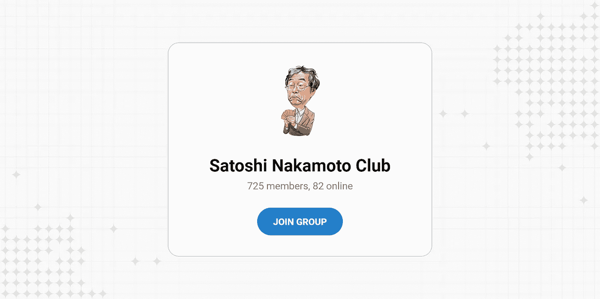

# 如何进入密码创业者封闭俱乐部？

> 原文：<https://medium.com/coinmonks/how-to-get-into-a-closed-club-for-crypto-entrepreneurs-fb2f1544e5e3?source=collection_archive---------26----------------------->

中本聪俱乐部是一个由 C 级人员和[密码公司](https://crypton.studio/en)所有者组成的封闭社区。

在三年时间里，它聚集了 700 多名引领潮流、影响整个区块链行业的人。

# 中本聪俱乐部是一个:

—在当前环境中发展您的业务；

—寻求建议或任何问题；

—了解大区块链世界的最新消息。

此外，在俱乐部里，我们会告诉你关于我们社区的重大事件和新闻。有的会上线，有的会下线。

[如果你想加入中本聪俱乐部，写信告诉我们](https://t.me/Crypton_Studio_Dev)你的项目或想法。然后我们会考虑你加入俱乐部的申请。

我们支持俱乐部的价值观，只接受积极的企业家。

> 交易新手？试试[密码交易机器人](/coinmonks/crypto-trading-bot-c2ffce8acb2a)或[复制交易](/coinmonks/top-10-crypto-copy-trading-platforms-for-beginners-d0c37c7d698c)