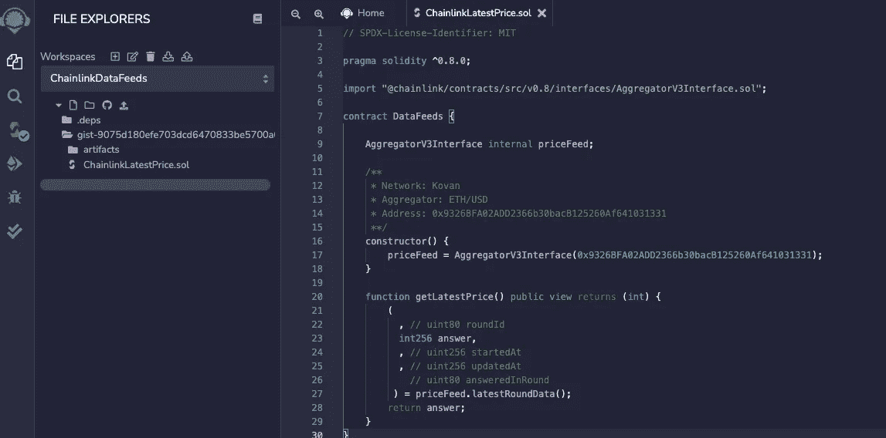
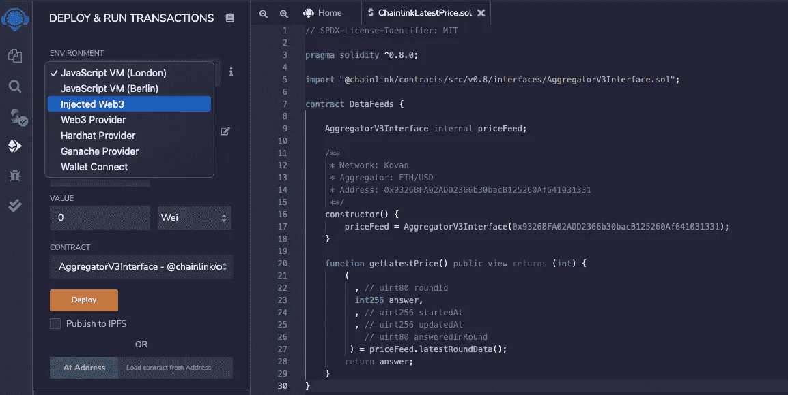
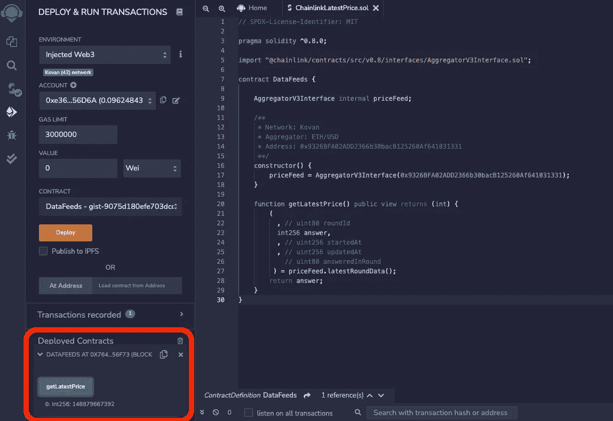

# 如何在智能合约中获取最新的 ETH 价格

> 原文：<https://medium.com/coinmonks/how-to-get-the-latest-eth-price-in-smart-contracts-da4f201b076c?source=collection_archive---------20----------------------->

Image by [Miloslav Hamřík](https://pixabay.com/users/vjkombajn-764634/?utm_source=link-attribution&utm_medium=referral&utm_campaign=image&utm_content=3818348) from [Pixabay](https://pixabay.com/?utm_source=link-attribution&utm_medium=referral&utm_campaign=image&utm_content=3818348)

我们可以通过使用 Chainlink 发布的 [Data Feeds API](https://docs.chain.link/docs/price-feeds-api-reference/) 轻松获得最新的 ETH 价格。

在本例中,“getLatestPrice”函数可用于获取最新的 ETH/USD 价格。

# 让我们看看这段代码中有什么

在构造函数中指定的地址可以在[以太坊数据供给](https://docs.chain.link/docs/ethereum-addresses/)中找到。这次我们想在 Kovan Testnet 上得到 ETH/USD 的价格，所以用 0x 9326 BFA 02 add 2366 b 30 bacb 125260 af 641031331。

“latestRoundData”函数返回几个值，但“getLatestPrice”函数只返回必要的答案(价格)。

# 在混音上试试

必要的话给科万加油。你可以在这里得到。

粘贴上面的代码并编译(mac 用 command + s，windows 用 ctrl + s)。

选择注入的 Web3 并按部署。你需要付汽油费。部署之前需要一点时间。

部署完成后，点击已部署合同区域中的 getLatestPrice 按钮。你会发现最新的价格

今天到此为止。谢谢大家！

> 交易新手？尝试[加密交易机器人](/coinmonks/crypto-trading-bot-c2ffce8acb2a)或[复制交易](/coinmonks/top-10-crypto-copy-trading-platforms-for-beginners-d0c37c7d698c)