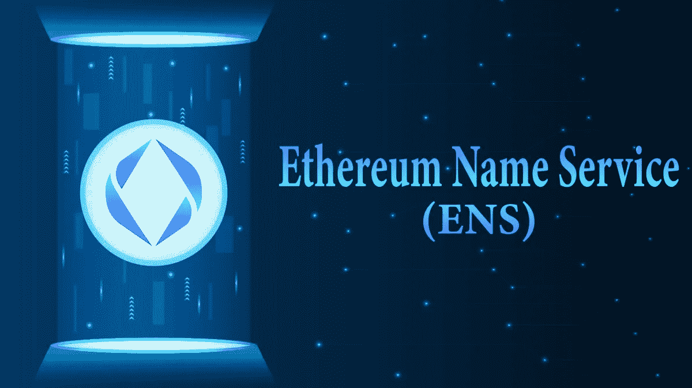
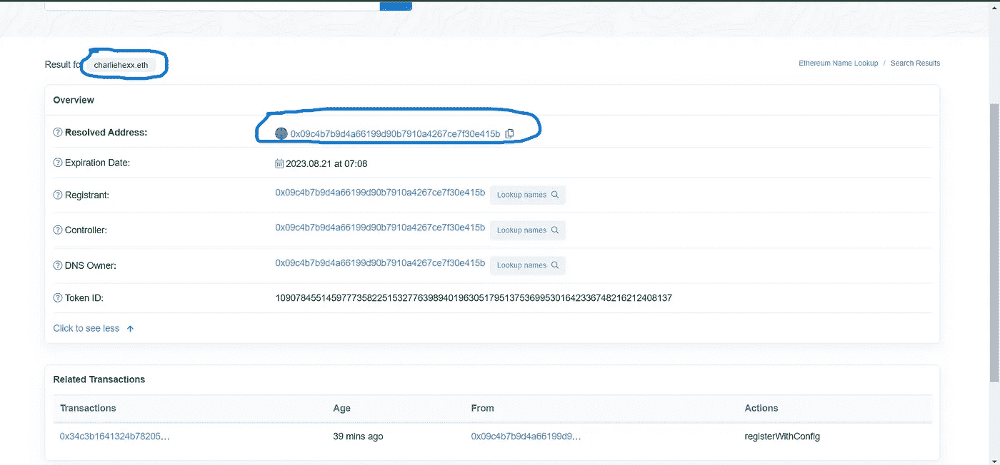

# 如何在 ENS(以太坊域名服务)上获得自己的域名..？

> 原文：<https://medium.com/coinmonks/how-to-get-your-domain-name-on-ens-ethereum-name-service-1e9a49830c29?source=collection_archive---------29----------------------->

你可能知道 DNS(域名服务),这是一个基于 web2 的服务来获取你的域名，帮助你唯一地识别你的 IP 地址。但是如何在 web3 上获得一个 ENS 来去掉你的长钱包地址，它可能看起来像这样` 0xcdgfhjg3459fjggege..对你来说，一遍又一遍地复制粘贴这么长的地址来把你的乙醚放进你的钱包里可能会令人望而生畏。让我们做一个酷孩子，在 web3 上拥有自己的 ENS。
首先让我们为你的钱包地址获取一个 ENS，从打开网站[这里](https://app.ens.domains/)开始。我们将使用假冒的 rinkeby tesnet 乙醚进行所有交易。

**注意——你的 metamask 钱包里一定有一些假的 tesnet 乙醚。获得 ENS 是超级容易的，你不必用你真正的以太或金钱去购买它。**
确保您的 metamask 钱包已连接到网站。搜索一个 ENS 域名，任何你喜欢的名字，只要有。点击可用，检查 ENS 名称的可用性。现在，只需点击“请求”进行注册，继续与您的假乙醚进行交易，以完成请求。完成两步后，当进度条进入第三步时，点击注册。然后，在进度条完成后，单击“设置为主 ENS 名称”。从下拉列表中选择您刚刚创建的 ENS 名称。
点击保存。

现在，你只需要记住你的 ENS 名字，而不是记住你的长钱包地址。
现在，您在 Rinkeby 上的地址注册了一个 ENS。
**注意-注册仅适用于 Rinkeby 测试网络。它与区块链主网以太坊**无关。
您只需进入 rinkeby testnet 网络并输入您的 ENS，即可验证您的 ENS

*0x 09 C4 b 7 b 9 D4 a 66199d 90 b 7910 a 4267 ce 7 f 30 e 415 b*是 Rinkeby Testnet 网络上的 charliehexx.eth。你可以去 Rinkeby Tesnet Etherscan 上验证一下。

> 交易新手？试试[加密交易机器人](/coinmonks/crypto-trading-bot-c2ffce8acb2a)或者[复制交易](/coinmonks/top-10-crypto-copy-trading-platforms-for-beginners-d0c37c7d698c)