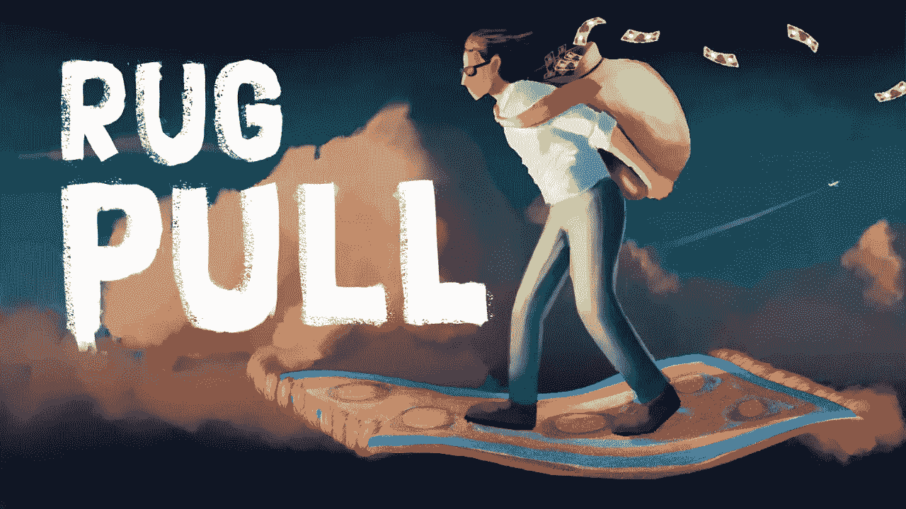

# 如何识别和避免地毯拉扯？

> 原文：<https://medium.com/coinmonks/how-to-identify-and-avoid-rug-pull-c38e15e07c2a?source=collection_archive---------21----------------------->

由于并非所有的加密货币项目都是合法的，所以了解如何保护自己免受常见诈骗至关重要。

“拉地毯”是一种常见的加密货币骗局，其中开发商或创作者推广一个项目，如新硬币或 NFT 发行，然后带着投资者的资金消失。事后很难找到拉地毯的人，因为区块链的分散化和假名性质使得那些参与者可以隐藏他们的身份。

尽管如此，还是有办法发现潜在的骗局，保护自己免受经济损失。

> 交易新手？在[最佳密码交易所](/coinmonks/crypto-exchange-dd2f9d6f3769)上尝试[密码交易机器人](/coinmonks/crypto-trading-bot-c2ffce8acb2a)或[复制交易](/coinmonks/top-10-crypto-copy-trading-platforms-for-beginners-d0c37c7d698c)

## 什么是地毯拉手？

拉地毯是加密货币市场中的一种骗局，加密货币项目的创造者突然出售他们所有的代币，导致门票价格暴跌，投资者亏损。这种骗局通常是由个人或团体实施的，他们创建了一个加密货币项目，通过出售自己的令牌而不是建立一个可行和可持续的项目来从中获利。

## 地毯拉头是如何工作的？

拉地毯类似于泵和转储计划，因为他们都利用了加密空间的缺乏监管，错误信息，先令，以及对错过的恐惧(FOMO)。另一方面，泵送和转储通常在较短的时间框架内操作，围绕低容量代币的价格行为，并且不需要代币开发者的参与。

**下面是地毯拉手的典型工作方式:**

*   加密货币项目的创造者通过宣传项目及其高回报的潜力来吸引投资者。
*   投资者通过首次发行硬币(ICO)或在加密货币交易所购买加密货币代币来购买项目。
*   该项目的创造者在交易所或私下向其他投资者出售他们自己的代币。
*   随着创造者抛售代币，加密货币的价值暴跌，导致投资者亏损。
*   该项目的创造者经常消失，给投资者留下毫无价值的代币，也没有办法挽回他们的损失。

## 有几种方法可以在地毯被拉之前检测到它:

**研究团队:**寻找项目背后团队的信息，包括他们的背景和经验。警惕有匿名或不熟悉团队成员的项目。

**检查项目的代码:**寻找代码维护良好并定期更新的迹象，这表明团队对项目的承诺。

**寻找危险信号:**寻找项目可能失败的警告信号，例如不切实际的回报承诺、缺乏透明度以及项目白皮书中缺乏细节。

**检查项目的社区:**寻找项目周围强大而活跃的社区的迹象，因为这可以表明其合法性。

**谨慎行事:**与任何投资一样，在投资加密货币项目之前进行研究非常重要。只投资你能承受的损失，并注意加密货币市场的高度波动和风险。

## QuillCheck 如何帮助检测和避免地毯拉扯？

QuillCheck 是由 QuillAudits 提供的安全工具。因为对于任何 web3、DeFi 项目来说,“代码就是法律”,所以有必要注意安全检查并检测任何可能的欺诈行为。QuillCheck 使用 21 次代码检查来确保项目的代码不会说谎，并且您不会损失资金。在搜索栏中输入令牌的合同地址，我们将为您准备一份项目安全性的全面分析。

 [## 免 QuillCheck 地毯拉力检测器

### 编辑描述

quillaudits.com](https://quillaudits.com/tools/quillcheck/) 

**结论**

投资者在投资加密货币项目之前保持谨慎并做好自己的研究非常重要。分散投资也很好，只投资你能承受的损失。

> 加入 Coinmonks [电报频道](https://t.me/coincodecap)和 [Youtube 频道](https://www.youtube.com/c/coinmonks/videos)了解加密交易和投资

# 另外，阅读

*   [用信用卡购买密码的 10 个最佳地点](https://coincodecap.com/buy-crypto-with-credit-card)
*   [最好的卡达诺钱包](https://coincodecap.com/best-cardano-wallets) | [Bingbon 副本交易](https://coincodecap.com/bingbon-copy-trading)
*   [如何给 MetaMask 钱包添加 Arbitrum？](https://coincodecap.com/how-to-add-arbitrum-to-metamask-wallet)
*   [KuCoin vs 北海巨妖 vs BitYard](https://coincodecap.com/kucoin-vs-kraken-vs-bityard)
*   [加密交易的最佳 VPN](https://coincodecap.com/best-vpns-for-crypto-trading)