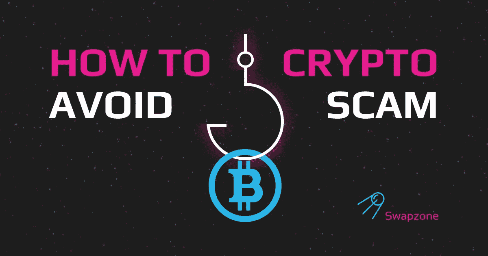

# 如何识别诈骗硬币:5 种方法

> 原文：<https://medium.com/coinmonks/how-to-identify-scam-coins-5-ways-3ff6c8c6f33?source=collection_archive---------10----------------------->

根据 CoinMarketCap 的数据，目前市场上基本上有数千种加密硬币。虽然这些加密货币中有许多受到各种平台的支持，但其中一些是加密骗局。无论你是新手还是熟悉加密市场，你肯定至少有一次想知道，“这枚硬币是不是像一些人说的那样是一个骗局？”或者这是一个合法的加密货币项目。在这篇文章中，我们将谈论五种方法，这将有助于您回答最大的加密骗局问题“如何识别骗局硬币？”

# 什么是骗局币？

许多人试图投资加密货币，但被骗走了他们的钱。也许他们选择了错误的资产，似乎或声称优于合法的加密货币，或者想快速致富，而没有研究他们将进入什么。

如果你想知道什么是骗局硬币，我们有你的答案。屎币或骗局币是假的加密币币或代币，没有长期价值。这种形式的加密货币骗局旨在让潜在投资者相信未知硬币的价值，要求他们购买。事实上，这些虚假项目已经失败或已经成功退出骗局不再是新闻，这就是为什么在进行投资之前做好研究是很重要的。

# 秘密诈骗案件

已经有几起全世界都知道的秘密骗局了。以下是近年来发生的三起最引人注目的加密骗局:

# 一枚硬币骗局

OneCoin 是 Ruja Ignatova 在 2014 年发起的一个庞氏骗局，伪装成加密货币。Ignatova 通过首映式和吸引人的营销说服超过 175 个国家的人们购买 OneCoin 代币，向他们保证他们是某个大项目的一部分，并将变得富有。不幸的是，这个“大东西”变成了一个巨大的骗局，使 OneCoin 骗局成为世界上最引人注目的骗局之一。

> 交易新手？试试[密码交易机器人](/coinmonks/crypto-trading-bot-c2ffce8acb2a)或者[复制交易](/coinmonks/top-10-crypto-copy-trading-platforms-for-beginners-d0c37c7d698c)

# Bitconnect 骗局

Bitconnect 骗局(也被称为 BitConnect 或 bitconnect)是另一个伪装成开源加密货币的庞氏骗局。像许多其他欺诈一样(无论是否与加密货币有关)，Bitconnect 声称有高达 10%的高额回报(这是一个巨大的数字)，尽管骗局中使用的硬币是合法的，但围绕它的组织却不是真实的。

# 鱿鱼币骗局

最近发行的加密货币“乌贼币”被证明是一个巨大的骗局，它的制造者欺骗了投资者。尽管它与网飞系列的乌贼游戏毫无关系，但创作者利用了这种相似性来欺骗许多人。骗局币一开始的价格不到一便士，但在短短的时间内，就涨到了 2860 美元。然后，正如你所看到的大多数这样的骗局，它在一瞬间变得一文不值，因为开发商选择了套现。鱿鱼币骗局发生在去年。

# 如何发现和避免秘密骗局

在投资一枚加密硬币之前，您必须仔细检查它，并检查它是否具有以下特征。如果它有这些特点，你只要避开它就能省下一大笔钱。以下是如何识别骗局硬币的方法:

# 1)探索社区

小心是保护自己免受迫在眉睫的骗局的最有效的技巧。Crypto 是一种数字产品，在互联网上可以获得所有必要的信息，所以请留意任何关于合法性、历史或其他用户报告的问题。因此，首先，你需要看看其他社区成员在其网站和社交媒体网站如 Twitter、Reddit、YouTube 和脸书上对硬币的看法。

# 2)查看白皮书

每个合法令牌都有一份白皮书，所以请查找您正在研究的令牌。白皮书是包含您需要了解的关于加密货币的所有信息的文档，这意味着如果没有白皮书，硬币可能是一个骗局。

# 3)留意网址

此外，合法硬币有活跃的 Github 页面和网址拼写正确的网站。这意味着，如果一个硬币的 Github 页面或网站是空的，没有显示任何活动的证据，你应该小心。

# 4)谨防“保底高收益”

骗局硬币上的报价简直好得令人难以置信。他们夸大其词，比如保证在尽可能短的时间内获得巨大的无风险回报。事实是，这些项目无法持续带来资金，因为要提供固定回报，公司需要持续的利润来源。

# 5)保管好你的钱包

始终保持钱包和机密短语(也称为恢复短语或种子短语)的安全。任何知道钱包秘密短语的人都可以访问里面的所有东西；所以，你千万不要透露给任何人。此外，为了避免丢失你的钱，试着用两个或更多的钱包来存放你的硬币。

# 哪里可以找到合法的加密货币？

首先， [CoinMarketCap](https://coinmarketcap.com/) ，一个提供加密货币价格、图表、交易量和其他数据信息的参考网站和工具，是一个你应该看看的地方，因为它显示了合法的加密货币和公司。在那里，你会发现从顶级货币或低上限替代硬币到新推出的硬币。其次，Swapzone 是另一个寻找真正货币的地方。我们只列出合法项目，所以你可以在我们的网站上寻找任何你感兴趣的合法加密货币。

# 避免加密骗局:如何交换合法的加密货币？

你现在可能想知道如何交易合法的加密货币来扩大你的持有量。这是个好主意，我们可以帮你。只需按照以下步骤，通过 Swapzone 将钱存入您的钱包:

**第一步*。*T5 进入 [Swapzone](https://swapzone.io/) 网站。**

***第二步。*** 选择您想要交换的配对。例如，BTC 对阿达配对*。*

***第三步。*** 输入您要兑换其他硬币的 BTC 金额。Swapzone 将为您带来许多交易所的最佳利率，并显示您的 BTC 将获得的硬币数量。

***第四步。*** 点击“交换”按钮，这将要求你在字段中输入你希望你的新令牌被发送到的地址。

***第五步。*** 点击“继续交易***”***按钮，Swapzone 会显示你选择购买的交易所的评论。

***第六步。*** 等到交易所处理完保证金，交易完成。

***第七步。*** 如果你愿意，给交换伙伴打分，留下评论。