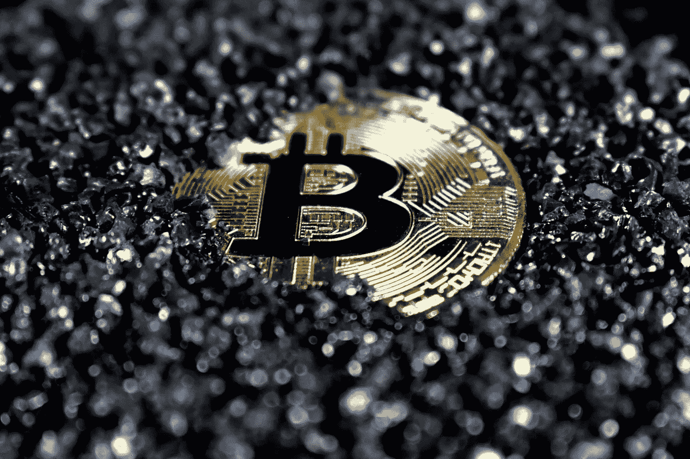

# 如何识别下一个比特币

> 原文：<https://medium.com/coinmonks/how-to-identify-the-next-bitcoin-2d6ccc1b5b2b?source=collection_archive---------55----------------------->

每个交易者都希望在加密货币的价值大幅提升之前，在它从微小变成巨大的硬币之前，购买加密货币。在一个拥有超过 10，000 种不同硬币、并以流动性差而闻名的市场中，预测一枚硬币的价格上涨显然具有挑战性。

***那么……如何做到不在百大加密货币的大名单上扔飞镖呢？***

你可以做两件主要的事情来提高你看到未来登山者的几率，尽管显然没有确定的方法来预测下一个大的加密货币在它变大之前。

——**1。-检查价格数据，并将其与其他技术指标结合起来，在温和反弹发展成长期牛市之前，寻找重要的 1 小时、1 天或 1 周走势。**

- **2** 。- **对这种注重价格的方法进行补充，分析已经开始波动的硬币的潜在因素，以确定它们是否确实具有强大的长期潜力。**

随着 2022 年的到来，一些交易新手可能会觉得比特币和以太坊等加密货币已经变得太有价值，太成熟了，不合他们的口味。它们的价格似乎过高，它们真正令人垂涎的扩张可能(也可能不会)即将结束。

那么……如果你想在一年内获得比如说两位数(或三位数)的回报，你会怎么做？

***搜索突破反弹的价格数据，作为你的第一步行动。*** 每种主要和次要加密货币的当前状态，连同其最近的价格变化和其他市场数据，都列在类似[**coin gecko**](https://www.coingecko.com/)**和**[**CoinMarketCap**](https://coinmarketcap.com/)**的网站上。**

通过单击这些网站上“1h”、“24h”和“7d”百分比列的顶部，可以根据在过去一小时、一天或一周内增长最多的加密货币对前 100 种加密货币进行排序。这让你可以确定任何东西是否真正开始反弹，在一两个时间框架内显著的百分比上涨表明潜在的突破(特别是如果这些上涨大于过去一周或一个月的百分比上涨)。

需要注意的是，CoinGecko 和 CoinMarketCap 不允许您简单地检查前 8，000 种加密货币(按市值)来确定哪些货币在之前的一小时、一天等时间里变化最快。您还可以查看前 200 名、前 300 名等。滚动到底部并选择下一页。通过这样做，你将能够注意到更新、更小的硬币，可能会增加你首先发现任何新事物的机会。

> 交易新手？试试[加密交易机器人](/coinmonks/crypto-trading-bot-c2ffce8acb2a)或者[复制交易](/coinmonks/top-10-crypto-copy-trading-platforms-for-beginners-d0c37c7d698c)

这将揭示一些你可能从未听说过的加密货币。因此，这是一个很好的工具，可以在媒体报道之前了解加密货币，那时可能已经太晚了。

首先对数据进行定价，以找到一枚内在潜力很高的长期增长硬币，这似乎有些奇怪或不合逻辑。然而，现在有如此多的加密货币可用，以至于需要花费大量的时间来搜索网络并研究每一种加密货币。

因此，从本质上来说是信息传播手段的市场，是将潜力大的硬币与潜力小或没有潜力的硬币区分开来的有用工具。也就是说，价格的变化和上涨应该被解释为一种暗示，即市场认为某个特定的硬币可能是好硬币。除了价格，如果可能的话，检查其他技术数据也是一个好主意。

如果你能找到最近的硬币， ***NVT 比率*** 是另一个可比较的指标。这将一枚硬币的市值与其原生平台的交易量进行比较，就像市场 ***的市值与 TVL 的比率*** 一样。再一次，大的比率表明某种东西已经被高估，在它出现显著反弹之前购买可能已经太晚了。

*   **基础研究与分析**

话虽如此，我们都知道加密货币市场有着不成比例的投机性 memecoins 和 pumps and dumps。出于这个原因，对相关加密货币背后的平台或项目的分析必须在价格数据显示新的上涨者之后进行。

假设你发现了一种相对较新的替代硬币，它的价值最近才开始上升。通过找到并阅读它的白皮书来开始你的研究将是明智的。你正在处理一种真正的加密货币的想法应该得到一份精心编写的全面白皮书的支持，即使我们中很少有人是计算机科学和密码学方面的专家。它还应该让你了解加密货币所处的特定行业，以及它的潜在竞争对手是谁。

投资一种已经开始上涨的新硬币可能是个好主意，如果它在变得更大之前检查了其中的一些方框。加密货币的世界没有什么是确定的，特别是考虑到市场是如此之小，而且容易受到较大参与者的操纵。

加密货币的投资者经常建议新用户只投资他们能够承受损失的资金。小盘币更是如此。但如果你按照上面的说明去做，至少会增加胜算。

 [## 即使和很多人在一起，我也感到孤独。

### 我认为我们非常孤独，比我们让任何人知道的都要孤独。我们生活在一个不那么孤独的世界…

medium.com](/@lifeaccordingtoalex/i-feel-alone-even-when-i-am-with-a-lot-of-people-d377ee974334) 

[突触网络](https://medium.com/u/84a7c56901?source=post_page-----2d6ccc1b5b2b--------------------------------) [詹姆士·勒罗伊·威尔森](https://medium.com/u/3b84991b6cfe?source=post_page-----2d6ccc1b5b2b--------------------------------) [苏巴加亚·萨胡](https://medium.com/u/23cbd4cec9b0?source=post_page-----2d6ccc1b5b2b--------------------------------) [拉克希亚·普拉塔普·蒙加](https://medium.com/u/a7fb9eb57527?source=post_page-----2d6ccc1b5b2b--------------------------------)

> *加入 Coinmonks* [*电报频道*](https://t.me/coincodecap) *和* [*Youtube 频道*](https://www.youtube.com/c/coinmonks/videos) *了解加密交易和投资*

# 另外，阅读

*   [有哪些交易信号？](https://coincodecap.com/trading-signal) | [Bitstamp vs 比特币基地](https://coincodecap.com/bitstamp-coinbase) | [买索拉纳](https://coincodecap.com/buy-solana)
*   [加密交易机器人](/coinmonks/crypto-trading-bot-c2ffce8acb2a) | [维护审查](https://coincodecap.com/uphold-review)
*   [如何给 MetaMask 钱包添加 Arbitrum？](https://coincodecap.com/how-to-add-arbitrum-to-metamask-wallet)
*   [KuCoin vs 北海巨妖 vs BitYard](https://coincodecap.com/kucoin-vs-kraken-vs-bityard)
*   [加密交易的最佳 VPN](https://coincodecap.com/best-vpns-for-crypto-trading)
*   [ProfitFarmers 回顾](https://coincodecap.com/profitfarmers-review) | [如何使用 Cornix 交易机器人](https://coincodecap.com/cornix-trading-bot)