# 如何安装和使用信任钱包

> 原文：<https://medium.com/coinmonks/how-to-install-and-use-the-trust-wallet-7326206c9480?source=collection_archive---------24----------------------->

本指南包含如何安装、设置和使用 Trust Wallet 的详细步骤。

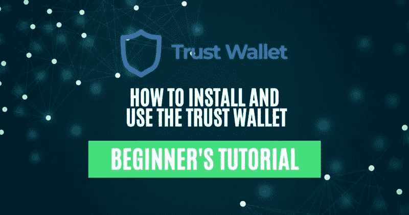

## Trust Wallet 是一个移动钱包应用程序，允许用户发送/接收、交换、购买、交换和下注他们的加密资产。用户可以将自己的以太坊(ERC721 和 ERC1155)和 BSC (BEP721 和 BEP1155)收藏品存放在钱包中。它还提供了一个全功能的 Web3 浏览器，用户可以使用它与多个分散的应用程序(dApps)进行交互。该钱包目前支持 65 个区块链和 450 多万资产。该应用程序适用于安卓和苹果设备。

在本文中，我们将介绍如何安装和使用信任钱包。在[下一部分](https://www.altcoinbuzz.io/bitcoin-and-crypto-guide/how-to-stake-bnb-using-trust-wallet/)中，我们将解释如何从你的信托钱包中下注一枚 [BNB](https://www.altcoinbuzz.io/cryptocurrency-news/bnb-chain-updates-top-gaining-projects-on-bnb-chain-june-week-4/) 硬币。

**安装信任钱包应用程序(安卓手机)**

要安装该应用程序，请访问 Google Play 商店并搜索 [Trust Wallet](https://trustwallet.com/assets) 应用程序。

**注意:**从 Google Play 商店安装任何应用程序时，都要检查应用程序的评级和下载次数。这将有助于检查申请的真实性。

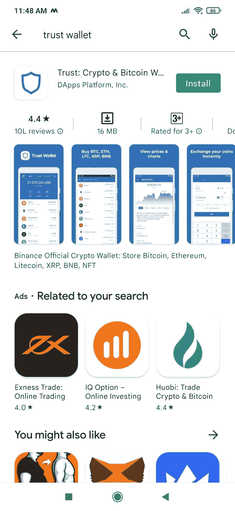

点击**安装**，应用程序将下载到您的手机上。

**设置信任钱包**

启动应用程序以查看各种设置选项。信任钱包提供以下选项，您可以通过这些选项来设置您的帐户:

*   创建新钱包
*   我已经有一个钱包了

如果您是 Trust Wallet 的新用户，并且想要创建一个全新的帐户，请使用第一个选项。

第二个选项将让您通过给出关键短语来导入现有帐户。

**创建新钱包**

新用户可以通过选择此选项来创建钱包。应用程序将要求设置钱包的密码。一旦设置了密码，它将向您显示备份短语，并要求您验证密钥短语。

验证正确后，您的钱包将被创建，您可以看到登录页面。

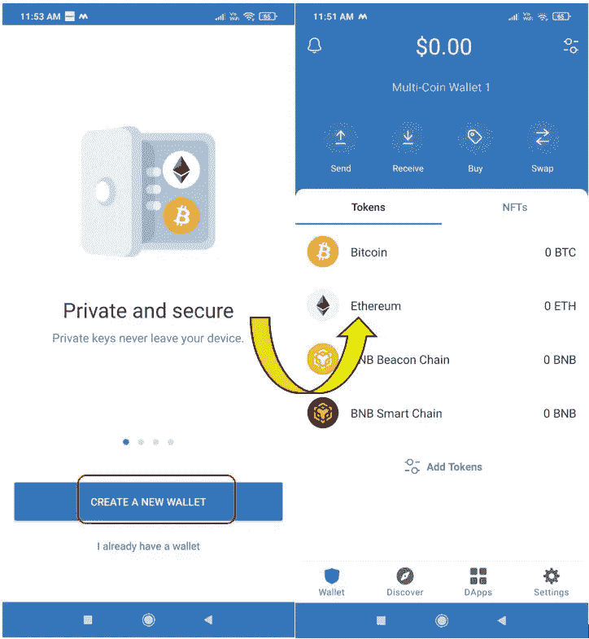

**注意:**安全存储您的钱包密钥短语(12 字或 24 字)。如果您丢失了设备，您的关键短语可以帮助找回您的资产。如果你丢失了关键短语，你将无法收回你的资金。

**恢复钱包**

恢复钱包选项可以帮助您在其他设备上设置现有帐户。

要恢复，请在安装后启动应用程序时，单击**我已经有一个钱包**选项。

现在，由于信任钱包是一个多链钱包，应用程序将要求您选择网络。假设我们选择了以太坊作为网络。您现在将获得以下不同的选项，您可以通过这些选项导入您的帐户:

*   备份短语(12 字或 24 字)
*   JSON 文件
*   私人密钥
*   地址

选择您喜欢的选项，并正确输入详细信息。完成后，您可以看到您现有的资产。

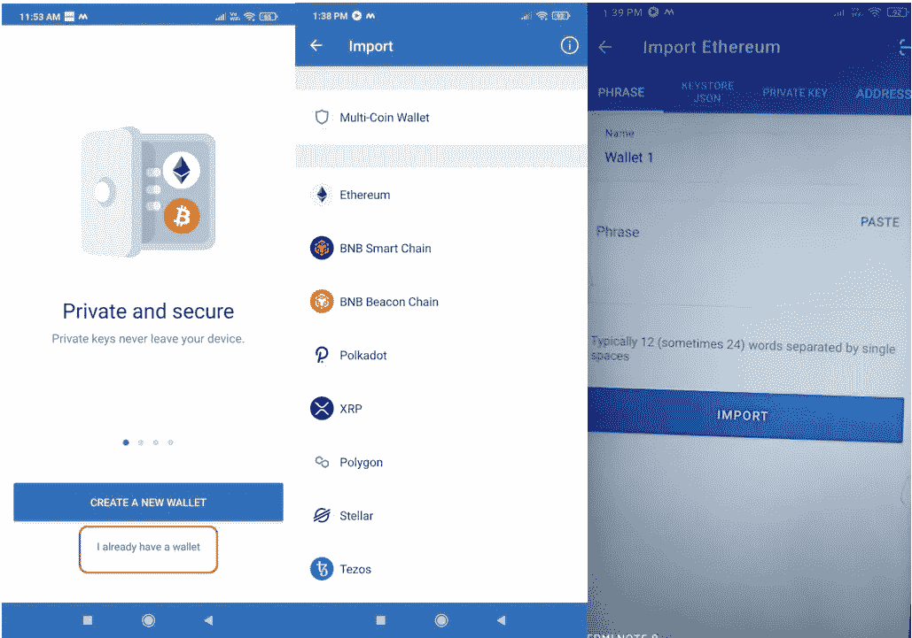

**发送**

发送选项允许用户将资产转移到其他地址。

要发送，首先，选择您要转移的硬币/代币。展开细节，你会发现**发送**按钮。点击它，并填写以下详细信息:

*   收件人地址
*   要转移的金额
*   备忘录(可选)

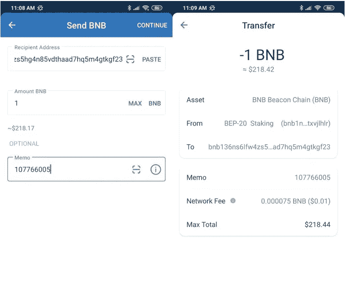

填写完上述所有细节后，点击**继续**以最终审查并确认流程。

**接收**

要在您的钱包中接收代币，您需要接收/公共地址。信托钱包是一种多链条、多资产的钱包。要接收钱包中的任何代币，请先选择代币并打开其详细信息。在这里，您可以找到**接收**按钮。点击此按钮获取地址或二维码。

请注意，该地址特定于令牌和网络。如果您使用此地址接收任何其他令牌，您可能会失去您的资金。

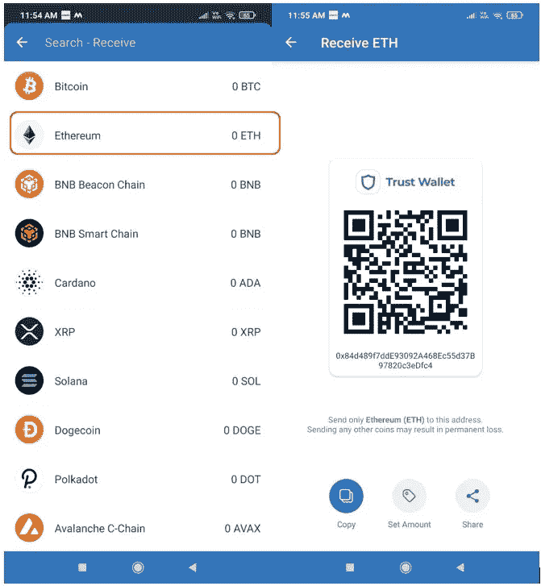

您可以按照相同的步骤获取其他令牌的接收地址。

**购买**

信任钱包允许用户从他们的钱包界面购买资产。购买工具由第三方服务提供商(MoonPay、Simplex、Transak、Ramp、币安连接)提供支持。

若要购买，请先选择令牌。接下来，输入您希望用于购买资产的金额。在这里，您可以查看不同服务提供商的费率，并选择您喜欢的服务提供商。

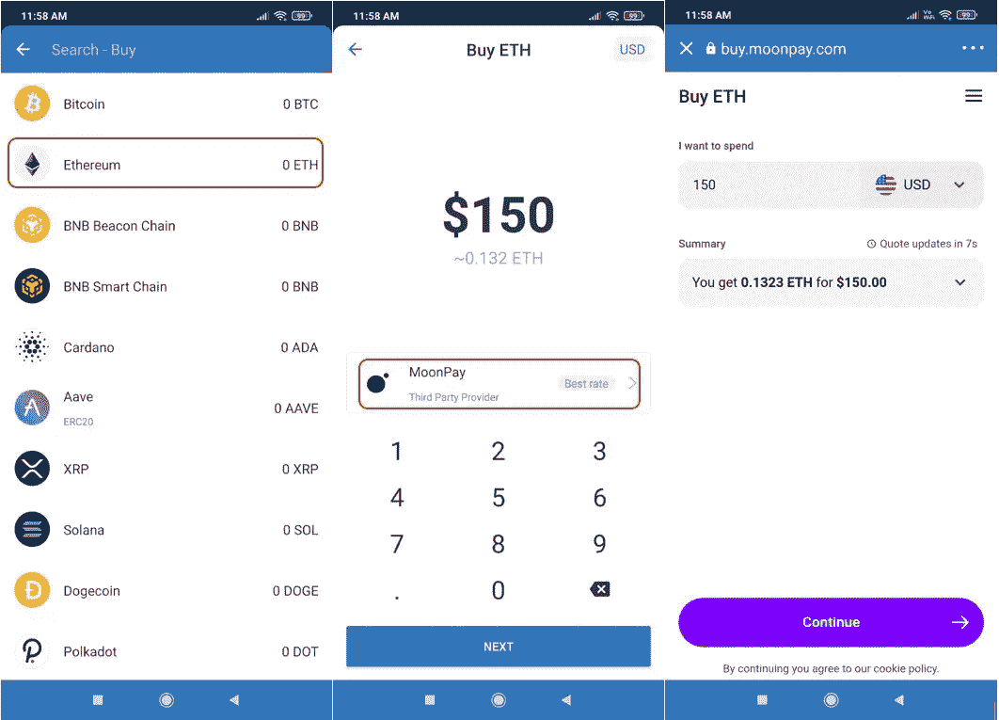

选择货币并确认流程。现在，您将被重定向到服务提供商的门户网站，如果您是首次使用该门户网站，则需要通过 KYC 流程。

一旦你的 KYC 完成，你就可以进行最后的支付，代币将会存入你的账户。

**互换**

交换选项允许您将一项资产与另一项资产交换。要进行交换，您需要选择您想要用来交换您需要的资产的源资产。输入源资产的金额，应用程序将显示您将收到的输出令牌的金额。

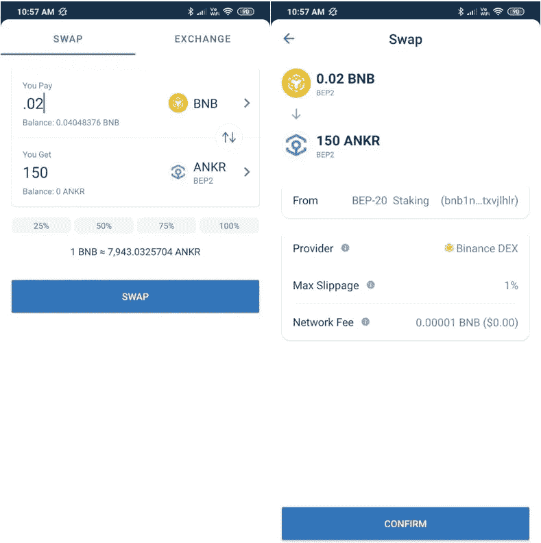

确认流程。交易成功后，您可以在钱包中看到所需的输出令牌。

**交换**

信任钱包交换选项允许您与币安 DEX 连接，并让您像传统的加密交换一样下单(购买/出售)。目前，兑换功能仅适用于 BNB BEP 2 代币交易。因此，当您检查可用市场时，您会发现只有 BNB 市场存在。

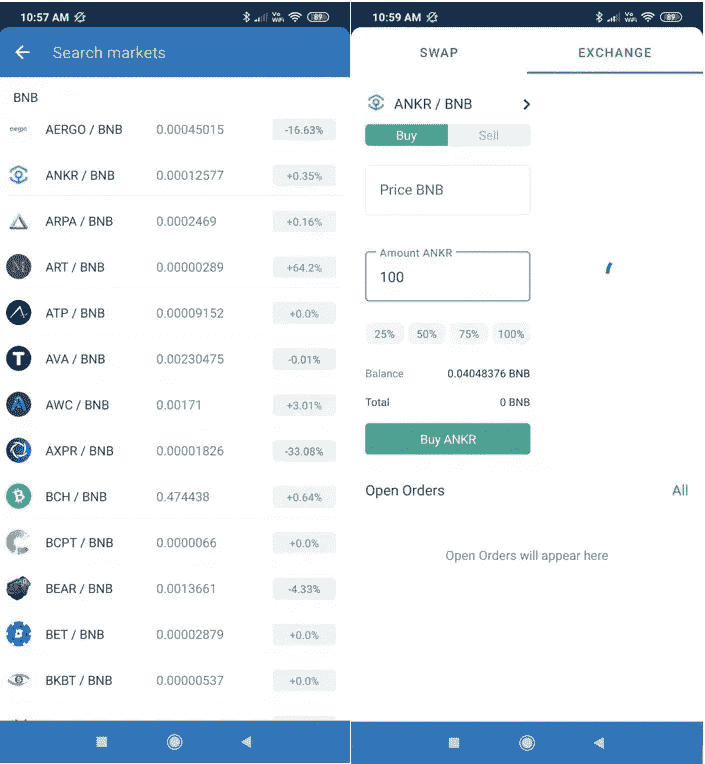

您可以从**市场**部分选择交易对，并下达买入/卖出订单。

**添加令牌**

默认情况下，您可以在信任钱包页面上看到一些硬币/代币。如果您想添加更多令牌，请转到**添加令牌**选项，并切换所需令牌对应的按钮，以便在您的登录页面上看到它。

按照下面截图中显示的步骤添加令牌。

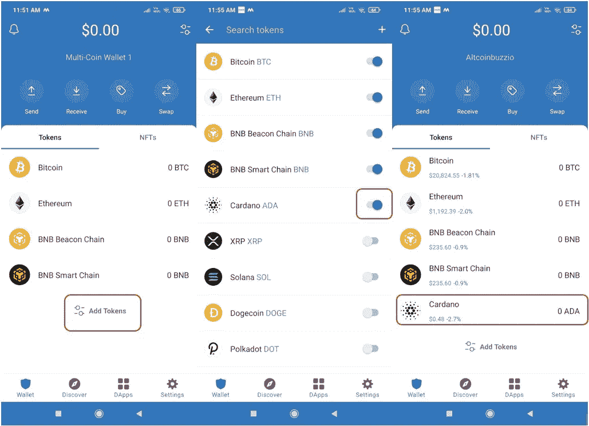

您可以按照相反的步骤禁用硬币，它将不再出现在您的钱包登录页面上。

**添加自定义令牌**

有时，您(或其他人)转移了一个令牌，但它没有出现在您的帐户上。在这种情况下，您可以通过转到**添加自定义令牌**部分来添加它。要手动添加令牌，您需要提供以下详细信息:

*   令牌合同地址
*   名字
*   标志
*   小数

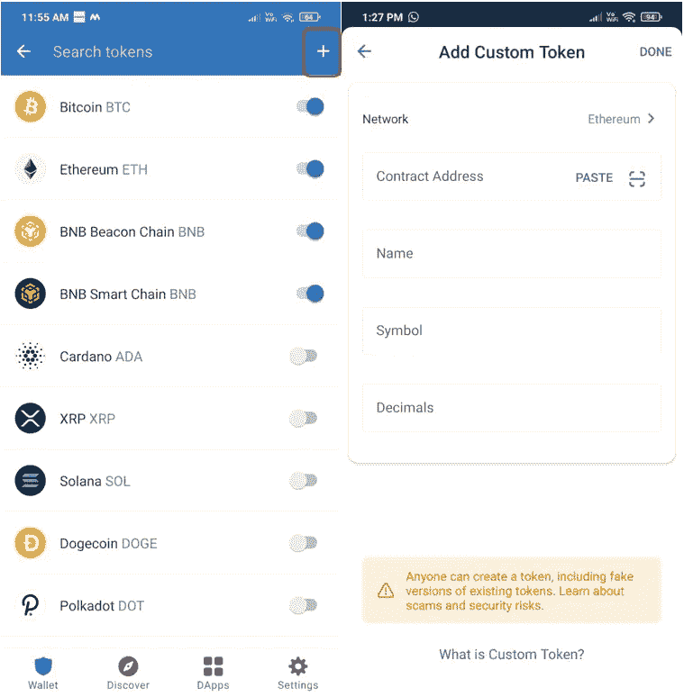

**NFTs**

信任钱包允许用户将他们的 NFT 存储在他们的钱包帐户中。用户目前可以将他们在以太坊(ERC721，ERC1155)和 BSC (BEP721 和 BEP1155)网络上的收藏品存储在他们的钱包上。

要在您的 Trust Wallet 帐户中接收 NFT，请点击出现在 Wallet 界面的 **NFT** 部分的**接收**按钮。这将显示一个地址，您可以使用它来转移您的收藏品。您也可以从钱包界面访问您的 OpenSea 帐户。

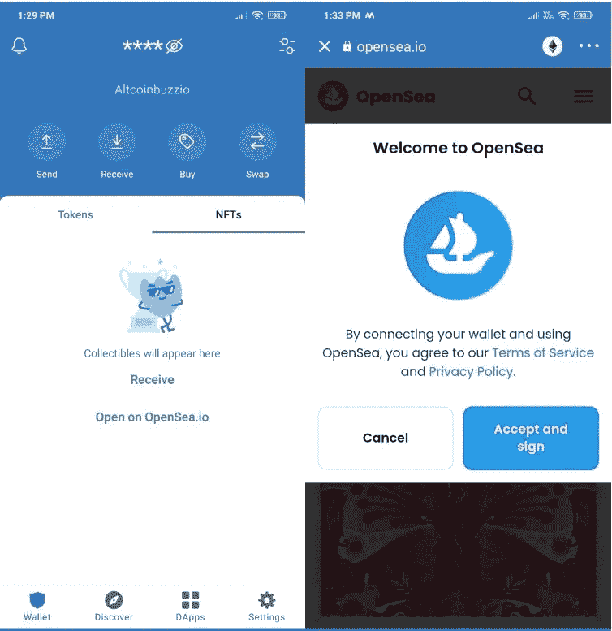

**dApps**

在此选项卡中，您可以查看使用信任钱包可以连接的所有 dApps 的列表。应用程序进一步分为不同的部分，如 Defi，产量农业，游戏，交流，市场，社会，公用事业，赌注等。为了容易接近。您可以选择任何 dApps 并连接您的 Trust Wallet 帐户并使用它。

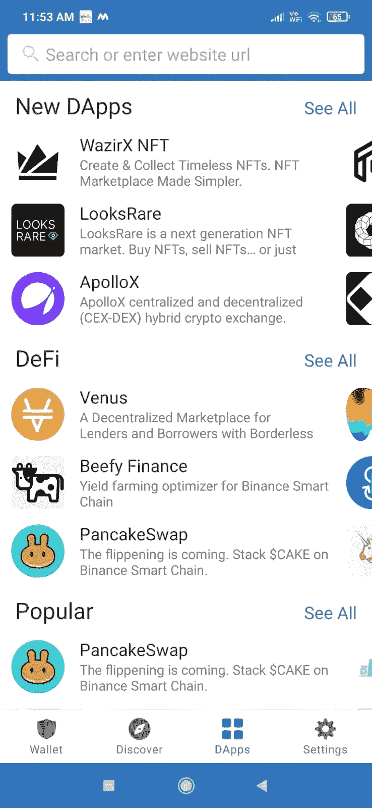

现在，假设您希望访问 PancakeSwap，从 dApps 选项卡中选择 dApp。它首先会询问您是否允许将钱包与 PancakeSwap 平台连接。一旦您提供批准，您将被重定向到 PancakeSwap 平台，并连接您的 Trust Wallet 帐户。

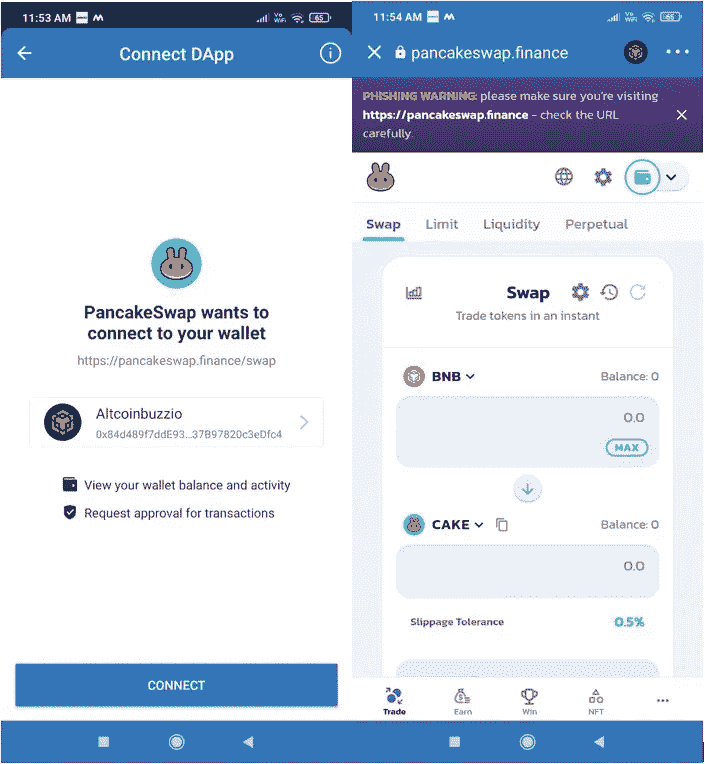

用户现在可以使用该平台进行互换、添加/移除流动性等。

在本系列文章的[下一部分](https://www.altcoinbuzz.io/bitcoin-and-crypto-guide/how-to-stake-bnb-using-trust-wallet/)中，我们将解释如何从你的信托钱包中下注你的 BNB 硬币。

***注:*** *本帖首发* [*此处*](https://www.altcoinbuzz.io/bitcoin-and-crypto-guide/how-to-install-and-use-the-trust-wallet/) *同*[*ltcoinbuzz . io*](https://www.altcoinbuzz.io/)**。**

***跟着我***

***👉**推特*

***👉**[**Linkedin**](https://www.linkedin.com/in/ruma-das-a1439320/)*

> ***交易新手？尝试[加密交易机器人](/coinmonks/crypto-trading-bot-c2ffce8acb2a)或[复制交易](/coinmonks/top-10-crypto-copy-trading-platforms-for-beginners-d0c37c7d698c)***