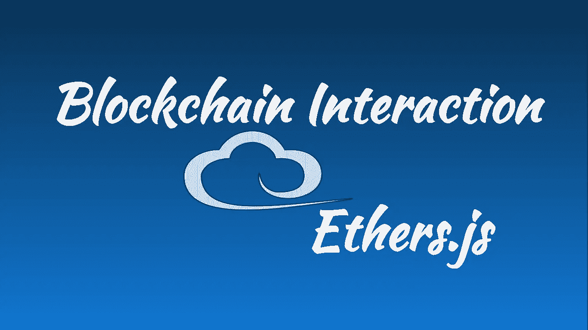
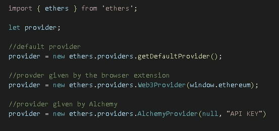
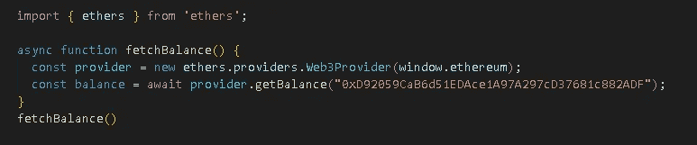
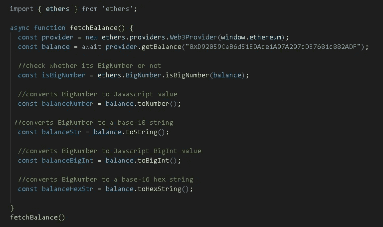
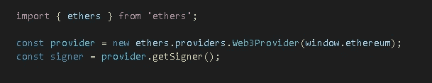
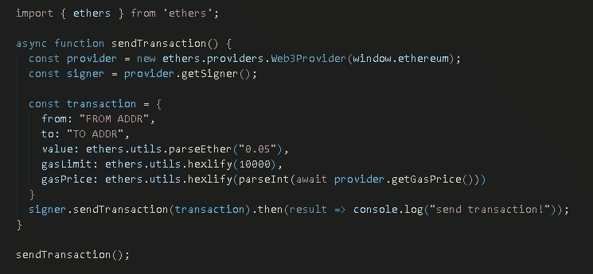
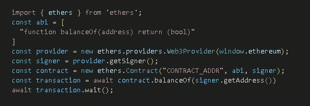

# 如何使用 Ethers.js 与区块链交互

> 原文：<https://medium.com/coinmonks/how-to-interact-with-blockchain-using-ethers-js-7d0be4a8a6e8?source=collection_archive---------4----------------------->

## 区块链系列

## 利用以太网，在区块链上读取数据和发送事务



## Ethers.js

Ethers.js 是一个允许我们与以太坊区块链及其生态系统连接的库。我们可以使用 ethers 通过 JSON-RPC、Infura、Alchemy、Cloudflare 或 Metamask 连接以太坊节点。 [Alchemy](https://znsrc.com/c/thgjmaelof) 还有一个 [ethers.js SDK](https://github.com/alchemyplatform/alchemy-sdk-js) ，它是 ethers.js 提供者的超集，直接与其 API 交互，如 JSON RPCs 和 NFT API。炼金术可以免费使用。

## 装置

```
npm install ethers
```

## 证明

Metamask、比特币基地、TrustWallet 和 Phantom 等加密钱包用于连接区块链。它们为每个分散的应用程序提供了一个入口点。我们可以在浏览器上安装加密钱包作为附件或插件。

当我们添加加密钱包作为浏览器的扩展时，它们会自动将自己注入到浏览器窗口对象中。例如，如果我们添加了[元掩码](https://chrome.google.com/webstore/detail/metamask/nkbihfbeogaeaoehlefnkodbefgpgknn)扩展，它将以太坊对象注入到浏览器窗口中。

## 建立提供商连接

Ethers.js 库使得连接到区块链中的任何节点变得很容易。我们既可以使用浏览器扩展提供的默认提供者，也可以使用第三方 RPC 提供者，如 Alchemy、Infura 和 Moralis。



Credits: Author

## 获取钱包余额

初始化提供者后，我们可以调用提供者方法 getBalance()来获取以太坊帐户的余额。



Credits: Author

## 处理大数字

在以太坊中，很多操作都是对 javascript 中值范围之外的数字进行的，称为 BigNumbers。Ethers.js 帮助我们将大数字转换成人类可读格式的数字。



Credits: Author

## 创建签名人

签名者是区块链帐户的抽象，用于在区块链上签署消息和发送交易。初始化提供者后，我们可以从中创建一个签名者。



Credits: Author

## 发送交易记录

我们可以使用签名者来发送事务。交易对象可能包含从和*到*地址的*，要发送的令牌*值*，气价*和气限*。***

**

*Credits: Author*

## *与智能合同的交互*

*我们可以连接到智能契约，并使用签名者调用契约 ABI 中指定的方法。ABI 是用 JSON 格式编写的。它包含关于智能合约的详细信息，例如可用的功能、如何使用它们以及如何从它们中检索数据。*

*例如，如果您的 ABI 包含 balanceOf()函数，我们可以如下调用该方法:*

**

*Credits: Author*

*开始使用 ethers.js 构建的一些教程:*

*   *[建立像 Opensea 一样的 NFT 市场 dapp】](https://znsrc.com/c/epnkfztxtu)*
*   *[在多边形上部署智能合同](https://znsrc.com/c/ovqrtxgndb)*

## *谢谢:)*

> *交易新手？试试[密码交易机器人](/coinmonks/crypto-trading-bot-c2ffce8acb2a)或[复制交易](/coinmonks/top-10-crypto-copy-trading-platforms-for-beginners-d0c37c7d698c)*