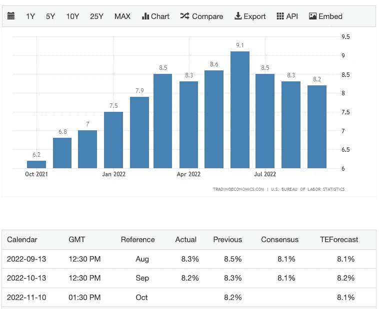

# 如何投资 1000 美元—第二部分

> 原文：<https://medium.com/coinmonks/how-to-invest-1k-part-2-2b4132b6ff6b?source=collection_archive---------25----------------------->

有什么比 A 计划更好的？a 计划 b。

我在这里分享了我在这个不确定的市场中关于我的**1k 美元投资**的策略。我的意思是积累大约 19.500 美元的 BTC，我打算在 0.878 美元的时候买入 GLP。然后我看到 [CPI US 数据](https://tradingeconomics.com/united-states/inflation-cpi)几天后就要发布了，于是决定等等。当 9 月份公布 CPI 数据时，BTC 明显抛售了。所以我模仿 DYOR，我发现:

1.  9 月 CPI(约 8 月通胀数据)8.3%:预期走低，数值走高令市场倾倒；
2.  10 月份 CPI(大约是 9 月份的通胀数据)为 8.1%，大多数分析师预计数据会更高，还会有一次下跌

所以，这是我的策略:

> CPI <8%: buy&long
> 
> CPI = 8.1% buy BTC and enjoy a small pump
> 
> CPI = 8.2% wait a small dump and buy $GLP
> 
> CPI > 8.3%买入 BTC 并做空

我开始享受 youtube 上的 Cryptorover(我经常关注的分析师之一)的直播，8.2%的数据一发布，BTC 就开始拼命抛售。

对我来说，这是故事和学习中最好的部分:当 BTC 不断抛售(18.600 美元，18.300 美元或更低)时，我怀疑我的策略和我的决定。我运行我的指数，把我的 1000 美元做空 BTC:每个人都在做空，我在赔钱。

但是我后退一步，认为不应该在情绪的波动上投资:这就是为什么像 FOMO 和 FUD 这样的词存在。我依靠我的策略，买入了 GLP:我实际上已经准备好进一步抛售，但这是我可以接受的短期效应的一部分。BTC 开始抽水从来没有低于价格，我正在考虑做空。

接下来的几个小时，BTC 一直在敲 20k 的门，即使它被拒绝，但它仍然高于 19.100 美元。我在 GLP 的头寸就在那里，使我在 ETH 的 APR 超过 19%。预计会有更多的波动，我们所有人都必须做出相应的评估和行动。

但如果我在恐慌时刻做出任何决定，做空，我会损失我投资的很大一部分，更糟糕的是，我会成为一个糟糕的投资者，因为在困难时刻我不能坚持我的策略。

下一次 CPI 数据将于 11 月 10 日公布。

希望这次学习能再次对我以后有所帮助。

> 交易新手？尝试[加密交易机器人](/coinmonks/crypto-trading-bot-c2ffce8acb2a)或[复制交易](/coinmonks/top-10-crypto-copy-trading-platforms-for-beginners-d0c37c7d698c)