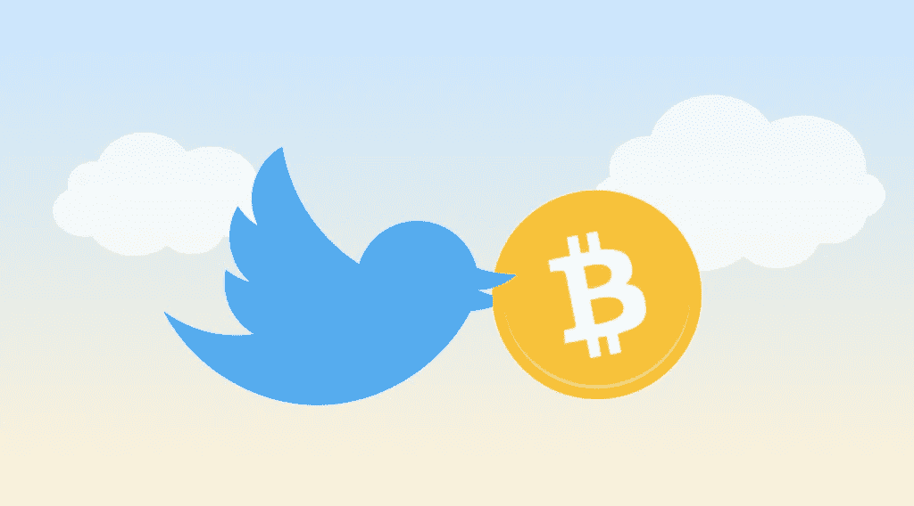
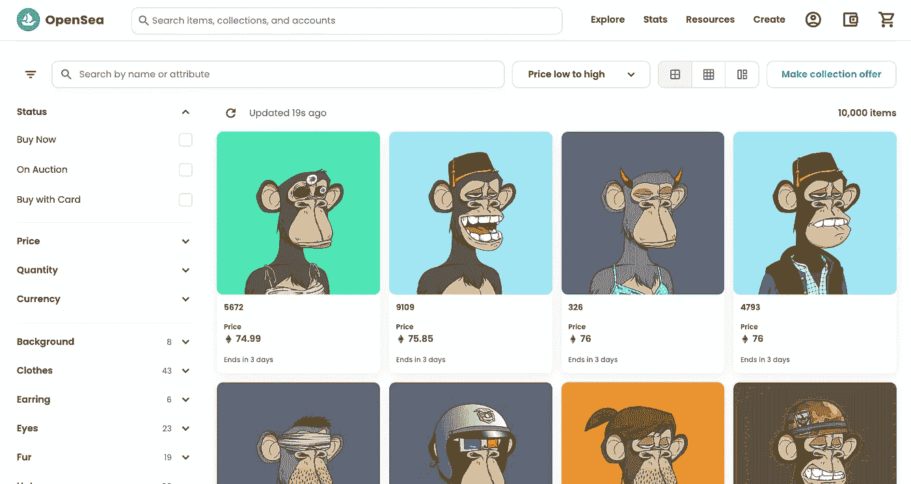
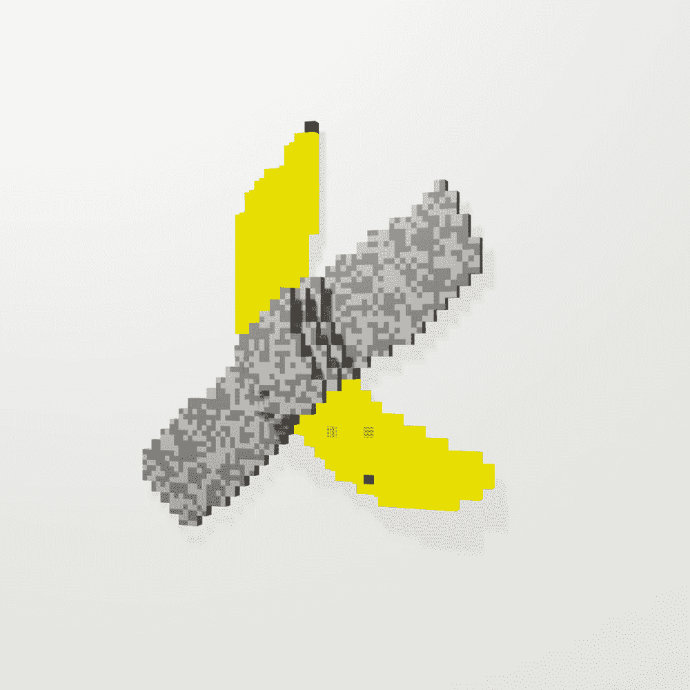
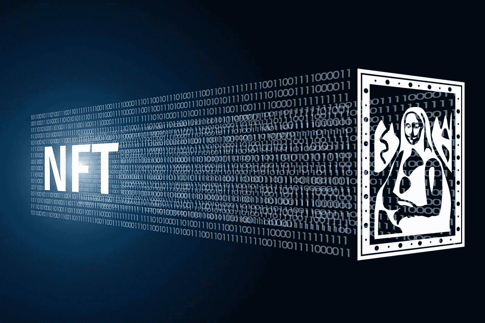
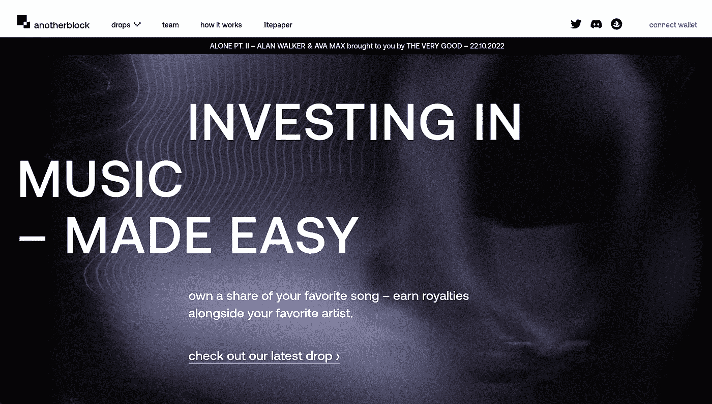

# 如何用 NFTs 赔钱

> 原文：<https://medium.com/coinmonks/how-to-lose-money-with-nfts-be3b14516a91?source=collection_archive---------15----------------------->

## 以及如何在 NFT 空间中航行

NFTs 是我们这一代最具突破性的技术之一。再过几年，我们将无法想象一个没有它们的世界。这些代码行，作为晦涩难懂的 JPEGs 而广为人知，将创造全新的经济，并彻底改变我们管理产权的方式。

然而，今天涉足 NFT 市场几乎肯定会赔钱。这是清空你储蓄账户的单程票。

Credit [NFT News Pro](https://nftnewspro.com/nfts-fees-and-trading/)

低质量的骗局很普遍，狡猾的项目创始人试图利用这个机会快速获利。就在上周，一个 NFT 项目的创始人声称在项目完成和资金到位后就“去世”了。

所以，让我们以一些在 NFT 市场上损失血汗钱的万全之策开始这篇文章。

# 像伟人一样交易 NFT

## **1。设定百万富翁的最后期限**

没有截止日期的目标只是一个愿望清单。这也适用于交易非功能性交易。

在你开始交易之前，确保你设定了成为百万富翁的时间表。这将激励你快速交易，不要过度思考你的决定。

你的百万富翁期限无疑会改善你的决策，并导致一些严重的交易。话虽如此，你不能忽视…

## **2。尽职调查**

非金融资产是地球上最热门的资产类别。这并不意味着你可以逃避尽职调查。但是你如何保证你能参与下一个[月鸟](https://www.moonbirds.xyz/)或者 [BAYC](https://boredapeyachtclub.com/#/) 项目呢？你去哪里做适当的尽职调查？

当然是加密推特！

Credit [Marko Mihajlović](https://academy.shrimpy.io/post/a-guide-to-crypto-twitter)

所有热门的新项目都在 Twitter 上公布和讨论。在这里，你可以获得即将上市的最新 NFT 的内幕消息。

当你发现一个接近 mint 的项目时，你应该专门在 Twitter 上做尽职调查。滚动浏览 2 到 3 条推文(不超过 5 条),评估情绪。相信你的直觉。如果每个人看起来都很兴奋，那你就有所收获了。只要人们有一张很酷的 NFT 头像，他们就是一个可靠的来源。

你不应该在这一步花费超过 5-10 分钟的时间(记住你的百万富翁截止日期)。只需点击造币页面并连接您的钱包。

如果你幸运的话，你甚至可以在早上把你的文件夹洗干净。

## **3。看看令人印象深刻的销量**

想要真正的阿尔法吗？前往 [OpenSea](https://opensea.io/) 网站，选择你喜欢的 NFT 系列。点击“最近上市”下拉菜单，并选择“最高的最后销售”。如果你看到一些令人印象深刻的数字，你知道你是赢家。这些 NFT 卖过一次高价，他们还会再卖一次。

跳进去把上次的高价卖了几个 ETH。就像印钞票一样。

这个建议应该可以让你重新抵押你的房子，并且立刻清空你的养老金。

然而，知道你在找什么是有帮助的..

## **4。寻找下一个 BAYC 或 CryptoPunk**

知道你在寻找什么会大大减少你寻找伟大交易的次数。过去的表现是未来结果最可靠的指标，所以从那里开始。过去做得好的有哪些？

[无聊猿游艇俱乐部](https://boredapeyachtclub.com/#/)和[隐朋克](https://larvalabs.com/cryptopunks)。

[BAYC on OpenSea](https://opensea.io/collection/boredapeyachtclub)

酷，所以现在我们只需要找到一个稍微有点扭曲的外观相似的项目。最好它们应该几乎相同，只有细微的差别。你离得越近，就越有可能付出高价，再也见不到那笔钱。

但是话说回来…

## **5。NFTs 仅上升**

最后，谁在乎你交易的是什么项目呢？NFT 很热门，当宏观环境改善时，它的价值会飙升。我们可能处于熊市，但 NFTs 未来只会上涨。就买蘸酱吧。

如果你想确保明年把你的积蓄一扫而空，请遵循以下步骤:

去 OpenSea，闭上眼睛，朝屏幕扔飞镖。不管飞镖打到什么项目，都买。冲洗并重复，直到你的钱包里没有钱了。

你从事什么项目真的不重要，即使是像素化香蕉和胶带的 NFT。NFTs 只会上升。这一致命的举动将会让你提前步入财务坟墓(特别是因为你需要在信用卡上安装一个新的电脑屏幕)。

有趣的是，我确实拥有一个像素化香蕉的 NFT。在这里。

现在你已经掌握了一些在 NFTs 中赔钱的好方法，让我们继续吧。

# 如何以正确的方式购买 NFT

希望你已经注意到了上一节中讽刺的语气。如果没有，愿上帝帮助你。

是时候转变态度，认真对待非功能性测试了。当你准备购买 NFT 时，你实际上应该寻找什么？

让我现在告诉你，购买 NFT 来获利是一种危险的方法。当然，如果运气好的话，你很快就能赚很多钱。但这不是参与的正确方式。

这里有一些提示给那些第一次购买 NFTs 并加入社区的人。

Credit [Chemistry World](https://www.google.com/url?sa=i&url=https%3A%2F%2Fwww.chemistryworld.com%2Fnews%2Fworlds-first-nft-marketplace-for-science-and-tech-ip-to-launch-in-march%2F4015052.article&psig=AOvVaw2GVRQYn5fDm2cwLH8UjcRC&ust=1666604034033000&source=images&cd=vfe&ved=0CA0QjhxqFwoTCLD_lP2F9voCFQAAAAAdAAAAABAE)

## **1。买便宜学**

如果你从未买过 NFT，我建议你买些便宜的作为教训。这是一个新的领域，你必须从某个地方开始。只要在二级市场上找到一个你认为看起来很酷的便宜的 NFT 就买下来。经历旅程。

除了经历购买 NFT 的经历之外，你从中学不到什么特别的东西。很多问题将会出现，所以这应该是你找到这些问题的答案的时候，而不要把你的全部积蓄置于危险之中。

一旦你适应了这个过程，你就可以开始深入挖掘了。

## **2。研究并参与社区活动**

了解谁组成了社区和某个项目的创建者团队会有很大的不同。通过加入他们的 Discord 服务器，你通常可以感觉到团队有多投入，社区成员有多兴奋。跳进去和人们交流。感受一下气氛，衡量一下你的感受。

警惕那些从不回应持有人或社区的游离创作者团队。上一次在服务器上发布公告是什么时候？主持人是否促进对话并回答问题？休眠的 NFT 项目的所有者可能正忙着在阿鲁巴花代币持有者的钱。

## **3。了解路线图和**

持有 NFT 的长期动机是什么？阅读创作者团队的路线图或文字材料，了解他们的计划是什么。这会让你对未来的旅程有一个感觉，你可以判断你是否同意他们的计划。如果它不符合你的价值观和信念，那就继续下一个项目。

一个清晰的路线图将有助于让社区对他们的发展方向感到兴奋，如果你想让 NFT 随着时间的推移保持其价值，你应该意识到这一点。

也就是说，如果你打算将 NFT 作为资产持有。也许你不应该？

## **4。爱 NFT**

这听起来可能有点古怪，但请相信我。不，这不是一个充满希望的祈祷密码神帮助你的 NFT 泵在价格。

这是一个忽略价格变动的建议。谁在乎价格？你真的喜欢 NFT 吗？如果是这样，你不能失去它(除非你支付 100+ ETH。你可能会失去一部分)。

找到你真正热爱的 NFT 是参与其中的好方法。这不是一项你指望能赚钱的投资。如果你出于对游戏的热爱而购买 NFT，你将卸下肩上的许多压力。

也就是说…

## **5。寻找实用程序**

NFT 项目为代币持有者提供各种奖励。如果你想把这个因素考虑进去，这可以是一种给你的 NFT 赋予货币价值的方法。

项目提供的东西，如优先获得未来的下降，空投，会见和问候创作者，和商品。在某些情况下，你的 NFT 作为你的连锁活动的凭证。在这种情况下，该实用程序通过 NFT 向社区的其他人展示您所取得的成就。

[Galxe 是一个使用 NFTs 作为凭证进行探索的好地方](https://galxe.com/)。

这个对你有没有价值，由你自己决定。

在[音乐 NFTs](/@callumcarlstrom/how-nfts-are-redefining-the-music-industry-c2431cdae54c) 的案例中，你实际上可以通过流媒体版税将它们作为分散现金流投资的一种方式。确定这些 NFT 的价值更多的是根据价格和所有权百分比来评估未来的潜在现金流。我个人拥有由另一个街区为你做这个预测的[音乐 NFTs 的第一季。](https://anotherblock.io/)

[AnotherBlock](https://anotherblock.io/)

## **6。关注正确的 Twitter 社区**

请自担风险进入。Twitter 可能是一个可疑的地方，你可能已经从本文的第一部分中发现了这一点。然而，如果你找对了地方，你可以在加密推特的深处找到一些严肃的阿尔法。很容易拐错弯，所以在这里要小心。

从关注一些有合适资质的知名人士开始。从那里找到你的路会容易得多。推荐特定的人很难，因为我们都对 web3 的不同领域感兴趣。如果你真的不知道从哪里开始，问问你加入的一个 Discord 服务器的社区。

[这里有一篇很好的文章来指导你使用加密 Twitter。](https://academy.shrimpy.io/post/a-guide-to-crypto-twitter)

NFT 是一个棘手的行业，太容易被炒作所迷惑。首先理解你为什么要进入 NFT 市场是很重要的。从那以后，小心行事，避免让自己暴露在不必要的风险中，直到你对自己正在做的事情感到非常满意。

一旦你适应了操纵 NFT 生态系统，这是你能做的最有趣的事情之一！如果你有其他在非金融交易中快速输钱的建议，我很乐意听听😉