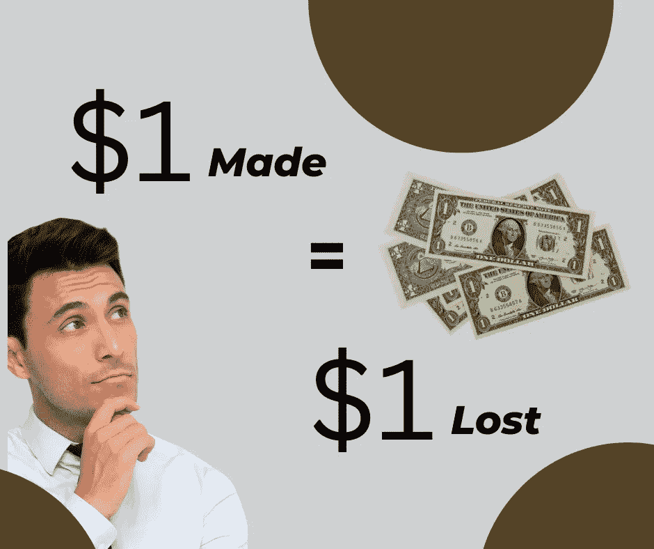

# 如何在不损失存款的情况下在 web3 中赚到 100 万美元

> 原文：<https://medium.com/coinmonks/how-to-make-1million-in-web3-without-losing-your-savings-73b096bebe79?source=collection_archive---------18----------------------->

web3 每赚 1 美分，就损失 1 美分。

作为一个投资者，现在从 web3 赚钱的方法之一是购买别人出售的东西，并以盈利或亏损的方式出售。

所以，当我买的时候，有人在赚钱，而我在赔钱，希望将来能赚到钱！

我付出的每一块钱，都有人拿走了。

问题是，我可能会购买一个在购买后就变得无用的项目。我可以购买或制作地毯；我的钱随着温暖的晚风消失了。

我只剩下一些毫无价值的照片，一张交易收据，每次看到这些照片都让我明白自己是多么的愚蠢。

还是关于愚蠢的问题，

**网络 3 代和药物滥用是怎么回事？**

你很难看到一个年轻的 web3 小伙子不流行或膨胀！这是入门要求还是什么？我会回来的。

在此之前，我需要购买或铸造一个 NFT，然后以更高的价格出售。

**那么图片价格是如何上涨的呢？**

创始人给予 NFT 的效用。像允许列表、抽奖、现实生活和虚拟世界中的活动门票、二次销售版税、赌注等等。

这些赋予了 NFT 它的价值；但是这些不再有价值，因为现在每个项目都在提供它们！因为创始人只想快速套现，腾飞。

我们是否解决了白人诈骗率不断上升的问题；是谁想出了 NFT 项目，创造了社区流动资金并从中获利？还是说，如果是黑人做的，那就是骗局，但如果是白人做的，那就是失败的生意？

我有一个想法，但是让我先告诉你如何赚钱，然后再告诉你如何保持！

外面有人打着 web3 bla bla bla 的幌子准备抢你的钱。你不应该允许他们那样做！

**您将如何防止这种情况发生？**

用不同的方式看待项目！

你以前买的是 FOMO 和 FUD，由创始人故意灌输，他们付钱给有影响力的人制造噪音，让人们进来。

我在 DeFi 的人知道这一点，当市值低的时候，你尽早加入一个项目，一些有影响的人开始炒作代币，更多的人开始购买。然后突然，你身上的一切都归零了，然后高潮过后你变得清晰了！你一直很坚强。

在 NFT，为了防止这种情况，要关注那些有实际用途的项目。这些天出现了很多这样的组织，我们通常称之为 DAO(去中心化自治组织)。稍后将详细介绍 DAOs。

这些 Dao 在 web3 平台上提供 web2 中的服务，包括:

[**Dtravel**](https://twitter.com/DtravelDAO?t=_rLkdt2zzFr_ydg4QxGu1A&s=09) :是 web3 上旅行住宿的未来。如果你曾经使用过 Airbnb 这是旅行的未来。Airbnb 向你收取使用平台的费用，并向房产所有人收取费用。

正是这一小部分成就了他们的今天。想象人们得到了他们有权得到的全部，这就是 Dtravel 正在做的

[**奥波利斯**](https://twitter.com/opolis?t=YbZZlMnvP1fD5UNZFc4z4w&s=09) :是工作的未来。由于保险、养老金、津贴等激励因素，许多人不想离开 web2 工作环境。无论你是创始人还是员工，Opolis 都会给 web3 的员工带来这些好处。

[**SINSO**](https://twitter.com/sinsonetwork?t=NSrhIgFIaU_BvellcX50WA&s=09) :是数据的未来！分散的云存储将让您能够控制您的数据以及您可以使用它们做什么。谷歌或脸书不会再干扰你的数据了

[**Opus-labs**](https://twitter.com/OpusLabsHQ?t=XELCkoJ4bMef4UHW55p2uw&s=09) :是一个把 web2 品牌带到 web3 的孵化器。他们更专注于音乐行业，但也计划通过他们的平台涉足其他行业。

这些是你应该买入的项目类型。因为他们解决了现实生活中的问题，他们将永远有需求，这意味着他们的股票将永远上涨，你的口袋也会上涨。

但是，为什么你一定要吹嘘你从 web3 获得的收益呢？我知道如果你在一个项目上真的很幸运，你可以获得一些疯狂的收益，但是钱应该让你做这些事情吗？

你的肾、肝和肺是非常昂贵的东西，有时甚至不是金钱可以修复的。如果你一定要尿尿，你应该买一个肾放在冰箱里，以备不时之需。

对一些人来说，这是同龄人的压力，对一些人来说，这是好奇心，其他人从他们身上寻找灵感。不管你的理由是什么，赚很多钱，并确保你留在身边享受它。

给我鼓掌。

谢谢你

https://twitter.com/DtravelDAO?t=_rLkdt2zzFr_ydg4QxGu1A&s = 09

辛索:[https://twitter.com/sinsonetwork?t=NSrhIgFIaU_BvellcX50WA&s = 09](https://twitter.com/sinsonetwork?t=NSrhIgFIaU_BvellcX50WA&s=09)

opolis https[://Twitter . com/opolis？t = ybzzlmnvp 1 FD 5 unz fc 4 z 4 w&s = 09](https://twitter.com/opolis?t=YbZZlMnvP1fD5UNZFc4z4w&s=09)

opus-labs:【https://twitter.com/OpusLabsHQ?t=XELCkoJ4bMef4UHW55p2uw】T2&s = 09

> 交易新手？试试[密码交易机器人](/coinmonks/crypto-trading-bot-c2ffce8acb2a)或[复制交易](/coinmonks/top-10-crypto-copy-trading-platforms-for-beginners-d0c37c7d698c)