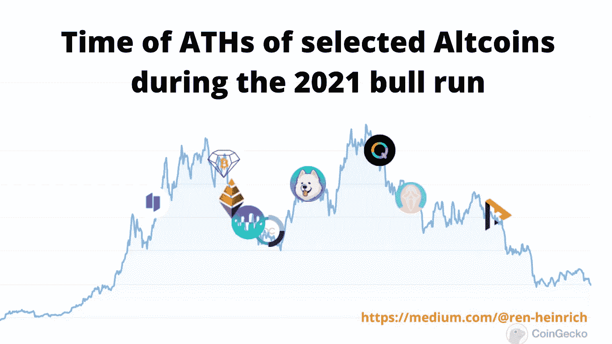
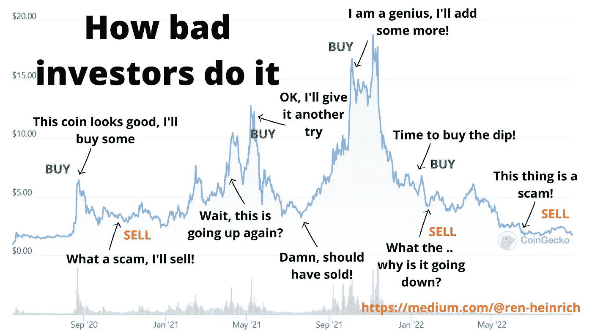
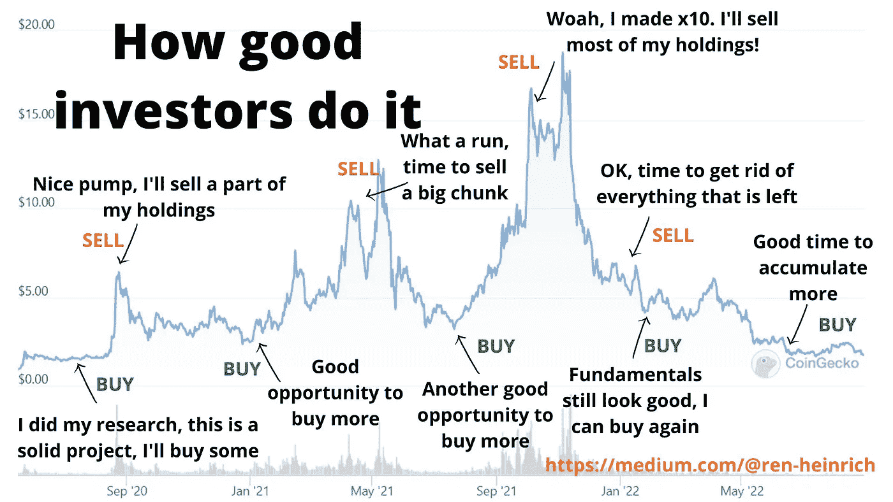

# 如何在加密季节获得复利

> 原文：<https://medium.com/coinmonks/how-to-make-compounding-gains-during-crypto-alt-seasons-fae021470b9f?source=collection_archive---------1----------------------->

通过提前了解和规划不同的阶段，正确地玩加密周期。

在秘密牛市中，最大的收益是在交替季节中获得的。同时，风险也最大。那么，如何在淡季明智地投资，以获得最佳回报呢？

这就是我将在本文中向您展示的内容。

# 加密牛市的 4 个阶段

每个加密牛市包括 4 个不同的阶段。让我们一个一个来看。

## 1.比特币开启牛市

资金流入比特币，推高价格，启动牛市。比特币拉动了整个加密市场，但它的收益最大。

## 2.以太坊接管

更多的钱流入以太坊，最终开始跑赢比特币。

## 3.大盘股紧随其后

资金流入其他价格上涨非常强劲的大型股。与此同时，以太坊和 BTC 的价格增长正在放缓。

## 4.替代赛季开始

在垂直上升后，大盘股正在见顶。接下来，中型股、小型股和屎币都在同时上涨。不管基本面如何，一切似乎都在飞向无限。在某个时候，牛市结束，各地的价格开始下跌。

这是牛市运行的一般方式。不同的阶段会互相影响，所以你不能 100%地把握时间。

为了更好地理解，让我们把注意力更多地放在 Alt-season 上，它也可以被分成单独的阶段。

Click me.

# 替代季节的三个阶段

## 1.替代季节开始

提供新技术和使用案例的创新型中小盘股的价格上涨带来了替代季节。

## 2.另类赛季正在全面展开

鲜为人知但仍然稳固的加密项目紧随其后，并显示出巨大的价格增长。

## 3.后期交替季节

垃圾项目、狗屎硬币、迷因硬币——一切都变得鲜活起来，并显示出巨大的增长，而不管基本面如何。

到目前为止一切顺利。这一切都不是特别难理解。但是为什么做出正确的决定——即在正确的时间买卖正确的硬币——仍然如此困难呢？

# 跟随计划还是跟随你的情感

因为成功的投资者有一个计划并遵循它，而不成功的投资者遵循他们的情绪。这里有两个坏投资者和好投资者的买卖行为的例子。

How bad investors buy and sell a crypto project

How good investors buy and sell a crypto project

花些时间来理解我们的“好”投资者与“坏”投资者相比做了什么。

事实证明，秘密投资的成功包括三个部分。它们中的每一个都同样重要。

## 1.知道买什么代用币

当购买替代硬币时，最重要的是你花一些时间研究每个加密项目。我写了一个关于如何做到这一点的分步指南。这是免费的，可能是你在互联网上能找到的最深入的指南。在这里阅读👇👇

 [## 如何研究加密货币？循序渐进的指南

### 没有任何特殊技能和先前的知识找到加密宝石

ren-heinrich.medium.com](https://ren-heinrich.medium.com/how-to-research-crypto-projects-a-step-by-step-guide-744fdc822b99) 

## 2.在适当的时候购买替代硬币

如上图所示，投资加密项目的最佳时机是在市场平静、价格低廉的时候，也就是在熊市期间。价格动作不多，你有很多时间分析多个项目，没有快速行动的压力。

## 3.在适当的时候出售代用币

好吧，废话。如果这么容易，每个人都会去做。

为了更好地理解，让我们再看一下这张图表。

Time of ATHs of selected Altcoins during the 2021 bull market.

这是 2021 年牛市的 BTC 图表，显示了选定的替代硬币何时达到其最高价格。

很明显，这些硬币达到顶峰的时间与比特币不同——有时相差几周到几个月。

如果一个投资者在合适的时间将资金从一个项目转移到下一个项目，他或她会赚多少钱？

# 如何在淡季大赚一笔

虽然很难预测单个硬币和代币的顶部，但有几种方法可以最大化回报。

你应该这么做。

## **1。建立并记录您的 Altcoin 投资组合**

你有一个研究充分的替代硬币投资组合。密切监视他们，不要错过换季开始的时间。这是我发表在 Coinmonks 上的一个关于创建不同种类的加密投资组合的指南。仔细讨论👇👇

 [## 指南:5 个最佳加密组合

### 如何构建完美的加密组合——初学者和高级用户指南。

medium.com](/coinmonks/guide-the-5-best-crypto-portfolios-f86478f6bb51) 

## 2.为每个项目设定价格目标

为每一枚硬币或代币设定目标价格，以确定你何时卖出部分股票。比如价格翻倍，那么你卖 50%。如果它再涨 25%，你就卖掉剩下的。这些价格目标看起来如何取决于你的风险承受能力。然而，重要的是你要设定目标并严格遵循它们。

## **3。出售你的第一枚 Altcoin**

你的一个硬币泵。如上所述，确保根据你设定的目标销售。把这些利润拿出来，a)投入比特币，b)投入稳定的硬币或法币。

如果是高质量的，一定要回购。如果你再次买入，但下一次却没有赢(大多数替代币都不会赢)，那么你就错过了其他替代币的潜在收益。

## **4。在赛季中期做什么**

如果我们仍然处于替代季节的早期/中期阶段，使用你从第一个替代硬币中获得的一些利润，并将它们投入到你的其他一些尚未涨价的替代硬币中。当这些硬币泵出时，按照第 3 步操作。

## **5。赛季结束后做什么**

当另类投资季即将结束时，卖掉你投资组合中剩下的每一枚另类硬币，将利润转换成 BTC、稳定硬币或菲亚特。不要执着于替代硬币，因为它会在下一次熊市中看到无情的价格下跌。

> 交易新手？试试[加密交易机器人](/coinmonks/crypto-trading-bot-c2ffce8acb2a)或者[复制交易](/coinmonks/top-10-crypto-copy-trading-platforms-for-beginners-d0c37c7d698c)