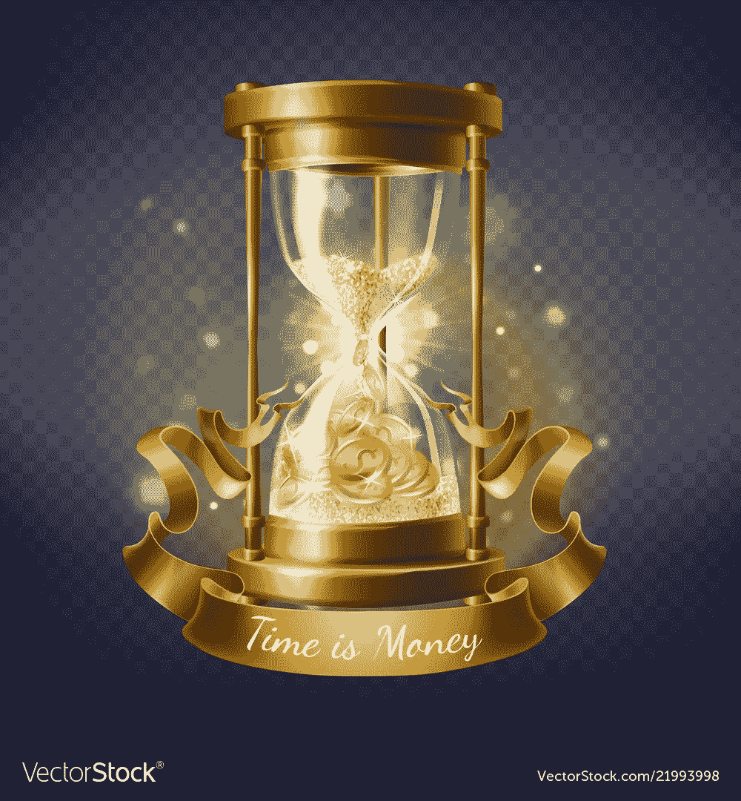

# 如何利用业余时间赚钱

> 原文：<https://medium.com/coinmonks/how-to-make-money-from-your-spare-time-1192afbbfa5?source=collection_archive---------29----------------------->

[https://www.vectorstock.com/royalty-free-vector/hourglass-with-gold-coins-time-is-money-vector-21993998](https://www.vectorstock.com/royalty-free-vector/hourglass-with-gold-coins-time-is-money-vector-21993998)

如果你像大多数人一样，你的时间总是可以利用的，但是你用它做什么呢？你可以去工作，也可以整天玩电子游戏。但是太阳下山了，没事可做怎么办？

这就是灰色市场的由来——提供某种娱乐的蒙昧活动的世界。

# 制作…的最好方法是什么